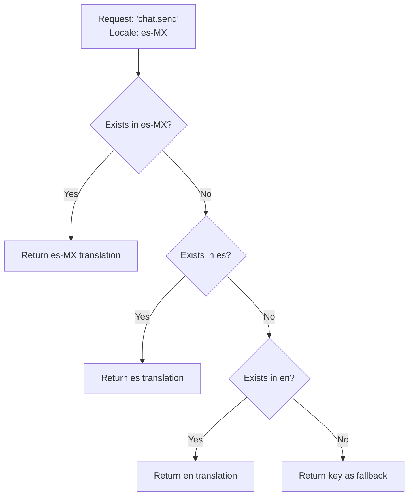

# Multi-language UI Support

## Introduction

When a user opens your chat interface, every button label, placeholder text, error message, and status indicator needs to appear in their language. This isn't just about running text through Google Translate—it's about building a flexible system that loads the right translations, handles missing keys gracefully, and adapts to user preferences.

Multi-language UI support is the foundation of internationalization. Get this right, and adding new languages becomes a matter of providing translation files rather than rewriting code.

### What We'll Cover

- Organizing translation files and folder structures
- Designing effective translation key patterns
- Implementing fallback language chains
- Detecting user language preferences
- Building a translation service for chat interfaces

### Prerequisites

- JavaScript modules and async/await
- JSON file handling
- Understanding of chat interface components

---

## Language File Organization

A well-organized translation file structure makes maintenance manageable.

### Folder Structure Options

**Option 1: Flat Structure (Small Projects)**
```
locales/
├── en.json
├── es.json
├── ar.json
├── zh.json
└── ja.json
```

**Option 2: Region-Specific (Medium Projects)**
```
locales/
├── en/
│   ├── common.json
│   └── chat.json
├── en-GB/
│   └── common.json       # Overrides for UK English
├── es/
│   ├── common.json
│   └── chat.json
├── es-MX/
│   └── common.json       # Mexican Spanish overrides
└── ar/
    ├── common.json
    └── chat.json
```

**Option 3: Feature-Based (Large Projects)**
```
locales/
├── en-US/
│   ├── common.json       # Shared UI elements
│   ├── chat.json         # Chat-specific text
│   ├── errors.json       # Error messages
│   ├── settings.json     # Settings page
│   └── onboarding.json   # First-time user flow
├── ja-JP/
│   ├── common.json
│   ├── chat.json
│   └── ...
```

### File Naming Conventions

| Pattern | Example | When to Use |
|---------|---------|-------------|
| Language only | `es.json` | Single variant per language |
| Language-Region | `es-ES.json` | Multiple regional variants |
| Language/file | `es/chat.json` | Large translation sets |
| BCP 47 full | `zh-Hans-CN.json` | Script distinctions needed |

---

## Translation Key Patterns

Good key naming makes translations maintainable and discoverable.

### Hierarchical Keys

```json
{
  "chat": {
    "input": {
      "placeholder": "Type a message...",
      "send_button": "Send",
      "attach_file": "Attach file"
    },
    "message": {
      "copied": "Message copied",
      "deleted": "Message deleted",
      "edited": "Edited"
    },
    "status": {
      "connecting": "Connecting...",
      "typing": "{name} is typing...",
      "online": "Online",
      "offline": "Offline"
    }
  },
  "errors": {
    "network": "Connection lost. Retrying...",
    "rate_limit": "Please wait {seconds} seconds",
    "invalid_input": "Message cannot be empty"
  }
}
```

### Key Naming Best Practices

| ✅ Good | ❌ Bad | Why |
|---------|--------|-----|
| `chat.send_button` | `button1` | Descriptive, locatable |
| `errors.network_timeout` | `err_001` | Self-documenting |
| `message.count_one` | `message_singular` | Follows ICU pattern |
| `settings.theme.dark` | `darkThemeLabel` | Consistent hierarchy |

### Interpolation Patterns

```json
{
  "greeting": "Hello, {name}!",
  "messages_count": "{count} messages",
  "time_remaining": "{minutes} min {seconds} sec remaining",
  "welcome_back": "Welcome back, {user}! You have {count} unread messages."
}
```

```javascript
// Simple interpolation implementation
function interpolate(template, params) {
  return template.replace(/{(\w+)}/g, (match, key) => {
    return params[key] !== undefined ? params[key] : match;
  });
}

// Usage
interpolate("Hello, {name}!", { name: "Alex" });
// "Hello, Alex!"
```

### Pluralization

Different languages have different plural rules. English has 2 forms (singular, plural), but Russian has 3, and Arabic has 6!

```json
{
  "messages": {
    "zero": "No messages",
    "one": "{count} message",
    "two": "{count} messages",
    "few": "{count} messages",
    "many": "{count} messages",
    "other": "{count} messages"
  }
}
```

```javascript
// Using Intl.PluralRules
function pluralize(key, count, translations, locale = 'en') {
  const rules = new Intl.PluralRules(locale);
  const category = rules.select(count);
  
  const pluralKey = `${key}.${category}`;
  const template = translations[pluralKey] || translations[`${key}.other`];
  
  return interpolate(template, { count });
}

// Usage
pluralize('messages', 1, translations, 'en');  // "1 message"
pluralize('messages', 5, translations, 'en');  // "5 messages"
pluralize('messages', 0, translations, 'en');  // "No messages"
```

---

## Fallback Language Chains

When a translation is missing, the system should gracefully fall back.

### Fallback Strategy



### Implementation

```javascript
class TranslationService {
  constructor() {
    this.translations = new Map();
    this.fallbackChain = [];
  }
  
  setFallbackChain(locales) {
    // e.g., ['es-MX', 'es', 'en']
    this.fallbackChain = locales;
  }
  
  async loadLocale(locale) {
    try {
      const response = await fetch(`/locales/${locale}.json`);
      if (response.ok) {
        const data = await response.json();
        this.translations.set(locale, this.flattenKeys(data));
      }
    } catch (error) {
      console.warn(`Failed to load locale: ${locale}`);
    }
  }
  
  // Convert nested object to flat keys
  flattenKeys(obj, prefix = '') {
    const result = {};
    
    for (const [key, value] of Object.entries(obj)) {
      const fullKey = prefix ? `${prefix}.${key}` : key;
      
      if (typeof value === 'object' && value !== null) {
        Object.assign(result, this.flattenKeys(value, fullKey));
      } else {
        result[fullKey] = value;
      }
    }
    
    return result;
  }
  
  t(key, params = {}) {
    // Try each locale in fallback chain
    for (const locale of this.fallbackChain) {
      const translations = this.translations.get(locale);
      if (translations && translations[key]) {
        return this.interpolate(translations[key], params);
      }
    }
    
    // Return key if no translation found
    console.warn(`Missing translation: ${key}`);
    return key;
  }
  
  interpolate(template, params) {
    return template.replace(/{(\w+)}/g, (match, key) => {
      return params[key] !== undefined ? params[key] : match;
    });
  }
}

// Usage
const i18n = new TranslationService();

// Load locales in order of preference
await i18n.loadLocale('es-MX');
await i18n.loadLocale('es');
await i18n.loadLocale('en');

i18n.setFallbackChain(['es-MX', 'es', 'en']);

// Will try es-MX first, then es, then en
i18n.t('chat.send_button');
```

### Generating Fallback Chains

```javascript
function generateFallbackChain(locale, defaultLocale = 'en') {
  const chain = [];
  const parts = locale.split('-');
  
  // Add full locale: "es-MX"
  chain.push(locale);
  
  // Add language only: "es"
  if (parts.length > 1) {
    chain.push(parts[0]);
  }
  
  // Add default locale if different
  if (!chain.includes(defaultLocale)) {
    chain.push(defaultLocale);
  }
  
  return chain;
}

// Examples
generateFallbackChain('es-MX');     // ['es-MX', 'es', 'en']
generateFallbackChain('zh-Hans-CN'); // ['zh-Hans-CN', 'zh', 'en']
generateFallbackChain('en-GB');     // ['en-GB', 'en']
```

---

## Language Detection

Detecting the user's preferred language involves multiple sources.

### Detection Priority

| Priority | Source | Reliability | Notes |
|----------|--------|-------------|-------|
| 1 | User setting | Highest | Explicit user choice |
| 2 | URL parameter | High | Shareable links |
| 3 | Cookie/localStorage | High | Persisted preference |
| 4 | `navigator.language` | Medium | Browser setting |
| 5 | `Accept-Language` header | Medium | Server-side only |
| 6 | IP geolocation | Low | Inaccurate for VPNs |

### Implementation

```javascript
class LocaleDetector {
  constructor(options = {}) {
    this.supportedLocales = options.supportedLocales || ['en'];
    this.defaultLocale = options.defaultLocale || 'en';
    this.storageKey = options.storageKey || 'preferred_locale';
  }
  
  detect() {
    return (
      this.fromStorage() ||
      this.fromURL() ||
      this.fromNavigator() ||
      this.defaultLocale
    );
  }
  
  fromStorage() {
    const saved = localStorage.getItem(this.storageKey);
    return this.validateLocale(saved);
  }
  
  fromURL() {
    const params = new URLSearchParams(window.location.search);
    const lang = params.get('lang') || params.get('locale');
    return this.validateLocale(lang);
  }
  
  fromNavigator() {
    // navigator.languages is an array of preferred languages
    const languages = navigator.languages || [navigator.language];
    
    for (const lang of languages) {
      const validated = this.validateLocale(lang);
      if (validated) return validated;
      
      // Try base language (e.g., "es" from "es-MX")
      const base = lang.split('-')[0];
      const validatedBase = this.validateLocale(base);
      if (validatedBase) return validatedBase;
    }
    
    return null;
  }
  
  validateLocale(locale) {
    if (!locale) return null;
    
    // Exact match
    if (this.supportedLocales.includes(locale)) {
      return locale;
    }
    
    // Case-insensitive match
    const normalized = locale.toLowerCase();
    const match = this.supportedLocales.find(
      l => l.toLowerCase() === normalized
    );
    
    return match || null;
  }
  
  save(locale) {
    localStorage.setItem(this.storageKey, locale);
  }
}

// Usage
const detector = new LocaleDetector({
  supportedLocales: ['en', 'es', 'ar', 'zh-Hans', 'ja'],
  defaultLocale: 'en'
});

const userLocale = detector.detect();
console.log(`Detected locale: ${userLocale}`);
```

### navigator.language vs navigator.languages

```javascript
// navigator.language - Single preferred language
console.log(navigator.language);
// "en-US"

// navigator.languages - Ordered list of preferences
console.log(navigator.languages);
// ["en-US", "en", "es", "fr"]

// Best practice: Use languages array with fallback
function getUserLanguages() {
  if (navigator.languages && navigator.languages.length > 0) {
    return [...navigator.languages];
  }
  return [navigator.language || 'en'];
}
```

---

## Complete Chat Translation Service

A production-ready translation service for chat interfaces:

```javascript
class ChatI18nService {
  constructor(config = {}) {
    this.supportedLocales = config.supportedLocales || ['en'];
    this.defaultLocale = config.defaultLocale || 'en';
    this.localesPath = config.localesPath || '/locales';
    
    this.translations = new Map();
    this.currentLocale = null;
    this.fallbackChain = [];
    this.formatters = {};
    
    this.listeners = new Set();
  }
  
  // Initialize with detected or specified locale
  async init(preferredLocale = null) {
    const detector = new LocaleDetector({
      supportedLocales: this.supportedLocales,
      defaultLocale: this.defaultLocale
    });
    
    const locale = preferredLocale || detector.detect();
    await this.setLocale(locale);
    
    return this;
  }
  
  // Change locale at runtime
  async setLocale(locale) {
    if (!this.supportedLocales.includes(locale)) {
      console.warn(`Unsupported locale: ${locale}, using ${this.defaultLocale}`);
      locale = this.defaultLocale;
    }
    
    this.currentLocale = locale;
    this.fallbackChain = this.generateFallbackChain(locale);
    
    // Load all locales in fallback chain
    await Promise.all(
      this.fallbackChain.map(l => this.loadLocale(l))
    );
    
    // Initialize Intl formatters
    this.initFormatters(locale);
    
    // Update document attributes
    this.updateDocumentLocale(locale);
    
    // Notify listeners
    this.notifyListeners();
    
    return locale;
  }
  
  generateFallbackChain(locale) {
    const chain = [locale];
    const parts = locale.split('-');
    
    if (parts.length > 1) {
      chain.push(parts[0]);
    }
    
    if (!chain.includes(this.defaultLocale)) {
      chain.push(this.defaultLocale);
    }
    
    return chain.filter(l => this.supportedLocales.includes(l));
  }
  
  async loadLocale(locale) {
    if (this.translations.has(locale)) return;
    
    try {
      const response = await fetch(`${this.localesPath}/${locale}.json`);
      if (!response.ok) throw new Error(`HTTP ${response.status}`);
      
      const data = await response.json();
      this.translations.set(locale, this.flattenKeys(data));
    } catch (error) {
      console.warn(`Failed to load translations for ${locale}:`, error);
    }
  }
  
  flattenKeys(obj, prefix = '') {
    const result = {};
    
    for (const [key, value] of Object.entries(obj)) {
      const fullKey = prefix ? `${prefix}.${key}` : key;
      
      if (typeof value === 'object' && value !== null && !Array.isArray(value)) {
        Object.assign(result, this.flattenKeys(value, fullKey));
      } else {
        result[fullKey] = value;
      }
    }
    
    return result;
  }
  
  initFormatters(locale) {
    this.formatters = {
      date: new Intl.DateTimeFormat(locale, {
        dateStyle: 'medium',
        timeStyle: 'short'
      }),
      dateShort: new Intl.DateTimeFormat(locale, {
        month: 'short',
        day: 'numeric'
      }),
      time: new Intl.DateTimeFormat(locale, {
        timeStyle: 'short'
      }),
      relativeTime: new Intl.RelativeTimeFormat(locale, {
        numeric: 'auto',
        style: 'long'
      }),
      number: new Intl.NumberFormat(locale),
      list: new Intl.ListFormat(locale, {
        style: 'long',
        type: 'conjunction'
      }),
      pluralRules: new Intl.PluralRules(locale)
    };
  }
  
  updateDocumentLocale(locale) {
    document.documentElement.lang = locale;
    
    // Set direction for RTL languages
    const rtlLocales = ['ar', 'he', 'fa', 'ur'];
    const isRTL = rtlLocales.some(rtl => locale.startsWith(rtl));
    document.documentElement.dir = isRTL ? 'rtl' : 'ltr';
  }
  
  // Main translation function
  t(key, params = {}) {
    for (const locale of this.fallbackChain) {
      const translations = this.translations.get(locale);
      if (translations && translations[key]) {
        return this.interpolate(translations[key], params);
      }
    }
    
    // Development warning
    if (process.env.NODE_ENV !== 'production') {
      console.warn(`Missing translation: ${key}`);
    }
    
    return key;
  }
  
  // Pluralized translation
  tp(key, count, params = {}) {
    const category = this.formatters.pluralRules.select(count);
    const pluralKey = `${key}.${category}`;
    
    // Try specific plural form, fall back to 'other'
    const translation = this.t(pluralKey) !== pluralKey 
      ? this.t(pluralKey, { count, ...params })
      : this.t(`${key}.other`, { count, ...params });
    
    return translation;
  }
  
  interpolate(template, params) {
    return template.replace(/{(\w+)}/g, (match, key) => {
      return params[key] !== undefined ? String(params[key]) : match;
    });
  }
  
  // Format date
  formatDate(date, style = 'default') {
    const formatter = style === 'short' 
      ? this.formatters.dateShort 
      : this.formatters.date;
    return formatter.format(date);
  }
  
  // Format time
  formatTime(date) {
    return this.formatters.time.format(date);
  }
  
  // Format relative time (e.g., "2 hours ago")
  formatRelativeTime(date) {
    const now = new Date();
    const diff = date - now;
    const seconds = Math.round(diff / 1000);
    const minutes = Math.round(diff / 60000);
    const hours = Math.round(diff / 3600000);
    const days = Math.round(diff / 86400000);
    
    if (Math.abs(seconds) < 60) {
      return this.formatters.relativeTime.format(seconds, 'second');
    } else if (Math.abs(minutes) < 60) {
      return this.formatters.relativeTime.format(minutes, 'minute');
    } else if (Math.abs(hours) < 24) {
      return this.formatters.relativeTime.format(hours, 'hour');
    } else {
      return this.formatters.relativeTime.format(days, 'day');
    }
  }
  
  // Format number
  formatNumber(number) {
    return this.formatters.number.format(number);
  }
  
  // Format list
  formatList(items) {
    return this.formatters.list.format(items);
  }
  
  // Subscribe to locale changes
  onLocaleChange(callback) {
    this.listeners.add(callback);
    return () => this.listeners.delete(callback);
  }
  
  notifyListeners() {
    this.listeners.forEach(callback => {
      callback(this.currentLocale);
    });
  }
  
  // Get current locale info
  getLocaleInfo() {
    return {
      current: this.currentLocale,
      fallbackChain: this.fallbackChain,
      isRTL: document.documentElement.dir === 'rtl',
      supported: this.supportedLocales
    };
  }
}

// Export singleton
export const i18n = new ChatI18nService({
  supportedLocales: ['en', 'es', 'ar', 'zh-Hans', 'ja', 'de', 'fr'],
  defaultLocale: 'en',
  localesPath: '/locales'
});
```

### Usage in Chat Components

```javascript
// Initialize on app start
await i18n.init();

// In message component
function renderMessage(message) {
  return `
    <div class="message">
      <div class="message-content">${message.content}</div>
      <div class="message-time">
        ${i18n.formatRelativeTime(new Date(message.timestamp))}
      </div>
    </div>
  `;
}

// In chat input component
function renderChatInput() {
  return `
    <input 
      type="text" 
      placeholder="${i18n.t('chat.input.placeholder')}"
    />
    <button>${i18n.t('chat.input.send_button')}</button>
  `;
}

// In error handler
function showError(errorType) {
  const message = i18n.t(`errors.${errorType}`);
  showNotification(message, 'error');
}

// Pluralized message count
function showUnreadCount(count) {
  return i18n.tp('chat.messages', count, { count });
  // "1 message" or "5 messages" depending on count and locale
}

// Language switcher
async function switchLanguage(newLocale) {
  await i18n.setLocale(newLocale);
  // UI will update via listeners
}
```

---

## Common Pitfalls

| ❌ Mistake | ✅ Solution |
|-----------|-------------|
| Hardcoding strings | Use translation keys everywhere |
| Concatenating translations | Use interpolation: `{name} is typing` |
| Assuming English word order | Keep full phrases as single keys |
| Ignoring pluralization | Use `Intl.PluralRules` |
| Not testing all locales | Automated tests for each locale |
| Loading all languages upfront | Lazy-load based on user locale |

---

## Best Practices

| Practice | Why It Matters |
|----------|----------------|
| Use descriptive key names | Easier for translators to understand context |
| Keep phrases complete | Word order varies by language |
| Provide context comments | Help translators understand usage |
| Use ICU message format | Industry standard for complex formatting |
| Implement fallback chains | Graceful degradation for missing translations |
| Test with pseudo-localization | Catch hardcoded strings early |

---

## Hands-on Exercise

### Your Task

Build a translation service for a chat interface that supports English and Spanish.

### Requirements

1. Create translation files for `en.json` and `es.json`
2. Implement locale detection from `navigator.language`
3. Support fallback from `es-MX` → `es` → `en`
4. Include interpolation for `{name}` placeholders
5. Add pluralization for message counts

### Expected Result

```javascript
const i18n = new ChatI18n();
await i18n.init();

i18n.t('chat.greeting', { name: 'Maria' });
// English: "Hello, Maria!"
// Spanish: "¡Hola, Maria!"

i18n.tp('chat.messages', 5);
// English: "5 messages"
// Spanish: "5 mensajes"
```

<details>
<summary>💡 Hints (click to expand)</summary>

- Start with the `flattenKeys` function to convert nested JSON
- Use `Intl.PluralRules` with locale parameter
- Remember Spanish has different plural rules than English
- Test with `navigator.language` set to different values

</details>

<details>
<summary>✅ Solution (click to expand)</summary>

**en.json:**
```json
{
  "chat": {
    "greeting": "Hello, {name}!",
    "messages": {
      "one": "{count} message",
      "other": "{count} messages"
    }
  }
}
```

**es.json:**
```json
{
  "chat": {
    "greeting": "¡Hola, {name}!",
    "messages": {
      "one": "{count} mensaje",
      "other": "{count} mensajes"
    }
  }
}
```

```javascript
class ChatI18n {
  constructor() {
    this.translations = new Map();
    this.locale = 'en';
    this.fallbackChain = ['en'];
    this.pluralRules = null;
  }
  
  async init() {
    this.locale = this.detectLocale();
    this.fallbackChain = this.buildFallbackChain(this.locale);
    this.pluralRules = new Intl.PluralRules(this.locale);
    
    for (const locale of this.fallbackChain) {
      await this.loadLocale(locale);
    }
  }
  
  detectLocale() {
    const lang = navigator.language || 'en';
    return ['en', 'es'].includes(lang.split('-')[0]) 
      ? lang 
      : 'en';
  }
  
  buildFallbackChain(locale) {
    const chain = [locale];
    const base = locale.split('-')[0];
    if (base !== locale) chain.push(base);
    if (!chain.includes('en')) chain.push('en');
    return chain;
  }
  
  async loadLocale(locale) {
    const base = locale.split('-')[0];
    try {
      const res = await fetch(`/locales/${base}.json`);
      const data = await res.json();
      this.translations.set(base, this.flatten(data));
    } catch (e) {}
  }
  
  flatten(obj, prefix = '') {
    let result = {};
    for (const [k, v] of Object.entries(obj)) {
      const key = prefix ? `${prefix}.${k}` : k;
      if (typeof v === 'object') {
        Object.assign(result, this.flatten(v, key));
      } else {
        result[key] = v;
      }
    }
    return result;
  }
  
  t(key, params = {}) {
    for (const locale of this.fallbackChain) {
      const base = locale.split('-')[0];
      const trans = this.translations.get(base);
      if (trans?.[key]) {
        return trans[key].replace(/{(\w+)}/g, (_, k) => params[k] ?? _);
      }
    }
    return key;
  }
  
  tp(key, count, params = {}) {
    const form = this.pluralRules.select(count);
    return this.t(`${key}.${form}`, { count, ...params });
  }
}
```

</details>

---

## Summary

✅ Organize translations in a clear folder structure with consistent naming

✅ Use hierarchical keys that describe context and location

✅ Implement fallback chains (e.g., `es-MX` → `es` → `en`) for graceful degradation

✅ Detect user language from storage, URL, then `navigator.languages`

✅ Use `Intl.PluralRules` for correct pluralization in all languages

**Next:** [RTL Layout Handling](./02-rtl-layout-handling.md)

---

## Further Reading

- [MDN: navigator.language](https://developer.mozilla.org/en-US/docs/Web/API/Navigator/language) - Language detection
- [MDN: Intl.PluralRules](https://developer.mozilla.org/en-US/docs/Web/JavaScript/Reference/Global_Objects/Intl/PluralRules) - Pluralization
- [ICU Message Format](https://unicode-org.github.io/icu/userguide/format_parse/messages/) - Industry standard
- [FormatJS](https://formatjs.io/) - Popular i18n library

<!--
Sources Consulted:
- MDN navigator.language: https://developer.mozilla.org/en-US/docs/Web/API/Navigator/language
- MDN Intl.PluralRules: https://developer.mozilla.org/en-US/docs/Web/JavaScript/Reference/Global_Objects/Intl/PluralRules
- Unicode CLDR: https://cldr.unicode.org/
-->
