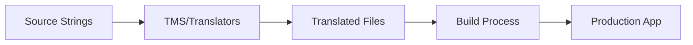
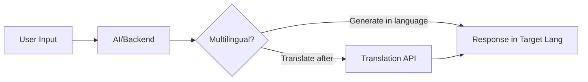
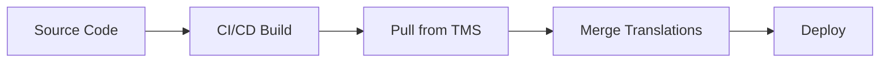
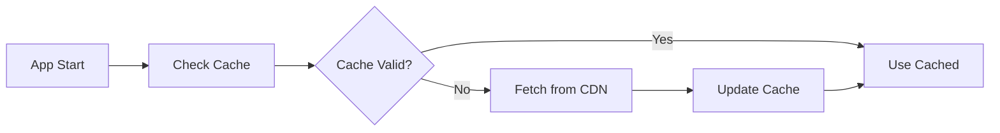
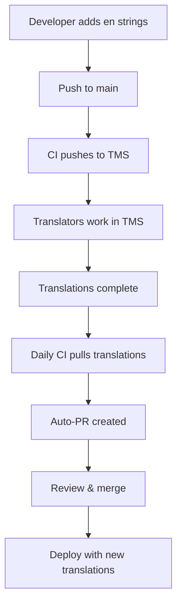

# Translation Integration Patterns

## Introduction

Building a multilingual chat interface requires more than just translating strings—you need a systematic approach to managing translations at scale. This means organizing static UI text separately from dynamic AI-generated content, integrating with Translation Management Systems (TMS), handling updates across languages, and maintaining consistency as your application grows.

This lesson covers practical patterns for integrating translation workflows into chat applications, from simple JSON files to sophisticated continuous localization pipelines.

### What We'll Cover

- Static vs dynamic translation strategies
- Translation file organization patterns
- Integration with Translation Management Systems
- Continuous localization workflows
- Runtime translation loading and caching
- Quality assurance for translations

### Prerequisites

- Understanding of translation key patterns (Lesson 1)
- Basic knowledge of build tools and CI/CD
- Familiarity with JSON and API integrations

---

## Static vs Dynamic Translation

Chat applications have two distinct types of content requiring translation:

### Content Types

| Type | Examples | Strategy |
|------|----------|----------|
| **Static UI** | Buttons, labels, menus, error messages | Pre-translated files loaded at build/runtime |
| **Dynamic Content** | AI responses, user messages, live data | Real-time translation or language-aware generation |
| **Semi-Dynamic** | FAQ responses, canned replies, templates | Pre-translated with variable interpolation |

### Static Translation Flow



### Dynamic Translation Flow



### Implementation Strategy

```javascript
class TranslationService {
  constructor(config) {
    this.staticTranslations = new Map();  // Pre-loaded from files
    this.dynamicCache = new Map();        // Cached API translations
    this.locale = config.locale || 'en';
  }
  
  // Static: Pre-loaded translations
  async loadStaticTranslations(locale) {
    const response = await fetch(`/locales/${locale}.json`);
    const translations = await response.json();
    this.staticTranslations.set(locale, this.flattenKeys(translations));
  }
  
  // Static translation lookup
  t(key, params = {}) {
    const translations = this.staticTranslations.get(this.locale);
    const template = translations?.[key] || key;
    return this.interpolate(template, params);
  }
  
  // Dynamic: API-based translation for user content
  async translateDynamic(text, targetLocale = this.locale) {
    const cacheKey = `${text}:${targetLocale}`;
    
    if (this.dynamicCache.has(cacheKey)) {
      return this.dynamicCache.get(cacheKey);
    }
    
    // Call translation API (Google, DeepL, etc.)
    const translated = await this.callTranslationAPI(text, targetLocale);
    
    this.dynamicCache.set(cacheKey, translated);
    return translated;
  }
  
  async callTranslationAPI(text, targetLocale) {
    // Implement with your chosen translation service
    // Example: Google Translate, DeepL, Azure Translator
    throw new Error('Implement with actual translation API');
  }
  
  flattenKeys(obj, prefix = '') {
    let result = {};
    for (const [key, value] of Object.entries(obj)) {
      const fullKey = prefix ? `${prefix}.${key}` : key;
      if (typeof value === 'object' && value !== null) {
        Object.assign(result, this.flattenKeys(value, fullKey));
      } else {
        result[fullKey] = value;
      }
    }
    return result;
  }
  
  interpolate(template, params) {
    return template.replace(/{(\w+)}/g, (_, key) => params[key] ?? `{${key}}`);
  }
}
```

---

## Translation File Organization

### Recommended Folder Structure

```
src/
├── locales/
│   ├── en/
│   │   ├── common.json       # Shared UI elements
│   │   ├── chat.json         # Chat-specific strings
│   │   ├── errors.json       # Error messages
│   │   ├── settings.json     # Settings page
│   │   └── onboarding.json   # Onboarding flow
│   ├── es/
│   │   ├── common.json
│   │   ├── chat.json
│   │   └── ...
│   ├── ar/
│   │   └── ...
│   └── index.js              # Locale registry
└── i18n/
    ├── config.js             # i18n configuration
    ├── TranslationService.js # Translation service
    └── useTranslation.js     # React hook (if using React)
```

### File Content Examples

**locales/en/chat.json:**
```json
{
  "input": {
    "placeholder": "Type a message...",
    "send": "Send",
    "attach_file": "Attach file",
    "voice_input": "Voice input"
  },
  "messages": {
    "typing": "{name} is typing...",
    "delivered": "Delivered",
    "read": "Read",
    "failed": "Failed to send",
    "retry": "Tap to retry"
  },
  "actions": {
    "copy": "Copy",
    "edit": "Edit",
    "delete": "Delete",
    "reply": "Reply",
    "forward": "Forward"
  },
  "status": {
    "connecting": "Connecting...",
    "connected": "Connected",
    "disconnected": "Disconnected",
    "reconnecting": "Reconnecting..."
  },
  "ai": {
    "thinking": "AI is thinking...",
    "generating": "Generating response...",
    "stopped": "Response stopped",
    "error": "Failed to get response"
  },
  "timestamps": {
    "just_now": "Just now",
    "today": "Today",
    "yesterday": "Yesterday"
  }
}
```

**locales/es/chat.json:**
```json
{
  "input": {
    "placeholder": "Escribe un mensaje...",
    "send": "Enviar",
    "attach_file": "Adjuntar archivo",
    "voice_input": "Entrada de voz"
  },
  "messages": {
    "typing": "{name} está escribiendo...",
    "delivered": "Entregado",
    "read": "Leído",
    "failed": "Error al enviar",
    "retry": "Toca para reintentar"
  },
  "actions": {
    "copy": "Copiar",
    "edit": "Editar",
    "delete": "Eliminar",
    "reply": "Responder",
    "forward": "Reenviar"
  },
  "status": {
    "connecting": "Conectando...",
    "connected": "Conectado",
    "disconnected": "Desconectado",
    "reconnecting": "Reconectando..."
  },
  "ai": {
    "thinking": "La IA está pensando...",
    "generating": "Generando respuesta...",
    "stopped": "Respuesta detenida",
    "error": "Error al obtener respuesta"
  },
  "timestamps": {
    "just_now": "Ahora mismo",
    "today": "Hoy",
    "yesterday": "Ayer"
  }
}
```

### Locale Registry

**locales/index.js:**
```javascript
export const locales = {
  en: {
    name: 'English',
    nativeName: 'English',
    direction: 'ltr',
    dateFormat: 'MM/DD/YYYY',
    flag: '🇺🇸'
  },
  es: {
    name: 'Spanish',
    nativeName: 'Español',
    direction: 'ltr',
    dateFormat: 'DD/MM/YYYY',
    flag: '🇪🇸'
  },
  ar: {
    name: 'Arabic',
    nativeName: 'العربية',
    direction: 'rtl',
    dateFormat: 'DD/MM/YYYY',
    flag: '🇸🇦'
  },
  zh: {
    name: 'Chinese',
    nativeName: '中文',
    direction: 'ltr',
    dateFormat: 'YYYY/MM/DD',
    flag: '🇨🇳'
  },
  ja: {
    name: 'Japanese',
    nativeName: '日本語',
    direction: 'ltr',
    dateFormat: 'YYYY/MM/DD',
    flag: '🇯🇵'
  }
};

export const defaultLocale = 'en';
export const supportedLocales = Object.keys(locales);
```

---

## Translation Management System Integration

### Popular TMS Options

| Platform | Best For | Key Features |
|----------|----------|--------------|
| **Lokalise** | Dev teams | Git integration, CLI, SDK |
| **Crowdin** | Open source | Free for OSS, large community |
| **Phrase** | Enterprise | Workflow management, CAT tools |
| **Transifex** | Large projects | API-first, machine translation |
| **Locize** | Real-time | Live updates, CDN delivery |

### Integration Patterns

**Pattern 1: Build-Time Sync**


**Pattern 2: Runtime Loading**


### Lokalise CLI Integration

```bash
# Install CLI
npm install @lokalise/cli -D

# Pull translations during build
npx lokalise2 file download \
  --token=$LOKALISE_API_TOKEN \
  --project-id=$LOKALISE_PROJECT_ID \
  --format=json \
  --original-filenames=true \
  --directory-prefix=src/locales/%LANG_ISO%

# Push new source strings
npx lokalise2 file upload \
  --token=$LOKALISE_API_TOKEN \
  --project-id=$LOKALISE_PROJECT_ID \
  --file=src/locales/en/chat.json \
  --lang-iso=en
```

### Automated Sync Script

```javascript
// scripts/sync-translations.js
import { LokaliseApi } from '@lokalise/node-api';
import fs from 'fs/promises';
import path from 'path';

const api = new LokaliseApi({ apiKey: process.env.LOKALISE_API_TOKEN });
const PROJECT_ID = process.env.LOKALISE_PROJECT_ID;
const LOCALES_DIR = './src/locales';

async function pullTranslations() {
  console.log('Downloading translations from Lokalise...');
  
  // Request download
  const downloadResponse = await api.files().download(PROJECT_ID, {
    format: 'json',
    original_filenames: true,
    directory_prefix: '%LANG_ISO%',
    include_comments: false,
    replace_breaks: false
  });
  
  // Download and extract the bundle
  const bundleUrl = downloadResponse.bundle_url;
  // Fetch and extract to LOCALES_DIR
  
  console.log('Translations updated successfully!');
}

async function pushSourceStrings() {
  console.log('Uploading source strings to Lokalise...');
  
  const sourceFiles = await fs.readdir(path.join(LOCALES_DIR, 'en'));
  
  for (const file of sourceFiles) {
    if (!file.endsWith('.json')) continue;
    
    const content = await fs.readFile(
      path.join(LOCALES_DIR, 'en', file), 
      'utf-8'
    );
    
    await api.files().upload(PROJECT_ID, {
      data: Buffer.from(content).toString('base64'),
      filename: file,
      lang_iso: 'en'
    });
    
    console.log(`Uploaded: ${file}`);
  }
}

// Run based on CLI arg
const command = process.argv[2];
if (command === 'pull') {
  pullTranslations();
} else if (command === 'push') {
  pushSourceStrings();
} else {
  console.log('Usage: node sync-translations.js [pull|push]');
}
```

### Package.json Scripts

```json
{
  "scripts": {
    "i18n:pull": "node scripts/sync-translations.js pull",
    "i18n:push": "node scripts/sync-translations.js push",
    "i18n:sync": "npm run i18n:push && npm run i18n:pull",
    "prebuild": "npm run i18n:pull"
  }
}
```

---

## Continuous Localization Workflow

### CI/CD Pipeline Integration

```yaml
# .github/workflows/localization.yml
name: Localization

on:
  push:
    branches: [main]
    paths:
      - 'src/locales/en/**'
  schedule:
    - cron: '0 6 * * *'  # Daily at 6 AM

jobs:
  sync-translations:
    runs-on: ubuntu-latest
    steps:
      - uses: actions/checkout@v4
      
      - name: Setup Node
        uses: actions/setup-node@v4
        with:
          node-version: '20'
          
      - name: Install dependencies
        run: npm ci
        
      - name: Push source strings
        if: github.event_name == 'push'
        run: npm run i18n:push
        env:
          LOKALISE_API_TOKEN: ${{ secrets.LOKALISE_API_TOKEN }}
          LOKALISE_PROJECT_ID: ${{ secrets.LOKALISE_PROJECT_ID }}
          
      - name: Pull translations
        run: npm run i18n:pull
        env:
          LOKALISE_API_TOKEN: ${{ secrets.LOKALISE_API_TOKEN }}
          LOKALISE_PROJECT_ID: ${{ secrets.LOKALISE_PROJECT_ID }}
          
      - name: Check for changes
        id: changes
        run: |
          if [[ -n $(git status --porcelain src/locales/) ]]; then
            echo "has_changes=true" >> $GITHUB_OUTPUT
          fi
          
      - name: Create PR for translation updates
        if: steps.changes.outputs.has_changes == 'true'
        uses: peter-evans/create-pull-request@v5
        with:
          commit-message: 'chore: update translations'
          title: 'Update translations from Lokalise'
          body: 'Automated translation sync from Lokalise TMS'
          branch: 'chore/translation-updates'
```

### Git-Based Workflow



---

## Runtime Translation Loading

### Lazy Loading Pattern

```javascript
class LazyTranslationLoader {
  constructor() {
    this.loadedNamespaces = new Map();  // locale -> Set of namespaces
    this.translations = new Map();       // locale -> { namespace -> translations }
    this.loading = new Map();            // Promise cache for in-flight requests
  }
  
  async loadNamespace(locale, namespace) {
    const key = `${locale}:${namespace}`;
    
    // Already loaded
    const loaded = this.loadedNamespaces.get(locale);
    if (loaded?.has(namespace)) {
      return this.translations.get(locale)?.[namespace];
    }
    
    // In-flight request
    if (this.loading.has(key)) {
      return this.loading.get(key);
    }
    
    // Start loading
    const promise = this.fetchNamespace(locale, namespace);
    this.loading.set(key, promise);
    
    try {
      const data = await promise;
      
      // Store translations
      if (!this.translations.has(locale)) {
        this.translations.set(locale, {});
      }
      this.translations.get(locale)[namespace] = data;
      
      // Mark as loaded
      if (!this.loadedNamespaces.has(locale)) {
        this.loadedNamespaces.set(locale, new Set());
      }
      this.loadedNamespaces.get(locale).add(namespace);
      
      return data;
    } finally {
      this.loading.delete(key);
    }
  }
  
  async fetchNamespace(locale, namespace) {
    const response = await fetch(`/locales/${locale}/${namespace}.json`);
    if (!response.ok) {
      throw new Error(`Failed to load ${locale}/${namespace}`);
    }
    return response.json();
  }
  
  // Load multiple namespaces in parallel
  async loadNamespaces(locale, namespaces) {
    return Promise.all(
      namespaces.map(ns => this.loadNamespace(locale, ns))
    );
  }
  
  // Preload likely-needed translations
  async preload(locale, namespaces = ['common', 'chat']) {
    try {
      await this.loadNamespaces(locale, namespaces);
    } catch (error) {
      console.warn('Translation preload failed:', error);
    }
  }
  
  getTranslation(locale, namespace, key) {
    const nsTranslations = this.translations.get(locale)?.[namespace];
    if (!nsTranslations) return null;
    
    // Support dot notation
    const keys = key.split('.');
    let value = nsTranslations;
    for (const k of keys) {
      value = value?.[k];
      if (value === undefined) return null;
    }
    return value;
  }
}

// Usage
const loader = new LazyTranslationLoader();

// Preload on app start
await loader.preload('es', ['common', 'chat']);

// Lazy load additional namespaces when needed
await loader.loadNamespace('es', 'settings');
```

### CDN-Based Delivery

```javascript
class CDNTranslationLoader {
  constructor(config) {
    this.cdnUrl = config.cdnUrl;  // e.g., https://cdn.example.com/i18n
    this.version = config.version || 'latest';
    this.cache = new Map();
    this.cacheExpiry = config.cacheExpiry || 3600000;  // 1 hour
  }
  
  async load(locale, namespace) {
    const cacheKey = `${locale}:${namespace}`;
    const cached = this.cache.get(cacheKey);
    
    // Check cache validity
    if (cached && Date.now() - cached.timestamp < this.cacheExpiry) {
      return cached.data;
    }
    
    // Fetch from CDN
    const url = `${this.cdnUrl}/${this.version}/${locale}/${namespace}.json`;
    const response = await fetch(url, {
      cache: 'no-cache',  // Let CDN handle caching
      headers: {
        'Accept': 'application/json'
      }
    });
    
    if (!response.ok) {
      if (cached) {
        // Use stale cache if fetch fails
        console.warn(`Using stale cache for ${cacheKey}`);
        return cached.data;
      }
      throw new Error(`Failed to load translations: ${response.status}`);
    }
    
    const data = await response.json();
    
    // Update cache
    this.cache.set(cacheKey, {
      data,
      timestamp: Date.now()
    });
    
    // Persist to localStorage for offline
    this.persistToStorage(cacheKey, data);
    
    return data;
  }
  
  persistToStorage(key, data) {
    try {
      localStorage.setItem(`i18n:${key}`, JSON.stringify({
        data,
        timestamp: Date.now()
      }));
    } catch (error) {
      // localStorage full or unavailable
      console.warn('Failed to persist translations:', error);
    }
  }
  
  loadFromStorage(locale, namespace) {
    const key = `i18n:${locale}:${namespace}`;
    try {
      const stored = localStorage.getItem(key);
      if (stored) {
        return JSON.parse(stored).data;
      }
    } catch (error) {
      console.warn('Failed to load from storage:', error);
    }
    return null;
  }
}
```

---

## Translation Quality Assurance

### Automated Validation

```javascript
class TranslationValidator {
  constructor(sourceLocale = 'en') {
    this.sourceLocale = sourceLocale;
  }
  
  async validateLocale(sourceTranslations, targetTranslations, targetLocale) {
    const issues = [];
    
    // Flatten both for comparison
    const sourceKeys = this.getAllKeys(sourceTranslations);
    const targetKeys = this.getAllKeys(targetTranslations);
    
    // Check for missing keys
    for (const key of sourceKeys) {
      if (!targetKeys.has(key)) {
        issues.push({
          type: 'missing_key',
          key,
          locale: targetLocale,
          message: `Missing translation for key: ${key}`
        });
      }
    }
    
    // Check for extra keys (possibly deprecated)
    for (const key of targetKeys) {
      if (!sourceKeys.has(key)) {
        issues.push({
          type: 'extra_key',
          key,
          locale: targetLocale,
          message: `Extra key not in source: ${key}`
        });
      }
    }
    
    // Check interpolation variables
    for (const key of sourceKeys) {
      if (targetKeys.has(key)) {
        const sourceVars = this.extractVariables(this.getValue(sourceTranslations, key));
        const targetVars = this.extractVariables(this.getValue(targetTranslations, key));
        
        const missingVars = sourceVars.filter(v => !targetVars.includes(v));
        const extraVars = targetVars.filter(v => !sourceVars.includes(v));
        
        if (missingVars.length > 0) {
          issues.push({
            type: 'missing_variables',
            key,
            locale: targetLocale,
            variables: missingVars,
            message: `Missing variables: ${missingVars.join(', ')}`
          });
        }
        
        if (extraVars.length > 0) {
          issues.push({
            type: 'extra_variables',
            key,
            locale: targetLocale,
            variables: extraVars,
            message: `Extra variables: ${extraVars.join(', ')}`
          });
        }
      }
    }
    
    // Check for empty translations
    for (const key of targetKeys) {
      const value = this.getValue(targetTranslations, key);
      if (typeof value === 'string' && value.trim() === '') {
        issues.push({
          type: 'empty_translation',
          key,
          locale: targetLocale,
          message: `Empty translation for key: ${key}`
        });
      }
    }
    
    return issues;
  }
  
  getAllKeys(obj, prefix = '') {
    const keys = new Set();
    
    for (const [key, value] of Object.entries(obj)) {
      const fullKey = prefix ? `${prefix}.${key}` : key;
      
      if (typeof value === 'object' && value !== null) {
        const nestedKeys = this.getAllKeys(value, fullKey);
        nestedKeys.forEach(k => keys.add(k));
      } else {
        keys.add(fullKey);
      }
    }
    
    return keys;
  }
  
  getValue(obj, path) {
    const keys = path.split('.');
    let value = obj;
    for (const key of keys) {
      value = value?.[key];
      if (value === undefined) return undefined;
    }
    return value;
  }
  
  extractVariables(text) {
    if (typeof text !== 'string') return [];
    const matches = text.match(/{(\w+)}/g) || [];
    return matches.map(m => m.slice(1, -1));
  }
}

// Usage in tests
describe('Translation Validation', () => {
  const validator = new TranslationValidator('en');
  
  test('Spanish translations are complete', async () => {
    const en = await import('../locales/en/chat.json');
    const es = await import('../locales/es/chat.json');
    
    const issues = await validator.validateLocale(en, es, 'es');
    
    const critical = issues.filter(i => 
      i.type === 'missing_key' || i.type === 'missing_variables'
    );
    
    if (critical.length > 0) {
      console.error('Critical translation issues:', critical);
    }
    
    expect(critical).toHaveLength(0);
  });
});
```

### CI Validation Script

```javascript
// scripts/validate-translations.js
import fs from 'fs/promises';
import path from 'path';

const LOCALES_DIR = './src/locales';
const SOURCE_LOCALE = 'en';

async function validateAllTranslations() {
  const validator = new TranslationValidator(SOURCE_LOCALE);
  const locales = await fs.readdir(LOCALES_DIR);
  
  // Load source translations
  const sourceDir = path.join(LOCALES_DIR, SOURCE_LOCALE);
  const sourceFiles = await fs.readdir(sourceDir);
  const sourceTranslations = {};
  
  for (const file of sourceFiles) {
    if (!file.endsWith('.json')) continue;
    const namespace = file.replace('.json', '');
    const content = await fs.readFile(path.join(sourceDir, file), 'utf-8');
    sourceTranslations[namespace] = JSON.parse(content);
  }
  
  // Validate each target locale
  const allIssues = [];
  
  for (const locale of locales) {
    if (locale === SOURCE_LOCALE) continue;
    
    const localeDir = path.join(LOCALES_DIR, locale);
    const stat = await fs.stat(localeDir);
    if (!stat.isDirectory()) continue;
    
    for (const [namespace, source] of Object.entries(sourceTranslations)) {
      const targetPath = path.join(localeDir, `${namespace}.json`);
      
      try {
        const content = await fs.readFile(targetPath, 'utf-8');
        const target = JSON.parse(content);
        
        const issues = await validator.validateLocale(source, target, locale);
        allIssues.push(...issues.map(i => ({ ...i, namespace })));
      } catch (error) {
        allIssues.push({
          type: 'missing_file',
          locale,
          namespace,
          message: `Missing translation file: ${locale}/${namespace}.json`
        });
      }
    }
  }
  
  // Report results
  if (allIssues.length === 0) {
    console.log('✅ All translations are valid!');
    process.exit(0);
  }
  
  console.log(`\n❌ Found ${allIssues.length} translation issues:\n`);
  
  const byLocale = allIssues.reduce((acc, issue) => {
    if (!acc[issue.locale]) acc[issue.locale] = [];
    acc[issue.locale].push(issue);
    return acc;
  }, {});
  
  for (const [locale, issues] of Object.entries(byLocale)) {
    console.log(`\n📍 ${locale} (${issues.length} issues):`);
    for (const issue of issues.slice(0, 10)) {
      console.log(`   [${issue.type}] ${issue.message}`);
    }
    if (issues.length > 10) {
      console.log(`   ... and ${issues.length - 10} more`);
    }
  }
  
  // Exit with error for CI
  const critical = allIssues.filter(i => 
    ['missing_key', 'missing_variables', 'missing_file'].includes(i.type)
  );
  
  if (critical.length > 0) {
    process.exit(1);
  }
}

validateAllTranslations();
```

---

## Complete Translation Integration

```javascript
// i18n/TranslationManager.js
export class TranslationManager {
  constructor(config) {
    this.config = {
      defaultLocale: 'en',
      fallbackLocale: 'en',
      supportedLocales: ['en', 'es', 'ar', 'zh', 'ja'],
      namespaces: ['common', 'chat', 'errors'],
      loadPath: '/locales/{{locale}}/{{namespace}}.json',
      ...config
    };
    
    this.currentLocale = this.config.defaultLocale;
    this.translations = new Map();
    this.loadedNamespaces = new Map();
    this.loading = new Map();
    this.listeners = new Set();
  }
  
  // Initialize with locale
  async init(locale = null) {
    const targetLocale = locale || this.detectLocale();
    await this.setLocale(targetLocale);
    return this;
  }
  
  detectLocale() {
    // Check localStorage
    const stored = localStorage.getItem('locale');
    if (stored && this.config.supportedLocales.includes(stored)) {
      return stored;
    }
    
    // Check browser
    for (const lang of navigator.languages) {
      const base = lang.split('-')[0];
      if (this.config.supportedLocales.includes(base)) {
        return base;
      }
    }
    
    return this.config.defaultLocale;
  }
  
  async setLocale(locale) {
    if (!this.config.supportedLocales.includes(locale)) {
      console.warn(`Unsupported locale: ${locale}`);
      locale = this.config.defaultLocale;
    }
    
    this.currentLocale = locale;
    localStorage.setItem('locale', locale);
    
    // Load core namespaces
    await this.loadNamespaces(locale, this.config.namespaces);
    
    // Update document
    document.documentElement.lang = locale;
    document.documentElement.dir = this.isRTL(locale) ? 'rtl' : 'ltr';
    
    // Notify listeners
    this.emit('localeChanged', locale);
  }
  
  isRTL(locale) {
    return ['ar', 'he', 'fa', 'ur'].includes(locale.split('-')[0]);
  }
  
  async loadNamespaces(locale, namespaces) {
    return Promise.all(namespaces.map(ns => this.loadNamespace(locale, ns)));
  }
  
  async loadNamespace(locale, namespace) {
    const key = `${locale}:${namespace}`;
    
    // Already loaded
    if (this.loadedNamespaces.get(locale)?.has(namespace)) {
      return;
    }
    
    // In progress
    if (this.loading.has(key)) {
      return this.loading.get(key);
    }
    
    // Start loading
    const promise = this.fetchTranslations(locale, namespace);
    this.loading.set(key, promise);
    
    try {
      const data = await promise;
      
      // Store
      if (!this.translations.has(locale)) {
        this.translations.set(locale, new Map());
      }
      this.translations.get(locale).set(namespace, this.flatten(data));
      
      // Mark loaded
      if (!this.loadedNamespaces.has(locale)) {
        this.loadedNamespaces.set(locale, new Set());
      }
      this.loadedNamespaces.get(locale).add(namespace);
      
    } finally {
      this.loading.delete(key);
    }
  }
  
  async fetchTranslations(locale, namespace) {
    const url = this.config.loadPath
      .replace('{{locale}}', locale)
      .replace('{{namespace}}', namespace);
    
    const response = await fetch(url);
    if (!response.ok) {
      throw new Error(`Failed to load ${locale}/${namespace}`);
    }
    return response.json();
  }
  
  flatten(obj, prefix = '') {
    const result = {};
    for (const [key, value] of Object.entries(obj)) {
      const fullKey = prefix ? `${prefix}.${key}` : key;
      if (typeof value === 'object' && value !== null) {
        Object.assign(result, this.flatten(value, fullKey));
      } else {
        result[fullKey] = value;
      }
    }
    return result;
  }
  
  // Main translation function
  t(key, params = {}, options = {}) {
    const namespace = options.namespace || key.split('.')[0];
    const actualKey = options.namespace ? key : key.substring(namespace.length + 1);
    
    // Try current locale
    let value = this.getTranslation(this.currentLocale, namespace, key);
    
    // Fallback to default locale
    if (value === null && this.currentLocale !== this.config.fallbackLocale) {
      value = this.getTranslation(this.config.fallbackLocale, namespace, key);
    }
    
    // Return key if not found
    if (value === null) {
      console.warn(`Missing translation: ${key}`);
      return key;
    }
    
    // Interpolate
    return this.interpolate(value, params);
  }
  
  getTranslation(locale, namespace, key) {
    const nsTranslations = this.translations.get(locale)?.get(namespace);
    if (!nsTranslations) return null;
    return nsTranslations[key] ?? null;
  }
  
  interpolate(template, params) {
    return template.replace(/{(\w+)}/g, (match, key) => {
      return params[key] !== undefined ? String(params[key]) : match;
    });
  }
  
  // Event handling
  on(event, callback) {
    this.listeners.add({ event, callback });
    return () => this.off(event, callback);
  }
  
  off(event, callback) {
    this.listeners.forEach(listener => {
      if (listener.event === event && listener.callback === callback) {
        this.listeners.delete(listener);
      }
    });
  }
  
  emit(event, data) {
    this.listeners.forEach(listener => {
      if (listener.event === event) {
        listener.callback(data);
      }
    });
  }
  
  // Utility methods
  getLocale() {
    return this.currentLocale;
  }
  
  getSupportedLocales() {
    return this.config.supportedLocales;
  }
  
  getLocaleInfo(locale = this.currentLocale) {
    return {
      code: locale,
      name: new Intl.DisplayNames(['en'], { type: 'language' }).of(locale),
      nativeName: new Intl.DisplayNames([locale], { type: 'language' }).of(locale),
      direction: this.isRTL(locale) ? 'rtl' : 'ltr'
    };
  }
}

// Singleton export
export const i18n = new TranslationManager();
```

---

## Common Pitfalls

| ❌ Mistake | ✅ Solution |
|-----------|-------------|
| Loading all translations upfront | Lazy-load namespaces as needed |
| No fallback for missing translations | Implement fallback chain |
| Hardcoding strings in code | Use translation keys everywhere |
| No validation in CI | Add automated translation checks |
| Ignoring context for translators | Add comments/descriptions in TMS |
| No cache invalidation strategy | Version translations, use cache busting |

---

## Best Practices

| Practice | Why It Matters |
|----------|----------------|
| Organize by namespace | Enables lazy loading, easier maintenance |
| Use a TMS | Streamlines translator workflow |
| Automate sync in CI/CD | Keeps translations up to date |
| Validate in tests | Catches issues before production |
| Version translation files | Enables rollback, cache busting |
| Provide context for translators | Better translation quality |

---

## Hands-on Exercise

### Your Task

Set up a translation loading system for a chat application.

### Requirements

1. Load translations from JSON files by namespace
2. Support lazy loading of namespaces
3. Implement fallback from target locale to English
4. Cache loaded translations
5. Emit events when locale changes

### Expected Result

```javascript
const tm = new TranslationManager();
await tm.init('es');

// Lazy load settings namespace
await tm.loadNamespace('es', 'settings');

// Get translation with fallback
tm.t('chat.send');  // "Enviar"
tm.t('settings.theme');  // Loaded on demand

// Change locale
await tm.setLocale('fr');
// Emits 'localeChanged' event
```

<details>
<summary>💡 Hints (click to expand)</summary>

- Use a Map to store translations by locale and namespace
- Track loading promises to prevent duplicate fetches
- Flatten nested JSON for easy key lookup
- Use EventTarget or custom event system for notifications

</details>

<details>
<summary>✅ Solution (click to expand)</summary>

```javascript
class TranslationManager extends EventTarget {
  constructor() {
    super();
    this.locale = 'en';
    this.fallback = 'en';
    this.translations = new Map();
    this.loaded = new Map();
    this.loading = new Map();
  }
  
  async init(locale) {
    this.locale = locale;
    await this.loadNamespaces(locale, ['common', 'chat']);
    if (locale !== this.fallback) {
      await this.loadNamespaces(this.fallback, ['common', 'chat']);
    }
    return this;
  }
  
  async loadNamespaces(locale, namespaces) {
    return Promise.all(namespaces.map(ns => this.loadNamespace(locale, ns)));
  }
  
  async loadNamespace(locale, namespace) {
    const key = `${locale}:${namespace}`;
    if (this.loaded.get(locale)?.has(namespace)) return;
    if (this.loading.has(key)) return this.loading.get(key);
    
    const promise = fetch(`/locales/${locale}/${namespace}.json`)
      .then(r => r.json())
      .then(data => {
        if (!this.translations.has(locale)) {
          this.translations.set(locale, new Map());
        }
        this.translations.get(locale).set(namespace, this.flatten(data));
        
        if (!this.loaded.has(locale)) {
          this.loaded.set(locale, new Set());
        }
        this.loaded.get(locale).add(namespace);
      })
      .finally(() => this.loading.delete(key));
    
    this.loading.set(key, promise);
    return promise;
  }
  
  flatten(obj, prefix = '') {
    let result = {};
    for (const [k, v] of Object.entries(obj)) {
      const key = prefix ? `${prefix}.${k}` : k;
      if (typeof v === 'object') {
        Object.assign(result, this.flatten(v, key));
      } else {
        result[key] = v;
      }
    }
    return result;
  }
  
  t(key, params = {}) {
    const [ns] = key.split('.');
    let value = this.translations.get(this.locale)?.get(ns)?.[key];
    if (!value && this.locale !== this.fallback) {
      value = this.translations.get(this.fallback)?.get(ns)?.[key];
    }
    if (!value) return key;
    return value.replace(/{(\w+)}/g, (_, k) => params[k] ?? `{${k}}`);
  }
  
  async setLocale(locale) {
    this.locale = locale;
    await this.loadNamespaces(locale, ['common', 'chat']);
    this.dispatchEvent(new CustomEvent('localeChanged', { detail: locale }));
  }
}
```

</details>

---

## Summary

✅ Separate static UI translations (files) from dynamic content (API/generation)

✅ Organize translations by namespace for lazy loading

✅ Integrate with a TMS for streamlined translator workflows

✅ Automate sync and validation in CI/CD pipelines

✅ Implement caching with fallback strategies for reliability

**Previous:** [AI Response Language Handling](./05-ai-response-language.md)

**Back to Unit:** [Internationalization Overview](./00-i18n-overview.md)

---

## Further Reading

- [Lokalise Documentation](https://docs.lokalise.com/) - TMS integration
- [FormatJS](https://formatjs.io/) - i18n library for JavaScript
- [i18next](https://www.i18next.com/) - Popular i18n framework
- [Continuous Localization Guide](https://phrase.com/blog/posts/continuous-localization/) - Best practices

<!--
Sources Consulted:
- Lokalise API Docs: https://docs.lokalise.com/
- i18next Documentation: https://www.i18next.com/
- FormatJS: https://formatjs.io/
-->
