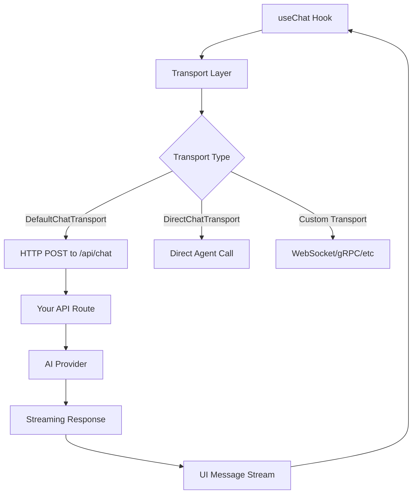

# AI SDK Integration: The useChat Hook

## Introduction

Building chat interfaces from scratch requires managing complex state: messages, loading indicators, streaming responses, error handling, and user input. The Vercel AI SDK's `useChat` hook eliminates this complexity by providing a complete solution for React-based chat applications.

The AI SDK has become the industry standard for building conversational interfaces in React, Next.js, and other JavaScript frameworks. Its `useChat` hook handles the intricate details of streaming AI responses, managing conversation state, and updating the UI in real-time.

### What We'll Cover

This lesson series explores the `useChat` hook in depth:

1. **Hook Fundamentals** — Initialization, transport setup, and basic configuration
2. **Message Parts Structure** — The modern parts-based message format for rich content
3. **Status Management** — Tracking request lifecycle and conditional rendering
4. **Actions and Callbacks** — Sending messages, stopping streams, and handling events
5. **Transport Configuration** — Customizing HTTP behavior and direct agent integration
6. **Tool Calling Integration** — Server-side and client-side function calling
7. **Performance Optimization** — Throttling, metadata streaming, and data reconciliation
8. **Agentic Chat Patterns** — Multi-step tool loops and autonomous agent UIs

### Prerequisites

Before diving into this lesson, you should understand:

- React hooks and functional components
- Basic understanding of streaming responses
- Familiarity with TypeScript (recommended)
- AI API concepts (Unit 4)

---

## Why useChat?

### The State Management Challenge

Without a dedicated library, building a chat interface requires managing:

```typescript
// Manual state management is complex
const [messages, setMessages] = useState([]);
const [input, setInput] = useState('');
const [isLoading, setIsLoading] = useState(false);
const [error, setError] = useState(null);
const [abortController, setAbortController] = useState(null);

// Plus streaming logic, retry handling, optimistic updates...
```

This approach leads to hundreds of lines of boilerplate code for each chat interface. The `useChat` hook encapsulates all of this complexity:

```typescript
// useChat handles everything
import { useChat } from '@ai-sdk/react';

const { messages, sendMessage, status, error, stop } = useChat();
```

### Key Benefits

| Benefit | Description |
|---------|-------------|
| **Automatic Streaming** | Handles SSE parsing and incremental UI updates |
| **State Management** | Manages messages, status, and errors automatically |
| **Type Safety** | Full TypeScript support with generics |
| **Flexible Transport** | HTTP, WebSocket, or direct agent communication |
| **Tool Integration** | Built-in support for function calling workflows |
| **Performance** | Optimized rendering with throttling options |

---

## Architecture Overview

The AI SDK 6.x introduces a **transport-based architecture** that separates communication logic from UI state management:



### Core Components

#### 1. The useChat Hook

The main interface for managing chat state. It returns:

- **State**: `messages`, `status`, `error`
- **Actions**: `sendMessage`, `stop`, `regenerate`, `setMessages`
- **Callbacks**: `onFinish`, `onError`, `onData`

#### 2. Transport Layer

Controls how messages travel between client and server:

- **DefaultChatTransport** — Standard HTTP POST requests
- **DirectChatTransport** — In-process agent calls (SSR, testing)
- **Custom Transport** — Your own implementation

#### 3. Message Format

Messages use a **parts-based structure** that supports rich content:

```typescript
interface UIMessage {
  id: string;
  role: 'user' | 'assistant' | 'system';
  parts: UIMessagePart[];  // Text, files, tool calls, reasoning
  metadata?: unknown;
}
```

---

## Quick Start Example

Here's a minimal working chat interface using the AI SDK:

### Client Component

```tsx
'use client';

import { useChat } from '@ai-sdk/react';
import { DefaultChatTransport } from 'ai';
import { useState } from 'react';

export default function Chat() {
  const { messages, sendMessage, status } = useChat({
    transport: new DefaultChatTransport({
      api: '/api/chat',
    }),
  });
  const [input, setInput] = useState('');

  return (
    <div className="chat-container">
      {/* Message list */}
      {messages.map(message => (
        <div key={message.id} className={`message ${message.role}`}>
          <strong>{message.role === 'user' ? 'You' : 'AI'}:</strong>
          {message.parts.map((part, i) =>
            part.type === 'text' ? <span key={i}>{part.text}</span> : null
          )}
        </div>
      ))}

      {/* Status indicator */}
      {status === 'streaming' && <div className="typing">AI is typing...</div>}

      {/* Input form */}
      <form
        onSubmit={e => {
          e.preventDefault();
          if (input.trim()) {
            sendMessage({ text: input });
            setInput('');
          }
        }}
      >
        <input
          value={input}
          onChange={e => setInput(e.target.value)}
          disabled={status !== 'ready'}
          placeholder="Type your message..."
        />
        <button type="submit" disabled={status !== 'ready'}>
          Send
        </button>
      </form>
    </div>
  );
}
```

### API Route (Next.js App Router)

```typescript
// app/api/chat/route.ts
import { convertToModelMessages, streamText, UIMessage } from 'ai';
import { openai } from '@ai-sdk/openai';

export const maxDuration = 30;

export async function POST(req: Request) {
  const { messages }: { messages: UIMessage[] } = await req.json();

  const result = streamText({
    model: openai('gpt-4o'),
    system: 'You are a helpful assistant.',
    messages: await convertToModelMessages(messages),
  });

  return result.toUIMessageStreamResponse();
}
```

**Output:**

When you run this application, you'll see:
- Messages appear instantly as you type
- AI responses stream in word-by-word
- The input disables during streaming
- Status updates reflect the current state

---

## AI SDK Versions

> **Important:** This lesson covers AI SDK 6.x, released in 2025. The API has changed significantly from earlier versions.

### Version Comparison

| Feature | v4.x | v5.x | v6.x (Current) |
|---------|------|------|----------------|
| Message format | `content` string | `parts` array | `parts` array |
| Transport | Built-in | Configurable | Transport-based |
| Input management | Hook manages | Hook manages | You manage |
| Tool typing | Generic | Typed parts | Fully typed |
| Package name | `ai` | `ai` + `@ai-sdk/react` | `ai` + `@ai-sdk/react` |

### Migration Notes

If migrating from older versions:

1. **Input State** — `useChat` no longer manages input; use your own `useState`
2. **handleSubmit** — Replaced with `sendMessage({ text })`
3. **Transport** — Now explicit via `DefaultChatTransport`
4. **Message Parts** — Use `message.parts` instead of `message.content`

---

## Lesson Structure

This lesson series builds progressively:

| Lesson | Focus | Key Concepts |
|--------|-------|--------------|
| [01-usechat-hook-fundamentals](./01-usechat-hook-fundamentals.md) | Getting started | Initialization, basic props |
| [02-message-parts-structure](./02-message-parts-structure.md) | Message format | Parts array, type safety |
| [03-status-management](./03-status-management.md) | Request lifecycle | Status states, rendering |
| [04-actions-and-callbacks](./04-actions-and-callbacks.md) | Interaction | Methods, event handlers |
| [05-transport-configuration](./05-transport-configuration.md) | Communication | HTTP, direct, custom |
| [06-tool-calling-integration](./06-tool-calling-integration.md) | Function calling | Tools in chat UI |
| [07-performance-optimization](./07-performance-optimization.md) | Speed | Throttling, streaming |
| [08-agentic-chat-patterns](./08-agentic-chat-patterns.md) | Agents | Multi-step, autonomous |

---

## Summary

✅ The `useChat` hook simplifies building React chat interfaces by managing state, streaming, and errors automatically

✅ AI SDK 6.x uses a transport-based architecture for flexible communication patterns

✅ Messages use a parts-based structure supporting text, files, tools, and reasoning

✅ The hook provides actions (`sendMessage`, `stop`, `regenerate`) and callbacks (`onFinish`, `onError`) for full control

✅ Full TypeScript support enables type-safe tool definitions and custom metadata

**Next:** [useChat Hook Fundamentals](./01-usechat-hook-fundamentals.md)

---

## Further Reading

- [AI SDK Documentation](https://ai-sdk.dev/docs) — Official comprehensive guide
- [useChat Reference](https://ai-sdk.dev/docs/reference/ai-sdk-ui/use-chat) — Full API reference
- [Chatbot Guide](https://ai-sdk.dev/docs/ai-sdk-ui/chatbot) — Building chatbots tutorial
- [Migration Guide](https://ai-sdk.dev/docs/migration-guides) — Upgrading from older versions

---

<!-- 
Sources Consulted:
- AI SDK Chatbot Guide: https://ai-sdk.dev/docs/ai-sdk-ui/chatbot
- useChat Reference: https://ai-sdk.dev/docs/reference/ai-sdk-ui/use-chat
- Transport Documentation: https://ai-sdk.dev/docs/ai-sdk-ui/transport
-->
