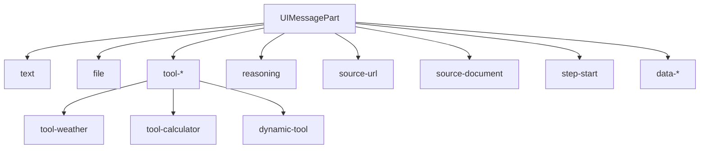
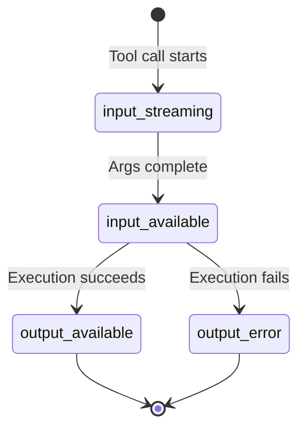

# Message Parts Structure

## Introduction

The AI SDK 6.x fundamentally changed how messages are structured. Instead of a simple `content` string, messages now use a **parts array** that supports rich, typed content including text, files, tool invocations, reasoning tokens, and custom data. This architecture enables building sophisticated chat interfaces that display diverse content types.

Understanding message parts is essential for rendering AI responses correctly and leveraging advanced features like tool calling and reasoning display.

### What We'll Cover

- The UIMessage interface and parts array structure
- All part types: text, file, tool-*, reasoning, source, step-start
- Type-safe rendering patterns with TypeScript
- Message metadata for token usage and custom data
- Creating messages with proper part structure

### Prerequisites

- Completed [useChat Hook Fundamentals](./01-usechat-hook-fundamentals.md)
- TypeScript familiarity (recommended)
- Understanding of discriminated unions

---

## The UIMessage Interface

Every message in the AI SDK follows this structure:

```typescript
interface UIMessage<TMetadata = unknown> {
  id: string;                    // Unique identifier
  role: 'system' | 'user' | 'assistant';
  parts: UIMessagePart[];        // Array of content parts
  metadata?: TMetadata;          // Optional custom metadata
}
```

### Key Differences from Legacy Format

| Aspect | Legacy (v4.x) | Current (v6.x) |
|--------|---------------|----------------|
| Text content | `message.content` | `message.parts[].text` |
| Content type | Always string | Typed parts array |
| Tool calls | Separate property | Part in array |
| File attachments | Separate handling | Part in array |
| Reasoning | Not supported | Part in array |

### Why Parts?

The parts-based approach offers significant advantages:

1. **Rich Content**: Display text, images, files, and tool results together
2. **Type Safety**: TypeScript knows exactly what each part contains
3. **Streaming Granularity**: Individual parts can stream independently
4. **Extensibility**: New part types added without breaking changes
5. **Rendering Control**: Precise control over how each type displays

---

## Part Types Overview

The AI SDK defines several part types:



### Core Part Types

| Part Type | Purpose | Key Properties |
|-----------|---------|----------------|
| `text` | Text content | `text: string` |
| `file` | Images/files | `url`, `mediaType`, `filename` |
| `reasoning` | Model thinking | `text: string` |
| `source-url` | Web citations | `url`, `title`, `id` |
| `source-document` | Doc citations | `title`, `id` |
| `step-start` | Multi-step boundaries | `stepNumber` |
| `tool-{name}` | Typed tool calls | `input`, `output`, `state` |
| `dynamic-tool` | Unknown tools | `toolName`, `input`, `output` |
| `data-{name}` | Custom data | `data: object` |

---

## Text Parts

The most common part type for displaying AI responses:

```typescript
interface TextUIPart {
  type: 'text';
  text: string;
}
```

### Rendering Text Parts

```tsx
function MessageContent({ message }: { message: UIMessage }) {
  return (
    <div>
      {message.parts.map((part, index) => {
        if (part.type === 'text') {
          return <p key={index}>{part.text}</p>;
        }
        return null;
      })}
    </div>
  );
}
```

### Streaming Text

Text parts update incrementally during streaming. The `text` property grows as chunks arrive:

```tsx
// During streaming, this updates in real-time
{message.parts
  .filter(part => part.type === 'text')
  .map((part, i) => (
    <span key={i} className="whitespace-pre-wrap">
      {part.text}
    </span>
  ))
}
```

---

## File Parts

File parts represent images, documents, or other binary content:

```typescript
interface FileUIPart {
  type: 'file';
  url: string;           // Data URL or external URL
  mediaType: string;     // MIME type: 'image/png', 'application/pdf'
  filename?: string;     // Optional filename
}
```

### Rendering Images

```tsx
function MessageParts({ parts }: { parts: UIMessagePart[] }) {
  return (
    <>
      {parts.map((part, index) => {
        switch (part.type) {
          case 'text':
            return <p key={index}>{part.text}</p>;
            
          case 'file':
            if (part.mediaType?.startsWith('image/')) {
              return (
                
              );
            }
            // Non-image files
            return (
              <a key={index} href={part.url} download={part.filename}>
                📎 {part.filename ?? 'Download file'}
              </a>
            );
            
          default:
            return null;
        }
      })}
    </>
  );
}
```

### Sending Files

Users can attach files when sending messages:

```tsx
const [files, setFiles] = useState<FileList | undefined>();

// In form submission
sendMessage({
  text: input,
  files: files,  // Automatically converted to file parts
});
```

---

## Reasoning Parts

Models like DeepSeek R1 and Claude with extended thinking emit reasoning tokens. The server must enable these with `sendReasoning: true`:

```typescript
// Server-side
return result.toUIMessageStreamResponse({
  sendReasoning: true,
});
```

### Reasoning Part Structure

```typescript
interface ReasoningUIPart {
  type: 'reasoning';
  text: string;
}
```

### Rendering Reasoning

Typically displayed in a collapsible section:

```tsx
function ReasoningDisplay({ parts }: { parts: UIMessagePart[] }) {
  const reasoningParts = parts.filter(p => p.type === 'reasoning');
  
  if (reasoningParts.length === 0) return null;
  
  return (
    <details className="bg-gray-100 p-3 rounded mb-2">
      <summary className="cursor-pointer font-medium">
        🧠 View AI Thinking Process
      </summary>
      <div className="mt-2 text-sm text-gray-600 whitespace-pre-wrap">
        {reasoningParts.map((part, i) => (
          <p key={i}>{part.text}</p>
        ))}
      </div>
    </details>
  );
}
```

---

## Tool Parts

Tool invocations appear as typed parts using the pattern `tool-{toolName}`:

### Part Type Structure

```typescript
// For a tool named 'getWeather', the part type is 'tool-getWeather'
interface ToolUIPart {
  type: `tool-${string}`;
  toolCallId: string;
  toolName: string;
  state: 'input-streaming' | 'input-available' | 'output-available' | 'output-error';
  input: object;       // Tool arguments
  output?: unknown;    // Tool result (when available)
  errorText?: string;  // Error message (when state is 'output-error')
}
```

### Tool States



| State | Description | Available Data |
|-------|-------------|----------------|
| `input-streaming` | Arguments still arriving | Partial `input` |
| `input-available` | Arguments complete | Full `input` |
| `output-available` | Execution complete | `input` + `output` |
| `output-error` | Execution failed | `input` + `errorText` |

### Rendering Tool Parts

```tsx
function ToolPartDisplay({ part }: { part: ToolUIPart }) {
  switch (part.state) {
    case 'input-streaming':
      return (
        <div className="text-gray-500">
          ⏳ Preparing {part.toolName}...
        </div>
      );
      
    case 'input-available':
      return (
        <div className="bg-blue-50 p-2 rounded">
          🔧 Running {part.toolName}...
          <pre className="text-xs mt-1">
            {JSON.stringify(part.input, null, 2)}
          </pre>
        </div>
      );
      
    case 'output-available':
      return (
        <div className="bg-green-50 p-2 rounded">
          ✅ {part.toolName} completed
          <pre className="text-xs mt-1">
            {JSON.stringify(part.output, null, 2)}
          </pre>
        </div>
      );
      
    case 'output-error':
      return (
        <div className="bg-red-50 p-2 rounded">
          ❌ {part.toolName} failed: {part.errorText}
        </div>
      );
  }
}
```

### Type-Safe Tool Rendering

For TypeScript projects, use specific tool part types:

```tsx
function MessageRenderer({ message }: { message: UIMessage }) {
  return (
    <div>
      {message.parts.map((part, index) => {
        switch (part.type) {
          case 'text':
            return <span key={index}>{part.text}</span>;
            
          case 'tool-getWeather':
            // TypeScript knows part.input has { city: string }
            return (
              <WeatherWidget
                key={index}
                city={part.input.city}
                weather={part.state === 'output-available' ? part.output : null}
                loading={part.state === 'input-available'}
              />
            );
            
          case 'tool-calculator':
            // TypeScript knows the calculator tool shape
            return (
              <CalculatorResult
                key={index}
                operation={part.input.operation}
                result={part.output}
              />
            );
            
          case 'dynamic-tool':
            // Handle unknown tools generically
            return (
              <GenericToolDisplay
                key={index}
                name={part.toolName}
                input={part.input}
                output={part.output}
              />
            );
            
          default:
            return null;
        }
      })}
    </div>
  );
}
```

---

## Source Parts

When using providers that return sources (Perplexity, Google with grounding), source parts appear:

### URL Sources

```typescript
interface SourceUrlUIPart {
  type: 'source-url';
  id: string;
  url: string;
  title?: string;
}
```

### Document Sources

```typescript
interface SourceDocumentUIPart {
  type: 'source-document';
  id: string;
  title?: string;
}
```

### Rendering Sources

```tsx
function SourceDisplay({ parts }: { parts: UIMessagePart[] }) {
  const sources = parts.filter(
    p => p.type === 'source-url' || p.type === 'source-document'
  );
  
  if (sources.length === 0) return null;
  
  return (
    <div className="mt-2 text-sm">
      <strong>Sources:</strong>
      <ul className="list-disc ml-4">
        {sources.map(source => (
          <li key={source.id}>
            {source.type === 'source-url' ? (
              <a href={source.url} target="_blank" rel="noopener">
                {source.title ?? new URL(source.url).hostname}
              </a>
            ) : (
              <span>{source.title ?? `Document ${source.id}`}</span>
            )}
          </li>
        ))}
      </ul>
    </div>
  );
}
```

---

## Step-Start Parts

Multi-step tool execution includes step-start parts to mark boundaries:

```typescript
interface StepStartUIPart {
  type: 'step-start';
  stepNumber: number;
}
```

### Rendering Step Boundaries

```tsx
function renderParts(parts: UIMessagePart[]) {
  return parts.map((part, index) => {
    switch (part.type) {
      case 'step-start':
        // Show divider between steps (skip first)
        return index > 0 ? (
          <hr key={index} className="my-2 border-gray-300" />
        ) : null;
        
      case 'text':
        return <p key={index}>{part.text}</p>;
        
      // ... other part types
    }
  });
}
```

---

## Message Metadata

Messages can carry custom metadata for tracking information like timestamps, model details, and token usage.

### Defining Metadata Types

```typescript
// Define your metadata shape
type MyMetadata = {
  createdAt: number;
  model?: string;
  totalTokens?: number;
};

// Use generic with useChat
const { messages } = useChat<UIMessage<MyMetadata>>({
  // config
});
```

### Server-Side Metadata

```typescript
// app/api/chat/route.ts
return result.toUIMessageStreamResponse({
  messageMetadata: ({ part }) => {
    if (part.type === 'start') {
      return {
        createdAt: Date.now(),
        model: 'gpt-4o',
      };
    }
    
    if (part.type === 'finish') {
      return {
        totalTokens: part.totalUsage?.totalTokens,
      };
    }
  },
});
```

### Accessing Metadata

```tsx
function MessageWithMeta({ message }: { message: UIMessage<MyMetadata> }) {
  return (
    <div>
      {/* Timestamp */}
      {message.metadata?.createdAt && (
        <span className="text-xs text-gray-500">
          {new Date(message.metadata.createdAt).toLocaleTimeString()}
        </span>
      )}
      
      {/* Content */}
      {message.parts.map((part, i) =>
        part.type === 'text' ? <p key={i}>{part.text}</p> : null
      )}
      
      {/* Token count */}
      {message.metadata?.totalTokens && (
        <span className="text-xs text-gray-400">
          {message.metadata.totalTokens} tokens
        </span>
      )}
    </div>
  );
}
```

---

## Complete Rendering Example

Here's a comprehensive message renderer handling all part types:

```tsx
'use client';

import { UIMessage, UIMessagePart } from 'ai';

interface MessageProps {
  message: UIMessage;
}

export function Message({ message }: MessageProps) {
  return (
    <div
      className={`p-4 rounded-lg ${
        message.role === 'user' ? 'bg-blue-100 ml-8' : 'bg-gray-100 mr-8'
      }`}
    >
      {/* Role indicator */}
      <div className="font-semibold mb-2">
        {message.role === 'user' ? '👤 You' : '🤖 Assistant'}
      </div>
      
      {/* Parts rendering */}
      <div className="space-y-2">
        {message.parts.map((part, index) => (
          <PartRenderer key={index} part={part} />
        ))}
      </div>
    </div>
  );
}

function PartRenderer({ part }: { part: UIMessagePart }) {
  switch (part.type) {
    // Text content
    case 'text':
      return <p className="whitespace-pre-wrap">{part.text}</p>;
    
    // Images and files
    case 'file':
      if (part.mediaType?.startsWith('image/')) {
        return (
          
        );
      }
      return (
        <a href={part.url} className="text-blue-600 underline">
          📎 {part.filename ?? 'Download'}
        </a>
      );
    
    // Reasoning/thinking
    case 'reasoning':
      return (
        <details className="bg-yellow-50 p-2 rounded text-sm">
          <summary className="cursor-pointer">🧠 Reasoning</summary>
          <p className="mt-1 text-gray-600">{part.text}</p>
        </details>
      );
    
    // Sources
    case 'source-url':
      return (
        <a
          href={part.url}
          target="_blank"
          rel="noopener"
          className="text-sm text-blue-600"
        >
          📚 {part.title ?? 'Source'}
        </a>
      );
    
    case 'source-document':
      return (
        <span className="text-sm text-gray-600">
          📄 {part.title ?? 'Document'}
        </span>
      );
    
    // Step boundaries
    case 'step-start':
      return <hr className="border-gray-300" />;
    
    // Dynamic/unknown tools
    case 'dynamic-tool':
      return (
        <div className="bg-purple-50 p-2 rounded text-sm">
          <strong>Tool: {part.toolName}</strong>
          {part.state === 'output-available' && (
            <pre className="mt-1">{JSON.stringify(part.output, null, 2)}</pre>
          )}
        </div>
      );
    
    default:
      // Handle typed tool parts (tool-getWeather, etc.)
      if (part.type.startsWith('tool-')) {
        return <ToolPartDisplay part={part} />;
      }
      
      // Handle custom data parts
      if (part.type.startsWith('data-')) {
        return <DataPartDisplay part={part} />;
      }
      
      return null;
  }
}
```

---

## Best Practices

### ✅ Do

| Practice | Reason |
|----------|--------|
| Use `message.parts` for rendering | Future-proof, supports all content types |
| Handle all states for tool parts | Provides feedback during execution |
| Type your metadata | Catch errors at compile time |
| Filter parts by type when needed | Cleaner rendering logic |

### ❌ Don't

| Anti-pattern | Problem |
|--------------|---------|
| Access `message.content` | Deprecated, may not exist |
| Ignore `input-streaming` state | Missing loading feedback |
| Skip `errorText` handling | Silent tool failures |
| Hardcode part type checks | Miss new part types |

---

## Hands-on Exercise

### Your Task

Build a message renderer that:

1. Displays text content with proper formatting
2. Shows images inline
3. Displays reasoning in a collapsible section
4. Lists sources as clickable links
5. Shows a custom "Thinking..." animation during tool execution

### Requirements

1. Create a `MessageRenderer` component
2. Handle at minimum: text, file, reasoning, source-url, and tool parts
3. Style tool states differently (loading, success, error)
4. Group sources at the bottom of the message

### Expected Result

A reusable component that renders any UIMessage with appropriate visuals for each part type.

<details>
<summary>💡 Hints (click to expand)</summary>

- Use a switch statement for part.type
- Filter parts into groups for organized rendering
- Check `part.mediaType.startsWith('image/')` for images
- Tool parts follow pattern `tool-{name}` or use `dynamic-tool`

</details>

---

## Summary

✅ Messages use a parts array instead of a content string, enabling rich multi-type content

✅ Part types include text, file, reasoning, source-url, source-document, step-start, and tool-*

✅ Tool parts have states: input-streaming, input-available, output-available, output-error

✅ Metadata can be attached to messages for timestamps, token counts, and custom data

✅ TypeScript generics provide type safety for both parts and metadata

**Next:** [Status Management](./03-status-management.md)

---

## Further Reading

- [UIMessage Reference](https://ai-sdk.dev/docs/reference/ai-sdk-core/ui-message) — Complete type documentation
- [Message Metadata](https://ai-sdk.dev/docs/ai-sdk-ui/message-metadata) — Metadata patterns
- [Chatbot Tool Usage](https://ai-sdk.dev/docs/ai-sdk-ui/chatbot-tool-usage) — Tool parts in depth

---

<!-- 
Sources Consulted:
- AI SDK Chatbot Guide: https://ai-sdk.dev/docs/ai-sdk-ui/chatbot
- Chatbot Tool Usage: https://ai-sdk.dev/docs/ai-sdk-ui/chatbot-tool-usage
- Streaming Data: https://ai-sdk.dev/docs/ai-sdk-ui/streaming-data
-->
