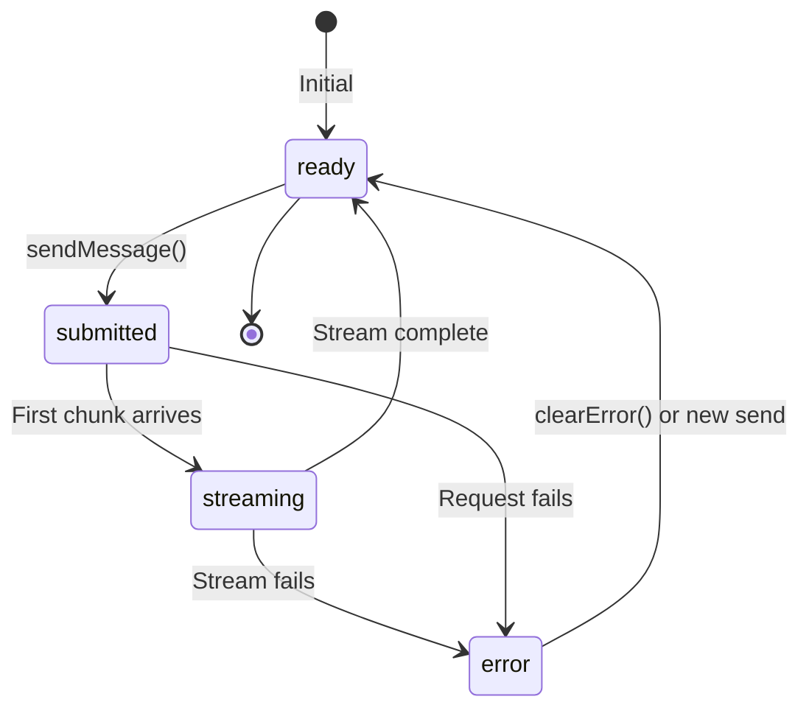

# Status Management

## Introduction

The `useChat` hook tracks the complete lifecycle of chat requests through a `status` property. Understanding these states enables you to provide appropriate user feedback — showing loading indicators, disabling inputs during processing, and handling errors gracefully.

Effective status management is the difference between a polished chat interface and one that leaves users confused about what's happening.

### What We'll Cover

- The four status states and their meanings
- Conditional rendering patterns for each state
- Building loading indicators and typing animations
- Handling errors with recovery options
- Status-based input control

### Prerequisites

- Completed [useChat Hook Fundamentals](./01-usechat-hook-fundamentals.md)
- Completed [Message Parts Structure](./02-message-parts-structure.md)

---

## The Status Lifecycle

The `status` property reflects the current state of the chat:



### Status Values

| Status | Description | User Should See |
|--------|-------------|-----------------|
| `ready` | Idle, can send messages | Enabled input, Send button |
| `submitted` | Request sent, waiting for response | "Thinking..." indicator |
| `streaming` | Response arriving in chunks | Typing animation, Stop button |
| `error` | Something went wrong | Error message, Retry option |

---

## Accessing Status

The `status` property is returned from `useChat`:

```tsx
const { messages, sendMessage, status, error } = useChat({
  transport: new DefaultChatTransport({ api: '/api/chat' }),
});

console.log(status); // 'ready' | 'submitted' | 'streaming' | 'error'
```

### Type Definition

```typescript
type ChatStatus = 'ready' | 'submitted' | 'streaming' | 'error';
```

---

## Conditional Rendering Patterns

### Basic Status Display

```tsx
function StatusIndicator({ status }: { status: ChatStatus }) {
  switch (status) {
    case 'ready':
      return null; // No indicator needed
      
    case 'submitted':
      return <div className="text-gray-500">🤔 Thinking...</div>;
      
    case 'streaming':
      return <div className="text-blue-500">✍️ Typing...</div>;
      
    case 'error':
      return <div className="text-red-500">❌ Error occurred</div>;
  }
}
```

### Status-Based Input Control

Disable the input field and submit button during processing:

```tsx
function ChatForm({ 
  status, 
  onSubmit 
}: { 
  status: ChatStatus; 
  onSubmit: (text: string) => void;
}) {
  const [input, setInput] = useState('');
  const isDisabled = status !== 'ready';
  
  const handleSubmit = (e: React.FormEvent) => {
    e.preventDefault();
    if (input.trim() && !isDisabled) {
      onSubmit(input);
      setInput('');
    }
  };
  
  return (
    <form onSubmit={handleSubmit} className="flex gap-2">
      <input
        value={input}
        onChange={e => setInput(e.target.value)}
        disabled={isDisabled}
        placeholder={isDisabled ? 'Please wait...' : 'Type a message...'}
        className={isDisabled ? 'bg-gray-100' : 'bg-white'}
      />
      <button 
        type="submit" 
        disabled={isDisabled || !input.trim()}
      >
        Send
      </button>
    </form>
  );
}
```

---

## Loading Indicators

### Simple Spinner

```tsx
function LoadingSpinner() {
  return (
    <div className="flex items-center gap-2">
      <svg 
        className="animate-spin h-5 w-5 text-blue-500" 
        viewBox="0 0 24 24"
      >
        <circle 
          className="opacity-25" 
          cx="12" cy="12" r="10" 
          stroke="currentColor" 
          strokeWidth="4"
        />
        <path 
          className="opacity-75" 
          fill="currentColor" 
          d="M4 12a8 8 0 018-8V0C5.373 0 0 5.373 0 12h4z"
        />
      </svg>
      <span>AI is thinking...</span>
    </div>
  );
}
```

### Animated Dots

```tsx
function TypingDots() {
  return (
    <div className="flex items-center gap-1">
      <span className="text-gray-500">AI is typing</span>
      <span className="flex gap-1">
        {[0, 1, 2].map(i => (
          <span
            key={i}
            className="w-2 h-2 bg-gray-400 rounded-full animate-bounce"
            style={{ animationDelay: `${i * 0.15}s` }}
          />
        ))}
      </span>
    </div>
  );
}
```

### Status-Aware Indicator

Combine indicators with status awareness:

```tsx
function ChatStatusIndicator({ status }: { status: ChatStatus }) {
  if (status === 'ready') return null;
  
  return (
    <div className="flex items-center gap-2 p-2 bg-gray-50 rounded">
      {status === 'submitted' && (
        <>
          <LoadingSpinner />
          <span>Preparing response...</span>
        </>
      )}
      
      {status === 'streaming' && (
        <>
          <TypingDots />
        </>
      )}
      
      {status === 'error' && (
        <span className="text-red-500">Something went wrong</span>
      )}
    </div>
  );
}
```

---

## Stop Button During Streaming

Show a stop button when the AI is responding:

```tsx
function ChatControls({ 
  status, 
  stop 
}: { 
  status: ChatStatus; 
  stop: () => void;
}) {
  // Only show during active processing
  const isProcessing = status === 'submitted' || status === 'streaming';
  
  if (!isProcessing) return null;
  
  return (
    <button
      onClick={stop}
      className="px-3 py-1 bg-red-500 text-white rounded hover:bg-red-600"
    >
      ⏹ Stop
    </button>
  );
}
```

### Complete Control Panel

```tsx
function ChatControlPanel({ 
  status, 
  stop, 
  regenerate 
}: { 
  status: ChatStatus; 
  stop: () => void;
  regenerate: () => void;
}) {
  return (
    <div className="flex gap-2">
      {/* Stop button - visible during streaming */}
      {(status === 'submitted' || status === 'streaming') && (
        <button onClick={stop} className="btn-danger">
          ⏹ Stop
        </button>
      )}
      
      {/* Regenerate button - visible when ready */}
      {status === 'ready' && (
        <button onClick={() => regenerate()} className="btn-secondary">
          🔄 Regenerate
        </button>
      )}
    </div>
  );
}
```

---

## Error Handling

### The Error Object

When `status === 'error'`, the `error` property contains details:

```tsx
const { status, error, clearError, regenerate } = useChat({
  // config
});

if (error) {
  console.log(error.message); // Error description
  console.log(error.cause);   // Underlying error (if any)
}
```

### Error Display Component

```tsx
function ErrorDisplay({ 
  error, 
  onRetry, 
  onDismiss 
}: { 
  error: Error;
  onRetry: () => void;
  onDismiss: () => void;
}) {
  return (
    <div className="bg-red-50 border border-red-200 rounded-lg p-4">
      <div className="flex items-start gap-3">
        <span className="text-red-500 text-xl">⚠️</span>
        <div className="flex-1">
          <h3 className="font-semibold text-red-800">
            Something went wrong
          </h3>
          <p className="text-red-600 text-sm mt-1">
            {error.message || 'An unexpected error occurred'}
          </p>
        </div>
      </div>
      
      <div className="flex gap-2 mt-4">
        <button
          onClick={onRetry}
          className="px-3 py-1 bg-red-600 text-white rounded hover:bg-red-700"
        >
          Try Again
        </button>
        <button
          onClick={onDismiss}
          className="px-3 py-1 bg-gray-200 text-gray-700 rounded hover:bg-gray-300"
        >
          Dismiss
        </button>
      </div>
    </div>
  );
}
```

### Integrating Error Handling

```tsx
function Chat() {
  const { 
    messages, 
    sendMessage, 
    status, 
    error, 
    clearError, 
    regenerate 
  } = useChat({
    transport: new DefaultChatTransport({ api: '/api/chat' }),
  });
  
  return (
    <div>
      {/* Messages */}
      {messages.map(msg => (
        <Message key={msg.id} message={msg} />
      ))}
      
      {/* Error display */}
      {status === 'error' && error && (
        <ErrorDisplay
          error={error}
          onRetry={() => regenerate()}
          onDismiss={() => clearError()}
        />
      )}
      
      {/* Input form - also disabled on error */}
      <ChatInput 
        disabled={status !== 'ready'} 
        onSend={text => sendMessage({ text })}
      />
    </div>
  );
}
```

---

## Server-Side Error Messages

By default, server errors are masked for security. To forward error messages to the client:

```typescript
// app/api/chat/route.ts
return result.toUIMessageStreamResponse({
  onError: (error) => {
    // Return a user-friendly message
    if (error instanceof Error) {
      return error.message;
    }
    return 'An error occurred while generating the response';
  },
});
```

> **Warning:** Be careful not to expose sensitive information in error messages. Consider logging detailed errors server-side while sending generic messages to clients.

---

## Advanced Status Patterns

### Skeleton Loading

Show placeholder content during processing:

```tsx
function MessageSkeleton() {
  return (
    <div className="animate-pulse p-4 bg-gray-100 rounded-lg">
      <div className="h-4 bg-gray-300 rounded w-3/4 mb-2"></div>
      <div className="h-4 bg-gray-300 rounded w-1/2"></div>
    </div>
  );
}

function ChatWithSkeleton({ status, messages }) {
  return (
    <div>
      {messages.map(msg => <Message key={msg.id} message={msg} />)}
      
      {/* Show skeleton during submitted state */}
      {status === 'submitted' && <MessageSkeleton />}
    </div>
  );
}
```

### Progressive Status Indicator

Show different messages based on wait time:

```tsx
function ProgressiveStatus({ status }: { status: ChatStatus }) {
  const [waitTime, setWaitTime] = useState(0);
  
  useEffect(() => {
    if (status === 'submitted' || status === 'streaming') {
      const interval = setInterval(() => {
        setWaitTime(t => t + 1);
      }, 1000);
      return () => clearInterval(interval);
    } else {
      setWaitTime(0);
    }
  }, [status]);
  
  if (status === 'ready') return null;
  
  const getMessage = () => {
    if (status === 'streaming') return 'Generating response...';
    if (waitTime < 3) return 'Thinking...';
    if (waitTime < 10) return 'Still working on it...';
    return 'This is taking longer than usual...';
  };
  
  return (
    <div className="text-gray-500 italic">
      {getMessage()}
    </div>
  );
}
```

### Disabled State Styling

Apply consistent styling for disabled states:

```tsx
function ChatInput({ status, onSend }) {
  const [input, setInput] = useState('');
  const disabled = status !== 'ready';
  
  return (
    <form 
      onSubmit={e => {
        e.preventDefault();
        if (input.trim() && !disabled) {
          onSend(input);
          setInput('');
        }
      }}
      className={`
        flex gap-2 p-3 border rounded-lg transition-all
        ${disabled ? 'bg-gray-100 opacity-75' : 'bg-white'}
      `}
    >
      <input
        value={input}
        onChange={e => setInput(e.target.value)}
        disabled={disabled}
        className={`
          flex-1 p-2 rounded border
          ${disabled 
            ? 'bg-gray-200 cursor-not-allowed' 
            : 'bg-white focus:ring-2 focus:ring-blue-500'
          }
        `}
        placeholder={disabled ? 'Please wait...' : 'Message...'}
      />
      <button
        type="submit"
        disabled={disabled || !input.trim()}
        className={`
          px-4 py-2 rounded font-medium transition-colors
          ${disabled || !input.trim()
            ? 'bg-gray-300 text-gray-500 cursor-not-allowed'
            : 'bg-blue-500 text-white hover:bg-blue-600'
          }
        `}
      >
        {status === 'streaming' ? '...' : 'Send'}
      </button>
    </form>
  );
}
```

---

## Complete Example

A full chat component with comprehensive status handling:

```tsx
'use client';

import { useChat } from '@ai-sdk/react';
import { DefaultChatTransport } from 'ai';
import { useState } from 'react';

export default function ChatWithStatus() {
  const [input, setInput] = useState('');
  
  const { 
    messages, 
    sendMessage, 
    status, 
    error, 
    stop, 
    regenerate, 
    clearError 
  } = useChat({
    transport: new DefaultChatTransport({ api: '/api/chat' }),
  });

  const handleSubmit = (e: React.FormEvent) => {
    e.preventDefault();
    if (input.trim() && status === 'ready') {
      sendMessage({ text: input });
      setInput('');
    }
  };

  const canSend = status === 'ready';
  const isProcessing = status === 'submitted' || status === 'streaming';

  return (
    <div className="flex flex-col h-screen max-w-2xl mx-auto">
      {/* Messages */}
      <div className="flex-1 overflow-y-auto p-4 space-y-4">
        {messages.map(message => (
          <div
            key={message.id}
            className={`p-3 rounded-lg ${
              message.role === 'user'
                ? 'bg-blue-100 ml-8'
                : 'bg-gray-100 mr-8'
            }`}
          >
            <div className="font-semibold text-sm text-gray-600 mb-1">
              {message.role === 'user' ? 'You' : 'Assistant'}
            </div>
            {message.parts.map((part, i) =>
              part.type === 'text' ? (
                <p key={i} className="whitespace-pre-wrap">{part.text}</p>
              ) : null
            )}
          </div>
        ))}

        {/* Status indicator */}
        {status === 'submitted' && (
          <div className="flex items-center gap-2 text-gray-500 p-3">
            <div className="animate-spin w-4 h-4 border-2 border-gray-300 border-t-blue-500 rounded-full" />
            <span>Thinking...</span>
          </div>
        )}
        
        {status === 'streaming' && (
          <div className="flex items-center gap-2 text-blue-500 p-3">
            <span>Typing</span>
            <span className="flex gap-1">
              {[0, 1, 2].map(i => (
                <span
                  key={i}
                  className="w-1.5 h-1.5 bg-blue-500 rounded-full animate-bounce"
                  style={{ animationDelay: `${i * 0.15}s` }}
                />
              ))}
            </span>
          </div>
        )}
      </div>

      {/* Error display */}
      {status === 'error' && error && (
        <div className="mx-4 mb-4 p-4 bg-red-50 border border-red-200 rounded-lg">
          <p className="text-red-700 font-medium">Error: {error.message}</p>
          <div className="flex gap-2 mt-3">
            <button
              onClick={() => regenerate()}
              className="px-3 py-1 bg-red-600 text-white rounded text-sm"
            >
              Retry
            </button>
            <button
              onClick={() => clearError()}
              className="px-3 py-1 bg-gray-200 rounded text-sm"
            >
              Dismiss
            </button>
          </div>
        </div>
      )}

      {/* Input area */}
      <div className="border-t p-4">
        <form onSubmit={handleSubmit} className="flex gap-2">
          <input
            type="text"
            value={input}
            onChange={e => setInput(e.target.value)}
            disabled={!canSend}
            placeholder={canSend ? 'Type your message...' : 'Please wait...'}
            className={`
              flex-1 px-4 py-2 border rounded-lg
              ${canSend 
                ? 'bg-white focus:ring-2 focus:ring-blue-500' 
                : 'bg-gray-100 cursor-not-allowed'
              }
            `}
          />
          
          {isProcessing ? (
            <button
              type="button"
              onClick={stop}
              className="px-4 py-2 bg-red-500 text-white rounded-lg hover:bg-red-600"
            >
              Stop
            </button>
          ) : (
            <button
              type="submit"
              disabled={!canSend || !input.trim()}
              className={`
                px-4 py-2 rounded-lg
                ${canSend && input.trim()
                  ? 'bg-blue-500 text-white hover:bg-blue-600'
                  : 'bg-gray-300 text-gray-500 cursor-not-allowed'
                }
              `}
            >
              Send
            </button>
          )}
        </form>
      </div>
    </div>
  );
}
```

---

## Best Practices

### ✅ Do

| Practice | Reason |
|----------|--------|
| Disable input during processing | Prevents duplicate submissions |
| Show different indicators for submitted vs streaming | Helps users understand what's happening |
| Provide a Stop button during streaming | Gives users control |
| Offer retry options on error | Enables recovery without refresh |
| Use transitions for status changes | Smoother user experience |

### ❌ Don't

| Anti-pattern | Problem |
|--------------|---------|
| Allow sending while status !== 'ready' | Race conditions, confusion |
| Show raw error messages | Security risk, poor UX |
| Leave error state without clear action | Users stuck |
| Forget to clear error on new attempt | Stale error display |

---

## Hands-on Exercise

### Your Task

Build a chat interface with an advanced status display that includes:

1. A skeleton loading animation during the "submitted" state
2. A typing indicator with animated dots during "streaming"
3. An error panel with "Retry" and "Dismiss" buttons
4. A countdown timer showing how long the request has been processing
5. Keyboard shortcut (Escape) to stop streaming

### Requirements

1. Create the status indicator components
2. Integrate keyboard event handling
3. Use CSS animations for smooth transitions
4. Track and display elapsed time during processing

<details>
<summary>💡 Hints (click to expand)</summary>

- Use `useEffect` with `setInterval` for the timer
- Use `useEffect` with `keydown` event listener for Escape
- Clean up intervals and event listeners on unmount
- Consider using `requestAnimationFrame` for smoother animations

</details>

---

## Summary

✅ Status has four values: ready, submitted, streaming, and error — each requiring different UI treatment

✅ Disable inputs and show loading indicators during submitted and streaming states

✅ Always provide a Stop button during streaming and Retry option on errors

✅ Use `clearError()` to dismiss errors and `regenerate()` to retry

✅ Server-side `onError` handler controls what error messages reach the client

**Next:** [Actions and Callbacks](./04-actions-and-callbacks.md)

---

## Further Reading

- [useChat Reference](https://ai-sdk.dev/docs/reference/ai-sdk-ui/use-chat) — Status and error details
- [Error Handling Guide](https://ai-sdk.dev/docs/ai-sdk-ui/error-handling) — Advanced error patterns
- [Chatbot Guide](https://ai-sdk.dev/docs/ai-sdk-ui/chatbot) — Status UI examples

---

<!-- 
Sources Consulted:
- AI SDK Chatbot Guide: https://ai-sdk.dev/docs/ai-sdk-ui/chatbot
- useChat Reference: https://ai-sdk.dev/docs/reference/ai-sdk-ui/use-chat
- Error Handling: https://ai-sdk.dev/docs/ai-sdk-ui/error-handling
-->
