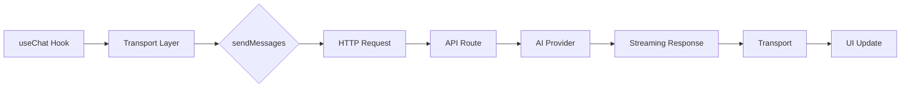

# Transport Configuration

## Introduction

The AI SDK's transport layer controls how messages travel between your React application and the backend. While the default HTTP transport works for most cases, advanced scenarios require custom transport configurations — trigger-based routing, direct agent calls, authentication patterns, and more.

Understanding transports gives you complete control over the communication layer of your chat application.

### What We'll Cover

- DefaultChatTransport configuration options
- DirectChatTransport for server-side and testing scenarios
- Request transformation with prepareSendMessagesRequest
- Trigger-based routing for regeneration and editing
- Building custom transport logic

### Prerequisites

- Completed [useChat Hook Fundamentals](./01-usechat-hook-fundamentals.md)
- Completed [Actions and Callbacks](./04-actions-and-callbacks.md)
- Understanding of HTTP request/response patterns

---

## Transport Architecture

The transport layer sits between useChat and your API:



### Transport Interface

All transports implement this interface:

```typescript
interface ChatTransport {
  sendMessages(options: SendMessagesOptions): Promise<ReadableStream>;
  reconnectToStream?(options: ReconnectOptions): Promise<ReadableStream | null>;
}
```

---

## DefaultChatTransport

The standard HTTP transport for most applications.

### Basic Configuration

```tsx
import { useChat } from '@ai-sdk/react';
import { DefaultChatTransport } from 'ai';

export default function Chat() {
  const { messages, sendMessage } = useChat({
    transport: new DefaultChatTransport({
      api: '/api/chat',
    }),
  });
  
  return (/* render */);
}
```

### All Configuration Options

```tsx
new DefaultChatTransport({
  // Required: API endpoint
  api: '/api/chat',
  
  // Optional: Static or dynamic headers
  headers: {
    'Authorization': 'Bearer token',
  },
  // OR
  headers: () => ({
    'Authorization': `Bearer ${getToken()}`,
  }),
  
  // Optional: Additional body fields
  body: {
    userId: '123',
  },
  // OR
  body: () => ({
    sessionId: getSessionId(),
  }),
  
  // Optional: Credentials mode
  credentials: 'include', // 'same-origin' | 'include' | 'omit'
  
  // Optional: Custom fetch implementation
  fetch: customFetch,
  
  // Optional: Transform requests before sending
  prepareSendMessagesRequest: (options) => ({
    body: transformBody(options),
  }),
  
  // Optional: Transform reconnect requests
  prepareReconnectToStreamRequest: (options) => ({
    body: transformReconnect(options),
  }),
})
```

---

## Dynamic Configuration

### Runtime Headers

Use functions when values change during the session:

```tsx
function ChatWithAuth() {
  const { token } = useAuth();
  
  const { messages, sendMessage } = useChat({
    transport: new DefaultChatTransport({
      api: '/api/chat',
      headers: () => ({
        'Authorization': `Bearer ${token}`,
        'X-Request-Time': new Date().toISOString(),
      }),
    }),
  });
  
  return (/* render */);
}
```

### Runtime Body Fields

```tsx
function ChatWithPreferences() {
  const [temperature, setTemperature] = useState(0.7);
  const [model, setModel] = useState('gpt-4o');
  
  const { messages, sendMessage } = useChat({
    transport: new DefaultChatTransport({
      api: '/api/chat',
      body: () => ({
        temperature,
        model,
        timestamp: Date.now(),
      }),
    }),
  });
  
  return (
    <div>
      <select value={model} onChange={e => setModel(e.target.value)}>
        <option value="gpt-4o">GPT-4o</option>
        <option value="gpt-4o-mini">GPT-4o Mini</option>
      </select>
      {/* Chat UI */}
    </div>
  );
}
```

> **Note:** For component state that changes frequently, use `useRef` to avoid stale closures, or prefer request-level options passed to `sendMessage`.

---

## Request Transformation

### prepareSendMessagesRequest

Transform the request before it's sent. Useful for:

- Sending only the last message instead of full history
- Adding computed fields
- Different payloads for different triggers

```tsx
new DefaultChatTransport({
  api: '/api/chat',
  prepareSendMessagesRequest: ({ id, messages, trigger, messageId }) => {
    return {
      headers: {
        'X-Chat-ID': id,
        'X-Trigger': trigger,
      },
      body: {
        // Only send the last message (server maintains history)
        message: messages[messages.length - 1],
        chatId: id,
        trigger,
      },
    };
  },
})
```

### Parameters Available

```typescript
interface PrepareSendMessageRequestOptions {
  id: string;                  // Chat ID
  messages: UIMessage[];       // Current messages
  trigger: 'submit-message' | 'regenerate-message';
  messageId?: string;          // Message being regenerated (if applicable)
  requestMetadata?: unknown;   // Custom metadata
  body?: Record<string, any>;  // Current body
  credentials?: RequestCredentials;
  headers?: HeadersInit;
  api: string;
}
```

---

## Trigger-Based Routing

Handle different actions (submit, regenerate) differently:

```tsx
const transport = new DefaultChatTransport({
  api: '/api/chat',
  prepareSendMessagesRequest: ({ id, messages, trigger, messageId }) => {
    if (trigger === 'submit-message') {
      // New message submission
      return {
        body: {
          type: 'new-message',
          chatId: id,
          message: messages[messages.length - 1],
        },
      };
    }
    
    if (trigger === 'regenerate-message') {
      // Regeneration request
      return {
        body: {
          type: 'regenerate',
          chatId: id,
          messageId,
          // Don't send messages, server has them
        },
      };
    }
    
    throw new Error(`Unknown trigger: ${trigger}`);
  },
});
```

### Server-Side Handler

```typescript
// app/api/chat/route.ts
export async function POST(req: Request) {
  const body = await req.json();
  
  if (body.type === 'new-message') {
    // Handle new message
    const messages = await loadMessages(body.chatId);
    messages.push(body.message);
    await saveMessages(body.chatId, messages);
    
    return generateResponse(messages);
  }
  
  if (body.type === 'regenerate') {
    // Handle regeneration
    const messages = await loadMessages(body.chatId);
    
    // Remove messages after the one being regenerated
    const index = messages.findIndex(m => m.id === body.messageId);
    const truncatedMessages = messages.slice(0, index);
    
    return generateResponse(truncatedMessages);
  }
  
  return new Response('Invalid request type', { status: 400 });
}
```

---

## DirectChatTransport

For scenarios without HTTP — server components, testing, or single-process apps.

### Use Cases

| Scenario | Why DirectChatTransport |
|----------|------------------------|
| Server-side rendering | No API endpoint needed |
| Unit testing | Test without network |
| Desktop apps | All in one process |
| Edge functions | Direct agent invocation |

### Basic Setup

```tsx
import { useChat } from '@ai-sdk/react';
import { DirectChatTransport, ToolLoopAgent } from 'ai';
import { openai } from '@ai-sdk/openai';

// Create an agent
const agent = new ToolLoopAgent({
  model: openai('gpt-4o'),
  instructions: 'You are a helpful assistant.',
  tools: {
    // Define tools here
  },
});

export default function DirectChat() {
  const { messages, sendMessage, status } = useChat({
    transport: new DirectChatTransport({ agent }),
  });
  
  return (/* render */);
}
```

### How It Works

1. `DirectChatTransport` receives UI messages
2. Converts them to model messages using `convertToModelMessages`
3. Calls the agent's `stream()` method directly
4. Returns the result as a UI message stream via `toUIMessageStream()`

### Configuration Options

```tsx
const transport = new DirectChatTransport({
  agent,
  
  // Optional: Pass options to the agent
  options: {
    customOption: 'value',
  },
  
  // Optional: Configure stream output
  sendReasoning: true,   // Include reasoning tokens
  sendSources: true,     // Include source citations
});
```

### Limitations

> **Warning:** `DirectChatTransport` does not support stream reconnection since there's no persistent server-side stream. The `reconnectToStream()` method always returns `null`.

---

## Custom Fetch Implementation

Intercept requests with a custom fetch function:

```tsx
const customFetch: typeof fetch = async (input, init) => {
  console.log('Request:', input, init);
  
  // Add timing
  const start = Date.now();
  
  try {
    const response = await fetch(input, init);
    
    console.log(`Response in ${Date.now() - start}ms`);
    
    return response;
  } catch (error) {
    console.error('Fetch error:', error);
    throw error;
  }
};

const transport = new DefaultChatTransport({
  api: '/api/chat',
  fetch: customFetch,
});
```

### Use Cases for Custom Fetch

- Request/response logging
- Retry logic
- Request caching
- Mock responses for testing
- Analytics and timing

### Testing with Mock Fetch

```tsx
// test/chat.test.tsx
const mockFetch = jest.fn().mockResolvedValue(
  new Response(
    new ReadableStream({
      start(controller) {
        controller.enqueue(
          new TextEncoder().encode('data: {"type":"text","text":"Hello!"}\n\n')
        );
        controller.close();
      },
    }),
    { headers: { 'Content-Type': 'text/event-stream' } }
  )
);

const transport = new DefaultChatTransport({
  api: '/api/chat',
  fetch: mockFetch,
});
```

---

## Stream Reconnection

Handle interrupted streams with reconnection support:

```tsx
const transport = new DefaultChatTransport({
  api: '/api/chat',
  
  prepareReconnectToStreamRequest: ({ id, requestMetadata }) => {
    return {
      api: `/api/chat/${id}/stream`,  // Reconnect endpoint
      body: {
        resumeFrom: requestMetadata?.lastChunkId,
      },
    };
  },
});

// In your component
const { resumeStream } = useChat({
  transport,
  resume: true,  // Enable auto-resume
});
```

### Enabling Resume in useChat

```tsx
const { messages, sendMessage, resumeStream } = useChat({
  transport: new DefaultChatTransport({ api: '/api/chat' }),
  resume: true,  // Attempt to resume on mount if stream was interrupted
});

// Manual resume after network recovery
const handleOnline = () => {
  resumeStream();
};

window.addEventListener('online', handleOnline);
```

---

## Multiple Transports Pattern

Use different transports for different scenarios:

```tsx
function AdaptiveChat({ mode }: { mode: 'online' | 'offline' }) {
  const onlineTransport = useMemo(
    () => new DefaultChatTransport({ api: '/api/chat' }),
    []
  );
  
  const offlineTransport = useMemo(
    () => new DirectChatTransport({ agent: localAgent }),
    []
  );
  
  const { messages, sendMessage } = useChat({
    transport: mode === 'online' ? onlineTransport : offlineTransport,
  });
  
  return (/* render */);
}
```

---

## Complete Example: Authenticated Chat with Routing

```tsx
'use client';

import { useChat } from '@ai-sdk/react';
import { DefaultChatTransport } from 'ai';
import { useAuth } from '@/hooks/useAuth';
import { useState } from 'react';

export default function AdvancedChat() {
  const { token, userId } = useAuth();
  const [input, setInput] = useState('');
  
  const transport = useMemo(() => 
    new DefaultChatTransport({
      api: '/api/chat',
      
      // Dynamic auth headers
      headers: () => ({
        'Authorization': `Bearer ${token}`,
      }),
      
      // Transform based on trigger
      prepareSendMessagesRequest: ({ id, messages, trigger, messageId }) => {
        const baseBody = {
          chatId: id,
          userId,
        };
        
        if (trigger === 'submit-message') {
          return {
            body: {
              ...baseBody,
              action: 'send',
              message: messages[messages.length - 1],
            },
          };
        }
        
        if (trigger === 'regenerate-message') {
          return {
            body: {
              ...baseBody,
              action: 'regenerate',
              targetMessageId: messageId,
            },
          };
        }
        
        return { body: baseBody };
      },
    }),
    [token, userId]
  );
  
  const { messages, sendMessage, regenerate, status } = useChat({
    id: `chat-${userId}`,
    transport,
  });

  const handleSubmit = (e: React.FormEvent) => {
    e.preventDefault();
    if (input.trim() && status === 'ready') {
      sendMessage({ text: input });
      setInput('');
    }
  };

  return (
    <div className="flex flex-col h-screen">
      {/* Messages */}
      <div className="flex-1 overflow-y-auto p-4">
        {messages.map(msg => (
          <div key={msg.id} className="mb-4">
            <div className="font-semibold">
              {msg.role === 'user' ? 'You' : 'AI'}
            </div>
            {msg.parts.map((part, i) =>
              part.type === 'text' ? <p key={i}>{part.text}</p> : null
            )}
            {msg.role === 'assistant' && status === 'ready' && (
              <button
                onClick={() => regenerate({ messageId: msg.id })}
                className="text-sm text-blue-500"
              >
                🔄 Regenerate
              </button>
            )}
          </div>
        ))}
      </div>

      {/* Input */}
      <form onSubmit={handleSubmit} className="p-4 border-t">
        <div className="flex gap-2">
          <input
            value={input}
            onChange={e => setInput(e.target.value)}
            disabled={status !== 'ready'}
            className="flex-1 p-2 border rounded"
            placeholder="Type a message..."
          />
          <button
            type="submit"
            disabled={status !== 'ready' || !input.trim()}
            className="px-4 py-2 bg-blue-500 text-white rounded disabled:opacity-50"
          >
            Send
          </button>
        </div>
      </form>
    </div>
  );
}
```

---

## Best Practices

### ✅ Do

| Practice | Reason |
|----------|--------|
| Memoize transport instances | Prevents recreating on each render |
| Use dynamic functions for auth | Token may refresh |
| Handle both triggers | Support regeneration properly |
| Test with mock fetch | Reliable unit tests |

### ❌ Don't

| Anti-pattern | Problem |
|--------------|---------|
| Create transport in render | Performance issues, identity changes |
| Hardcode tokens in body | Security risk, stale values |
| Ignore trigger type | Broken regeneration |
| Skip error handling in custom fetch | Silent failures |

---

## Hands-on Exercise

### Your Task

Build a chat with these transport features:

1. **Authentication**: Include JWT token in headers
2. **Model Selection**: Send selected model in body
3. **Trigger Routing**: Different endpoints for send vs regenerate
4. **Request Logging**: Log all requests with timing

### Requirements

1. Create a `DefaultChatTransport` with dynamic headers
2. Use `prepareSendMessagesRequest` for trigger-based routing
3. Implement custom fetch for logging
4. Add a model selector dropdown that affects requests

<details>
<summary>💡 Hints (click to expand)</summary>

- Wrap `fetch` to add logging around the actual call
- Use `trigger` parameter to choose endpoint
- Store model selection in component state
- Access state in body function

</details>

---

## Summary

✅ `DefaultChatTransport` provides configurable HTTP communication with headers, body, and credentials

✅ Dynamic functions for headers and body enable runtime configuration

✅ `prepareSendMessagesRequest` transforms requests, enabling trigger-based routing

✅ `DirectChatTransport` bypasses HTTP for server-side rendering and testing

✅ Custom fetch implementations enable logging, retries, and mocking

**Next:** [Tool Calling Integration](./06-tool-calling-integration.md)

---

## Further Reading

- [Transport Documentation](https://ai-sdk.dev/docs/ai-sdk-ui/transport) — Complete transport guide
- [DefaultChatTransport Reference](https://github.com/vercel/ai/blob/main/packages/ai/src/ui/default-chat-transport.ts) — Source code
- [DirectChatTransport Reference](https://ai-sdk.dev/docs/reference/ai-sdk-ui/direct-chat-transport) — Direct transport API

---

<!-- 
Sources Consulted:
- Transport Documentation: https://ai-sdk.dev/docs/ai-sdk-ui/transport
- useChat Reference: https://ai-sdk.dev/docs/reference/ai-sdk-ui/use-chat
- AI SDK Chatbot Guide: https://ai-sdk.dev/docs/ai-sdk-ui/chatbot
-->
