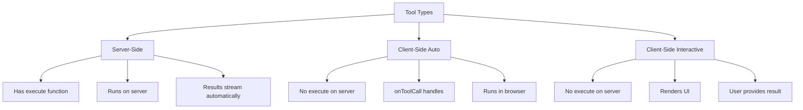

# Tool Calling Integration

## Introduction

One of the most powerful features of modern AI chatbots is the ability to call tools — functions that extend the AI's capabilities beyond text generation. The AI SDK provides deep integration between `useChat` and function calling, enabling server-side tools, client-side tools, user confirmation workflows, and automatic tool loop execution.

This lesson covers everything you need to build chat interfaces with rich tool interactions.

### What We'll Cover

- Server-side tool execution with automatic streaming
- Client-side tools executed in the browser
- The `onToolCall` callback and `addToolOutput` method
- Automatic re-submission with `sendAutomaticallyWhen`
- Tool approval workflows
- Rendering tool parts in the UI
- Error handling for tools

### Prerequisites

- Completed [Message Parts Structure](./02-message-parts-structure.md)
- Completed [Actions and Callbacks](./04-actions-and-callbacks.md)
- Understanding of function calling concepts (Unit 10)

---

## Tool Types in Chat

The AI SDK supports three types of tools:



| Type | Definition | Execution | Use Case |
|------|------------|-----------|----------|
| **Server-side** | Tool with `execute` function | Automatic on server | API calls, database queries |
| **Client-side auto** | No `execute`, handled by `onToolCall` | Automatic in browser | Get location, device info |
| **Client-side interactive** | No `execute`, UI rendered | User interaction | Confirmations, form inputs |

---

## Server-Side Tools

Tools defined with an `execute` function run automatically on the server.

### Server Route Definition

```typescript
// app/api/chat/route.ts
import { convertToModelMessages, streamText, UIMessage } from 'ai';
import { openai } from '@ai-sdk/openai';
import { z } from 'zod';

export async function POST(req: Request) {
  const { messages }: { messages: UIMessage[] } = await req.json();

  const result = streamText({
    model: openai('gpt-4o'),
    messages: await convertToModelMessages(messages),
    tools: {
      getWeather: {
        description: 'Get the current weather for a city',
        inputSchema: z.object({
          city: z.string().describe('The city name'),
        }),
        execute: async ({ city }) => {
          // This runs on the server
          const weather = await fetchWeatherAPI(city);
          return weather;
        },
      },
    },
  });

  return result.toUIMessageStreamResponse();
}
```

### How It Works

1. AI decides to call `getWeather` with arguments
2. Server executes the `execute` function
3. Result is streamed back as part of the message
4. UI displays the tool result automatically

### Client Component

```tsx
'use client';

import { useChat } from '@ai-sdk/react';
import { DefaultChatTransport } from 'ai';

export default function WeatherChat() {
  const { messages, sendMessage, status } = useChat({
    transport: new DefaultChatTransport({ api: '/api/chat' }),
  });

  return (
    <div>
      {messages.map(message => (
        <div key={message.id}>
          {message.parts.map((part, i) => {
            switch (part.type) {
              case 'text':
                return <p key={i}>{part.text}</p>;
              
              case 'tool-getWeather':
                return (
                  <WeatherWidget
                    key={i}
                    city={part.input.city}
                    weather={part.state === 'output-available' ? part.output : null}
                    loading={part.state !== 'output-available'}
                  />
                );
              
              default:
                return null;
            }
          })}
        </div>
      ))}
    </div>
  );
}
```

---

## Client-Side Tools

Tools without an `execute` function must be handled on the client.

### Server Definition (No Execute)

```typescript
// app/api/chat/route.ts
tools: {
  // No execute function - will be handled client-side
  getLocation: {
    description: 'Get the user\'s current location',
    inputSchema: z.object({}),
    // No execute here!
  },
}
```

### Client Handling with onToolCall

```tsx
const { messages, sendMessage, addToolOutput } = useChat({
  transport: new DefaultChatTransport({ api: '/api/chat' }),
  
  async onToolCall({ toolCall }) {
    // Check for dynamic tools first (important for TypeScript)
    if (toolCall.dynamic) {
      console.log('Dynamic tool:', toolCall.toolName);
      return;
    }
    
    if (toolCall.toolName === 'getLocation') {
      try {
        const position = await new Promise<GeolocationPosition>(
          (resolve, reject) => {
            navigator.geolocation.getCurrentPosition(resolve, reject);
          }
        );
        
        // Don't await - avoids potential deadlocks
        addToolOutput({
          tool: 'getLocation',
          toolCallId: toolCall.toolCallId,
          output: {
            lat: position.coords.latitude,
            lng: position.coords.longitude,
          },
        });
      } catch (error) {
        addToolOutput({
          tool: 'getLocation',
          toolCallId: toolCall.toolCallId,
          state: 'output-error',
          errorText: 'Location access denied',
        });
      }
    }
  },
});
```

> **Important:** Always check `toolCall.dynamic` first in TypeScript. Without this check, you'll get type errors when accessing `toolCall.toolName`.

---

## addToolOutput

The `addToolOutput` method provides tool results to the chat.

### Success Case

```typescript
addToolOutput({
  tool: 'getWeather',         // Tool name
  toolCallId: toolCall.toolCallId,  // From the tool call
  output: {                   // The result
    temperature: 72,
    condition: 'sunny',
  },
});
```

### Error Case

```typescript
addToolOutput({
  tool: 'getWeather',
  toolCallId: toolCall.toolCallId,
  state: 'output-error',     // Indicates failure
  errorText: 'Weather API unavailable',
});
```

### Type-Safe Tool Output

The `tool` parameter provides TypeScript type inference:

```typescript
// TypeScript knows the output type based on 'getWeather' tool definition
addToolOutput({
  tool: 'getWeather',  // Typed!
  toolCallId: toolCall.toolCallId,
  output: weatherData, // Must match tool's output type
});
```

---

## Automatic Re-submission

After providing tool results, you often want the AI to continue processing. Use `sendAutomaticallyWhen`:

### Using the Built-in Helper

```tsx
import { useChat } from '@ai-sdk/react';
import { lastAssistantMessageIsCompleteWithToolCalls } from 'ai';

const { messages, sendMessage, addToolOutput } = useChat({
  transport: new DefaultChatTransport({ api: '/api/chat' }),
  
  // Automatically submit when all tool results are available
  sendAutomaticallyWhen: lastAssistantMessageIsCompleteWithToolCalls,
  
  async onToolCall({ toolCall }) {
    // Handle tools...
    addToolOutput({
      tool: toolCall.toolName,
      toolCallId: toolCall.toolCallId,
      output: result,
    });
    // No need to manually call sendMessage - it happens automatically!
  },
});
```

### Custom Condition

```tsx
sendAutomaticallyWhen: ({ messages }) => {
  const lastMessage = messages[messages.length - 1];
  
  // Only auto-submit for certain conditions
  if (lastMessage.role !== 'assistant') return false;
  
  const toolParts = lastMessage.parts.filter(
    p => p.type.startsWith('tool-')
  );
  
  // Check if all tools have results
  return toolParts.every(
    p => p.state === 'output-available' || p.state === 'output-error'
  );
}
```

---

## Interactive Client-Side Tools

Some tools require user interaction before providing a result.

### Example: Confirmation Dialog

```tsx
function ConfirmationTool({ part, onRespond }: {
  part: ToolUIPart;
  onRespond: (confirmed: boolean) => void;
}) {
  if (part.state !== 'input-available') {
    return <div>Loading...</div>;
  }
  
  return (
    <div className="p-4 bg-yellow-50 rounded-lg">
      <p className="font-semibold">{part.input.message}</p>
      <div className="flex gap-2 mt-3">
        <button
          onClick={() => onRespond(true)}
          className="px-4 py-2 bg-green-500 text-white rounded"
        >
          Confirm
        </button>
        <button
          onClick={() => onRespond(false)}
          className="px-4 py-2 bg-red-500 text-white rounded"
        >
          Cancel
        </button>
      </div>
    </div>
  );
}

// In your chat component:
{part.type === 'tool-askForConfirmation' && 
  part.state === 'input-available' && (
    <ConfirmationTool
      part={part}
      onRespond={(confirmed) => {
        addToolOutput({
          tool: 'askForConfirmation',
          toolCallId: part.toolCallId,
          output: confirmed ? 'User confirmed' : 'User denied',
        });
      }}
    />
  )
}
```

---

## Tool Approval Workflow

Require user approval before executing sensitive server-side tools.

### Server Setup

```typescript
import { tool } from 'ai';

tools: {
  deleteFile: tool({
    description: 'Delete a file from the system',
    inputSchema: z.object({
      filename: z.string(),
    }),
    needsApproval: true,  // Require approval
    execute: async ({ filename }) => {
      await fs.unlink(filename);
      return { deleted: filename };
    },
  }),
}
```

### Dynamic Approval

```typescript
tools: {
  transferMoney: tool({
    description: 'Transfer money to an account',
    inputSchema: z.object({
      amount: z.number(),
      toAccount: z.string(),
    }),
    // Only require approval for large amounts
    needsApproval: ({ amount }) => amount > 1000,
    execute: async (input) => {
      return await processTransfer(input);
    },
  }),
}
```

### Client-Side Approval UI

```tsx
const { addToolApprovalResponse } = useChat({
  transport: new DefaultChatTransport({ api: '/api/chat' }),
  sendAutomaticallyWhen: lastAssistantMessageIsCompleteWithApprovalResponses,
});

// In render:
{part.type === 'tool-deleteFile' && part.state === 'approval-requested' && (
  <div className="p-4 bg-orange-50 rounded-lg">
    <p>Delete file: {part.input.filename}?</p>
    <div className="flex gap-2 mt-3">
      <button
        onClick={() => addToolApprovalResponse({
          id: part.approval.id,
          approved: true,
        })}
        className="px-4 py-2 bg-green-500 text-white rounded"
      >
        Approve
      </button>
      <button
        onClick={() => addToolApprovalResponse({
          id: part.approval.id,
          approved: false,
          reason: 'User declined deletion',
        })}
        className="px-4 py-2 bg-red-500 text-white rounded"
      >
        Deny
      </button>
    </div>
  </div>
)}
```

---

## Rendering Tool Parts

### Complete Tool Renderer

```tsx
function ToolPartRenderer({ part }: { part: UIMessagePart }) {
  // Type guard for tool parts
  if (!part.type.startsWith('tool-') && part.type !== 'dynamic-tool') {
    return null;
  }
  
  const { addToolOutput, addToolApprovalResponse } = useChatContext();
  
  // Handle different states
  switch (part.state) {
    case 'input-streaming':
      return (
        <div className="flex items-center gap-2 text-gray-500">
          <Spinner />
          <span>Preparing {part.toolName}...</span>
        </div>
      );
    
    case 'input-available':
      return (
        <div className="p-3 bg-blue-50 rounded">
          <div className="font-semibold">🔧 {part.toolName}</div>
          <pre className="mt-2 text-sm overflow-auto">
            {JSON.stringify(part.input, null, 2)}
          </pre>
          <div className="text-gray-500 text-sm mt-1">Executing...</div>
        </div>
      );
    
    case 'approval-requested':
      return (
        <ApprovalDialog
          tool={part.toolName}
          input={part.input}
          onApprove={() => addToolApprovalResponse({
            id: part.approval.id,
            approved: true,
          })}
          onDeny={(reason) => addToolApprovalResponse({
            id: part.approval.id,
            approved: false,
            reason,
          })}
        />
      );
    
    case 'output-available':
      return (
        <div className="p-3 bg-green-50 rounded">
          <div className="font-semibold">✅ {part.toolName}</div>
          <pre className="mt-2 text-sm overflow-auto">
            {JSON.stringify(part.output, null, 2)}
          </pre>
        </div>
      );
    
    case 'output-error':
      return (
        <div className="p-3 bg-red-50 rounded">
          <div className="font-semibold">❌ {part.toolName}</div>
          <p className="text-red-600 mt-1">{part.errorText}</p>
        </div>
      );
    
    default:
      return null;
  }
}
```

---

## Tool Call Streaming

Tool arguments stream in real-time, allowing you to show progress:

```tsx
case 'input-streaming':
  // Show partial input as it arrives
  return (
    <div className="p-3 bg-gray-50 rounded">
      <div className="font-semibold animate-pulse">
        🔧 {part.toolName}
      </div>
      {part.input && Object.keys(part.input).length > 0 && (
        <pre className="mt-2 text-sm text-gray-500">
          {JSON.stringify(part.input, null, 2)}
        </pre>
      )}
    </div>
  );
```

---

## Error Handling

### In onToolCall

```tsx
async onToolCall({ toolCall }) {
  if (toolCall.dynamic) return;
  
  if (toolCall.toolName === 'fetchData') {
    try {
      const data = await fetchExternalData(toolCall.input);
      
      addToolOutput({
        tool: 'fetchData',
        toolCallId: toolCall.toolCallId,
        output: data,
      });
    } catch (error) {
      addToolOutput({
        tool: 'fetchData',
        toolCallId: toolCall.toolCallId,
        state: 'output-error',
        errorText: error instanceof Error 
          ? error.message 
          : 'Unknown error occurred',
      });
    }
  }
}
```

### Server-Side Error Masking

By default, server errors are masked. To forward them:

```typescript
// app/api/chat/route.ts
return result.toUIMessageStreamResponse({
  onError: (error) => {
    // Forward error message (be careful with sensitive info)
    return error instanceof Error ? error.message : 'Tool execution failed';
  },
});
```

---

## Dynamic Tools

When tool definitions aren't known at compile time (e.g., MCP tools):

```tsx
{message.parts.map((part, i) => {
  if (part.type === 'dynamic-tool') {
    return (
      <div key={i} className="p-3 bg-purple-50 rounded">
        <div className="font-semibold">🔌 {part.toolName}</div>
        {part.state === 'output-available' && (
          <pre className="mt-2 text-sm">
            {JSON.stringify(part.output, null, 2)}
          </pre>
        )}
      </div>
    );
  }
  return null;
})}
```

---

## Complete Example

```tsx
'use client';

import { useChat } from '@ai-sdk/react';
import { 
  DefaultChatTransport, 
  lastAssistantMessageIsCompleteWithToolCalls 
} from 'ai';
import { useState } from 'react';

export default function ToolChat() {
  const [input, setInput] = useState('');
  
  const { messages, sendMessage, addToolOutput, status } = useChat({
    transport: new DefaultChatTransport({ api: '/api/chat' }),
    
    sendAutomaticallyWhen: lastAssistantMessageIsCompleteWithToolCalls,
    
    async onToolCall({ toolCall }) {
      if (toolCall.dynamic) return;
      
      if (toolCall.toolName === 'getLocation') {
        try {
          const cities = ['New York', 'London', 'Tokyo', 'Paris'];
          const randomCity = cities[Math.floor(Math.random() * cities.length)];
          
          addToolOutput({
            tool: 'getLocation',
            toolCallId: toolCall.toolCallId,
            output: randomCity,
          });
        } catch (error) {
          addToolOutput({
            tool: 'getLocation',
            toolCallId: toolCall.toolCallId,
            state: 'output-error',
            errorText: 'Could not get location',
          });
        }
      }
    },
  });

  return (
    <div className="max-w-2xl mx-auto p-4">
      <div className="space-y-4 mb-4">
        {messages.map(message => (
          <div key={message.id} className="space-y-2">
            <div className="font-semibold">
              {message.role === 'user' ? '👤 You' : '🤖 AI'}
            </div>
            
            {message.parts.map((part, i) => {
              switch (part.type) {
                case 'text':
                  return <p key={i}>{part.text}</p>;
                
                case 'tool-getWeather':
                  return (
                    <div key={i} className="p-3 bg-blue-50 rounded">
                      {part.state === 'output-available' ? (
                        <>
                          <strong>Weather in {part.input.city}:</strong>
                          <span> {part.output}</span>
                        </>
                      ) : (
                        <span>Getting weather for {part.input.city}...</span>
                      )}
                    </div>
                  );
                
                case 'tool-getLocation':
                  return (
                    <div key={i} className="p-3 bg-green-50 rounded">
                      {part.state === 'output-available' ? (
                        <span>📍 Location: {part.output}</span>
                      ) : part.state === 'output-error' ? (
                        <span className="text-red-500">❌ {part.errorText}</span>
                      ) : (
                        <span>Getting location...</span>
                      )}
                    </div>
                  );
                
                default:
                  return null;
              }
            })}
          </div>
        ))}
      </div>

      <form
        onSubmit={e => {
          e.preventDefault();
          if (input.trim() && status === 'ready') {
            sendMessage({ text: input });
            setInput('');
          }
        }}
        className="flex gap-2"
      >
        <input
          value={input}
          onChange={e => setInput(e.target.value)}
          disabled={status !== 'ready'}
          className="flex-1 p-2 border rounded"
          placeholder="Ask about weather or location..."
        />
        <button
          type="submit"
          disabled={status !== 'ready'}
          className="px-4 py-2 bg-blue-500 text-white rounded disabled:opacity-50"
        >
          Send
        </button>
      </form>
    </div>
  );
}
```

---

## Best Practices

### ✅ Do

| Practice | Reason |
|----------|--------|
| Check `toolCall.dynamic` first | Required for TypeScript type narrowing |
| Don't await `addToolOutput` | Avoids potential deadlocks |
| Use `sendAutomaticallyWhen` | Simplifies tool loop handling |
| Handle all tool states | Complete UI feedback |
| Provide error states | Users know what went wrong |

### ❌ Don't

| Anti-pattern | Problem |
|--------------|---------|
| Forget to call `addToolOutput` | Tool never completes |
| Await `addToolOutput` | Potential deadlock |
| Skip approval for sensitive ops | Security risk |
| Ignore streaming state | Missing loading feedback |

---

## Summary

✅ Server-side tools have `execute` functions that run automatically

✅ Client-side tools require `onToolCall` and `addToolOutput` handling

✅ `sendAutomaticallyWhen` automates the tool result → resubmit flow

✅ Tool approval with `needsApproval` adds user confirmation for sensitive operations

✅ Tool parts have typed names (`tool-{name}`) with state tracking through the lifecycle

**Next:** [Performance Optimization](./07-performance-optimization.md)

---

## Further Reading

- [Chatbot Tool Usage](https://ai-sdk.dev/docs/ai-sdk-ui/chatbot-tool-usage) — Complete tool guide
- [Tool Calling Core](https://ai-sdk.dev/docs/ai-sdk-core/tools-and-tool-calling) — Server-side tool patterns
- [InferUITools Reference](https://ai-sdk.dev/docs/reference/ai-sdk-ui/infer-ui-tools) — Type inference

---

<!-- 
Sources Consulted:
- Chatbot Tool Usage: https://ai-sdk.dev/docs/ai-sdk-ui/chatbot-tool-usage
- useChat Reference: https://ai-sdk.dev/docs/reference/ai-sdk-ui/use-chat
- Tool Calling: https://ai-sdk.dev/docs/ai-sdk-core/tools-and-tool-calling
-->
