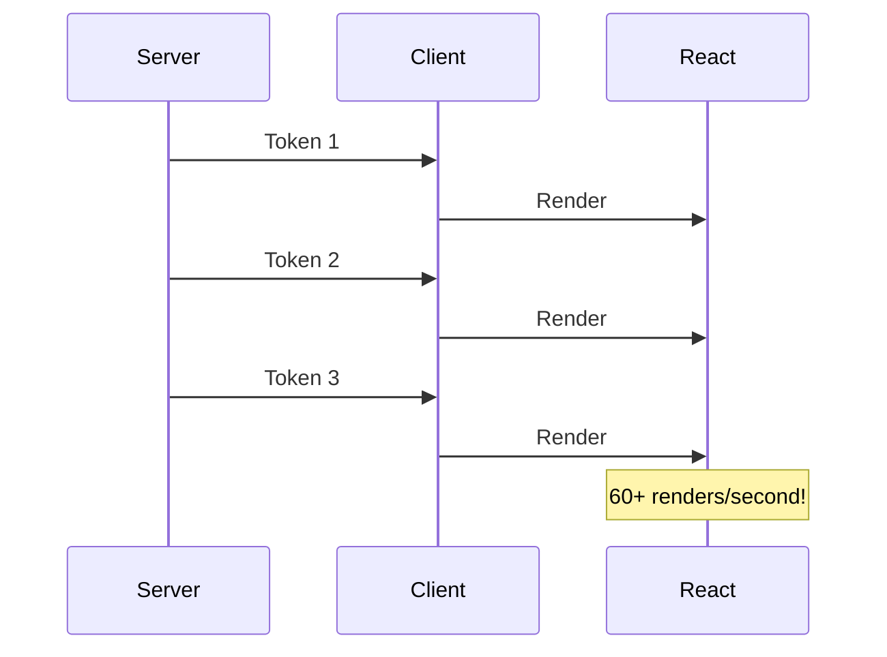
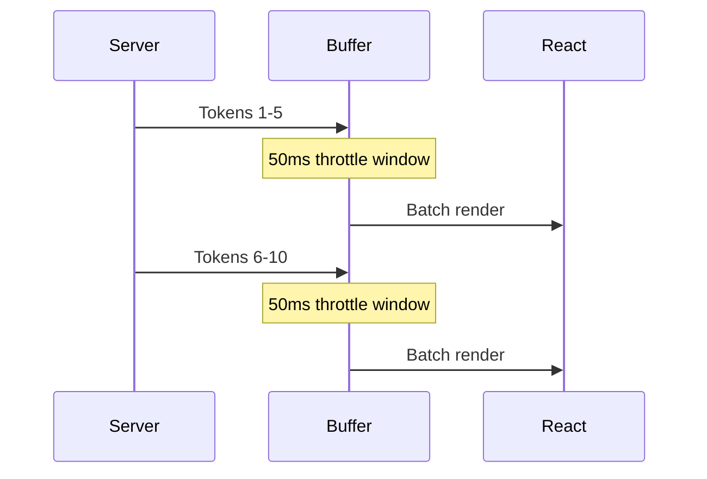
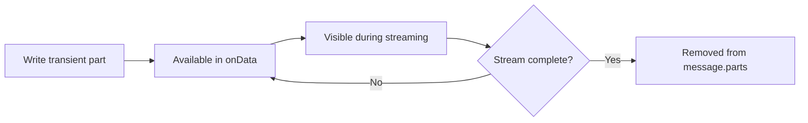

# Performance Optimization

## Introduction

Streaming chat interfaces generate rapid state updates as tokens arrive. Without optimization, these updates can cause UI jank, high CPU usage, and poor user experience. The AI SDK provides several mechanisms to optimize performance while maintaining responsive interfaces.

This lesson covers throttling, efficient data streaming, metadata handling, and reconciliation patterns.

### What We'll Cover

- The `experimental_throttle` option for batched updates
- Streaming metadata alongside text
- Custom data parts with `createUIMessageStream`
- Data reconciliation and transient parts
- React rendering optimization patterns

### Prerequisites

- Completed [Actions and Callbacks](./04-actions-and-callbacks.md)
- Understanding of React rendering performance basics

---

## The Performance Problem

### Without Throttling



When streaming, each token triggers a state update. At typical streaming speeds (30-100 tokens/second), this means:

- **60+ React re-renders per second** during streaming
- High CPU usage on mobile devices
- Potential frame drops and jank
- Wasted renders for tokens the user can't distinguish

---

## experimental_throttle

The `experimental_throttle` option batches updates at a fixed interval.

### Basic Usage

```tsx
import { useChat } from '@ai-sdk/react';
import { DefaultChatTransport } from 'ai';

const { messages, sendMessage } = useChat({
  transport: new DefaultChatTransport({ api: '/api/chat' }),
  
  // Batch updates every 50ms
  experimental_throttle: 50,
});
```

### How It Works



With throttling:

| Interval | Renders/Second | Benefit |
|----------|----------------|---------|
| 0 (none) | 60-100+ | None - every token triggers render |
| 50ms | ~20 | Good balance for most UIs |
| 100ms | ~10 | Heavy throttling for slow devices |
| 200ms | ~5 | Noticeable lag, not recommended |

### Recommended Values

```tsx
// Desktop applications - responsive
experimental_throttle: 50,

// Mobile-first - battery efficient
experimental_throttle: 100,

// Complex UIs with syntax highlighting
experimental_throttle: 75,
```

> **Note:** The throttle applies to the `messages` state updates. Other states like `status` may update immediately.

---

## Streaming Metadata

Beyond text, you often need to stream additional data like sources, citations, or progress information.

### Server-Side with createUIMessageStream

```typescript
// app/api/chat/route.ts
import { 
  convertToModelMessages, 
  streamText, 
  createUIMessageStream,
  UIMessage 
} from 'ai';
import { openai } from '@ai-sdk/openai';

export async function POST(req: Request) {
  const { messages }: { messages: UIMessage[] } = await req.json();

  const stream = createUIMessageStream({
    execute: async (writer) => {
      // Stream custom data first
      writer.write({
        type: 'data-sources',
        id: 'sources-1',
        data: {
          databases: ['product_catalog', 'inventory'],
          timestamp: Date.now(),
        },
      });

      // Then stream the LLM response
      const result = streamText({
        model: openai('gpt-4o'),
        messages: await convertToModelMessages(messages),
      });

      // Merge text stream into UI stream
      result.mergeInto(writer);
      await result.consumeStream();
    },
  });

  return stream.toResponse();
}
```

### Custom Data Part Types

```typescript
// Define data parts for different information types
writer.write({
  type: 'data-progress',  // Becomes accessible via part.type === 'data-progress'
  id: 'progress-1',
  data: {
    stage: 'searching',
    complete: 30,
  },
});

writer.write({
  type: 'data-citation',
  id: 'cite-1',
  data: {
    title: 'Product Documentation',
    url: 'https://docs.example.com/products',
    pageNumber: 42,
  },
});
```

### Rendering Data Parts

```tsx
{message.parts.map((part, i) => {
  switch (part.type) {
    case 'text':
      return <p key={i}>{part.text}</p>;
    
    case 'data-sources':
      return (
        <div key={i} className="flex gap-2 text-sm text-gray-500">
          📚 Sources: {part.data.databases.join(', ')}
        </div>
      );
    
    case 'data-progress':
      return (
        <div key={i} className="w-full bg-gray-200 rounded">
          <div 
            className="bg-blue-500 rounded h-2" 
            style={{ width: `${part.data.complete}%` }}
          />
          <span className="text-xs">{part.data.stage}</span>
        </div>
      );
    
    case 'data-citation':
      return (
        <a 
          key={i} 
          href={part.data.url}
          className="text-blue-600 underline"
        >
          [{i}] {part.data.title} (p. {part.data.pageNumber})
        </a>
      );
    
    default:
      return null;
  }
})}
```

---

## Data Reconciliation

When you send data parts with the same `id`, they are **updated** rather than added. This enables progress tracking and live updates.

### How Reconciliation Works

```typescript
// First write
writer.write({
  type: 'data-progress',
  id: 'progress-main',  // This ID is the key
  data: { stage: 'searching', complete: 10 },
});

// Later write with SAME ID updates the existing part
writer.write({
  type: 'data-progress',
  id: 'progress-main',  // Same ID = update, not new part
  data: { stage: 'analyzing', complete: 50 },
});

// Different ID creates a new part
writer.write({
  type: 'data-progress',
  id: 'progress-secondary',  // New ID = new part
  data: { stage: 'formatting', complete: 75 },
});
```

### Progress Bar Example

```typescript
// Server
async function processWithProgress(writer, input) {
  const steps = [
    { stage: 'Parsing query', progress: 20 },
    { stage: 'Searching database', progress: 40 },
    { stage: 'Analyzing results', progress: 60 },
    { stage: 'Generating response', progress: 80 },
    { stage: 'Complete', progress: 100 },
  ];

  for (const step of steps) {
    writer.write({
      type: 'data-progress',
      id: 'main-progress',  // Always same ID
      data: {
        stage: step.stage,
        complete: step.progress,
      },
    });
    
    await doWork(step.stage);
  }
}
```

```tsx
// Client - only one progress bar rendered, updated in place
{message.parts.map((part, i) => {
  if (part.type === 'data-progress') {
    return (
      <ProgressBar
        key={part.id}  // Use the stable ID as key
        stage={part.data.stage}
        complete={part.data.complete}
      />
    );
  }
})}
```

---

## Transient Parts

Some data is only relevant during streaming and shouldn't persist in final messages.

### Marking Parts as Transient

```typescript
// Server
writer.write({
  type: 'data-typing-indicator',
  id: 'typing',
  transient: true,  // Won't be in final message.parts
  data: { 
    text: 'Thinking...' 
  },
});
```

### Behavior



| Property | Transient Part | Normal Part |
|----------|----------------|-------------|
| Available in `onData` | ✅ | ✅ |
| In `message.parts` during stream | ✅ | ✅ |
| In `message.parts` after stream | ❌ | ✅ |
| Use case | Loading states, temporary indicators | Citations, sources, results |

### Handling Transient Parts

```tsx
const { messages } = useChat({
  transport: new DefaultChatTransport({ api: '/api/chat' }),
  
  onData({ data, part }) {
    // Transient parts available here during streaming
    if (part?.transient) {
      console.log('Transient update:', part);
    }
  },
});
```

---

## React Optimization Patterns

### Memoized Message Components

```tsx
import { memo } from 'react';
import type { UIMessage } from 'ai';

const MessageItem = memo(function MessageItem({ 
  message 
}: { 
  message: UIMessage 
}) {
  return (
    <div className="message">
      {message.parts.map((part, i) => (
        <PartRenderer key={i} part={part} />
      ))}
    </div>
  );
});

// Usage - only re-renders when message content changes
{messages.map(message => (
  <MessageItem key={message.id} message={message} />
))}
```

### Virtualized Lists for Long Conversations

For chat histories with many messages, virtualization prevents rendering off-screen content:

```tsx
import { useVirtualizer } from '@tanstack/react-virtual';

function VirtualizedChat({ messages }) {
  const parentRef = useRef<HTMLDivElement>(null);
  
  const virtualizer = useVirtualizer({
    count: messages.length,
    getScrollElement: () => parentRef.current,
    estimateSize: () => 100,  // Estimated message height
    overscan: 5,  // Render 5 extra items for smooth scrolling
  });

  return (
    <div ref={parentRef} className="h-[600px] overflow-auto">
      <div
        style={{
          height: `${virtualizer.getTotalSize()}px`,
          position: 'relative',
        }}
      >
        {virtualizer.getVirtualItems().map(virtualRow => (
          <div
            key={virtualRow.key}
            style={{
              position: 'absolute',
              top: 0,
              left: 0,
              width: '100%',
              transform: `translateY(${virtualRow.start}px)`,
            }}
          >
            <MessageItem message={messages[virtualRow.index]} />
          </div>
        ))}
      </div>
    </div>
  );
}
```

### Separate Streaming State

Keep the streaming message separate from the stable history:

```tsx
function OptimizedChat() {
  const { messages, status } = useChat({
    transport: new DefaultChatTransport({ api: '/api/chat' }),
    experimental_throttle: 50,
  });

  const historyMessages = useMemo(() => {
    if (status === 'streaming' && messages.length > 0) {
      return messages.slice(0, -1);  // All but streaming message
    }
    return messages;
  }, [messages, status]);

  const streamingMessage = useMemo(() => {
    if (status === 'streaming' && messages.length > 0) {
      return messages[messages.length - 1];
    }
    return null;
  }, [messages, status]);

  return (
    <div>
      {/* History rarely re-renders */}
      <MemoizedHistory messages={historyMessages} />
      
      {/* Only this updates during streaming */}
      {streamingMessage && (
        <StreamingMessage message={streamingMessage} />
      )}
    </div>
  );
}
```

---

## Network Optimization

### Request Batching

When sending multiple messages quickly (e.g., regenerate scenarios):

```tsx
const debouncedSend = useMemo(() => 
  debounce((content: string) => {
    sendMessage({ text: content });
  }, 100),
  [sendMessage]
);
```

### Connection Keep-Alive

The `DefaultChatTransport` maintains connection efficiently, but for high-frequency chat:

```tsx
const transport = useMemo(() => 
  new DefaultChatTransport({
    api: '/api/chat',
    headers: {
      'Connection': 'keep-alive',
    },
  }),
  []
);
```

---

## Debugging Performance

### Monitor Re-renders

```tsx
import { useEffect, useRef } from 'react';

function MessageWithRenderCount({ message }) {
  const renderCount = useRef(0);
  
  useEffect(() => {
    renderCount.current++;
    console.log(`Message ${message.id} rendered ${renderCount.current} times`);
  });
  
  return <div>{/* ... */}</div>;
}
```

### Profile with React DevTools

1. Open React DevTools
2. Go to Profiler tab
3. Enable "Record why each component rendered"
4. Send a message and analyze the flame graph
5. Look for unnecessary re-renders in message list

### Throttle Effectiveness

```tsx
const { messages } = useChat({
  transport: new DefaultChatTransport({ api: '/api/chat' }),
  experimental_throttle: 50,
});

useEffect(() => {
  const start = performance.now();
  return () => {
    console.log(`Message update took ${performance.now() - start}ms`);
  };
}, [messages]);
```

---

## Complete Optimized Example

```tsx
'use client';

import { useChat } from '@ai-sdk/react';
import { DefaultChatTransport } from 'ai';
import { memo, useMemo, useRef, useCallback } from 'react';

// Memoized part renderer
const PartRenderer = memo(function PartRenderer({ part }: { part: any }) {
  switch (part.type) {
    case 'text':
      return <p className="whitespace-pre-wrap">{part.text}</p>;
    case 'data-progress':
      return (
        <div className="w-full bg-gray-200 rounded h-2">
          <div 
            className="bg-blue-500 h-2 rounded transition-all"
            style={{ width: `${part.data.complete}%` }}
          />
        </div>
      );
    default:
      return null;
  }
});

// Memoized message component
const MessageItem = memo(function MessageItem({ 
  message,
  isStreaming 
}: { 
  message: any;
  isStreaming: boolean;
}) {
  return (
    <div className={`p-4 ${message.role === 'user' ? 'bg-blue-50' : 'bg-gray-50'}`}>
      <div className="font-semibold mb-2">
        {message.role === 'user' ? '👤 You' : '🤖 AI'}
        {isStreaming && <span className="ml-2 animate-pulse">●</span>}
      </div>
      {message.parts.map((part: any, i: number) => (
        <PartRenderer key={`${part.type}-${i}`} part={part} />
      ))}
    </div>
  );
});

export default function OptimizedChat() {
  const inputRef = useRef<HTMLInputElement>(null);

  const { messages, sendMessage, status } = useChat({
    transport: new DefaultChatTransport({ api: '/api/chat' }),
    experimental_throttle: 50,  // Key optimization!
  });

  // Separate history from streaming message
  const { history, streamingMsg } = useMemo(() => {
    if (status === 'streaming' && messages.length > 0) {
      return {
        history: messages.slice(0, -1),
        streamingMsg: messages[messages.length - 1],
      };
    }
    return { history: messages, streamingMsg: null };
  }, [messages, status]);

  const handleSubmit = useCallback((e: React.FormEvent) => {
    e.preventDefault();
    const input = inputRef.current;
    if (input?.value.trim() && status === 'ready') {
      sendMessage({ text: input.value });
      input.value = '';
    }
  }, [sendMessage, status]);

  return (
    <div className="max-w-2xl mx-auto">
      {/* Stable history - rarely re-renders */}
      <div className="space-y-2">
        {history.map(message => (
          <MessageItem 
            key={message.id} 
            message={message} 
            isStreaming={false}
          />
        ))}
        
        {/* Only streaming message updates frequently */}
        {streamingMsg && (
          <MessageItem 
            key={streamingMsg.id} 
            message={streamingMsg} 
            isStreaming={true}
          />
        )}
      </div>

      <form onSubmit={handleSubmit} className="mt-4 flex gap-2">
        <input
          ref={inputRef}
          disabled={status !== 'ready'}
          className="flex-1 p-2 border rounded"
          placeholder="Type a message..."
        />
        <button
          type="submit"
          disabled={status !== 'ready'}
          className="px-4 py-2 bg-blue-500 text-white rounded disabled:opacity-50"
        >
          Send
        </button>
      </form>
    </div>
  );
}
```

---

## Summary

✅ `experimental_throttle` batches state updates to reduce renders (recommended: 50ms)

✅ Stream custom data with `createUIMessageStream` and typed `data-*` parts

✅ Same `id` on data parts triggers updates, not new entries

✅ Transient parts disappear after streaming completes — perfect for loading states

✅ Separate streaming message from history to minimize re-renders

**Next:** [Agentic Chat Patterns](./08-agentic-chat-patterns.md)

---

## Further Reading

- [Streaming Data](https://ai-sdk.dev/docs/ai-sdk-ui/chatbot-streaming-data) — Custom data streaming
- [useChat Reference](https://ai-sdk.dev/docs/reference/ai-sdk-ui/use-chat) — All options including throttle
- [React Performance](https://react.dev/learn/render-and-commit) — Understanding React rendering

---

<!-- 
Sources Consulted:
- Streaming Data: https://ai-sdk.dev/docs/ai-sdk-ui/chatbot-streaming-data
- useChat Reference: https://ai-sdk.dev/docs/reference/ai-sdk-ui/use-chat
- Chatbot Guide: https://ai-sdk.dev/docs/ai-sdk-ui/chatbot
-->
