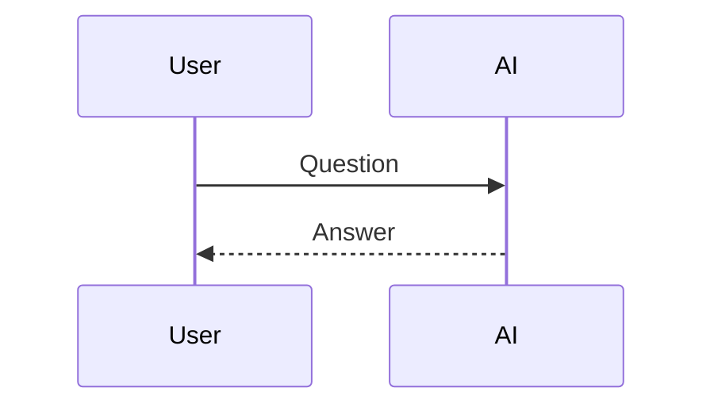
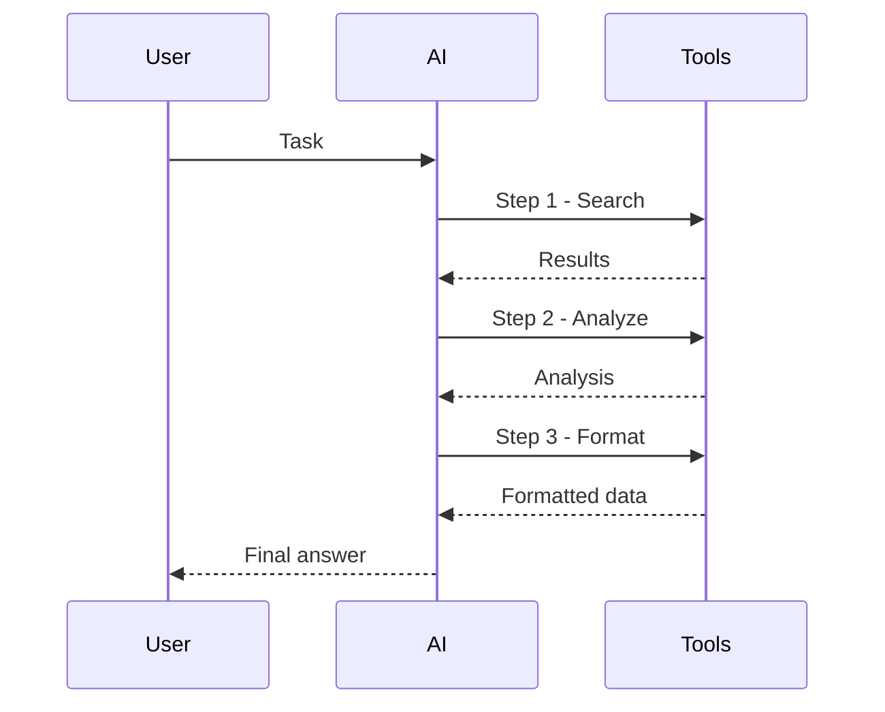
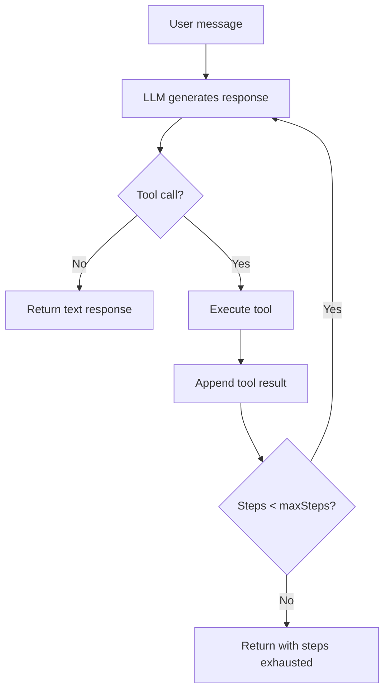
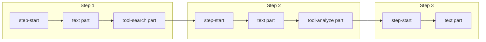
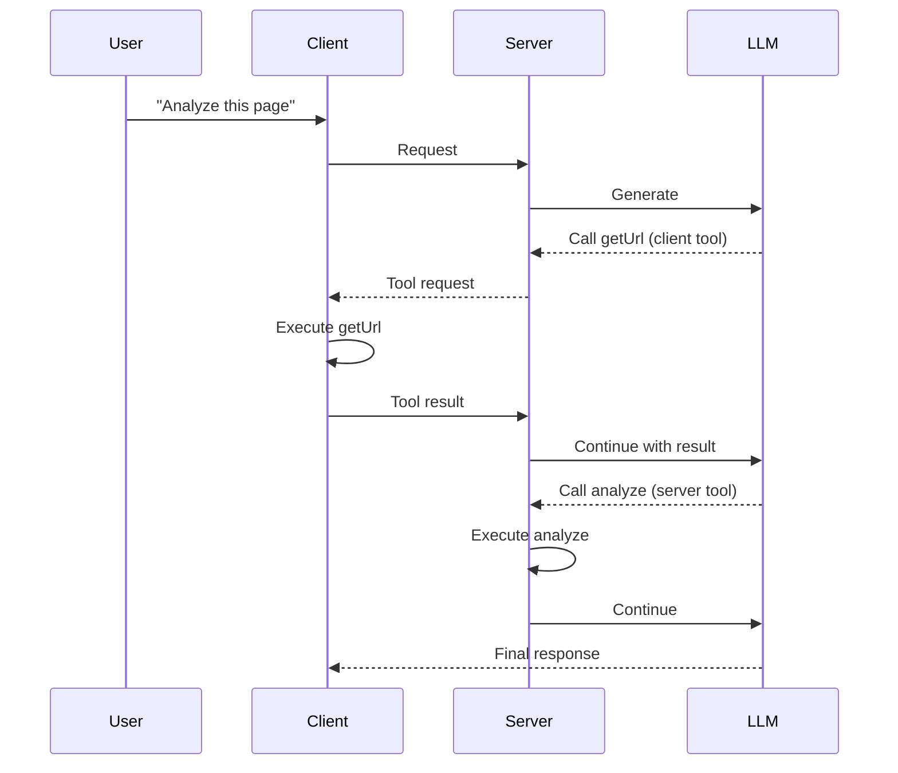

# Agentic Chat Patterns

## Introduction

Modern AI assistants go beyond single request-response cycles. They execute multi-step reasoning, call multiple tools in sequence, and adjust their approach based on intermediate results. The AI SDK provides powerful primitives for building these agentic chat experiences.

This lesson covers multi-step tool loops, step tracking, progress visualization, and patterns for building sophisticated AI agents in chat interfaces.

### What We'll Cover

- Multi-step tool execution with `maxSteps`
- Controlling loop termination with `stopWhen`
- Step boundaries with `step-start` parts
- Progress visualization during agent execution
- Server-side vs client-side agent patterns
- Error recovery in multi-step flows

### Prerequisites

- Completed [Tool Calling Integration](./06-tool-calling-integration.md)
- Understanding of AI agent concepts (Unit 11)

---

## What Makes Chat "Agentic"?

Traditional chatbots handle one request at a time:



Agentic chat involves autonomous multi-step execution:



Key characteristics:
- **Autonomous decision-making** — AI decides which tools to use
- **Multi-step execution** — Multiple tool calls in sequence
- **Intermediate reasoning** — AI processes results before continuing
- **Goal-oriented** — Works toward completing a task, not just answering

---

## Multi-Step Tool Execution

### Server-Side with maxSteps

The `maxSteps` option enables automatic tool loop execution on the server:

```typescript
// app/api/chat/route.ts
import { convertToModelMessages, streamText, UIMessage } from 'ai';
import { openai } from '@ai-sdk/openai';
import { z } from 'zod';

export async function POST(req: Request) {
  const { messages }: { messages: UIMessage[] } = await req.json();

  const result = streamText({
    model: openai('gpt-4o'),
    messages: await convertToModelMessages(messages),
    
    // Allow up to 5 sequential tool executions
    maxSteps: 5,
    
    tools: {
      search: {
        description: 'Search for information',
        inputSchema: z.object({
          query: z.string(),
        }),
        execute: async ({ query }) => {
          return await searchDatabase(query);
        },
      },
      analyze: {
        description: 'Analyze search results',
        inputSchema: z.object({
          data: z.array(z.string()),
        }),
        execute: async ({ data }) => {
          return await analyzeData(data);
        },
      },
      summarize: {
        description: 'Create a summary',
        inputSchema: z.object({
          content: z.string(),
        }),
        execute: async ({ content }) => {
          return summarizeContent(content);
        },
      },
    },
  });

  return result.toUIMessageStreamResponse();
}
```

### How maxSteps Works



| maxSteps | Behavior |
|----------|----------|
| 1 | Single tool call only |
| 3 | Up to 3 sequential tool calls |
| 5 | Recommended for most agents |
| 10+ | Complex research/analysis tasks |

---

## Controlling Loop Termination

### Using stopWhen with stepCountIs

```typescript
import { stepCountIs } from 'ai';

const result = streamText({
  model: openai('gpt-4o'),
  messages: await convertToModelMessages(messages),
  
  // Stop after exactly 3 steps
  stopWhen: stepCountIs(3),
  
  tools: { /* ... */ },
});
```

### Custom Stop Conditions

```typescript
stopWhen: ({ steps }) => {
  const lastStep = steps[steps.length - 1];
  
  // Stop if the AI says it's done
  if (lastStep.text?.includes('[TASK_COMPLETE]')) {
    return true;
  }
  
  // Stop if we've made too many tool calls
  const toolCallCount = steps.reduce(
    (count, step) => count + (step.toolCalls?.length || 0),
    0
  );
  if (toolCallCount > 10) {
    return true;
  }
  
  // Continue otherwise
  return false;
}
```

### Combining Conditions

```typescript
import { stepCountIs, hasNoActiveToolCalls, and, or } from 'ai';

// Stop when step count is 5 OR when there are no more tool calls
stopWhen: or(
  stepCountIs(5),
  hasNoActiveToolCalls
)

// Stop when step count is at least 3 AND no active tool calls
stopWhen: and(
  stepCountIs(3),
  hasNoActiveToolCalls
)
```

---

## Step Boundaries with step-start Parts

Multi-step execution creates `step-start` parts that mark transitions between steps.

### Understanding Step Parts



### Rendering Step Progress

```tsx
function AgentMessage({ message }) {
  const steps = useMemo(() => {
    const stepGroups = [];
    let currentStep = [];
    
    for (const part of message.parts) {
      if (part.type === 'step-start') {
        if (currentStep.length > 0) {
          stepGroups.push(currentStep);
        }
        currentStep = [part];
      } else {
        currentStep.push(part);
      }
    }
    
    if (currentStep.length > 0) {
      stepGroups.push(currentStep);
    }
    
    return stepGroups;
  }, [message.parts]);

  return (
    <div className="space-y-4">
      {steps.map((stepParts, stepIndex) => (
        <StepCard 
          key={stepIndex} 
          stepNumber={stepIndex + 1}
          parts={stepParts}
        />
      ))}
    </div>
  );
}

function StepCard({ stepNumber, parts }) {
  return (
    <div className="border-l-4 border-blue-400 pl-4">
      <div className="text-sm text-gray-500 mb-2">
        Step {stepNumber}
      </div>
      {parts.map((part, i) => {
        if (part.type === 'step-start') return null;
        return <PartRenderer key={i} part={part} />;
      })}
    </div>
  );
}
```

---

## Progress Visualization

### Real-Time Step Tracking

```tsx
function AgentProgress({ message, status }) {
  const stepCount = useMemo(() => 
    message.parts.filter(p => p.type === 'step-start').length,
    [message.parts]
  );
  
  const activeTools = useMemo(() => 
    message.parts.filter(p => 
      p.type.startsWith('tool-') && 
      p.state !== 'output-available' &&
      p.state !== 'output-error'
    ),
    [message.parts]
  );
  
  return (
    <div className="bg-gray-100 p-4 rounded-lg">
      <div className="flex items-center gap-4">
        <div className="text-2xl font-bold text-blue-600">
          Step {stepCount}
        </div>
        
        {status === 'streaming' && (
          <div className="flex items-center gap-2">
            <span className="animate-pulse">●</span>
            <span className="text-sm text-gray-600">
              {activeTools.length > 0 
                ? `Running: ${activeTools[0].toolName}`
                : 'Thinking...'}
            </span>
          </div>
        )}
      </div>
      
      {/* Step indicators */}
      <div className="flex gap-2 mt-3">
        {Array.from({ length: stepCount }).map((_, i) => (
          <div
            key={i}
            className={`w-3 h-3 rounded-full ${
              i < stepCount - 1 
                ? 'bg-green-500' 
                : 'bg-blue-500 animate-pulse'
            }`}
          />
        ))}
      </div>
    </div>
  );
}
```

### Tool Execution Timeline

```tsx
function ToolTimeline({ message }) {
  const toolParts = message.parts.filter(p => 
    p.type.startsWith('tool-') || p.type === 'dynamic-tool'
  );
  
  return (
    <div className="border-l-2 border-gray-300 ml-4">
      {toolParts.map((part, i) => (
        <div key={i} className="relative pl-6 pb-4">
          {/* Timeline dot */}
          <div className={`absolute left-[-5px] w-3 h-3 rounded-full ${
            part.state === 'output-available' ? 'bg-green-500' :
            part.state === 'output-error' ? 'bg-red-500' :
            'bg-blue-500 animate-pulse'
          }`} />
          
          {/* Tool info */}
          <div className="text-sm font-medium">{part.toolName}</div>
          <div className="text-xs text-gray-500">
            {part.state === 'output-available' && '✓ Complete'}
            {part.state === 'output-error' && '✗ Failed'}
            {part.state === 'input-streaming' && 'Preparing...'}
            {part.state === 'input-available' && 'Executing...'}
          </div>
        </div>
      ))}
    </div>
  );
}
```

---

## Client-Side Agent Pattern

For client-side tools that need to participate in multi-step loops:

### Using sendAutomaticallyWhen

```tsx
import { useChat } from '@ai-sdk/react';
import { 
  DefaultChatTransport,
  lastAssistantMessageIsCompleteWithToolCalls 
} from 'ai';

export default function ClientAgent() {
  const { messages, sendMessage, addToolOutput, status } = useChat({
    transport: new DefaultChatTransport({ api: '/api/chat' }),
    
    // Automatically continue after tool results are provided
    sendAutomaticallyWhen: lastAssistantMessageIsCompleteWithToolCalls,
    
    async onToolCall({ toolCall }) {
      if (toolCall.dynamic) return;
      
      switch (toolCall.toolName) {
        case 'getClipboard':
          try {
            const text = await navigator.clipboard.readText();
            addToolOutput({
              tool: 'getClipboard',
              toolCallId: toolCall.toolCallId,
              output: text,
            });
          } catch {
            addToolOutput({
              tool: 'getClipboard',
              toolCallId: toolCall.toolCallId,
              state: 'output-error',
              errorText: 'Clipboard access denied',
            });
          }
          break;
          
        case 'getCurrentUrl':
          addToolOutput({
            tool: 'getCurrentUrl',
            toolCallId: toolCall.toolCallId,
            output: window.location.href,
          });
          break;
      }
    },
  });
  
  // ... render
}
```

### Mixed Server/Client Tools



---

## Error Recovery

### Handling Step Failures

```typescript
// Server-side error handling
const result = streamText({
  model: openai('gpt-4o'),
  messages: await convertToModelMessages(messages),
  maxSteps: 5,
  
  tools: {
    riskyOperation: {
      description: 'An operation that might fail',
      inputSchema: z.object({ input: z.string() }),
      execute: async ({ input }) => {
        try {
          return await performRiskyOperation(input);
        } catch (error) {
          // Return error as result so AI can adapt
          return {
            success: false,
            error: error.message,
            suggestion: 'Try with different parameters',
          };
        }
      },
    },
  },
});
```

### Client-Side Retry Pattern

```tsx
const { messages, sendMessage, regenerate, status, error } = useChat({
  transport: new DefaultChatTransport({ api: '/api/chat' }),
  
  onError({ error }) {
    console.error('Chat error:', error);
  },
});

// UI for error recovery
{status === 'error' && (
  <div className="bg-red-50 p-4 rounded-lg">
    <p className="text-red-600">{error?.message}</p>
    <div className="flex gap-2 mt-3">
      <button
        onClick={() => regenerate()}
        className="px-3 py-1 bg-red-500 text-white rounded"
      >
        Retry Last Step
      </button>
      <button
        onClick={() => {
          // Manual intervention - provide corrected input
          sendMessage({ text: 'Try a different approach' });
        }}
        className="px-3 py-1 bg-gray-500 text-white rounded"
      >
        Try Different Approach
      </button>
    </div>
  </div>
)}
```

---

## Reasoning Display

Show the AI's thinking process alongside tool execution:

### Server Setup with Reasoning

```typescript
const result = streamText({
  model: openai('gpt-4o'),
  messages: await convertToModelMessages(messages),
  maxSteps: 5,
  experimental_reasoning: true,  // Enable reasoning parts
  tools: { /* ... */ },
});
```

### Rendering Reasoning Parts

```tsx
function ReasoningStep({ part }) {
  const [expanded, setExpanded] = useState(false);
  
  return (
    <div className="bg-purple-50 rounded-lg overflow-hidden">
      <button
        onClick={() => setExpanded(!expanded)}
        className="w-full p-3 text-left flex items-center justify-between"
      >
        <span className="font-medium text-purple-700">
          💭 AI Reasoning
        </span>
        <span>{expanded ? '▼' : '▶'}</span>
      </button>
      
      {expanded && (
        <div className="px-3 pb-3 text-sm text-purple-600 whitespace-pre-wrap">
          {part.reasoning}
        </div>
      )}
    </div>
  );
}

// In message renderer:
{part.type === 'reasoning' && <ReasoningStep part={part} />}
```

---

## Complete Agentic Chat Example

```tsx
'use client';

import { useChat } from '@ai-sdk/react';
import { 
  DefaultChatTransport,
  lastAssistantMessageIsCompleteWithToolCalls 
} from 'ai';
import { useState, useMemo } from 'react';

export default function AgenticChat() {
  const [input, setInput] = useState('');
  
  const { messages, sendMessage, addToolOutput, status, stop } = useChat({
    transport: new DefaultChatTransport({ api: '/api/agent' }),
    experimental_throttle: 50,
    sendAutomaticallyWhen: lastAssistantMessageIsCompleteWithToolCalls,
    
    async onToolCall({ toolCall }) {
      if (toolCall.dynamic) return;
      
      if (toolCall.toolName === 'getScreenSize') {
        addToolOutput({
          tool: 'getScreenSize',
          toolCallId: toolCall.toolCallId,
          output: {
            width: window.innerWidth,
            height: window.innerHeight,
          },
        });
      }
    },
  });

  // Get current step count from last assistant message
  const currentStep = useMemo(() => {
    const lastAssistant = [...messages].reverse().find(m => m.role === 'assistant');
    if (!lastAssistant) return 0;
    return lastAssistant.parts.filter(p => p.type === 'step-start').length;
  }, [messages]);

  return (
    <div className="max-w-3xl mx-auto p-4">
      {/* Progress indicator */}
      {status === 'streaming' && (
        <div className="mb-4 p-3 bg-blue-50 rounded-lg flex items-center justify-between">
          <div className="flex items-center gap-3">
            <div className="animate-spin h-5 w-5 border-2 border-blue-500 border-t-transparent rounded-full" />
            <span>Agent working... Step {currentStep}</span>
          </div>
          <button
            onClick={() => stop()}
            className="px-3 py-1 text-sm bg-red-500 text-white rounded"
          >
            Stop
          </button>
        </div>
      )}

      {/* Messages */}
      <div className="space-y-4 mb-4">
        {messages.map(message => (
          <div key={message.id}>
            <div className="font-semibold mb-2">
              {message.role === 'user' ? '👤 You' : '🤖 Agent'}
            </div>
            
            {message.parts.map((part, i) => {
              switch (part.type) {
                case 'step-start':
                  return (
                    <div key={i} className="text-xs text-gray-400 my-2 border-t pt-2">
                      — Step {i + 1} —
                    </div>
                  );
                
                case 'text':
                  return <p key={i} className="whitespace-pre-wrap">{part.text}</p>;
                
                case 'reasoning':
                  return (
                    <details key={i} className="bg-purple-50 p-2 rounded text-sm">
                      <summary className="cursor-pointer text-purple-700">
                        💭 View reasoning
                      </summary>
                      <p className="mt-2 text-purple-600">{part.reasoning}</p>
                    </details>
                  );
                
                default:
                  if (part.type.startsWith('tool-') || part.type === 'dynamic-tool') {
                    return (
                      <div key={i} className={`p-3 rounded my-2 ${
                        part.state === 'output-available' ? 'bg-green-50' :
                        part.state === 'output-error' ? 'bg-red-50' :
                        'bg-yellow-50'
                      }`}>
                        <div className="font-medium">
                          🔧 {part.toolName}
                          {part.state === 'output-available' && ' ✓'}
                          {part.state === 'output-error' && ' ✗'}
                        </div>
                        {part.state === 'output-available' && (
                          <pre className="text-xs mt-1 overflow-auto">
                            {JSON.stringify(part.output, null, 2)}
                          </pre>
                        )}
                      </div>
                    );
                  }
                  return null;
              }
            })}
          </div>
        ))}
      </div>

      {/* Input */}
      <form
        onSubmit={e => {
          e.preventDefault();
          if (input.trim() && status === 'ready') {
            sendMessage({ text: input });
            setInput('');
          }
        }}
        className="flex gap-2"
      >
        <input
          value={input}
          onChange={e => setInput(e.target.value)}
          disabled={status !== 'ready'}
          className="flex-1 p-3 border rounded-lg"
          placeholder="Give the agent a task..."
        />
        <button
          type="submit"
          disabled={status !== 'ready'}
          className="px-6 py-3 bg-blue-500 text-white rounded-lg disabled:opacity-50"
        >
          Run
        </button>
      </form>
    </div>
  );
}
```

---

## Best Practices

### ✅ Do

| Practice | Reason |
|----------|--------|
| Set reasonable `maxSteps` limits | Prevent runaway loops |
| Show step progress to users | Transparency builds trust |
| Handle tool errors gracefully | Keep agent running |
| Use `sendAutomaticallyWhen` | Simplifies tool loop logic |
| Provide stop button | User control over long operations |

### ❌ Don't

| Anti-pattern | Problem |
|--------------|---------|
| Unlimited `maxSteps` | Runaway costs and time |
| Hide agent activity | Users lose trust |
| Fail silently on errors | Agent gets stuck |
| Block UI during execution | Poor user experience |

---

## Summary

✅ `maxSteps` enables automatic multi-step tool execution on the server

✅ `stopWhen` with `stepCountIs` controls loop termination precisely

✅ `step-start` parts mark boundaries between reasoning steps

✅ `sendAutomaticallyWhen` enables client-side tools to participate in agent loops

✅ Always provide progress visualization and stop controls for long-running agents

**Next:** [Message Parts Structure](./02-message-parts-structure.md) to revisit the foundation

---

## Further Reading

- [Multi-step Tool Calls](https://ai-sdk.dev/docs/ai-sdk-core/tools-and-tool-calling#multi-step-calls) — Server-side patterns
- [Chatbot Tool Usage](https://ai-sdk.dev/docs/ai-sdk-ui/chatbot-tool-usage) — Client-side integration
- [AI Agents Course Unit](../../../11-ai-agents/) — Deep dive on agent architecture

---

<!-- 
Sources Consulted:
- Multi-step Tool Calls: https://ai-sdk.dev/docs/ai-sdk-core/tools-and-tool-calling
- Chatbot Tool Usage: https://ai-sdk.dev/docs/ai-sdk-ui/chatbot-tool-usage
- useChat Reference: https://ai-sdk.dev/docs/reference/ai-sdk-ui/use-chat
-->
