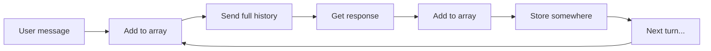
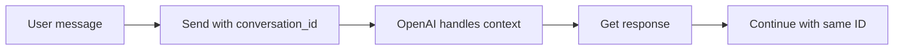
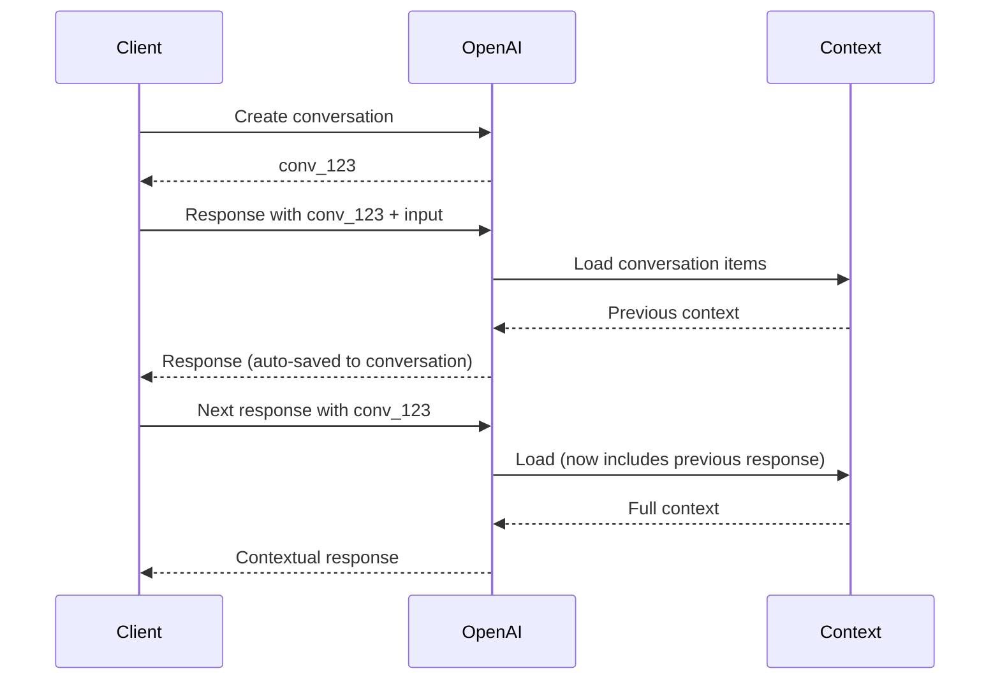

# OpenAI Conversations API

## Introduction

Managing conversation state is one of the most critical challenges in building AI chat applications. Traditional approaches require you to manually track messages, pass arrays back and forth, and handle context window limits yourself. The OpenAI Conversations API eliminates this complexity by providing server-side persistent conversation objects.

With Conversations API, you get:

- **Durable conversation IDs** that persist across sessions and devices
- **Automatic context management** without manual message array handling
- **Built-in compaction** for long-running conversations
- **Seamless integration** with the Responses API

This lesson introduces the Conversations API and prepares you to build production-grade chat applications with persistent state.

### What We'll Cover

- Conversations API overview and architecture
- Creating and managing conversation objects
- Conversation items: messages, tool calls, and outputs
- Automatic context chaining with `previous_response_id`
- Context window management and compaction
- Response storage control for compliance

### Prerequisites

- Completed [AI API Integration](../../../04-ai-api-integration/) unit
- Understanding of OpenAI Responses API basics
- Familiarity with REST API concepts

---

## Why Conversations API?

### The Problem with Manual State Management

Traditional multi-turn conversations require you to:



This approach has significant drawbacks:

| Challenge | Impact |
|-----------|--------|
| Manual array management | Error-prone, verbose code |
| Client-side storage | Data loss on refresh/device switch |
| Token counting | Must track context window yourself |
| Scaling | Increases payload size each turn |

### The Conversations API Solution



| Benefit | How It Works |
|---------|--------------|
| Persistent state | Conversation lives on OpenAI servers |
| Cross-session | Same ID works from any device |
| Automatic context | No manual message arrays needed |
| Built-in compaction | Long conversations stay efficient |

---

## Two Approaches to Conversation State

OpenAI provides two complementary mechanisms:

### 1. Conversations API (Persistent Objects)

```python
# Create a long-lived conversation
conversation = openai.conversations.create()

# Use it across multiple responses
response = openai.responses.create(
    model="gpt-4o",
    input="What's the weather?",
    conversation=conversation.id
)
```

Best for:
- Multi-session applications
- Cross-device continuity
- Chat history that persists

### 2. Response Chaining (previous_response_id)

```python
# First response
response1 = openai.responses.create(
    model="gpt-4o",
    input="Tell me a joke"
)

# Chain to it
response2 = openai.responses.create(
    model="gpt-4o",
    input="Explain why that's funny",
    previous_response_id=response1.id
)
```

Best for:
- Short-lived sessions
- Stateless API calls
- Simple multi-turn without storage needs

---

## Lesson Structure

This lesson folder contains five sub-lessons:

| Lesson | Topic | Key Concepts |
|--------|-------|--------------|
| [01-conversations-api-fundamentals](./01-conversations-api-fundamentals.md) | CRUD operations | Create, retrieve, update, delete conversations |
| [02-conversation-items](./02-conversation-items.md) | Managing items | Messages, tool calls, item CRUD operations |
| [03-automatic-context-chaining](./03-automatic-context-chaining.md) | Context flow | `previous_response_id`, `conversation` parameter |
| [04-context-window-management](./04-context-window-management.md) | Token limits | Compaction, encrypted items, ZDR support |
| [05-response-storage-control](./05-response-storage-control.md) | Data handling | `store` parameter, compliance, ephemeral mode |

---

## Quick Start

### Installation

```bash
pip install openai>=1.50.0
```

### Basic Usage

```python
from openai import OpenAI

client = OpenAI()

# Create a conversation
conversation = client.conversations.create(
    metadata={"user_id": "user_123", "topic": "support"}
)

print(f"Conversation ID: {conversation.id}")
# conv_689667905b048191b4740501625afd940c7533ace33a2dab

# Use in a response
response = client.responses.create(
    model="gpt-4o",
    input="Hello! I need help with my order.",
    conversation=conversation.id
)

print(response.output_text)

# Continue the conversation (context is automatic)
response2 = client.responses.create(
    model="gpt-4o",
    input="My order number is #12345",
    conversation=conversation.id
)

print(response2.output_text)
```

---

## Key Concepts Preview

### Conversation Objects

```json
{
  "id": "conv_123",
  "object": "conversation",
  "created_at": 1741900000,
  "metadata": {"topic": "demo"}
}
```

### Conversation Items

Items are the building blocks of conversations:

- **Messages** — User and assistant text
- **Tool calls** — Function/tool invocations
- **Tool outputs** — Results from tool execution
- **Compaction items** — Compressed historical context

### Context Window Flow



---

## When to Use What

| Scenario | Recommended Approach |
|----------|---------------------|
| Persistent chat history | Conversations API |
| Cross-device sync | Conversations API |
| One-off multi-turn | `previous_response_id` |
| Ephemeral/compliance mode | `previous_response_id` + `store: false` |
| Long-running agents | Conversations API + compaction |
| Simple Q&A follow-ups | `previous_response_id` |

---

## Summary

✅ Conversations API provides persistent, server-side conversation state

✅ Two approaches: persistent `conversation` objects or `previous_response_id` chaining

✅ Automatic context management eliminates manual message arrays

✅ Built-in compaction handles long conversations efficiently

✅ Metadata enables organization and querying of conversations

**Next:** [Conversations API Fundamentals](./01-conversations-api-fundamentals.md)

---

## Further Reading

- [Conversation State Guide](https://platform.openai.com/docs/guides/conversation-state) — Official guide
- [Conversations API Reference](https://platform.openai.com/docs/api-reference/conversations) — Full API docs
- [Responses API](https://platform.openai.com/docs/api-reference/responses) — Response creation

---

<!-- 
Sources Consulted:
- Conversation State Guide: https://platform.openai.com/docs/guides/conversation-state
- Conversations API Reference: https://platform.openai.com/docs/api-reference/conversations
- Responses API Reference: https://platform.openai.com/docs/api-reference/responses
-->
