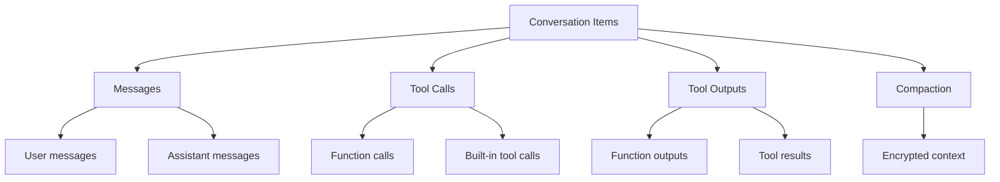

# Conversation Items

## Introduction

Conversations are containers for **items** — the individual pieces of content that make up a chat history. Items include user messages, assistant responses, tool calls, tool outputs, and more. Understanding how to manage items gives you fine-grained control over conversation content.

This lesson covers item types, CRUD operations, and practical patterns for item management.

### What We'll Cover

- Item types and their structures
- Creating items in conversations
- Listing and retrieving items
- Deleting items
- Pagination and ordering
- Include parameters for additional data

### Prerequisites

- Completed [Conversations API Fundamentals](./01-conversations-api-fundamentals.md)
- Understanding of OpenAI function calling concepts

---

## Item Types

Conversations can contain several types of items:



### Message Items

The most common item type — user and assistant text:

```json
{
  "type": "message",
  "id": "msg_abc123",
  "status": "completed",
  "role": "user",
  "content": [
    {
      "type": "input_text",
      "text": "What's the weather like?"
    }
  ]
}
```

```json
{
  "type": "message",
  "id": "msg_def456",
  "status": "completed",
  "role": "assistant",
  "content": [
    {
      "type": "output_text",
      "text": "I'd be happy to help! Could you tell me your location?",
      "annotations": []
    }
  ]
}
```

### Content Types

| Content Type | Role | Description |
|--------------|------|-------------|
| `input_text` | user | Plain text input |
| `input_image` | user | Image attachment |
| `output_text` | assistant | Generated text |
| `refusal` | assistant | Content policy refusal |

### Tool Call Items

When the model invokes a function:

```json
{
  "type": "function_call",
  "id": "fc_123",
  "status": "completed",
  "name": "get_weather",
  "arguments": "{\"location\": \"San Francisco\"}"
}
```

### Tool Output Items

Results from function execution:

```json
{
  "type": "function_call_output",
  "id": "fco_456",
  "call_id": "fc_123",
  "output": "{\"temperature\": 68, \"condition\": \"sunny\"}"
}
```

### Compaction Items

Encrypted summaries of prior context (see [Context Window Management](./04-context-window-management.md)):

```json
{
  "type": "compaction",
  "id": "cmp_789",
  "encrypted_content": "gAAAAABpM0Yj-..."
}
```

---

## Listing Items

### Basic Listing

```python
from openai import OpenAI

client = OpenAI()

# List items in a conversation
items = client.conversations.items.list("conv_123")

for item in items.data:
    print(f"{item.type}: {item.id}")
    
    if item.type == "message":
        print(f"  Role: {item.role}")
        for content in item.content:
            if content.type == "input_text":
                print(f"  Text: {content.text}")
            elif content.type == "output_text":
                print(f"  Text: {content.text}")
```

### Pagination

For conversations with many items:

```python
def get_all_items(client, conversation_id: str, limit: int = 20):
    """Retrieve all items with pagination."""
    all_items = []
    after = None
    
    while True:
        kwargs = {"limit": limit}
        if after:
            kwargs["after"] = after
        
        response = client.conversations.items.list(
            conversation_id,
            **kwargs
        )
        
        all_items.extend(response.data)
        
        if not response.has_more:
            break
        
        after = response.last_id
    
    return all_items
```

### Ordering

Control the order of returned items:

```python
# Newest first (default)
items = client.conversations.items.list(
    "conv_123",
    order="desc"
)

# Oldest first
items = client.conversations.items.list(
    "conv_123",
    order="asc"
)
```

### Include Parameter

Request additional data in item responses:

```python
items = client.conversations.items.list(
    "conv_123",
    include=[
        "web_search_call.action.sources",
        "file_search_call.results",
        "code_interpreter_call.outputs",
        "message.input_image.image_url",
        "reasoning.encrypted_content"
    ]
)
```

| Include Value | Description |
|---------------|-------------|
| `web_search_call.action.sources` | Web search source URLs |
| `code_interpreter_call.outputs` | Python execution outputs |
| `file_search_call.results` | File search results |
| `message.input_image.image_url` | Input image URLs |
| `message.output_text.logprobs` | Log probabilities |
| `reasoning.encrypted_content` | Encrypted reasoning tokens |
| `computer_call_output.output.image_url` | Computer use screenshots |

---

## Creating Items

### Adding Messages

Add items to an existing conversation:

```python
# Add a single user message
result = client.conversations.items.create(
    "conv_123",
    items=[
        {
            "type": "message",
            "role": "user",
            "content": [
                {"type": "input_text", "text": "Hello!"}
            ]
        }
    ]
)

print(f"Created {len(result.data)} items")
```

### Adding Multiple Items

You can add up to 20 items at once:

```python
result = client.conversations.items.create(
    "conv_123",
    items=[
        {
            "type": "message",
            "role": "user",
            "content": [{"type": "input_text", "text": "What's 2+2?"}]
        },
        {
            "type": "message",
            "role": "assistant",
            "content": [{"type": "output_text", "text": "2 + 2 equals 4."}]
        },
        {
            "type": "message",
            "role": "user",
            "content": [{"type": "input_text", "text": "And 3+3?"}]
        }
    ]
)
```

### Adding Tool Interactions

```python
result = client.conversations.items.create(
    "conv_123",
    items=[
        # The function call
        {
            "type": "function_call",
            "name": "calculate",
            "arguments": '{"expression": "2+2"}'
        },
        # The result
        {
            "type": "function_call_output",
            "call_id": "fc_manual_123",  # Match to function call
            "output": '{"result": 4}'
        }
    ]
)
```

---

## Retrieving Individual Items

Get a specific item by ID:

```python
item = client.conversations.items.retrieve(
    "conv_123",
    "msg_abc123"
)

print(f"Item type: {item.type}")
print(f"Status: {item.status}")

if item.type == "message":
    print(f"Role: {item.role}")
```

### With Include Parameters

```python
item = client.conversations.items.retrieve(
    "conv_123",
    "msg_abc123",
    include=["message.output_text.logprobs"]
)
```

---

## Deleting Items

Remove specific items from a conversation:

```python
result = client.conversations.items.delete(
    "conv_123",
    "msg_abc123"
)

print(result)
# Returns the updated conversation object
```

### Bulk Deletion

Delete multiple items:

```python
def delete_items(client, conversation_id: str, item_ids: list[str]):
    """Delete multiple items from a conversation."""
    deleted = []
    failed = []
    
    for item_id in item_ids:
        try:
            client.conversations.items.delete(conversation_id, item_id)
            deleted.append(item_id)
        except Exception as e:
            failed.append({"id": item_id, "error": str(e)})
    
    return {"deleted": deleted, "failed": failed}
```

### Selective Deletion

Delete items matching criteria:

```python
def delete_user_messages(client, conversation_id: str):
    """Delete all user messages from a conversation."""
    items = client.conversations.items.list(conversation_id)
    
    user_message_ids = [
        item.id 
        for item in items.data 
        if item.type == "message" and item.role == "user"
    ]
    
    for item_id in user_message_ids:
        client.conversations.items.delete(conversation_id, item_id)
    
    print(f"Deleted {len(user_message_ids)} user messages")
```

---

## Working with Item Content

### Extracting Text

```python
def extract_text(item) -> str:
    """Extract text content from a message item."""
    if item.type != "message":
        return ""
    
    texts = []
    for content in item.content:
        if hasattr(content, "text"):
            texts.append(content.text)
    
    return "\n".join(texts)


# Usage
items = client.conversations.items.list("conv_123")

for item in items.data:
    if item.type == "message":
        text = extract_text(item)
        print(f"{item.role}: {text[:100]}...")
```

### Building a Transcript

```python
def get_conversation_transcript(client, conversation_id: str) -> str:
    """Generate a readable transcript of the conversation."""
    items = client.conversations.items.list(
        conversation_id,
        order="asc"  # Chronological order
    )
    
    transcript = []
    
    for item in items.data:
        if item.type == "message":
            role = item.role.upper()
            text = extract_text(item)
            transcript.append(f"{role}: {text}")
        
        elif item.type == "function_call":
            transcript.append(f"[TOOL CALL: {item.name}({item.arguments})]")
        
        elif item.type == "function_call_output":
            transcript.append(f"[TOOL RESULT: {item.output}]")
    
    return "\n\n".join(transcript)
```

---

## Item Status

Items have a status field indicating their state:

| Status | Meaning |
|--------|---------|
| `completed` | Item fully processed |
| `in_progress` | Currently being generated |
| `incomplete` | Generation stopped early |

```python
def check_incomplete_items(client, conversation_id: str):
    """Find any incomplete items in a conversation."""
    items = client.conversations.items.list(conversation_id)
    
    incomplete = [
        item for item in items.data 
        if item.status != "completed"
    ]
    
    if incomplete:
        print(f"Found {len(incomplete)} incomplete items:")
        for item in incomplete:
            print(f"  {item.id}: {item.status}")
    
    return incomplete
```

---

## Practical Patterns

### Conversation History Export

```python
import json
from datetime import datetime

def export_conversation(client, conversation_id: str) -> dict:
    """Export a conversation with all items."""
    conversation = client.conversations.retrieve(conversation_id)
    
    all_items = []
    after = None
    
    while True:
        kwargs = {"order": "asc"}
        if after:
            kwargs["after"] = after
        
        response = client.conversations.items.list(conversation_id, **kwargs)
        all_items.extend([item.model_dump() for item in response.data])
        
        if not response.has_more:
            break
        after = response.last_id
    
    return {
        "id": conversation.id,
        "created_at": conversation.created_at,
        "metadata": conversation.metadata,
        "items": all_items,
        "exported_at": datetime.now().isoformat()
    }


# Usage
export = export_conversation(client, "conv_123")

with open("conversation_export.json", "w") as f:
    json.dump(export, f, indent=2)
```

### Conversation Import

```python
def import_conversation(client, export_data: dict) -> str:
    """Import a previously exported conversation."""
    # Create new conversation with same metadata
    conversation = client.conversations.create(
        metadata=export_data.get("metadata", {})
    )
    
    # Add items in batches of 20
    items = export_data.get("items", [])
    
    for i in range(0, len(items), 20):
        batch = items[i:i+20]
        
        # Clean items for import (remove IDs, etc.)
        cleaned = []
        for item in batch:
            clean_item = {
                "type": item["type"],
            }
            
            if item["type"] == "message":
                clean_item["role"] = item["role"]
                clean_item["content"] = item["content"]
            
            # Add other item types as needed
            cleaned.append(clean_item)
        
        if cleaned:
            client.conversations.items.create(
                conversation.id,
                items=cleaned
            )
    
    print(f"Imported {len(items)} items to {conversation.id}")
    return conversation.id
```

### Message Editing Simulation

Since items can't be edited in place, simulate editing by replacing:

```python
def edit_message(
    client, 
    conversation_id: str, 
    item_id: str, 
    new_text: str
) -> str:
    """Simulate editing a message by deleting and recreating."""
    # Get the original item
    original = client.conversations.items.retrieve(
        conversation_id, 
        item_id
    )
    
    if original.type != "message":
        raise ValueError("Can only edit message items")
    
    # Delete the original
    client.conversations.items.delete(conversation_id, item_id)
    
    # Create the replacement
    result = client.conversations.items.create(
        conversation_id,
        items=[{
            "type": "message",
            "role": original.role,
            "content": [{"type": "input_text", "text": new_text}]
        }]
    )
    
    return result.data[0].id
```

---

## Complete Example

```python
from openai import OpenAI
from typing import Optional

client = OpenAI()

class ConversationManager:
    def __init__(self, conversation_id: str):
        self.conversation_id = conversation_id
    
    def get_history(self, limit: Optional[int] = None) -> list:
        """Get conversation history."""
        kwargs = {"order": "asc"}
        if limit:
            kwargs["limit"] = limit
        
        items = client.conversations.items.list(
            self.conversation_id,
            **kwargs
        )
        return items.data
    
    def get_last_n_messages(self, n: int) -> list:
        """Get the last N messages."""
        items = client.conversations.items.list(
            self.conversation_id,
            order="desc",
            limit=n
        )
        return list(reversed(items.data))
    
    def add_system_context(self, context: str):
        """Add a system-level context message."""
        # Using a user message with system context
        client.conversations.items.create(
            self.conversation_id,
            items=[{
                "type": "message",
                "role": "user",
                "content": [{
                    "type": "input_text",
                    "text": f"[SYSTEM CONTEXT]: {context}"
                }]
            }]
        )
    
    def clear_history(self, keep_last: int = 0):
        """Clear conversation history, optionally keeping last N items."""
        items = self.get_history()
        
        to_delete = items[:-keep_last] if keep_last > 0 else items
        
        for item in to_delete:
            try:
                client.conversations.items.delete(
                    self.conversation_id,
                    item.id
                )
            except Exception as e:
                print(f"Failed to delete {item.id}: {e}")
        
        print(f"Deleted {len(to_delete)} items")
    
    def get_statistics(self) -> dict:
        """Get statistics about the conversation."""
        items = self.get_history()
        
        stats = {
            "total_items": len(items),
            "messages": 0,
            "user_messages": 0,
            "assistant_messages": 0,
            "tool_calls": 0,
            "tool_outputs": 0
        }
        
        for item in items:
            if item.type == "message":
                stats["messages"] += 1
                if item.role == "user":
                    stats["user_messages"] += 1
                elif item.role == "assistant":
                    stats["assistant_messages"] += 1
            elif item.type == "function_call":
                stats["tool_calls"] += 1
            elif item.type == "function_call_output":
                stats["tool_outputs"] += 1
        
        return stats


# Usage
manager = ConversationManager("conv_123")

# Get statistics
stats = manager.get_statistics()
print(f"Conversation has {stats['total_items']} items")
print(f"  - {stats['user_messages']} user messages")
print(f"  - {stats['assistant_messages']} assistant messages")
print(f"  - {stats['tool_calls']} tool calls")

# Get last 5 messages
recent = manager.get_last_n_messages(5)
for item in recent:
    if item.type == "message":
        print(f"{item.role}: {item.content[0].text[:50]}...")
```

---

## Summary

✅ Items are the building blocks of conversations: messages, tool calls, outputs

✅ List items with pagination, ordering, and include parameters

✅ Create up to 20 items at once for bulk operations

✅ Retrieve individual items by ID for detailed inspection

✅ Delete items to manage conversation content and privacy

✅ Use include parameters to get additional data like sources and results

**Next:** [Automatic Context Chaining](./03-automatic-context-chaining.md)

---

## Further Reading

- [List Items Reference](https://platform.openai.com/docs/api-reference/conversations/list-items) — Pagination and filtering
- [Create Items Reference](https://platform.openai.com/docs/api-reference/conversations/create-items) — Adding items
- [Item Object](https://platform.openai.com/docs/api-reference/conversations/item-object) — Item structure

---

<!-- 
Sources Consulted:
- Conversations API Reference: https://platform.openai.com/docs/api-reference/conversations
- List Items: https://platform.openai.com/docs/api-reference/conversations/list-items
- Create Items: https://platform.openai.com/docs/api-reference/conversations/create-items
-->
