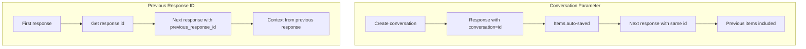
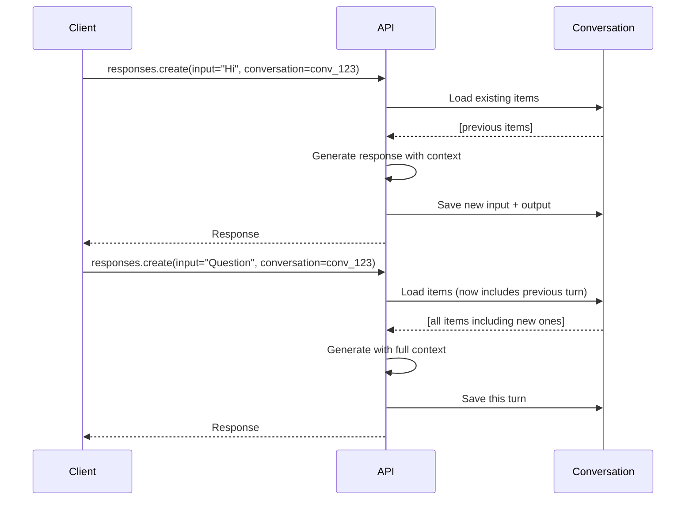
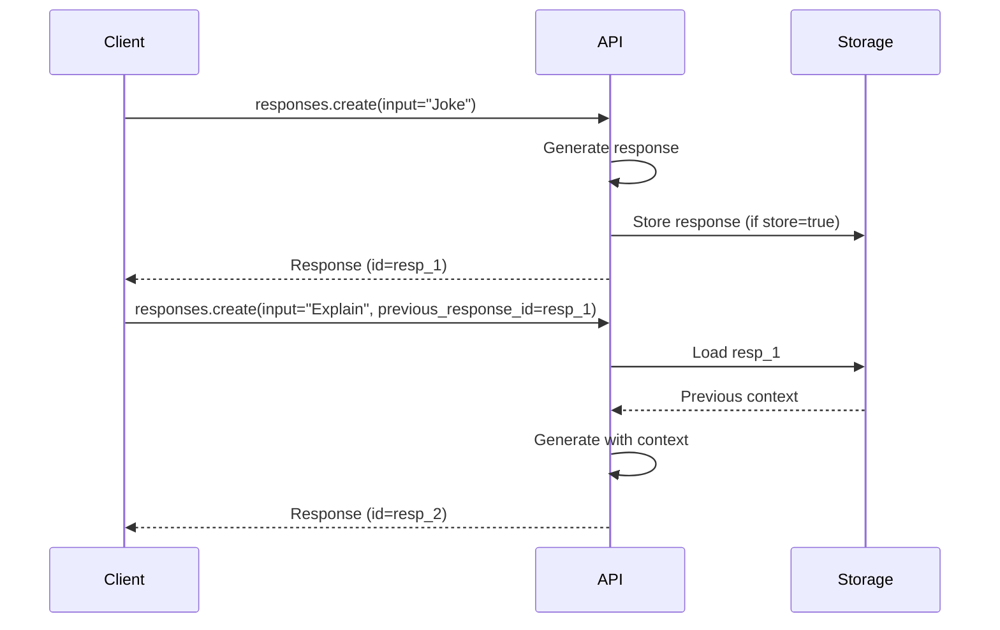

# Automatic Context Chaining

## Introduction

One of the most powerful features of OpenAI's APIs is automatic context chaining — the ability to maintain conversation context without manually managing message arrays. The Responses API provides two complementary mechanisms: the `conversation` parameter for persistent state and `previous_response_id` for stateless chaining.

This lesson covers both approaches and when to use each.

### What We'll Cover

- The `conversation` parameter for persistent multi-turn
- The `previous_response_id` parameter for stateless chaining
- Differences and trade-offs between approaches
- Combining with instructions
- Practical patterns for context management

### Prerequisites

- Completed [Conversations API Fundamentals](./01-conversations-api-fundamentals.md)
- Understanding of OpenAI Responses API

---

## Two Approaches to Context



| Feature | `conversation` | `previous_response_id` |
|---------|---------------|------------------------|
| State persistence | Server-side, durable | Ephemeral by default |
| Cross-session | ✅ Yes | ❌ Requires `store: true` |
| Item management | Full CRUD | Read-only chain |
| Use case | Long-lived chats | Single-session multi-turn |

---

## Using the Conversation Parameter

The `conversation` parameter connects a response to a persistent conversation object.

### Basic Usage

```python
from openai import OpenAI

client = OpenAI()

# Create a conversation
conversation = client.conversations.create(
    metadata={"user_id": "user_123"}
)

# First turn
response1 = client.responses.create(
    model="gpt-4o",
    input="My name is Alice.",
    conversation=conversation.id
)
print(response1.output_text)
# "Nice to meet you, Alice! How can I help you today?"

# Second turn - context is automatic
response2 = client.responses.create(
    model="gpt-4o",
    input="What's my name?",
    conversation=conversation.id
)
print(response2.output_text)
# "Your name is Alice!"
```

### How It Works



### Conversation Object Reference

You can pass either the ID or an object:

```python
# By ID
response = client.responses.create(
    model="gpt-4o",
    input="Hello",
    conversation="conv_123"
)

# By object (also creates if new)
response = client.responses.create(
    model="gpt-4o",
    input="Hello",
    conversation={"id": "conv_123"}
)
```

---

## Using previous_response_id

The `previous_response_id` parameter chains responses without a persistent conversation object.

### Basic Usage

```python
# First response
response1 = client.responses.create(
    model="gpt-4o",
    input="Tell me a joke about programming."
)
print(response1.output_text)
print(f"Response ID: {response1.id}")

# Chain to it
response2 = client.responses.create(
    model="gpt-4o",
    input="Explain why that's funny.",
    previous_response_id=response1.id
)
print(response2.output_text)

# Continue the chain
response3 = client.responses.create(
    model="gpt-4o",
    input="Make it funnier.",
    previous_response_id=response2.id
)
print(response3.output_text)
```

### How It Works



### Important: Storage Requirement

By default, `store: true` so responses are saved and can be referenced. If you use `store: false`, the response won't be retrievable:

```python
# This works
response1 = client.responses.create(
    model="gpt-4o",
    input="Hello",
    store=True  # default
)

# Can chain to it
response2 = client.responses.create(
    model="gpt-4o",
    input="Follow up",
    previous_response_id=response1.id  # Works!
)

# But if store=false...
response_ephemeral = client.responses.create(
    model="gpt-4o",
    input="Ephemeral",
    store=False
)

# This will fail!
# client.responses.create(
#     model="gpt-4o",
#     input="Can't chain",
#     previous_response_id=response_ephemeral.id  # Error!
# )
```

---

## Comparing the Approaches

### When to Use `conversation`

| Scenario | Why |
|----------|-----|
| User accounts with chat history | Persists across sessions |
| Customer support chats | Need to review/audit later |
| Multi-device access | Same conversation anywhere |
| Long-running agents | Durable state management |
| Item-level operations needed | Can add/delete/list items |

### When to Use `previous_response_id`

| Scenario | Why |
|----------|-----|
| Single-page app session | Simple, no object to manage |
| Quick multi-turn Q&A | Lightweight chaining |
| Stateless API design | No external state needed |
| Testing/prototyping | Quick iteration |

### Comparison Table

| Aspect | `conversation` | `previous_response_id` |
|--------|---------------|------------------------|
| Setup | Create conversation first | Just use response ID |
| Persistence | Always persisted | Depends on `store` |
| Cross-session | ✅ Built-in | ⚠️ Requires `store: true` |
| Item management | Full CRUD | None |
| Metadata | 16 key-value pairs | None |
| Compaction | Supported | Supported |
| Branching | Create new conversation | Use different response ID |

---

## Instructions Handling

System instructions can be passed with each request, but they **don't carry over** from previous responses:

```python
# First response with instructions
response1 = client.responses.create(
    model="gpt-4o",
    instructions="You are a helpful pirate. Respond in pirate speak.",
    input="Hello!",
    conversation=conversation.id
)
# "Ahoy, matey! What brings ye to these waters?"

# Second response - instructions NOT carried over
response2 = client.responses.create(
    model="gpt-4o",
    # No instructions - reverts to default behavior
    input="Tell me about yourself.",
    conversation=conversation.id
)
# "I'm an AI assistant..." (no pirate speak!)

# Must include instructions again
response3 = client.responses.create(
    model="gpt-4o",
    instructions="You are a helpful pirate. Respond in pirate speak.",
    input="What's 2+2?",
    conversation=conversation.id
)
# "Arr, that be 4, ye landlubber!"
```

### Best Practice: Consistent Instructions

```python
class ChatSession:
    def __init__(self, conversation_id: str, instructions: str):
        self.conversation_id = conversation_id
        self.instructions = instructions
    
    def chat(self, message: str) -> str:
        response = client.responses.create(
            model="gpt-4o",
            instructions=self.instructions,  # Always include
            input=message,
            conversation=self.conversation_id
        )
        return response.output_text


# Usage
session = ChatSession(
    conversation_id="conv_123",
    instructions="You are a helpful customer support agent for Acme Corp."
)

print(session.chat("I have a billing question"))
print(session.chat("Why was I charged twice?"))
```

---

## Branching Conversations

Create multiple conversation branches from a single point:

### With Conversations

```python
# Main conversation
main_conv = client.conversations.create()

response1 = client.responses.create(
    model="gpt-4o",
    input="I'm planning a trip. Suggest two options: beach or mountains.",
    conversation=main_conv.id
)

# Branch A: Beach
beach_conv = client.conversations.create(
    metadata={"branch": "beach", "parent": main_conv.id}
)

# Copy context
main_items = client.conversations.items.list(main_conv.id)
client.conversations.items.create(
    beach_conv.id,
    items=[item.model_dump() for item in main_items.data]
)

beach_response = client.responses.create(
    model="gpt-4o",
    input="Let's go with the beach option. Tell me more.",
    conversation=beach_conv.id
)

# Branch B: Mountains
mountain_conv = client.conversations.create(
    metadata={"branch": "mountains", "parent": main_conv.id}
)

client.conversations.items.create(
    mountain_conv.id,
    items=[item.model_dump() for item in main_items.data]
)

mountain_response = client.responses.create(
    model="gpt-4o",
    input="Let's go with the mountains option. Tell me more.",
    conversation=mountain_conv.id
)
```

### With previous_response_id

```python
# Common starting point
response1 = client.responses.create(
    model="gpt-4o",
    input="Give me two options for dinner: Italian or Japanese."
)

# Branch A: Italian
italian = client.responses.create(
    model="gpt-4o",
    input="Let's do Italian. Recommend dishes.",
    previous_response_id=response1.id
)

# Branch B: Japanese (from same starting point)
japanese = client.responses.create(
    model="gpt-4o",
    input="Let's do Japanese. Recommend dishes.",
    previous_response_id=response1.id  # Same parent!
)
```

---

## Manual vs Automatic Context

Sometimes you need to construct context manually:

### Manual Context Construction

```python
# Manually constructed conversation
response = client.responses.create(
    model="gpt-4o",
    input=[
        {"role": "user", "content": "My name is Bob."},
        {"role": "assistant", "content": "Nice to meet you, Bob!"},
        {"role": "user", "content": "What's my name?"}
    ]
)
print(response.output_text)
# "Your name is Bob!"
```

### Hybrid Approach

Combine manual history with automatic chaining:

```python
# Start with some context
response1 = client.responses.create(
    model="gpt-4o",
    input=[
        {"role": "user", "content": "Context: The user is a VIP customer."},
        {"role": "assistant", "content": "Understood, I'll provide VIP-level service."},
        {"role": "user", "content": "I need help with my order."}
    ]
)

# Continue with automatic chaining
response2 = client.responses.create(
    model="gpt-4o",
    input="Order #12345 is delayed.",
    previous_response_id=response1.id
)
```

---

## Error Handling

### Chain Broken

```python
from openai import NotFoundError

def safe_chain(client, message: str, previous_id: str = None):
    """Safely chain responses, handling missing previous responses."""
    try:
        kwargs = {"model": "gpt-4o", "input": message}
        
        if previous_id:
            kwargs["previous_response_id"] = previous_id
        
        return client.responses.create(**kwargs)
    
    except NotFoundError:
        print(f"Previous response {previous_id} not found. Starting fresh.")
        return client.responses.create(model="gpt-4o", input=message)
```

### Conversation Deleted

```python
def safe_conversation_chat(client, conversation_id: str, message: str):
    """Chat with fallback if conversation was deleted."""
    try:
        return client.responses.create(
            model="gpt-4o",
            input=message,
            conversation=conversation_id
        )
    except NotFoundError:
        # Conversation deleted - create new one
        new_conv = client.conversations.create()
        print(f"Created new conversation: {new_conv.id}")
        
        return client.responses.create(
            model="gpt-4o",
            input=message,
            conversation=new_conv.id
        )
```

---

## Complete Example

```python
from openai import OpenAI
from dataclasses import dataclass
from typing import Optional

client = OpenAI()

@dataclass
class Message:
    role: str
    content: str

class MultiTurnChat:
    """Flexible multi-turn chat supporting both persistence modes."""
    
    def __init__(
        self,
        persistent: bool = True,
        instructions: str = None
    ):
        self.persistent = persistent
        self.instructions = instructions
        self.conversation_id = None
        self.last_response_id = None
    
    def start(self, metadata: dict = None):
        """Start a new chat session."""
        if self.persistent:
            conv = client.conversations.create(metadata=metadata or {})
            self.conversation_id = conv.id
            print(f"Started persistent conversation: {conv.id}")
        else:
            self.last_response_id = None
            print("Started ephemeral session")
    
    def chat(self, message: str) -> str:
        """Send a message and get a response."""
        kwargs = {
            "model": "gpt-4o",
            "input": message
        }
        
        if self.instructions:
            kwargs["instructions"] = self.instructions
        
        if self.persistent and self.conversation_id:
            kwargs["conversation"] = self.conversation_id
        elif not self.persistent and self.last_response_id:
            kwargs["previous_response_id"] = self.last_response_id
        
        response = client.responses.create(**kwargs)
        
        if not self.persistent:
            self.last_response_id = response.id
        
        return response.output_text
    
    def get_history(self) -> list[Message]:
        """Get conversation history (persistent mode only)."""
        if not self.persistent or not self.conversation_id:
            raise ValueError("History only available in persistent mode")
        
        items = client.conversations.items.list(
            self.conversation_id,
            order="asc"
        )
        
        messages = []
        for item in items.data:
            if item.type == "message":
                content = ""
                for c in item.content:
                    if hasattr(c, "text"):
                        content = c.text
                        break
                messages.append(Message(role=item.role, content=content))
        
        return messages
    
    def switch_mode(self, persistent: bool):
        """Switch between persistent and ephemeral modes."""
        if persistent == self.persistent:
            return
        
        if persistent:
            # Moving to persistent - create conversation
            conv = client.conversations.create()
            self.conversation_id = conv.id
            self.persistent = True
            print(f"Switched to persistent mode: {conv.id}")
        else:
            # Moving to ephemeral
            self.persistent = False
            print("Switched to ephemeral mode")


# Usage examples

# Persistent mode
print("=== Persistent Mode ===")
chat = MultiTurnChat(
    persistent=True,
    instructions="You are a helpful coding assistant."
)
chat.start(metadata={"purpose": "coding_help"})

print(chat.chat("How do I reverse a string in Python?"))
print(chat.chat("What about in JavaScript?"))
print(chat.chat("Which is more efficient?"))

# View history
for msg in chat.get_history():
    print(f"{msg.role}: {msg.content[:50]}...")


# Ephemeral mode
print("\n=== Ephemeral Mode ===")
quick_chat = MultiTurnChat(persistent=False)
quick_chat.start()

print(quick_chat.chat("What's 10 factorial?"))
print(quick_chat.chat("Divide that by 100"))
```

---

## Summary

✅ `conversation` parameter enables persistent, cross-session multi-turn conversations

✅ `previous_response_id` enables lightweight, stateless chaining

✅ Instructions don't carry over — include them with each request

✅ Both approaches support branching from common points

✅ Choose based on persistence needs and state management requirements

**Next:** [Context Window Management](./04-context-window-management.md)

---

## Further Reading

- [Conversation State Guide](https://platform.openai.com/docs/guides/conversation-state) — Official patterns
- [Responses API Reference](https://platform.openai.com/docs/api-reference/responses/create) — Full parameter docs
- [Conversations API](https://platform.openai.com/docs/api-reference/conversations) — Conversation management

---

<!-- 
Sources Consulted:
- Conversation State Guide: https://platform.openai.com/docs/guides/conversation-state
- Responses API Reference: https://platform.openai.com/docs/api-reference/responses
- Conversations API Reference: https://platform.openai.com/docs/api-reference/conversations
-->
