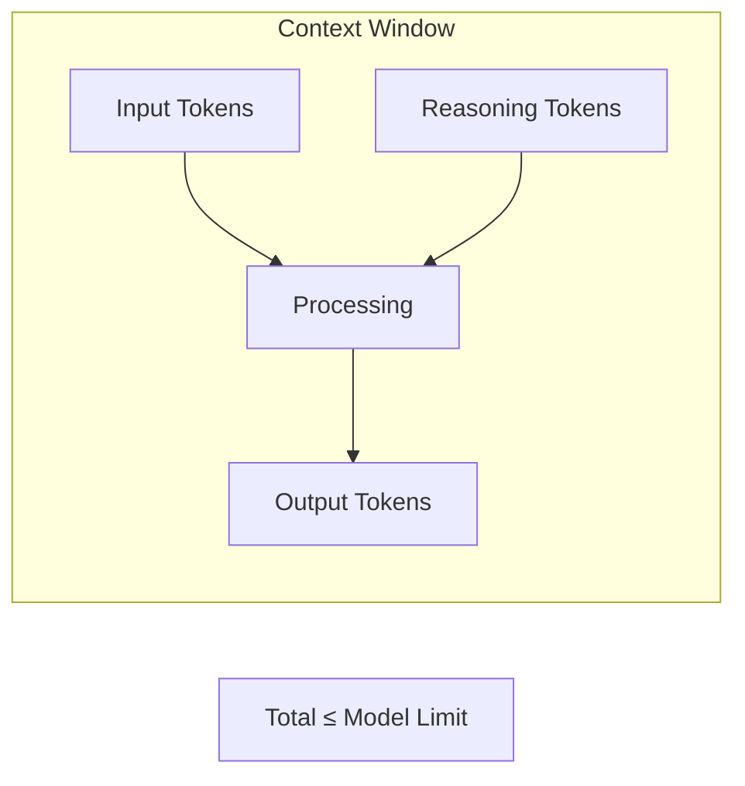
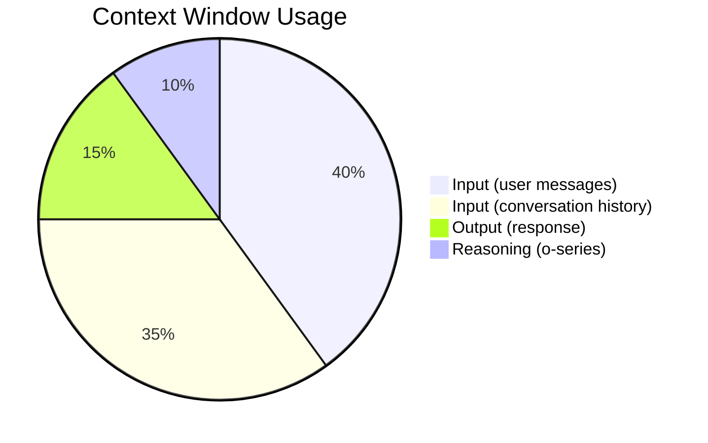
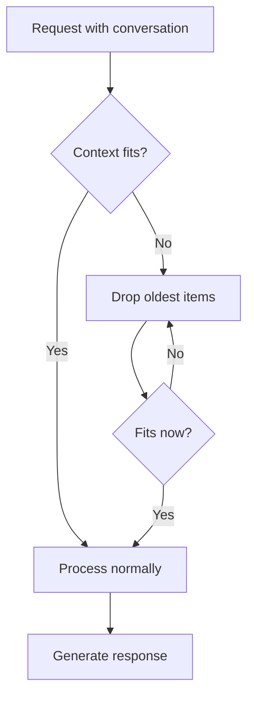
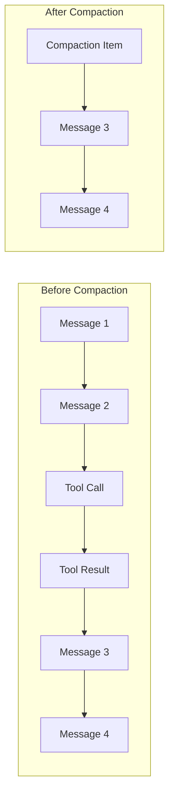

# Context Window Management

## Introduction

Every LLM has a context window — a maximum number of tokens it can process in a single request. As conversations grow, you risk exceeding this limit, causing errors or truncated responses. The OpenAI APIs provide tools to manage context efficiently, including automatic truncation and context compaction.

This lesson covers understanding context limits, monitoring token usage, and using the compaction endpoint for long-running conversations.

### What We'll Cover

- Understanding context windows and token limits
- Token counting and monitoring
- The truncation parameter
- Context compaction with `/responses/compact`
- Encrypted compaction items and ZDR compatibility
- Practical patterns for long conversations

### Prerequisites

- Completed [Automatic Context Chaining](./03-automatic-context-chaining.md)
- Understanding of tokens and tokenization

---

## Understanding Context Windows

### What Is a Context Window?

The context window is the maximum total tokens (input + output + reasoning) for a single API request:



### Model Context Limits

| Model | Context Window | Max Output |
|-------|---------------|------------|
| gpt-4o | 128,000 tokens | 16,384 tokens |
| gpt-4o-mini | 128,000 tokens | 16,384 tokens |
| o1 | 200,000 tokens | 100,000 tokens |
| o3 | 200,000 tokens | 100,000 tokens |
| gpt-4.1 | 1,000,000 tokens | 32,768 tokens |

> **Note:** Check the [models page](https://platform.openai.com/docs/models) for current limits.

### Token Composition



---

## Monitoring Token Usage

### Response Token Counts

Every response includes usage statistics:

```python
from openai import OpenAI

client = OpenAI()

response = client.responses.create(
    model="gpt-4o",
    input="Explain quantum computing in simple terms."
)

print(f"Input tokens: {response.usage.input_tokens}")
print(f"Output tokens: {response.usage.output_tokens}")
print(f"Total tokens: {response.usage.total_tokens}")

# Detailed breakdown
print(f"Cached input: {response.usage.input_tokens_details.cached_tokens}")
print(f"Reasoning tokens: {response.usage.output_tokens_details.reasoning_tokens}")
```

### Pre-Request Token Counting

Check token count before sending:

```python
# Get input token count without generating
token_count = client.responses.input_tokens(
    model="gpt-4o",
    input="Your message here..."
)

print(f"This request would use {token_count.input_tokens} input tokens")

# With conversation context
token_count = client.responses.input_tokens(
    model="gpt-4o",
    input="Follow-up question",
    previous_response_id="resp_123"
)

print(f"With context: {token_count.input_tokens} input tokens")
```

### Tracking Cumulative Usage

```python
class TokenTracker:
    def __init__(self):
        self.total_input = 0
        self.total_output = 0
        self.requests = 0
    
    def track(self, response):
        self.total_input += response.usage.input_tokens
        self.total_output += response.usage.output_tokens
        self.requests += 1
    
    def report(self):
        return {
            "requests": self.requests,
            "total_input_tokens": self.total_input,
            "total_output_tokens": self.total_output,
            "total_tokens": self.total_input + self.total_output,
            "avg_input_per_request": self.total_input / max(1, self.requests),
            "avg_output_per_request": self.total_output / max(1, self.requests)
        }


# Usage
tracker = TokenTracker()

response = client.responses.create(model="gpt-4o", input="Hello!")
tracker.track(response)

response2 = client.responses.create(
    model="gpt-4o",
    input="Tell me more",
    previous_response_id=response.id
)
tracker.track(response2)

print(tracker.report())
```

---

## The Truncation Parameter

Control what happens when context exceeds limits:

### Options

| Value | Behavior |
|-------|----------|
| `disabled` (default) | Error if context exceeds limit |
| `auto` | Automatically drop older items to fit |

### Using Auto Truncation

```python
response = client.responses.create(
    model="gpt-4o",
    input="Continue our conversation...",
    conversation="conv_123",
    truncation="auto"  # Drop old context if needed
)
```

### How Auto Truncation Works



> **Warning:** Auto truncation silently drops context. Important early messages may be lost.

### Detecting Truncation

```python
response = client.responses.create(
    model="gpt-4o",
    input="Question about earlier context",
    conversation="conv_123",
    truncation="auto"
)

# Check if response is incomplete
if response.incomplete_details:
    print(f"Response incomplete: {response.incomplete_details}")
```

---

## Context Compaction

For long-running conversations, **compaction** provides a smarter alternative to truncation. It summarizes older context into encrypted, opaque items that preserve the model's understanding while reducing token count.

### What Compaction Does



| Aspect | Before | After |
|--------|--------|-------|
| Items | Many individual messages | Compacted + recent |
| Tokens | High | Reduced |
| User messages | All visible | Preserved verbatim |
| Assistant/tool | All visible | Summarized in compaction |

### Using the Compact Endpoint

```python
# Long conversation that's getting large
conversation_id = "conv_123"

# Get current items to compact
items = client.conversations.items.list(
    conversation_id,
    order="asc"
)

# Prepare input for compaction
input_items = [item.model_dump() for item in items.data]

# Compact the context
compacted = client.responses.compact(
    model="gpt-4o",  # Must match or be compatible with your main model
    input=input_items
)

print(f"Compaction ID: {compacted.id}")
print(f"Output items: {len(compacted.output)}")
print(f"Token savings: {compacted.usage.input_tokens} → {compacted.usage.output_tokens}")
```

### Compacted Response Structure

```json
{
  "id": "resp_001",
  "object": "response.compaction",
  "created_at": 1764967971,
  "output": [
    {
      "type": "message",
      "role": "user",
      "content": [
        {"type": "input_text", "text": "Original user message"}
      ]
    },
    {
      "type": "compaction",
      "id": "cmp_001",
      "encrypted_content": "gAAAAABpM0Yj-..."
    }
  ],
  "usage": {
    "input_tokens": 42897,
    "output_tokens": 12000,
    "total_tokens": 54912
  }
}
```

### Using Compacted Context

After compaction, use the output in subsequent requests:

```python
# Compact
compacted = client.responses.compact(
    model="gpt-4o",
    input=conversation_items
)

# Use compacted context in next request
response = client.responses.create(
    model="gpt-4o",
    input=compacted.output + [
        {"role": "user", "content": "New question here"}
    ]
)
```

---

## Compaction with Conversations

For conversations, you typically want to replace items with compacted versions:

```python
def compact_conversation(client, conversation_id: str, model: str = "gpt-4o"):
    """Compact a conversation's context."""
    # 1. Get all items
    items = client.conversations.items.list(
        conversation_id,
        order="asc"
    )
    
    if len(items.data) < 5:
        print("Conversation too short to compact")
        return
    
    # 2. Compact
    compacted = client.responses.compact(
        model=model,
        input=[item.model_dump() for item in items.data]
    )
    
    # 3. Delete old items
    for item in items.data:
        try:
            client.conversations.items.delete(conversation_id, item.id)
        except Exception:
            pass
    
    # 4. Add compacted items
    # Filter to only compaction-compatible items
    new_items = []
    for output in compacted.output:
        if output.type == "message":
            new_items.append({
                "type": "message",
                "role": output.role,
                "content": output.content
            })
        elif output.type == "compaction":
            # Compaction items need special handling
            # They're added automatically when using previous_response_id
            pass
    
    if new_items:
        client.conversations.items.create(conversation_id, items=new_items)
    
    print(f"Compacted {len(items.data)} items → {len(compacted.output)} items")
    print(f"Token reduction: {compacted.usage.input_tokens} → {compacted.usage.output_tokens}")
```

---

## Encrypted Compaction and ZDR

Compaction uses encrypted items that are compatible with Zero Data Retention (ZDR) requirements.

### What Gets Encrypted

| Content Type | Treatment |
|--------------|-----------|
| User messages | Preserved verbatim (not encrypted) |
| Assistant responses | Encrypted into compaction item |
| Tool calls/outputs | Encrypted into compaction item |
| Reasoning tokens | Encrypted (with include parameter) |

### ZDR-Compatible Workflow

For organizations with ZDR enabled:

```python
# Request encrypted reasoning for ZDR compatibility
response = client.responses.create(
    model="o1",
    input="Complex reasoning task",
    include=["reasoning.encrypted_content"],  # Enable encrypted reasoning
    store=False  # ZDR mode
)

# The response includes encrypted reasoning that can be used in multi-turn
# even with ZDR enabled
```

### Including Encrypted Reasoning

```python
items = client.conversations.items.list(
    "conv_123",
    include=["reasoning.encrypted_content"]
)

# Reasoning items now include encrypted_content field
for item in items.data:
    if item.type == "reasoning":
        print(f"Has encrypted content: {bool(item.encrypted_content)}")
```

---

## Compaction Instructions

Pass system instructions to guide compaction:

```python
compacted = client.responses.compact(
    model="gpt-4o",
    input=conversation_items,
    instructions="Preserve all technical details and code snippets. "
                 "Summarize casual conversation briefly."
)
```

> **Best Practice:** Use the same instructions for compaction and responses to maintain consistency.

---

## Practical Patterns

### Automatic Compaction Threshold

```python
class ManagedConversation:
    def __init__(self, client, model: str = "gpt-4o", 
                 compact_threshold: int = 50000):
        self.client = client
        self.model = model
        self.compact_threshold = compact_threshold
        self.conversation = client.conversations.create()
    
    def chat(self, message: str) -> str:
        # Check token count
        token_count = self.client.responses.input_tokens(
            model=self.model,
            input=message,
            conversation=self.conversation.id
        )
        
        # Compact if approaching threshold
        if token_count.input_tokens > self.compact_threshold:
            print("Compacting conversation...")
            self._compact()
        
        # Send message
        response = self.client.responses.create(
            model=self.model,
            input=message,
            conversation=self.conversation.id
        )
        
        return response.output_text
    
    def _compact(self):
        items = self.client.conversations.items.list(
            self.conversation.id,
            order="asc"
        )
        
        compacted = self.client.responses.compact(
            model=self.model,
            input=[item.model_dump() for item in items.data]
        )
        
        # Store compacted context (implementation depends on your needs)
        self._replace_with_compacted(compacted.output)
```

### Rolling Window with Compaction

Keep recent messages visible, compact older ones:

```python
def rolling_compact(
    client, 
    conversation_id: str,
    keep_recent: int = 10,
    model: str = "gpt-4o"
):
    """Keep recent messages, compact older ones."""
    items = client.conversations.items.list(
        conversation_id,
        order="asc"
    )
    
    all_items = items.data
    
    if len(all_items) <= keep_recent:
        return  # Nothing to compact
    
    # Split into old (to compact) and recent (to keep)
    old_items = all_items[:-keep_recent]
    recent_items = all_items[-keep_recent:]
    
    # Compact old items
    compacted = client.responses.compact(
        model=model,
        input=[item.model_dump() for item in old_items]
    )
    
    # Delete old items
    for item in old_items:
        try:
            client.conversations.items.delete(conversation_id, item.id)
        except Exception:
            pass
    
    print(f"Compacted {len(old_items)} items, kept {len(recent_items)} recent")
    
    return compacted
```

### Estimating When to Compact

```python
def should_compact(
    client,
    conversation_id: str,
    model: str,
    threshold_percent: float = 0.75
) -> bool:
    """Check if conversation should be compacted."""
    # Get model's context limit
    model_limits = {
        "gpt-4o": 128000,
        "gpt-4o-mini": 128000,
        "o1": 200000,
        "gpt-4.1": 1000000
    }
    
    limit = model_limits.get(model, 128000)
    threshold = int(limit * threshold_percent)
    
    # Check current usage
    token_count = client.responses.input_tokens(
        model=model,
        input="",  # Empty message for count
        conversation=conversation_id
    )
    
    return token_count.input_tokens > threshold
```

---

## Error Handling

### Context Too Large

```python
from openai import BadRequestError

def safe_response(client, **kwargs):
    """Handle context size errors gracefully."""
    try:
        return client.responses.create(**kwargs)
    
    except BadRequestError as e:
        if "context_length_exceeded" in str(e):
            print("Context too large - compacting...")
            
            # If using conversation, compact it
            if "conversation" in kwargs:
                compact_conversation(client, kwargs["conversation"])
                return client.responses.create(**kwargs)
            
            # If using previous_response_id, use truncation
            kwargs["truncation"] = "auto"
            return client.responses.create(**kwargs)
        
        raise
```

---

## Summary

✅ Context windows limit total tokens per request (input + output + reasoning)

✅ Use `truncation: "auto"` for automatic context dropping (may lose important history)

✅ Use `/responses/compact` for intelligent context summarization

✅ Compaction preserves user messages verbatim while encrypting summaries

✅ Monitor token usage with `input_tokens` endpoint and response usage stats

✅ ZDR compatibility maintained through encrypted compaction items

**Next:** [Response Storage Control](./05-response-storage-control.md)

---

## Further Reading

- [Conversation State - Managing Context](https://platform.openai.com/docs/guides/conversation-state#managing-the-context-window) — Official guide
- [Compact Endpoint Reference](https://platform.openai.com/docs/api-reference/responses/compact) — API documentation
- [Model Context Limits](https://platform.openai.com/docs/models) — Current model specifications

---

<!-- 
Sources Consulted:
- Conversation State Guide: https://platform.openai.com/docs/guides/conversation-state
- Responses API Compact: https://platform.openai.com/docs/api-reference/responses/compact
- Compacted Response Object: https://platform.openai.com/docs/api-reference/responses/compacted-object
-->
