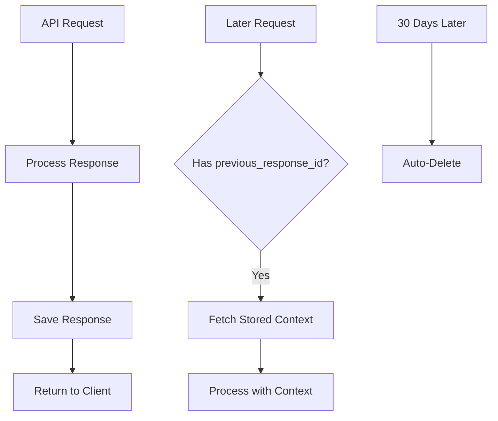
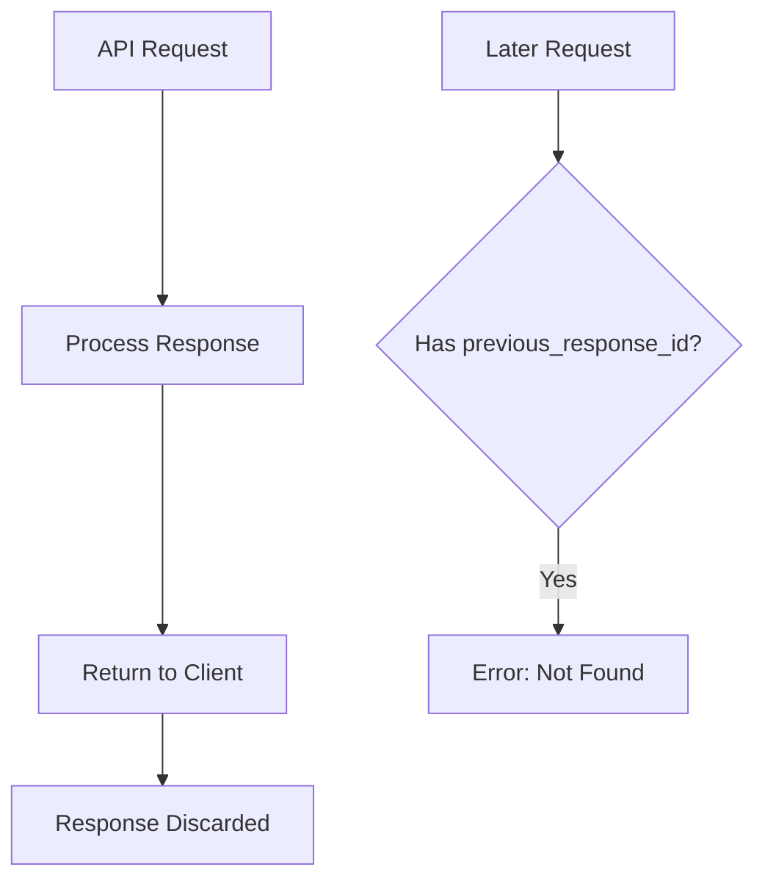

# Response Storage Control

## Introduction

By default, OpenAI stores your API responses for 30 days to support conversation continuity and debugging. However, you can control this behavior with the `store` parameter. Understanding storage options is essential for compliance, privacy, and optimizing your application architecture.

This lesson covers the `store` parameter, data retention policies, and when to use ephemeral vs. persistent responses.

### What We'll Cover

- The `store` parameter and its effects
- Default retention periods
- When to disable storage
- Zero Data Retention (ZDR) considerations
- Compliance and privacy patterns

### Prerequisites

- Completed [Context Window Management](./04-context-window-management.md)
- Understanding of response chaining

---

## The Store Parameter

### Overview

| Value | Behavior | Response Chaining | Retention |
|-------|----------|-------------------|-----------|
| `true` (default) | Response saved | `previous_response_id` works | 30 days |
| `false` | Response not saved | Cannot chain | None |

### Basic Usage

```python
from openai import OpenAI

client = OpenAI()

# Default: stored for 30 days
stored_response = client.responses.create(
    model="gpt-4o",
    input="Explain machine learning."
    # store=True is implicit
)

# Ephemeral: not stored
ephemeral_response = client.responses.create(
    model="gpt-4o",
    input="What is my account balance?",  # Sensitive data
    store=False
)

print(f"Stored ID (usable for chaining): {stored_response.id}")
print(f"Ephemeral ID (not chainable): {ephemeral_response.id}")
```

---

## Effects of Storage Settings

### When `store=True` (Default)



**Capabilities:**
- ✅ Use `previous_response_id` for chaining
- ✅ Retrieve response later via API
- ✅ Automatic context continuity
- ✅ Debugging and audit trails

### When `store=False`



**Capabilities:**
- ❌ Cannot use `previous_response_id` 
- ❌ Cannot retrieve response later
- ✅ Maximum privacy
- ✅ Compliance with strict data policies

---

## Chaining Limitations with Ephemeral Responses

### What Fails

```python
# Create ephemeral response
response1 = client.responses.create(
    model="gpt-4o",
    input="Start a conversation",
    store=False
)

# This will fail!
try:
    response2 = client.responses.create(
        model="gpt-4o",
        input="Continue...",
        previous_response_id=response1.id  # Response not stored!
    )
except Exception as e:
    print(f"Error: {e}")
    # Response not found - ephemeral responses cannot be chained
```

### Workaround: Manual Context

For ephemeral responses that need continuity, manage context manually:

```python
def ephemeral_chat(client, messages: list[dict], user_input: str) -> str:
    """Chat with manual context management, no server storage."""
    # Build full context from message history
    input_messages = messages + [
        {"role": "user", "content": user_input}
    ]
    
    response = client.responses.create(
        model="gpt-4o",
        input=input_messages,
        store=False
    )
    
    # Caller must store messages locally
    return response.output_text


# Usage
history = []

# Turn 1
response = ephemeral_chat(client, history, "What is Python?")
history.append({"role": "user", "content": "What is Python?"})
history.append({"role": "assistant", "content": response})

# Turn 2
response = ephemeral_chat(client, history, "How do I install it?")
history.append({"role": "user", "content": "How do I install it?"})
history.append({"role": "assistant", "content": response})
```

---

## When to Disable Storage

### Recommended for `store=False`

| Scenario | Reason |
|----------|--------|
| **Sensitive personal data** | PII, health info, financial data |
| **One-time queries** | No need for continuity |
| **Testing/development** | Avoid cluttering stored responses |
| **Strict compliance** | GDPR, HIPAA requirements |
| **High-volume simple queries** | Reduce storage overhead |

### Keep `store=True` For

| Scenario | Reason |
|----------|--------|
| **Multi-turn conversations** | Automatic context chaining |
| **Debugging needs** | Response retrieval for troubleshooting |
| **Audit requirements** | Response history for compliance |
| **Conversation persistence** | Users returning to continue chats |

---

## Zero Data Retention (ZDR)

Organizations can enable Zero Data Retention at the account level. This affects all API requests.

### ZDR Behavior

When ZDR is enabled for your organization:

```python
# With ZDR enabled, this behaves as store=False automatically
response = client.responses.create(
    model="gpt-4o",
    input="Query with ZDR",
    # store parameter is ignored - always ephemeral
)
```

### ZDR and Multi-Turn Conversations

ZDR presents challenges for conversation continuity. Solutions:

**Option 1: Manual Context**

```python
# Store context locally, not on OpenAI servers
local_history = []

for user_input in user_inputs:
    response = client.responses.create(
        model="gpt-4o",
        input=local_history + [{"role": "user", "content": user_input}]
    )
    
    local_history.append({"role": "user", "content": user_input})
    local_history.append({"role": "assistant", "content": response.output_text})
```

**Option 2: Encrypted Compaction**

```python
# Use encrypted reasoning for ZDR-compatible multi-turn
response = client.responses.create(
    model="o1",
    input="Complex query requiring reasoning",
    include=["reasoning.encrypted_content"]
)

# Encrypted content can be used in next turn even with ZDR
next_response = client.responses.create(
    model="o1",
    input=response.output + [{"role": "user", "content": "Follow-up"}],
    include=["reasoning.encrypted_content"]
)
```

---

## Data Retention Policies

### Default Retention Period

| Content Type | Retention | Notes |
|--------------|-----------|-------|
| API responses (`store=True`) | 30 days | Auto-deleted after |
| Conversation objects | 30 days | Includes all items |
| Ephemeral responses | 0 days | Never stored |
| ZDR organizations | 0 days | All requests ephemeral |

### What Gets Stored

When `store=True`, OpenAI stores:

- Request input
- Response output
- Token usage metadata
- Timestamps
- Model used

### What's Never Stored (Regardless of Setting)

- Your API key
- Request headers
- Network metadata
- Your application code

---

## Compliance Patterns

### GDPR Considerations

```python
def gdpr_compliant_response(client, user_input: str, user_consent: bool):
    """Handle GDPR requirements."""
    if not user_consent:
        # No consent = no storage
        return client.responses.create(
            model="gpt-4o",
            input=user_input,
            store=False
        )
    else:
        # With consent, storage acceptable
        return client.responses.create(
            model="gpt-4o",
            input=user_input,
            store=True
        )
```

### PII Detection Pattern

```python
import re

def contains_pii(text: str) -> bool:
    """Simple PII detection (use proper tools in production)."""
    patterns = [
        r'\b\d{3}-\d{2}-\d{4}\b',  # SSN
        r'\b\d{16}\b',  # Credit card
        r'\b[A-Za-z0-9._%+-]+@[A-Za-z0-9.-]+\.[A-Z|a-z]{2,}\b',  # Email
    ]
    
    for pattern in patterns:
        if re.search(pattern, text):
            return True
    return False


def smart_storage_decision(client, user_input: str):
    """Automatically disable storage for PII."""
    should_store = not contains_pii(user_input)
    
    return client.responses.create(
        model="gpt-4o",
        input=user_input,
        store=should_store
    )
```

### Hybrid Storage Strategy

```python
class HybridConversation:
    """Store non-sensitive turns, keep sensitive ones ephemeral."""
    
    def __init__(self, client):
        self.client = client
        self.conversation = client.conversations.create()
        self.ephemeral_context = []  # Local storage for sensitive turns
    
    def chat(self, message: str, sensitive: bool = False) -> str:
        if sensitive:
            return self._ephemeral_turn(message)
        else:
            return self._stored_turn(message)
    
    def _stored_turn(self, message: str) -> str:
        """Normal stored response with conversation."""
        # Include any ephemeral context first
        full_input = self.ephemeral_context + [
            {"role": "user", "content": message}
        ]
        
        response = self.client.responses.create(
            model="gpt-4o",
            input=full_input,
            conversation=self.conversation.id,
            store=True
        )
        
        # Clear ephemeral context after it's been used
        self.ephemeral_context = []
        
        return response.output_text
    
    def _ephemeral_turn(self, message: str) -> str:
        """Ephemeral response - stored locally only."""
        # Get conversation items for context
        items = self.client.conversations.items.list(
            self.conversation.id,
            order="asc"
        )
        
        # Build full context
        full_input = (
            [item.model_dump() for item in items.data] +
            self.ephemeral_context +
            [{"role": "user", "content": message}]
        )
        
        response = self.client.responses.create(
            model="gpt-4o",
            input=full_input,
            store=False  # Don't store this turn
        )
        
        # Store locally for continuity
        self.ephemeral_context.append({"role": "user", "content": message})
        self.ephemeral_context.append({
            "role": "assistant", 
            "content": response.output_text
        })
        
        return response.output_text
```

---

## Best Practices

### Storage Decision Matrix

| Data Sensitivity | Conversation Length | Recommendation |
|-----------------|---------------------|----------------|
| Low | Any | `store=True` |
| Medium | Short (1-2 turns) | `store=False` |
| Medium | Long | Hybrid (sensitive turns ephemeral) |
| High | Any | `store=False` + local storage |

### Implementation Guidelines

1. **Default to storage on** for better UX (context preservation)
2. **Flag sensitive operations** and disable storage for those
3. **Document your data handling** for compliance
4. **Use metadata** to tag conversations by data sensitivity
5. **Implement local backup** for critical conversation history

```python
# Tagging conversations by sensitivity
conversation = client.conversations.create(
    metadata={
        "data_classification": "internal",
        "contains_pii": "false",
        "retention_required": "false"
    }
)
```

---

## Hands-on Exercise

### Your Task

Build a conversation handler that:
1. Detects potential PII in user input
2. Automatically disables storage for sensitive messages
3. Maintains conversation continuity using hybrid approach
4. Logs storage decisions for audit purposes

### Requirements

1. Create a `SecureConversation` class
2. Implement PII detection (emails, phone numbers at minimum)
3. Store non-sensitive turns normally
4. Handle sensitive turns ephemerally with local context
5. Add logging of storage decisions

### Expected Behavior

```python
secure = SecureConversation(client)

# Normal - stored
secure.chat("What's the weather like?")
# > Storage: enabled

# PII detected - ephemeral  
secure.chat("My email is user@example.com")
# > Storage: disabled (PII detected)

# Back to normal
secure.chat("Thanks for the help!")
# > Storage: enabled
```

<details>
<summary>💡 Hints (click to expand)</summary>

- Use regex patterns from the compliance section
- Inherit from or adapt the `HybridConversation` class
- Add a logger instance to track decisions
- Consider edge cases like mixed content

</details>

<details>
<summary>✅ Solution (click to expand)</summary>

```python
import re
import logging
from openai import OpenAI

logging.basicConfig(level=logging.INFO)
logger = logging.getLogger(__name__)

class SecureConversation:
    PII_PATTERNS = [
        (r'\b[A-Za-z0-9._%+-]+@[A-Za-z0-9.-]+\.[A-Z|a-z]{2,}\b', 'email'),
        (r'\b\d{3}[-.\s]?\d{3}[-.\s]?\d{4}\b', 'phone'),
        (r'\b\d{3}-\d{2}-\d{4}\b', 'ssn'),
        (r'\b\d{16}\b', 'credit_card'),
    ]
    
    def __init__(self, client: OpenAI):
        self.client = client
        self.conversation = client.conversations.create()
        self.ephemeral_context = []
        
        logger.info(f"Created secure conversation: {self.conversation.id}")
    
    def detect_pii(self, text: str) -> list[str]:
        """Detect PII types in text."""
        found = []
        for pattern, pii_type in self.PII_PATTERNS:
            if re.search(pattern, text, re.IGNORECASE):
                found.append(pii_type)
        return found
    
    def chat(self, message: str) -> str:
        """Send message with automatic storage control."""
        pii_found = self.detect_pii(message)
        
        if pii_found:
            logger.warning(f"PII detected: {pii_found} - using ephemeral mode")
            return self._ephemeral_turn(message)
        else:
            logger.info("No PII detected - using stored mode")
            return self._stored_turn(message)
    
    def _stored_turn(self, message: str) -> str:
        full_input = self.ephemeral_context + [
            {"role": "user", "content": message}
        ]
        
        response = self.client.responses.create(
            model="gpt-4o",
            input=full_input,
            conversation=self.conversation.id,
            store=True
        )
        
        self.ephemeral_context = []
        logger.debug(f"Stored turn - response ID: {response.id}")
        
        return response.output_text
    
    def _ephemeral_turn(self, message: str) -> str:
        items = self.client.conversations.items.list(
            self.conversation.id,
            order="asc"
        )
        
        full_input = (
            [item.model_dump() for item in items.data] +
            self.ephemeral_context +
            [{"role": "user", "content": message}]
        )
        
        response = self.client.responses.create(
            model="gpt-4o",
            input=full_input,
            store=False
        )
        
        self.ephemeral_context.append({"role": "user", "content": message})
        self.ephemeral_context.append({
            "role": "assistant",
            "content": response.output_text
        })
        
        logger.debug("Ephemeral turn - no server storage")
        
        return response.output_text
    
    def get_audit_log(self) -> dict:
        """Get storage decision summary."""
        return {
            "conversation_id": self.conversation.id,
            "ephemeral_turns": len(self.ephemeral_context) // 2,
        }


# Usage
client = OpenAI()
secure = SecureConversation(client)

print(secure.chat("What's the weather like?"))
print(secure.chat("Contact me at user@example.com"))
print(secure.chat("Thanks!"))

print(secure.get_audit_log())
```

</details>

---

## Summary

✅ Use `store=True` (default) when you need response chaining and context continuity

✅ Use `store=False` for sensitive data, testing, or compliance requirements

✅ Ephemeral responses cannot be chained with `previous_response_id`

✅ ZDR organizations have implicit `store=False` for all requests

✅ Use hybrid approaches for conversations mixing sensitive and non-sensitive data

✅ Implement PII detection to automatically manage storage decisions

**Congratulations!** You've completed the OpenAI Conversations API lesson series. You now understand how to build persistent, scalable conversational applications with proper context management and data handling.

**Next Unit:** Continue to [Prompt Engineering](../../06-prompt-engineering/00-overview.md) to master crafting effective prompts for AI applications.

---

## Further Reading

- [Conversation State Guide](https://platform.openai.com/docs/guides/conversation-state) — Complete official documentation
- [Data Usage Policies](https://openai.com/policies/api-data-usage-policies) — OpenAI's data handling policies
- [Zero Data Retention](https://platform.openai.com/docs/models#how-we-use-your-data) — ZDR documentation

---

<!-- 
Sources Consulted:
- Conversation State Guide: https://platform.openai.com/docs/guides/conversation-state
- OpenAI API Data Policies: https://openai.com/policies/api-data-usage-policies
- Responses API Reference: https://platform.openai.com/docs/api-reference/responses
-->
