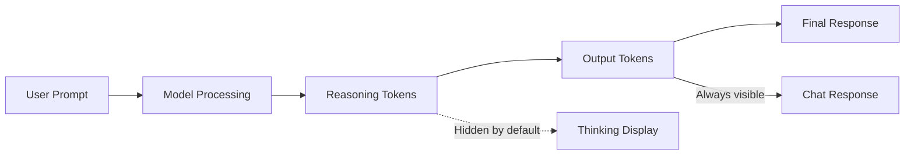

# Reasoning & Thinking Display

## Overview

Reasoning models like OpenAI's o-series (o1, o3, o4-mini), DeepSeek R1, and Claude with extended thinking represent a new paradigm in AI — models that "think before they answer." These models generate internal reasoning tokens that help them solve complex problems more effectively.

Displaying this thinking process in your chat interface creates transparency, builds user trust, and helps users understand how the AI arrived at its answer. This lesson series covers the UI patterns and implementation techniques for rendering reasoning tokens, tool invocations, and cost information.

## Why Reasoning Display Matters

| Benefit | Description |
|---------|-------------|
| **Transparency** | Users see how the AI thinks, building trust |
| **Debugging** | Developers can identify where reasoning goes wrong |
| **Education** | Users learn problem-solving approaches from AI reasoning |
| **Engagement** | Thinking indicators keep users informed during long waits |
| **Cost Awareness** | Token visualization helps users understand API costs |

## Models with Reasoning Capabilities

### OpenAI Reasoning Models

| Model | Context | Output | Notes |
|-------|---------|--------|-------|
| gpt-5 | 128k | 32k | Full reasoning with summaries |
| gpt-5-mini | 128k | 16k | Faster, economical |
| o1 | 200k | 100k | Deep reasoning |
| o3 | 200k | 100k | Advanced reasoning |
| o4-mini | 200k | 100k | Fast reasoning |

### Claude Extended Thinking

| Model | Thinking Support | Notes |
|-------|-----------------|-------|
| Claude Opus 4.5 | ✅ Summarized + preserved | Latest, thinking blocks preserved |
| Claude Sonnet 4.5 | ✅ Summarized | Current default |
| Claude Opus 4 | ✅ Summarized | High capability |

### Other Reasoning Models

| Provider | Model | Notes |
|----------|-------|-------|
| DeepSeek | deepseek-r1 | Full reasoning tokens exposed |
| xAI | Grok-3 (reasoning) | Thinking capabilities |

## What You'll Learn

This lesson series covers:

1. **Rendering Reasoning Tokens** — Detecting and styling `part.type === 'reasoning'`
2. **Thinking Section UI Patterns** — Collapsible sections, toggles, duration display
3. **Streaming Reasoning Display** — Real-time thinking with animated indicators
4. **Tool Invocation Display** — Rendering tool calls, arguments, and results
5. **Cost & Token Visualization** — Displaying reasoning costs and usage

## Key Concepts

### Reasoning Tokens vs Output Tokens



| Token Type | Visibility | Billing | Purpose |
|------------|------------|---------|---------|
| **Input** | Your prompt | Charged | Context |
| **Reasoning** | Optional (summary/encrypted) | Charged as output | Internal thinking |
| **Output** | Always visible | Charged | Final response |

### Message Parts in AI SDK

```typescript
// AI SDK message structure
interface UIMessage {
  id: string;
  role: 'user' | 'assistant';
  parts: MessagePart[];
  metadata?: Record<string, unknown>;
}

type MessagePart = 
  | { type: 'text'; text: string }
  | { type: 'reasoning'; text: string }
  | { type: 'tool-invocation'; toolName: string; toolCallId: string; state: string; input: unknown }
  | { type: 'tool-result'; toolName: string; toolCallId: string; output: unknown }
  | { type: 'file'; url: string; mediaType: string }
  | { type: 'source-url'; url: string; title?: string };
```

## Quick Start Example

Here's a minimal example of rendering reasoning tokens:

```tsx
// React component with AI SDK useChat
import { useChat } from '@ai-sdk/react';

export function ReasoningChat() {
  const { messages, sendMessage, status } = useChat();
  
  return (
    <div className="chat-container">
      {messages.map(message => (
        <div key={message.id} className={`message ${message.role}`}>
          {message.parts.map((part, index) => {
            switch (part.type) {
              case 'reasoning':
                return (
                  <details key={index} className="thinking-block">
                    <summary>💭 Thinking...</summary>
                    <pre>{part.text}</pre>
                  </details>
                );
              
              case 'text':
                return <p key={index}>{part.text}</p>;
              
              default:
                return null;
            }
          })}
        </div>
      ))}
    </div>
  );
}
```

## Server Configuration

Enable reasoning on the server:

```typescript
// app/api/chat/route.ts
import { streamText, convertToModelMessages, UIMessage } from 'ai';

export async function POST(req: Request) {
  const { messages }: { messages: UIMessage[] } = await req.json();
  
  const result = streamText({
    model: 'deepseek/deepseek-r1', // or other reasoning model
    messages: await convertToModelMessages(messages),
  });
  
  return result.toUIMessageStreamResponse({
    sendReasoning: true, // Enable reasoning token streaming
  });
}
```

## Lesson Structure

| Lesson | Focus | Key Skills |
|--------|-------|------------|
| [01 - Rendering Reasoning Tokens](./01-rendering-reasoning-tokens.md) | Basic rendering | Detecting parts, styling |
| [02 - Thinking Section UI Patterns](./02-thinking-section-ui-patterns.md) | UX patterns | Collapsible, toggles |
| [03 - Streaming Reasoning Display](./03-streaming-reasoning-display.md) | Real-time | Animations, streaming |
| [04 - Tool Invocation Display](./04-tool-invocation-display.md) | Tool calls | States, arguments, results |
| [05 - Cost & Token Visualization](./05-cost-token-visualization.md) | Metrics | Token counts, costs |

## Prerequisites

Before starting this lesson series, ensure you understand:

- React fundamentals and hooks
- AI SDK `useChat` hook basics ([Lesson 15](../15-ai-sdk-integration-usechat/00-ai-sdk-integration-usechat.md))
- Streaming concepts ([Lesson 3](../03-streaming-text-display/00-streaming-text-display.md))
- Basic CSS animations

## Resources

### AI SDK Documentation
- [Chatbot - Reasoning](https://ai-sdk.dev/docs/ai-sdk-ui/chatbot#reasoning) — Reasoning tokens in useChat
- [Chatbot Tool Usage](https://ai-sdk.dev/docs/ai-sdk-ui/chatbot-tool-usage) — Tool invocation display
- [Message Metadata](https://ai-sdk.dev/docs/ai-sdk-ui/message-metadata) — Token usage tracking

### Provider Documentation
- [OpenAI Reasoning Models](https://platform.openai.com/docs/guides/reasoning) — o-series models
- [Claude Extended Thinking](https://docs.anthropic.com/en/docs/build-with-claude/extended-thinking) — Claude thinking
- [DeepSeek R1](https://platform.deepseek.com/) — DeepSeek reasoning

---

**Next:** [Rendering Reasoning Tokens](./01-rendering-reasoning-tokens.md)
