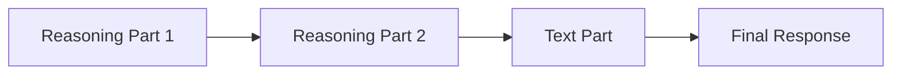

# Rendering Reasoning Tokens

## Introduction

Reasoning tokens are the internal "thoughts" that models like OpenAI's o-series, DeepSeek R1, and Claude with extended thinking generate before producing their final answer. These tokens represent step-by-step problem solving that happens behind the scenes.

In AI SDK, reasoning tokens appear as message parts with `type: 'reasoning'`. This lesson covers how to detect, render, and style these tokens in your chat interface.

### What We'll Cover

- Detecting reasoning parts in messages
- Basic rendering patterns
- Styling thinking vs response content
- Progressive reveal techniques
- Provider-specific differences

### Prerequisites

- AI SDK `useChat` hook basics
- React component patterns
- CSS fundamentals

---

## Understanding Reasoning Parts

### Message Structure with Reasoning

When reasoning is enabled, assistant messages contain multiple parts:

```typescript
// Message with reasoning
{
  id: "msg_123",
  role: "assistant",
  parts: [
    { type: "reasoning", text: "Let me think through this step by step...\n1. First I need to..." },
    { type: "text", text: "The answer is 42." }
  ]
}
```

### Part Order

Reasoning parts typically appear **before** text parts:



> **Note:** With Claude interleaved thinking or multi-step tool use, reasoning parts may appear between tool calls.

---

## Basic Rendering Pattern

### Detecting Reasoning Parts

```tsx
function ChatMessage({ message }: { message: UIMessage }) {
  return (
    <div className={`message ${message.role}`}>
      {message.parts.map((part, index) => {
        // Handle each part type
        switch (part.type) {
          case 'reasoning':
            return <ReasoningBlock key={index} text={part.text} />;
          
          case 'text':
            return <TextBlock key={index} text={part.text} />;
          
          default:
            return null;
        }
      })}
    </div>
  );
}
```

### Simple Reasoning Component

```tsx
function ReasoningBlock({ text }: { text: string }) {
  return (
    <div className="reasoning-block">
      <div className="reasoning-header">
        <span className="thinking-icon">💭</span>
        <span className="thinking-label">Thinking</span>
      </div>
      <div className="reasoning-content">
        {text}
      </div>
    </div>
  );
}
```

### Basic Styling

```css
.reasoning-block {
  background: linear-gradient(135deg, #f0f4ff 0%, #e8f0fe 100%);
  border-left: 3px solid #6366f1;
  border-radius: 8px;
  padding: 12px 16px;
  margin-bottom: 12px;
  font-family: 'SF Mono', 'Consolas', monospace;
  font-size: 0.9rem;
  color: #4b5563;
}

.reasoning-header {
  display: flex;
  align-items: center;
  gap: 8px;
  margin-bottom: 8px;
  font-weight: 600;
  color: #6366f1;
}

.thinking-icon {
  font-size: 1.1rem;
}

.reasoning-content {
  white-space: pre-wrap;
  line-height: 1.6;
}
```

---

## Styling Thinking vs Response

### Visual Hierarchy

Create clear distinction between thinking and response:

| Element | Thinking | Response |
|---------|----------|----------|
| Background | Subtle gradient / muted | White / primary |
| Border | Left accent line | None or full border |
| Font | Monospace | Sans-serif |
| Opacity | Slightly reduced | Full |
| Icon | 💭 🧠 ⚡ | None |

### Styled Components Example

```tsx
import styles from './Message.module.css';

function MessageParts({ parts }: { parts: MessagePart[] }) {
  return (
    <>
      {parts.map((part, index) => {
        if (part.type === 'reasoning') {
          return (
            <div key={index} className={styles.thinking}>
              <header className={styles.thinkingHeader}>
                <ThinkingIcon />
                <span>Chain of Thought</span>
              </header>
              <pre className={styles.thinkingText}>{part.text}</pre>
            </div>
          );
        }
        
        if (part.type === 'text') {
          return (
            <div key={index} className={styles.response}>
              <ReactMarkdown>{part.text}</ReactMarkdown>
            </div>
          );
        }
        
        return null;
      })}
    </>
  );
}
```

### CSS Module

```css
/* Message.module.css */

.thinking {
  position: relative;
  background: #fafafa;
  border-radius: 12px;
  padding: 16px;
  margin-bottom: 16px;
  border: 1px solid #e5e7eb;
}

.thinking::before {
  content: '';
  position: absolute;
  left: 0;
  top: 0;
  bottom: 0;
  width: 4px;
  background: linear-gradient(180deg, #8b5cf6 0%, #6366f1 100%);
  border-radius: 4px 0 0 4px;
}

.thinkingHeader {
  display: flex;
  align-items: center;
  gap: 8px;
  color: #7c3aed;
  font-size: 0.75rem;
  font-weight: 600;
  text-transform: uppercase;
  letter-spacing: 0.05em;
  margin-bottom: 12px;
}

.thinkingText {
  font-family: 'JetBrains Mono', monospace;
  font-size: 0.85rem;
  line-height: 1.7;
  color: #6b7280;
  white-space: pre-wrap;
  word-break: break-word;
  margin: 0;
}

.response {
  font-size: 1rem;
  line-height: 1.75;
  color: #1f2937;
}

.response p {
  margin-bottom: 1em;
}

.response code {
  background: #f3f4f6;
  padding: 2px 6px;
  border-radius: 4px;
  font-size: 0.875em;
}
```

---

## Progressive Reveal

### Why Progressive Reveal?

Long reasoning chains can overwhelm users. Progressive reveal:
- Shows thinking is happening
- Keeps interface clean
- Lets users dive deeper if interested

### Collapsible Reasoning

```tsx
import { useState } from 'react';

function CollapsibleReasoning({ text }: { text: string }) {
  const [isExpanded, setIsExpanded] = useState(false);
  
  // Show preview (first 200 chars)
  const preview = text.slice(0, 200);
  const hasMore = text.length > 200;
  
  return (
    <div className="reasoning-collapsible">
      <button 
        className="reasoning-toggle"
        onClick={() => setIsExpanded(!isExpanded)}
        aria-expanded={isExpanded}
      >
        <span className="toggle-icon">
          {isExpanded ? '▼' : '▶'}
        </span>
        <span>
          {isExpanded ? 'Hide thinking' : 'Show thinking'}
        </span>
      </button>
      
      <div 
        className={`reasoning-body ${isExpanded ? 'expanded' : 'collapsed'}`}
        aria-hidden={!isExpanded}
      >
        {isExpanded ? text : `${preview}${hasMore ? '...' : ''}`}
      </div>
    </div>
  );
}
```

### CSS for Collapsible

```css
.reasoning-collapsible {
  border: 1px solid #e5e7eb;
  border-radius: 8px;
  overflow: hidden;
  margin-bottom: 12px;
}

.reasoning-toggle {
  display: flex;
  align-items: center;
  gap: 8px;
  width: 100%;
  padding: 12px 16px;
  background: #f9fafb;
  border: none;
  cursor: pointer;
  font-size: 0.875rem;
  color: #6b7280;
  transition: background 0.2s;
}

.reasoning-toggle:hover {
  background: #f3f4f6;
}

.toggle-icon {
  font-size: 0.75rem;
  transition: transform 0.2s;
}

.reasoning-body {
  padding: 16px;
  font-family: monospace;
  font-size: 0.85rem;
  line-height: 1.6;
  white-space: pre-wrap;
  max-height: 400px;
  overflow-y: auto;
  transition: max-height 0.3s ease;
}

.reasoning-body.collapsed {
  max-height: 60px;
  overflow: hidden;
  position: relative;
}

.reasoning-body.collapsed::after {
  content: '';
  position: absolute;
  bottom: 0;
  left: 0;
  right: 0;
  height: 40px;
  background: linear-gradient(transparent, white);
}
```

---

## Using Native HTML Details

For a simpler approach, use the native `<details>` element:

```tsx
function NativeCollapsibleReasoning({ text }: { text: string }) {
  return (
    <details className="reasoning-details">
      <summary>
        <span className="icon">💭</span>
        View thinking process
      </summary>
      <pre className="reasoning-pre">{text}</pre>
    </details>
  );
}
```

```css
.reasoning-details {
  background: #f9fafb;
  border-radius: 8px;
  margin-bottom: 12px;
}

.reasoning-details summary {
  padding: 12px 16px;
  cursor: pointer;
  list-style: none;
  display: flex;
  align-items: center;
  gap: 8px;
  font-size: 0.875rem;
  color: #6b7280;
}

.reasoning-details summary::-webkit-details-marker {
  display: none;
}

.reasoning-details[open] summary {
  border-bottom: 1px solid #e5e7eb;
}

.reasoning-pre {
  padding: 16px;
  margin: 0;
  font-size: 0.85rem;
  white-space: pre-wrap;
  max-height: 300px;
  overflow-y: auto;
}
```

---

## Provider-Specific Rendering

### OpenAI Reasoning (Summaries)

OpenAI reasoning models return **summaries** rather than full reasoning:

```typescript
// OpenAI returns reasoning summaries
{
  type: "reasoning",
  summary: [
    {
      type: "summary_text",
      text: "**Analyzing the problem**\n\nI'm breaking down..."
    }
  ]
}
```

Render with markdown support:

```tsx
import ReactMarkdown from 'react-markdown';

function OpenAIReasoning({ summary }: { summary: SummaryText[] }) {
  return (
    <div className="reasoning-summary">
      {summary.map((item, index) => (
        <ReactMarkdown key={index}>
          {item.text}
        </ReactMarkdown>
      ))}
    </div>
  );
}
```

### Claude Extended Thinking

Claude returns thinking blocks that may be summarized:

```typescript
// Claude thinking response
{
  type: "thinking",
  thinking: "Let me analyze this step by step...",
  signature: "WaUjzkypQ2mUE..." // For verification
}
```

> **Note:** Claude 4 models return summarized thinking. Claude Sonnet 3.7 returns full thinking.

### DeepSeek R1

DeepSeek exposes full reasoning tokens:

```tsx
function DeepSeekReasoning({ text }: { text: string }) {
  // DeepSeek reasoning can be very long
  const lines = text.split('\n');
  
  return (
    <div className="deepseek-reasoning">
      <div className="reasoning-header">
        <span>🧠 Deep Reasoning ({lines.length} steps)</span>
      </div>
      <div className="reasoning-steps">
        {lines.map((line, i) => (
          <div key={i} className="step">
            <span className="step-number">{i + 1}</span>
            <span className="step-text">{line}</span>
          </div>
        ))}
      </div>
    </div>
  );
}
```

---

## Combining Multiple Parts

### Full Message Renderer

```tsx
function AssistantMessage({ message }: { message: UIMessage }) {
  const reasoningParts = message.parts.filter(p => p.type === 'reasoning');
  const textParts = message.parts.filter(p => p.type === 'text');
  const hasReasoning = reasoningParts.length > 0;
  
  return (
    <div className="assistant-message">
      {/* Reasoning section (if any) */}
      {hasReasoning && (
        <details className="thinking-section" open={false}>
          <summary>
            💭 View thinking ({reasoningParts.length} block{reasoningParts.length > 1 ? 's' : ''})
          </summary>
          <div className="thinking-content">
            {reasoningParts.map((part, i) => (
              <pre key={i}>{part.text}</pre>
            ))}
          </div>
        </details>
      )}
      
      {/* Response section */}
      <div className="response-section">
        {textParts.map((part, i) => (
          <ReactMarkdown key={i}>{part.text}</ReactMarkdown>
        ))}
      </div>
    </div>
  );
}
```

---

## Hands-on Exercise

### Your Task

Create a `ReasoningMessage` component that:
1. Renders reasoning parts in a collapsible section
2. Shows a preview (first 150 characters) when collapsed
3. Displays a word count badge
4. Renders text parts with markdown
5. Uses appropriate visual distinction

### Requirements

- Use AI SDK's `UIMessage` type
- Handle messages with no reasoning gracefully
- Add accessibility attributes (`aria-expanded`, `aria-hidden`)
- Style thinking distinctly from response

<details>
<summary>💡 Hints</summary>

- Filter parts by type first
- Calculate word count: `text.split(/\s+/).length`
- Use `useState` for collapse toggle
- Consider using CSS variables for theming

</details>

<details>
<summary>✅ Solution</summary>

```tsx
import { useState } from 'react';
import ReactMarkdown from 'react-markdown';
import type { UIMessage } from 'ai';

interface ReasoningMessageProps {
  message: UIMessage;
}

export function ReasoningMessage({ message }: ReasoningMessageProps) {
  const [showThinking, setShowThinking] = useState(false);
  
  // Separate parts by type
  const reasoningParts = message.parts.filter(p => p.type === 'reasoning');
  const textParts = message.parts.filter(p => p.type === 'text');
  
  // Combine all reasoning text
  const reasoningText = reasoningParts
    .map(p => p.text)
    .join('\n\n');
  
  const wordCount = reasoningText.split(/\s+/).filter(Boolean).length;
  const preview = reasoningText.slice(0, 150);
  const hasMore = reasoningText.length > 150;
  
  return (
    <div className="reasoning-message">
      {/* Reasoning Section */}
      {reasoningParts.length > 0 && (
        <div className="thinking-container">
          <button
            className="thinking-toggle"
            onClick={() => setShowThinking(!showThinking)}
            aria-expanded={showThinking}
          >
            <span className="toggle-arrow">
              {showThinking ? '▼' : '▶'}
            </span>
            <span className="thinking-label">
              💭 Thinking
            </span>
            <span className="word-badge">
              {wordCount} words
            </span>
          </button>
          
          <div 
            className={`thinking-body ${showThinking ? 'open' : 'closed'}`}
            aria-hidden={!showThinking}
          >
            {showThinking ? (
              <pre>{reasoningText}</pre>
            ) : (
              <p className="thinking-preview">
                {preview}{hasMore ? '...' : ''}
              </p>
            )}
          </div>
        </div>
      )}
      
      {/* Response Section */}
      <div className="response-content">
        {textParts.map((part, index) => (
          <ReactMarkdown key={index}>{part.text}</ReactMarkdown>
        ))}
      </div>
    </div>
  );
}
```

```css
.reasoning-message {
  display: flex;
  flex-direction: column;
  gap: 16px;
}

.thinking-container {
  background: var(--thinking-bg, #f5f3ff);
  border: 1px solid var(--thinking-border, #ddd6fe);
  border-radius: 12px;
  overflow: hidden;
}

.thinking-toggle {
  display: flex;
  align-items: center;
  gap: 8px;
  width: 100%;
  padding: 12px 16px;
  background: transparent;
  border: none;
  cursor: pointer;
  text-align: left;
}

.thinking-toggle:hover {
  background: rgba(0, 0, 0, 0.02);
}

.toggle-arrow {
  font-size: 0.7rem;
  color: var(--thinking-accent, #7c3aed);
}

.thinking-label {
  font-weight: 500;
  color: var(--thinking-accent, #7c3aed);
}

.word-badge {
  margin-left: auto;
  font-size: 0.75rem;
  color: #9ca3af;
  background: white;
  padding: 2px 8px;
  border-radius: 9999px;
}

.thinking-body {
  padding: 0 16px 16px;
  font-family: 'SF Mono', monospace;
  font-size: 0.85rem;
  line-height: 1.6;
  color: #6b7280;
}

.thinking-body.closed {
  padding-bottom: 12px;
}

.thinking-body pre {
  margin: 0;
  white-space: pre-wrap;
  max-height: 300px;
  overflow-y: auto;
}

.thinking-preview {
  margin: 0;
  font-style: italic;
}

.response-content {
  font-size: 1rem;
  line-height: 1.75;
}
```

</details>

---

## Summary

✅ Reasoning parts have `type: 'reasoning'` and contain the model's thinking

✅ Use visual hierarchy to distinguish thinking from response (color, font, borders)

✅ Progressive reveal keeps interfaces clean — use collapsible sections

✅ Native `<details>` element provides accessible disclosure without JavaScript

✅ Different providers return reasoning differently (summaries vs full tokens)

✅ Combine multiple reasoning parts into a single collapsible section

**Next:** [Thinking Section UI Patterns](./02-thinking-section-ui-patterns.md)

---

## Further Reading

- [AI SDK Chatbot - Reasoning](https://ai-sdk.dev/docs/ai-sdk-ui/chatbot#reasoning) — Official documentation
- [OpenAI Reasoning Summaries](https://platform.openai.com/docs/guides/reasoning#reasoning-summaries) — Summary format
- [Claude Extended Thinking](https://docs.anthropic.com/en/docs/build-with-claude/extended-thinking) — Claude thinking blocks

---

<!-- 
Sources Consulted:
- AI SDK Chatbot: https://ai-sdk.dev/docs/ai-sdk-ui/chatbot
- OpenAI Reasoning: https://platform.openai.com/docs/guides/reasoning
- Claude Extended Thinking: https://docs.anthropic.com/en/docs/build-with-claude/extended-thinking
-->
