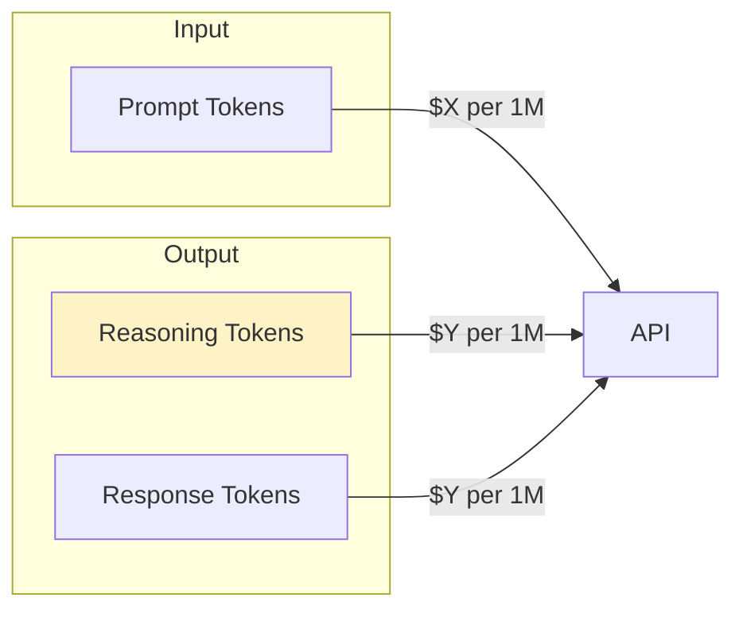

# Cost & Token Visualization

## Introduction

Reasoning models consume significantly more tokens than standard models—sometimes 10-100x more—because they generate internal "thinking" tokens before responding. Users need transparency about these costs to make informed decisions about when to use reasoning features and how to manage their API spending.

This lesson covers accessing token usage data, displaying cost breakdowns, showing reasoning token counts, and giving users control over cost-related preferences.

### What We'll Cover

- Accessing token usage from AI SDK responses
- Breaking down reasoning vs output tokens
- Displaying token counts and costs in the UI
- User preferences for showing/hiding cost information
- Real-time token tracking during streaming

### Prerequisites

- [Tool Invocation Display](./04-tool-invocation-display.md)
- Understanding of reasoning models
- Basic knowledge of AI API pricing

---

## Understanding Token Costs

### Reasoning Token Breakdown



| Token Type | Description | Billing |
|------------|-------------|---------|
| Input tokens | Your prompt, context, history | Input rate |
| Reasoning tokens | Model's internal thinking | Output rate |
| Output tokens | Final response text | Output rate |

> **🤖 AI Context:** Reasoning tokens are billed at output token rates, which are typically 3-4x higher than input rates. A complex reasoning chain might generate 10,000+ reasoning tokens before producing a 500-token response.

---

## Accessing Token Usage

### Server-Side Usage Data

```typescript
import { openai } from '@ai-sdk/openai';
import { generateText } from 'ai';

const response = await generateText({
  model: openai('o4-mini'),
  prompt: 'Explain quantum entanglement',
});

// Access usage information
const { usage } = response;

console.log({
  inputTokens: usage.promptTokens,
  outputTokens: usage.completionTokens,
  totalTokens: usage.totalTokens,
});
```

**Output:**
```json
{
  "inputTokens": 12,
  "outputTokens": 847,
  "totalTokens": 859
}
```

### Reasoning Token Details (OpenAI)

```typescript
// For OpenAI reasoning models, detailed breakdown is available
const { usage, experimental_providerMetadata } = response;

// Provider-specific metadata may contain reasoning details
const reasoningTokens = experimental_providerMetadata?.openai?.reasoningTokens;

console.log({
  promptTokens: usage.promptTokens,
  reasoningTokens: reasoningTokens || 0,
  completionTokens: usage.completionTokens,
  totalTokens: usage.totalTokens,
});
```

---

## Streaming Token Metadata

### Sending Usage to Client

```typescript
// app/api/chat/route.ts
import { openai } from '@ai-sdk/openai';
import { streamText } from 'ai';

export async function POST(request: Request) {
  const { messages } = await request.json();
  
  const result = streamText({
    model: openai('o4-mini'),
    messages,
  });
  
  return result.toUIMessageStreamResponse({
    sendReasoning: true,
    // Include message metadata for token info
    messageMetadata: async ({ usage }) => ({
      tokens: {
        prompt: usage?.promptTokens ?? 0,
        completion: usage?.completionTokens ?? 0,
        total: usage?.totalTokens ?? 0,
      },
    }),
  });
}
```

### Accessing Metadata on Client

```tsx
import { useChat } from '@ai-sdk/react';

export function ChatWithUsage() {
  const { messages } = useChat();
  
  return (
    <div>
      {messages.map(message => (
        <div key={message.id}>
          <MessageContent parts={message.parts} />
          
          {/* Display token usage if available */}
          {message.metadata?.tokens && (
            <TokenBadge tokens={message.metadata.tokens} />
          )}
        </div>
      ))}
    </div>
  );
}
```

---

## Token Count Display Components

### Simple Token Badge

```tsx
interface TokenBadgeProps {
  tokens: {
    prompt: number;
    completion: number;
    total: number;
  };
}

export function TokenBadge({ tokens }: TokenBadgeProps) {
  return (
    <div className="token-badge">
      <span className="token-icon">🔢</span>
      <span className="token-count">{tokens.total.toLocaleString()} tokens</span>
    </div>
  );
}
```

```css
.token-badge {
  display: inline-flex;
  align-items: center;
  gap: 4px;
  padding: 4px 10px;
  background: #f1f5f9;
  border-radius: 9999px;
  font-size: 0.75rem;
  color: #64748b;
}

.token-icon {
  font-size: 0.875rem;
}
```

### Detailed Token Breakdown

```tsx
interface TokenBreakdownProps {
  tokens: {
    prompt: number;
    completion: number;
    reasoning?: number;
    total: number;
  };
  showCost?: boolean;
  pricing?: {
    inputPerMillion: number;
    outputPerMillion: number;
  };
}

export function TokenBreakdown({ 
  tokens, 
  showCost = false,
  pricing = { inputPerMillion: 3, outputPerMillion: 15 }
}: TokenBreakdownProps) {
  const inputCost = (tokens.prompt / 1_000_000) * pricing.inputPerMillion;
  const outputCost = (tokens.completion / 1_000_000) * pricing.outputPerMillion;
  const totalCost = inputCost + outputCost;
  
  return (
    <div className="token-breakdown">
      <div className="breakdown-header">
        <span>Token Usage</span>
        {showCost && (
          <span className="total-cost">
            ${totalCost.toFixed(4)}
          </span>
        )}
      </div>
      
      <div className="breakdown-rows">
        <TokenRow 
          label="Input"
          tokens={tokens.prompt}
          cost={showCost ? inputCost : undefined}
          color="#3b82f6"
        />
        
        {tokens.reasoning !== undefined && tokens.reasoning > 0 && (
          <TokenRow 
            label="Reasoning"
            tokens={tokens.reasoning}
            cost={showCost ? (tokens.reasoning / 1_000_000) * pricing.outputPerMillion : undefined}
            color="#f59e0b"
          />
        )}
        
        <TokenRow 
          label="Output"
          tokens={tokens.completion - (tokens.reasoning || 0)}
          cost={showCost ? ((tokens.completion - (tokens.reasoning || 0)) / 1_000_000) * pricing.outputPerMillion : undefined}
          color="#10b981"
        />
      </div>
      
      <div className="breakdown-total">
        <span>Total</span>
        <span>{tokens.total.toLocaleString()}</span>
      </div>
    </div>
  );
}

interface TokenRowProps {
  label: string;
  tokens: number;
  cost?: number;
  color: string;
}

function TokenRow({ label, tokens, cost, color }: TokenRowProps) {
  return (
    <div className="token-row">
      <div className="row-label">
        <span 
          className="color-dot" 
          style={{ background: color }}
        />
        <span>{label}</span>
      </div>
      <div className="row-values">
        <span className="token-value">
          {tokens.toLocaleString()}
        </span>
        {cost !== undefined && (
          <span className="cost-value">
            ${cost.toFixed(4)}
          </span>
        )}
      </div>
    </div>
  );
}
```

```css
.token-breakdown {
  background: white;
  border: 1px solid #e2e8f0;
  border-radius: 12px;
  padding: 16px;
  font-size: 0.875rem;
}

.breakdown-header {
  display: flex;
  justify-content: space-between;
  align-items: center;
  margin-bottom: 12px;
  font-weight: 600;
  color: #334155;
}

.total-cost {
  font-family: 'JetBrains Mono', monospace;
  color: #64748b;
}

.breakdown-rows {
  display: flex;
  flex-direction: column;
  gap: 8px;
}

.token-row {
  display: flex;
  justify-content: space-between;
  align-items: center;
}

.row-label {
  display: flex;
  align-items: center;
  gap: 8px;
  color: #64748b;
}

.color-dot {
  width: 8px;
  height: 8px;
  border-radius: 50%;
}

.row-values {
  display: flex;
  gap: 12px;
}

.token-value {
  font-family: 'JetBrains Mono', monospace;
  color: #334155;
}

.cost-value {
  font-family: 'JetBrains Mono', monospace;
  color: #64748b;
  min-width: 60px;
  text-align: right;
}

.breakdown-total {
  display: flex;
  justify-content: space-between;
  margin-top: 12px;
  padding-top: 12px;
  border-top: 1px solid #e2e8f0;
  font-weight: 600;
}
```

---

## Visual Token Meter

### Progress Bar Visualization

```tsx
interface TokenMeterProps {
  tokens: {
    prompt: number;
    reasoning?: number;
    completion: number;
  };
  maxTokens?: number;
}

export function TokenMeter({ tokens, maxTokens = 100000 }: TokenMeterProps) {
  const total = tokens.prompt + tokens.completion;
  const reasoningTokens = tokens.reasoning || 0;
  const responseTokens = tokens.completion - reasoningTokens;
  
  const promptPercent = (tokens.prompt / maxTokens) * 100;
  const reasoningPercent = (reasoningTokens / maxTokens) * 100;
  const responsePercent = (responseTokens / maxTokens) * 100;
  
  return (
    <div className="token-meter">
      <div className="meter-label">
        <span>Token Usage</span>
        <span>{total.toLocaleString()} / {maxTokens.toLocaleString()}</span>
      </div>
      
      <div className="meter-bar">
        <div 
          className="meter-segment prompt"
          style={{ width: `${promptPercent}%` }}
          title={`Input: ${tokens.prompt.toLocaleString()}`}
        />
        {reasoningTokens > 0 && (
          <div 
            className="meter-segment reasoning"
            style={{ width: `${reasoningPercent}%` }}
            title={`Reasoning: ${reasoningTokens.toLocaleString()}`}
          />
        )}
        <div 
          className="meter-segment response"
          style={{ width: `${responsePercent}%` }}
          title={`Response: ${responseTokens.toLocaleString()}`}
        />
      </div>
      
      <div className="meter-legend">
        <LegendItem color="#3b82f6" label="Input" />
        {reasoningTokens > 0 && (
          <LegendItem color="#f59e0b" label="Reasoning" />
        )}
        <LegendItem color="#10b981" label="Response" />
      </div>
    </div>
  );
}

function LegendItem({ color, label }: { color: string; label: string }) {
  return (
    <div className="legend-item">
      <span className="legend-dot" style={{ background: color }} />
      <span>{label}</span>
    </div>
  );
}
```

```css
.token-meter {
  padding: 12px;
  background: #f8fafc;
  border-radius: 8px;
}

.meter-label {
  display: flex;
  justify-content: space-between;
  font-size: 0.75rem;
  color: #64748b;
  margin-bottom: 8px;
}

.meter-bar {
  display: flex;
  height: 8px;
  background: #e2e8f0;
  border-radius: 4px;
  overflow: hidden;
}

.meter-segment {
  height: 100%;
  transition: width 0.3s ease;
}

.meter-segment.prompt { background: #3b82f6; }
.meter-segment.reasoning { background: #f59e0b; }
.meter-segment.response { background: #10b981; }

.meter-legend {
  display: flex;
  gap: 16px;
  margin-top: 8px;
}

.legend-item {
  display: flex;
  align-items: center;
  gap: 4px;
  font-size: 0.7rem;
  color: #64748b;
}

.legend-dot {
  width: 6px;
  height: 6px;
  border-radius: 50%;
}
```

---

## User Preferences

### Cost Visibility Toggle

```tsx
import { useState, createContext, useContext } from 'react';

interface CostPreferences {
  showTokenCounts: boolean;
  showCostEstimates: boolean;
  showReasoningBreakdown: boolean;
}

const CostPreferencesContext = createContext<{
  preferences: CostPreferences;
  updatePreferences: (updates: Partial<CostPreferences>) => void;
}>({
  preferences: {
    showTokenCounts: true,
    showCostEstimates: false,
    showReasoningBreakdown: true,
  },
  updatePreferences: () => {},
});

export function CostPreferencesProvider({ children }: { children: React.ReactNode }) {
  const [preferences, setPreferences] = useState<CostPreferences>({
    showTokenCounts: true,
    showCostEstimates: false,
    showReasoningBreakdown: true,
  });
  
  const updatePreferences = (updates: Partial<CostPreferences>) => {
    setPreferences(prev => ({ ...prev, ...updates }));
  };
  
  return (
    <CostPreferencesContext.Provider value={{ preferences, updatePreferences }}>
      {children}
    </CostPreferencesContext.Provider>
  );
}

export const useCostPreferences = () => useContext(CostPreferencesContext);
```

### Settings Panel

```tsx
export function CostSettingsPanel() {
  const { preferences, updatePreferences } = useCostPreferences();
  
  return (
    <div className="settings-panel">
      <h3>Cost & Token Display</h3>
      
      <label className="setting-row">
        <input
          type="checkbox"
          checked={preferences.showTokenCounts}
          onChange={(e) => updatePreferences({ 
            showTokenCounts: e.target.checked 
          })}
        />
        <span>Show token counts</span>
      </label>
      
      <label className="setting-row">
        <input
          type="checkbox"
          checked={preferences.showCostEstimates}
          onChange={(e) => updatePreferences({ 
            showCostEstimates: e.target.checked 
          })}
        />
        <span>Show cost estimates</span>
      </label>
      
      <label className="setting-row">
        <input
          type="checkbox"
          checked={preferences.showReasoningBreakdown}
          onChange={(e) => updatePreferences({ 
            showReasoningBreakdown: e.target.checked 
          })}
        />
        <span>Show reasoning token breakdown</span>
      </label>
    </div>
  );
}
```

### Conditional Display

```tsx
export function MessageWithTokens({ message }: { message: UIMessage }) {
  const { preferences } = useCostPreferences();
  
  return (
    <div className="message">
      <MessageContent parts={message.parts} />
      
      {preferences.showTokenCounts && message.metadata?.tokens && (
        <TokenBreakdown
          tokens={message.metadata.tokens}
          showCost={preferences.showCostEstimates}
        />
      )}
    </div>
  );
}
```

---

## Session-Level Cost Tracking

### Cumulative Usage Hook

```tsx
import { useState, useEffect } from 'react';
import type { UIMessage } from 'ai';

interface SessionUsage {
  totalPromptTokens: number;
  totalCompletionTokens: number;
  totalReasoningTokens: number;
  estimatedCost: number;
  messageCount: number;
}

export function useSessionUsage(
  messages: UIMessage[],
  pricing = { inputPerMillion: 3, outputPerMillion: 15 }
): SessionUsage {
  const [usage, setUsage] = useState<SessionUsage>({
    totalPromptTokens: 0,
    totalCompletionTokens: 0,
    totalReasoningTokens: 0,
    estimatedCost: 0,
    messageCount: 0,
  });
  
  useEffect(() => {
    let totalPrompt = 0;
    let totalCompletion = 0;
    let totalReasoning = 0;
    let count = 0;
    
    messages.forEach(msg => {
      if (msg.metadata?.tokens) {
        totalPrompt += msg.metadata.tokens.prompt || 0;
        totalCompletion += msg.metadata.tokens.completion || 0;
        totalReasoning += msg.metadata.tokens.reasoning || 0;
        count++;
      }
    });
    
    const inputCost = (totalPrompt / 1_000_000) * pricing.inputPerMillion;
    const outputCost = (totalCompletion / 1_000_000) * pricing.outputPerMillion;
    
    setUsage({
      totalPromptTokens: totalPrompt,
      totalCompletionTokens: totalCompletion,
      totalReasoningTokens: totalReasoning,
      estimatedCost: inputCost + outputCost,
      messageCount: count,
    });
  }, [messages, pricing]);
  
  return usage;
}
```

### Session Summary Component

```tsx
export function SessionCostSummary({ messages }: { messages: UIMessage[] }) {
  const usage = useSessionUsage(messages);
  const { preferences } = useCostPreferences();
  
  if (!preferences.showTokenCounts) return null;
  
  return (
    <div className="session-summary">
      <div className="summary-header">Session Usage</div>
      
      <div className="summary-stats">
        <div className="stat">
          <span className="stat-value">
            {(usage.totalPromptTokens + usage.totalCompletionTokens).toLocaleString()}
          </span>
          <span className="stat-label">Total Tokens</span>
        </div>
        
        {usage.totalReasoningTokens > 0 && preferences.showReasoningBreakdown && (
          <div className="stat reasoning">
            <span className="stat-value">
              {usage.totalReasoningTokens.toLocaleString()}
            </span>
            <span className="stat-label">Reasoning</span>
          </div>
        )}
        
        {preferences.showCostEstimates && (
          <div className="stat cost">
            <span className="stat-value">
              ${usage.estimatedCost.toFixed(4)}
            </span>
            <span className="stat-label">Est. Cost</span>
          </div>
        )}
        
        <div className="stat">
          <span className="stat-value">{usage.messageCount}</span>
          <span className="stat-label">Messages</span>
        </div>
      </div>
    </div>
  );
}
```

```css
.session-summary {
  background: linear-gradient(135deg, #f8fafc 0%, #f1f5f9 100%);
  border: 1px solid #e2e8f0;
  border-radius: 12px;
  padding: 16px;
}

.summary-header {
  font-size: 0.75rem;
  font-weight: 600;
  color: #64748b;
  text-transform: uppercase;
  letter-spacing: 0.05em;
  margin-bottom: 12px;
}

.summary-stats {
  display: flex;
  gap: 24px;
  flex-wrap: wrap;
}

.stat {
  display: flex;
  flex-direction: column;
  gap: 2px;
}

.stat-value {
  font-size: 1.25rem;
  font-weight: 600;
  font-family: 'JetBrains Mono', monospace;
  color: #334155;
}

.stat.reasoning .stat-value {
  color: #d97706;
}

.stat.cost .stat-value {
  color: #059669;
}

.stat-label {
  font-size: 0.7rem;
  color: #94a3b8;
}
```

---

## Summary

✅ Access token usage via `usage` object from AI SDK responses

✅ Send metadata to clients using `messageMetadata` in streaming responses

✅ Break down costs: input tokens vs reasoning tokens vs output tokens

✅ Create visual representations with progress bars and badges

✅ Implement user preferences for showing/hiding cost information

✅ Track cumulative session usage for budget awareness

**Previous:** [Tool Invocation Display](./04-tool-invocation-display.md)

---

## Further Reading

- [AI SDK Usage Tracking](https://ai-sdk.dev/docs/ai-sdk-core/telemetry) — Built-in telemetry
- [OpenAI Pricing](https://openai.com/pricing) — Current model pricing
- [Anthropic Pricing](https://www.anthropic.com/pricing) — Claude model costs

---

<!-- 
Sources Consulted:
- AI SDK streamText API: https://ai-sdk.dev/docs/reference/ai-sdk-core/stream-text
- OpenAI Reasoning Guide: https://platform.openai.com/docs/guides/reasoning
- AI SDK UI Message Streaming: https://ai-sdk.dev/docs/ai-sdk-ui/stream-protocol
-->
