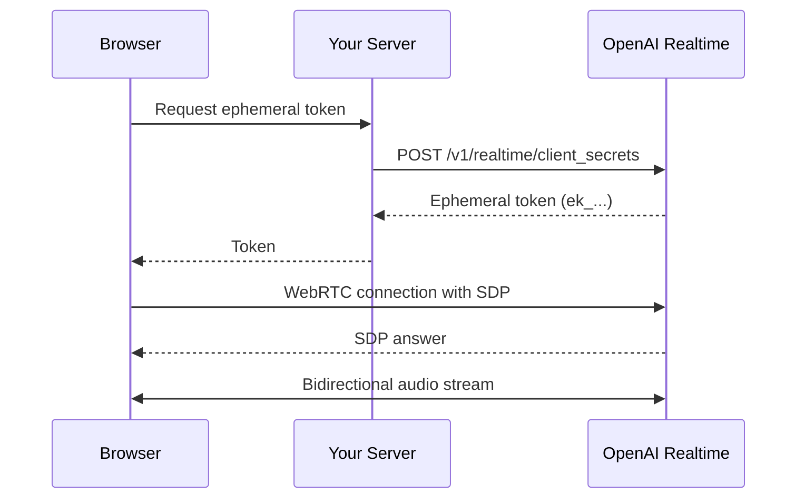

# Voice & Realtime Chat Interfaces

## Introduction

Voice-enabled chat interfaces represent the next evolution in AI interaction. Instead of typing messages and waiting for text responses, users can have natural conversations with AI assistants using their voice. OpenAI's Realtime API enables speech-to-speech communication with sub-second latency, creating experiences that feel genuinely conversational.

This lesson introduces the concepts and UI patterns needed to build voice chat interfaces using WebRTC and the OpenAI Agents SDK.

### Why Voice Interfaces Matter

Voice interfaces offer unique advantages:

| Benefit | Description |
|---------|-------------|
| **Natural interaction** | Speaking is faster and more intuitive than typing |
| **Accessibility** | Enables hands-free use for users with mobility limitations |
| **Multitasking** | Users can interact while doing other activities |
| **Emotional nuance** | Voice conveys tone and emotion that text cannot |
| **Mobile-first** | Ideal for small screens and on-the-go usage |

### What We'll Cover

This lesson folder covers:

1. **Realtime API UI Patterns** — Voice activity indicators, speaking states, waveform visualization
2. **WebRTC Implementation** — RTCPeerConnection setup, microphone permissions, connection status
3. **Agents SDK Voice Integration** — RealtimeAgent, RealtimeSession, voice selection
4. **Voice-Specific UX** — Push-to-talk, VAD, interruption handling, transcripts
5. **Turn-Taking & Audio Settings** — Speaking indicators, device selection, volume controls

### Prerequisites

- [Streaming Text Display](../03-streaming-text-display/00-streaming-text-display.md)
- [Loading & Status Indicators](../04-loading-status-indicators/00-loading-status-indicators.md)
- Understanding of async/await and event handling
- Basic familiarity with WebRTC concepts

---

## Key Technologies

### OpenAI Realtime API

The Realtime API enables speech-to-speech communication with AI models. It supports:

- **WebRTC connections** — Low-latency audio streaming from browsers
- **WebSocket connections** — Server-side audio processing
- **Voice activity detection** — Automatic turn detection
- **Multiple voices** — Alloy, Ash, Ballad, Coral, Sage, Verse, and more
- **Tool calling** — AI can execute functions during conversation

### OpenAI Agents SDK

The Agents SDK provides high-level abstractions for building voice agents:

```typescript
import { RealtimeAgent, RealtimeSession } from '@openai/agents/realtime';

const agent = new RealtimeAgent({
  name: 'Assistant',
  instructions: 'You are a helpful voice assistant.',
});

const session = new RealtimeSession(agent, {
  model: 'gpt-realtime',
});

await session.connect({ apiKey: ephemeralKey });
```

### WebRTC

WebRTC (Web Real-Time Communication) enables peer-to-peer audio/video streaming:

```typescript
// Core WebRTC interfaces
const pc = new RTCPeerConnection();  // Connection management
const dc = pc.createDataChannel('oai-events');  // Event signaling
const stream = await navigator.mediaDevices.getUserMedia({ audio: true });  // Microphone
```

---

## Architecture Overview



---

## Quick Start

### 1. Install Dependencies

```bash
npm install @openai/agents zod
```

### 2. Generate Ephemeral Token (Server)

```typescript
// api/token/route.ts
export async function GET() {
  const response = await fetch(
    'https://api.openai.com/v1/realtime/client_secrets',
    {
      method: 'POST',
      headers: {
        Authorization: `Bearer ${process.env.OPENAI_API_KEY}`,
        'Content-Type': 'application/json',
      },
      body: JSON.stringify({
        session: {
          type: 'realtime',
          model: 'gpt-realtime',
        },
      }),
    }
  );
  
  return Response.json(await response.json());
}
```

### 3. Connect Voice Agent (Client)

```typescript
import { RealtimeAgent, RealtimeSession } from '@openai/agents/realtime';

async function startVoiceChat() {
  // Get ephemeral token from your server
  const tokenResponse = await fetch('/api/token');
  const { value: ephemeralKey } = await tokenResponse.json();
  
  // Create agent
  const agent = new RealtimeAgent({
    name: 'Voice Assistant',
    instructions: 'You are a friendly voice assistant.',
  });
  
  // Create session (auto-configures microphone in browser)
  const session = new RealtimeSession(agent, {
    model: 'gpt-realtime',
  });
  
  // Connect
  await session.connect({ apiKey: ephemeralKey });
  
  console.log('Voice chat active! Start speaking...');
}
```

---

## Lesson Structure

| Lesson | Topics |
|--------|--------|
| [01 - Realtime API UI Patterns](./01-realtime-api-ui-patterns.md) | Voice activity indicators, speaking/listening states, waveform visualization, audio level meters |
| [02 - WebRTC Implementation](./02-webrtc-implementation.md) | RTCPeerConnection, microphone permissions, connection status, data channels |
| [03 - Agents SDK Voice Integration](./03-agents-sdk-voice.md) | RealtimeAgent, RealtimeSession, voice selection, guardrails, tools |
| [04 - Voice-Specific UX](./04-voice-specific-ux.md) | Push-to-talk, VAD, interruption handling, transcript display |
| [05 - Turn-Taking & Audio Settings](./05-turn-taking-audio-settings.md) | Speaking indicators, device selection, volume controls |

---

## Summary

✅ Voice interfaces enable natural, hands-free AI interaction

✅ OpenAI Realtime API provides speech-to-speech with sub-second latency

✅ Agents SDK simplifies voice agent development with RealtimeSession

✅ WebRTC handles low-latency audio streaming in browsers

✅ Ephemeral tokens enable secure client-side connections

**Next:** [Realtime API UI Patterns](./01-realtime-api-ui-patterns.md)

---

## Further Reading

- [OpenAI Realtime API WebRTC Guide](https://platform.openai.com/docs/guides/realtime-webrtc) — Connection setup
- [OpenAI Agents SDK TypeScript](https://openai.github.io/openai-agents-js/) — SDK documentation
- [MDN WebRTC API](https://developer.mozilla.org/en-US/docs/Web/API/WebRTC_API) — Browser APIs
- [Realtime Console Example](https://github.com/openai/openai-realtime-console/) — Reference implementation

---

<!-- 
Sources Consulted:
- OpenAI Realtime WebRTC: https://platform.openai.com/docs/guides/realtime-webrtc
- OpenAI Agents SDK: https://openai.github.io/openai-agents-js/
- MDN WebRTC API: https://developer.mozilla.org/en-US/docs/Web/API/WebRTC_API
-->
