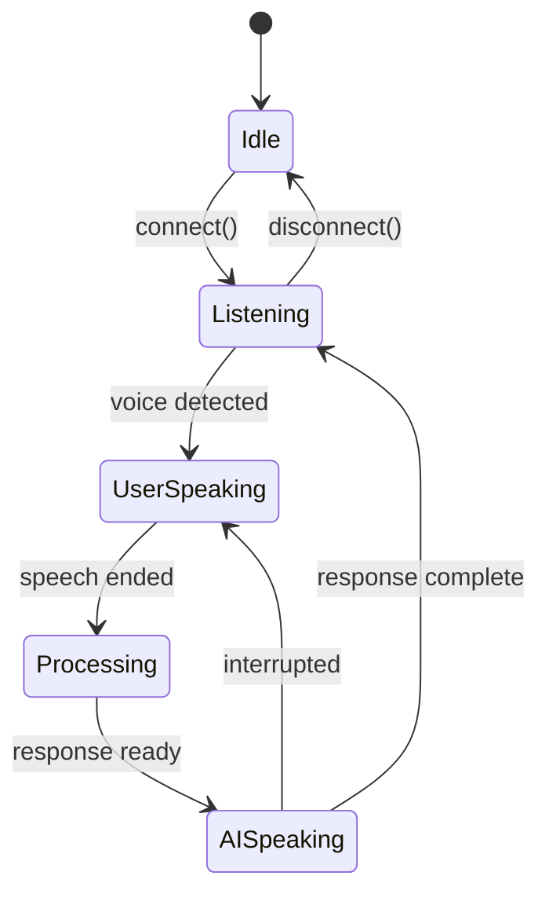

# Realtime API UI Patterns

## Introduction

Voice chat interfaces require specialized UI patterns that communicate audio activity, connection state, and turn-taking in real time. Unlike text chats where users see characters appear, voice interfaces must convey invisible audio events visually. Well-designed voice activity indicators make the difference between a confusing experience and one that feels natural.

This lesson covers the essential UI patterns for voice chat interfaces: voice activity indicators, speaking/listening state displays, waveform visualizations, and audio level meters.

### What We'll Cover

- Voice activity indicator states
- Speaking vs listening state display
- Real-time waveform visualization
- Audio level meters for input monitoring
- Connection and processing states

### Prerequisites

- [Overview](./00-voice-realtime-overview.md)
- React component fundamentals
- CSS animations basics

---

## Voice Activity Indicator States

Voice interfaces have distinct states that users need to understand at a glance:

| State | Description | Visual Treatment |
|-------|-------------|------------------|
| **Idle** | Not connected or inactive | Gray/muted, static |
| **Listening** | Microphone active, waiting for speech | Subtle pulse, accent color |
| **User Speaking** | User's voice detected | Active animation, bright |
| **AI Processing** | Processing user's input | Thinking indicator |
| **AI Speaking** | AI is responding | Waveform, different color |

### State Machine



### Voice State Type

```typescript
type VoiceState = 
  | 'idle'
  | 'connecting'
  | 'listening'
  | 'user-speaking'
  | 'processing'
  | 'ai-speaking';

interface VoiceActivityProps {
  state: VoiceState;
  audioLevel?: number;  // 0-1
}
```

---

## Basic Voice Activity Indicator

### Pulsing Orb Indicator

```tsx
interface VoiceOrbProps {
  state: VoiceState;
  size?: 'sm' | 'md' | 'lg';
}

export function VoiceOrb({ state, size = 'md' }: VoiceOrbProps) {
  const sizeClasses = {
    sm: 'w-12 h-12',
    md: 'w-20 h-20',
    lg: 'w-32 h-32',
  };
  
  return (
    <div className={`voice-orb ${state} ${sizeClasses[size]}`}>
      <div className="orb-core" />
      <div className="orb-ring orb-ring-1" />
      <div className="orb-ring orb-ring-2" />
      <div className="orb-ring orb-ring-3" />
    </div>
  );
}
```

```css
.voice-orb {
  position: relative;
  display: flex;
  align-items: center;
  justify-content: center;
}

.orb-core {
  width: 50%;
  height: 50%;
  border-radius: 50%;
  background: currentColor;
  transition: transform 0.2s ease, background 0.3s ease;
}

.orb-ring {
  position: absolute;
  inset: 0;
  border-radius: 50%;
  border: 2px solid currentColor;
  opacity: 0;
}

/* Idle state */
.voice-orb.idle {
  color: #94a3b8;
}

.voice-orb.idle .orb-core {
  transform: scale(0.8);
}

/* Connecting state */
.voice-orb.connecting {
  color: #f59e0b;
}

.voice-orb.connecting .orb-core {
  animation: pulse 1.5s ease-in-out infinite;
}

/* Listening state */
.voice-orb.listening {
  color: #3b82f6;
}

.voice-orb.listening .orb-ring {
  animation: listening-pulse 2s ease-out infinite;
}

.voice-orb.listening .orb-ring-2 {
  animation-delay: 0.4s;
}

.voice-orb.listening .orb-ring-3 {
  animation-delay: 0.8s;
}

/* User speaking */
.voice-orb.user-speaking {
  color: #22c55e;
}

.voice-orb.user-speaking .orb-core {
  animation: speaking-pulse 0.3s ease-in-out infinite alternate;
}

.voice-orb.user-speaking .orb-ring {
  opacity: 0.3;
  animation: speaking-ring 0.5s ease-out infinite;
}

/* Processing */
.voice-orb.processing {
  color: #8b5cf6;
}

.voice-orb.processing .orb-core {
  animation: processing-spin 1s linear infinite;
}

/* AI speaking */
.voice-orb.ai-speaking {
  color: #06b6d4;
}

.voice-orb.ai-speaking .orb-core {
  animation: ai-pulse 0.4s ease-in-out infinite alternate;
}

@keyframes pulse {
  0%, 100% { transform: scale(0.8); opacity: 0.7; }
  50% { transform: scale(1); opacity: 1; }
}

@keyframes listening-pulse {
  0% { transform: scale(0.5); opacity: 0.6; }
  100% { transform: scale(1.2); opacity: 0; }
}

@keyframes speaking-pulse {
  from { transform: scale(1); }
  to { transform: scale(1.2); }
}

@keyframes speaking-ring {
  0% { transform: scale(0.8); opacity: 0.5; }
  100% { transform: scale(1.3); opacity: 0; }
}

@keyframes processing-spin {
  from { transform: rotate(0deg) scale(0.9); }
  to { transform: rotate(360deg) scale(0.9); }
}

@keyframes ai-pulse {
  from { transform: scale(0.9); }
  to { transform: scale(1.1); }
}
```

---

## Speaking/Listening State Display

### State Banner Component

```tsx
interface VoiceStateBannerProps {
  state: VoiceState;
  transcriptPreview?: string;
}

export function VoiceStateBanner({ 
  state, 
  transcriptPreview 
}: VoiceStateBannerProps) {
  const stateConfig = {
    idle: { icon: '🎤', label: 'Click to start', color: 'gray' },
    connecting: { icon: '🔄', label: 'Connecting...', color: 'amber' },
    listening: { icon: '👂', label: 'Listening...', color: 'blue' },
    'user-speaking': { icon: '🗣️', label: 'You are speaking', color: 'green' },
    processing: { icon: '🧠', label: 'Thinking...', color: 'purple' },
    'ai-speaking': { icon: '🤖', label: 'Assistant speaking', color: 'cyan' },
  };
  
  const config = stateConfig[state];
  
  return (
    <div className={`voice-state-banner ${config.color}`}>
      <span className="state-icon">{config.icon}</span>
      <div className="state-content">
        <span className="state-label">{config.label}</span>
        {transcriptPreview && state === 'user-speaking' && (
          <span className="transcript-preview">
            "{transcriptPreview}"
          </span>
        )}
      </div>
      {state === 'listening' && (
        <div className="listening-dots">
          <span />
          <span />
          <span />
        </div>
      )}
    </div>
  );
}
```

```css
.voice-state-banner {
  display: flex;
  align-items: center;
  gap: 12px;
  padding: 12px 20px;
  border-radius: 12px;
  background: var(--banner-bg);
  border: 1px solid var(--banner-border);
  transition: all 0.3s ease;
}

.voice-state-banner.gray {
  --banner-bg: #f1f5f9;
  --banner-border: #e2e8f0;
  --banner-text: #64748b;
}

.voice-state-banner.blue {
  --banner-bg: #eff6ff;
  --banner-border: #bfdbfe;
  --banner-text: #2563eb;
}

.voice-state-banner.green {
  --banner-bg: #f0fdf4;
  --banner-border: #bbf7d0;
  --banner-text: #16a34a;
}

.voice-state-banner.purple {
  --banner-bg: #faf5ff;
  --banner-border: #e9d5ff;
  --banner-text: #9333ea;
}

.voice-state-banner.cyan {
  --banner-bg: #ecfeff;
  --banner-border: #a5f3fc;
  --banner-text: #0891b2;
}

.state-icon {
  font-size: 1.5rem;
}

.state-label {
  font-weight: 500;
  color: var(--banner-text);
}

.transcript-preview {
  display: block;
  font-size: 0.875rem;
  color: #64748b;
  font-style: italic;
  max-width: 300px;
  white-space: nowrap;
  overflow: hidden;
  text-overflow: ellipsis;
}

.listening-dots {
  display: flex;
  gap: 4px;
  margin-left: auto;
}

.listening-dots span {
  width: 8px;
  height: 8px;
  background: var(--banner-text);
  border-radius: 50%;
  animation: dot-bounce 1.4s ease-in-out infinite;
}

.listening-dots span:nth-child(2) {
  animation-delay: 0.2s;
}

.listening-dots span:nth-child(3) {
  animation-delay: 0.4s;
}

@keyframes dot-bounce {
  0%, 80%, 100% { transform: scale(0.6); opacity: 0.5; }
  40% { transform: scale(1); opacity: 1; }
}
```

---

## Waveform Visualization

### Real-time Audio Waveform

Waveforms provide visual feedback that audio is being captured or played:

```tsx
import { useRef, useEffect } from 'react';

interface WaveformProps {
  audioData: Float32Array | null;
  isActive: boolean;
  color?: string;
  barCount?: number;
}

export function Waveform({ 
  audioData, 
  isActive, 
  color = '#3b82f6',
  barCount = 32 
}: WaveformProps) {
  const canvasRef = useRef<HTMLCanvasElement>(null);
  
  useEffect(() => {
    const canvas = canvasRef.current;
    if (!canvas) return;
    
    const ctx = canvas.getContext('2d');
    if (!ctx) return;
    
    const width = canvas.width;
    const height = canvas.height;
    const barWidth = width / barCount;
    const barGap = 2;
    
    // Clear canvas
    ctx.clearRect(0, 0, width, height);
    
    if (!isActive || !audioData) {
      // Draw idle bars
      ctx.fillStyle = '#e2e8f0';
      for (let i = 0; i < barCount; i++) {
        const barHeight = 4;
        const x = i * barWidth;
        const y = (height - barHeight) / 2;
        ctx.fillRect(x + barGap / 2, y, barWidth - barGap, barHeight);
      }
      return;
    }
    
    // Calculate bar heights from audio data
    const samplesPerBar = Math.floor(audioData.length / barCount);
    
    ctx.fillStyle = color;
    
    for (let i = 0; i < barCount; i++) {
      // Get average amplitude for this bar
      let sum = 0;
      for (let j = 0; j < samplesPerBar; j++) {
        const index = i * samplesPerBar + j;
        sum += Math.abs(audioData[index] || 0);
      }
      const average = sum / samplesPerBar;
      
      // Scale to bar height (min 4px, max 90% of height)
      const barHeight = Math.max(4, average * height * 0.9);
      const x = i * barWidth;
      const y = (height - barHeight) / 2;
      
      // Draw bar with rounded corners
      ctx.beginPath();
      ctx.roundRect(x + barGap / 2, y, barWidth - barGap, barHeight, 2);
      ctx.fill();
    }
  }, [audioData, isActive, color, barCount]);
  
  return (
    <canvas
      ref={canvasRef}
      width={256}
      height={64}
      className="waveform-canvas"
      aria-label={isActive ? 'Audio waveform active' : 'Audio waveform idle'}
    />
  );
}
```

```css
.waveform-canvas {
  display: block;
  width: 100%;
  max-width: 256px;
  height: 64px;
}
```

### Using Web Audio API for Visualization

```typescript
function useAudioAnalyzer(stream: MediaStream | null) {
  const [audioData, setAudioData] = useState<Float32Array | null>(null);
  const analyzerRef = useRef<AnalyserNode | null>(null);
  const animationRef = useRef<number>(0);
  
  useEffect(() => {
    if (!stream) {
      setAudioData(null);
      return;
    }
    
    const audioContext = new AudioContext();
    const source = audioContext.createMediaStreamSource(stream);
    const analyzer = audioContext.createAnalyser();
    
    analyzer.fftSize = 256;
    analyzer.smoothingTimeConstant = 0.8;
    
    source.connect(analyzer);
    analyzerRef.current = analyzer;
    
    const dataArray = new Float32Array(analyzer.frequencyBinCount);
    
    function updateAudioData() {
      if (analyzerRef.current) {
        analyzerRef.current.getFloatTimeDomainData(dataArray);
        setAudioData(new Float32Array(dataArray));
      }
      animationRef.current = requestAnimationFrame(updateAudioData);
    }
    
    updateAudioData();
    
    return () => {
      cancelAnimationFrame(animationRef.current);
      audioContext.close();
    };
  }, [stream]);
  
  return audioData;
}
```

---

## Audio Level Meters

### Input Level Meter

Audio level meters show users their microphone input volume:

```tsx
interface AudioLevelMeterProps {
  level: number;  // 0-1
  threshold?: number;  // VAD threshold
  orientation?: 'horizontal' | 'vertical';
}

export function AudioLevelMeter({ 
  level, 
  threshold = 0.1,
  orientation = 'horizontal' 
}: AudioLevelMeterProps) {
  const isAboveThreshold = level > threshold;
  const normalizedLevel = Math.min(1, Math.max(0, level));
  
  return (
    <div 
      className={`audio-level-meter ${orientation}`}
      role="meter"
      aria-valuenow={Math.round(normalizedLevel * 100)}
      aria-valuemin={0}
      aria-valuemax={100}
      aria-label="Audio input level"
    >
      <div 
        className={`level-fill ${isAboveThreshold ? 'active' : ''}`}
        style={{
          [orientation === 'horizontal' ? 'width' : 'height']: 
            `${normalizedLevel * 100}%`
        }}
      />
      {threshold > 0 && (
        <div 
          className="threshold-marker"
          style={{
            [orientation === 'horizontal' ? 'left' : 'bottom']: 
              `${threshold * 100}%`
          }}
        />
      )}
    </div>
  );
}
```

```css
.audio-level-meter {
  position: relative;
  background: #e2e8f0;
  border-radius: 4px;
  overflow: hidden;
}

.audio-level-meter.horizontal {
  width: 100%;
  height: 8px;
}

.audio-level-meter.vertical {
  width: 8px;
  height: 100%;
}

.level-fill {
  position: absolute;
  background: linear-gradient(90deg, #22c55e, #84cc16);
  transition: width 0.05s linear, height 0.05s linear;
}

.audio-level-meter.horizontal .level-fill {
  left: 0;
  top: 0;
  height: 100%;
}

.audio-level-meter.vertical .level-fill {
  bottom: 0;
  left: 0;
  width: 100%;
}

.level-fill.active {
  background: linear-gradient(90deg, #22c55e, #16a34a);
}

.threshold-marker {
  position: absolute;
  background: #f59e0b;
}

.audio-level-meter.horizontal .threshold-marker {
  width: 2px;
  height: 100%;
  top: 0;
}

.audio-level-meter.vertical .threshold-marker {
  width: 100%;
  height: 2px;
  left: 0;
}
```

### Segmented Level Meter

```tsx
interface SegmentedMeterProps {
  level: number;
  segments?: number;
}

export function SegmentedMeter({ level, segments = 10 }: SegmentedMeterProps) {
  const activeSegments = Math.round(level * segments);
  
  return (
    <div className="segmented-meter" role="meter">
      {Array.from({ length: segments }).map((_, i) => {
        const isActive = i < activeSegments;
        const segmentColor = 
          i < segments * 0.6 ? 'green' :
          i < segments * 0.8 ? 'yellow' : 'red';
        
        return (
          <div
            key={i}
            className={`segment ${isActive ? segmentColor : 'inactive'}`}
          />
        );
      })}
    </div>
  );
}
```

```css
.segmented-meter {
  display: flex;
  gap: 2px;
}

.segment {
  width: 8px;
  height: 24px;
  border-radius: 2px;
  transition: background 0.05s linear;
}

.segment.inactive {
  background: #e2e8f0;
}

.segment.green {
  background: #22c55e;
}

.segment.yellow {
  background: #f59e0b;
}

.segment.red {
  background: #ef4444;
}
```

---

## Connection Status Indicator

```tsx
interface ConnectionStatusProps {
  status: 'disconnected' | 'connecting' | 'connected' | 'error';
  latency?: number;
}

export function ConnectionStatus({ status, latency }: ConnectionStatusProps) {
  const statusConfig = {
    disconnected: { color: '#94a3b8', label: 'Disconnected' },
    connecting: { color: '#f59e0b', label: 'Connecting...' },
    connected: { color: '#22c55e', label: 'Connected' },
    error: { color: '#ef4444', label: 'Connection error' },
  };
  
  const config = statusConfig[status];
  
  return (
    <div className="connection-status">
      <div 
        className={`status-dot ${status}`}
        style={{ backgroundColor: config.color }}
      />
      <span className="status-label">{config.label}</span>
      {status === 'connected' && latency !== undefined && (
        <span className="latency">{latency}ms</span>
      )}
    </div>
  );
}
```

```css
.connection-status {
  display: flex;
  align-items: center;
  gap: 8px;
  font-size: 0.875rem;
}

.status-dot {
  width: 8px;
  height: 8px;
  border-radius: 50%;
}

.status-dot.connecting {
  animation: pulse 1s ease-in-out infinite;
}

.status-label {
  color: #64748b;
}

.latency {
  color: #94a3b8;
  font-family: 'JetBrains Mono', monospace;
  font-size: 0.75rem;
}
```

---

## Summary

✅ Voice states include idle, listening, speaking (user/AI), and processing

✅ Pulsing orb indicators convey state through animation and color

✅ Waveforms use Web Audio API's AnalyserNode for real-time visualization

✅ Level meters show users their microphone input volume

✅ Connection status keeps users informed of WebRTC state

**Previous:** [Overview](./00-voice-realtime-overview.md) | **Next:** [WebRTC Implementation](./02-webrtc-implementation.md)

---

## Further Reading

- [Web Audio API AnalyserNode](https://developer.mozilla.org/en-US/docs/Web/API/AnalyserNode) — Audio analysis
- [CSS Animations](https://developer.mozilla.org/en-US/docs/Web/CSS/animation) — Animation properties
- [Canvas API](https://developer.mozilla.org/en-US/docs/Web/API/Canvas_API) — Waveform drawing

---

<!-- 
Sources Consulted:
- MDN Web Audio API: https://developer.mozilla.org/en-US/docs/Web/API/Web_Audio_API
- MDN Canvas API: https://developer.mozilla.org/en-US/docs/Web/API/Canvas_API
- OpenAI Realtime Console: https://github.com/openai/openai-realtime-console/
-->
