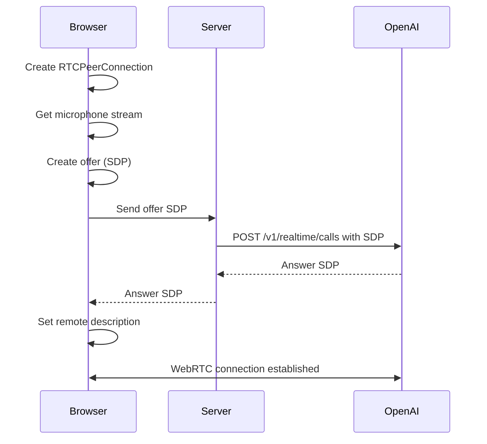

# WebRTC Implementation

## Introduction

WebRTC (Web Real-Time Communication) provides the foundation for low-latency voice chat with the OpenAI Realtime API. Unlike WebSocket-based approaches that require manual audio handling, WebRTC abstracts away codec negotiation, packet loss recovery, and adaptive bitrate—letting you focus on the user experience.

This lesson covers the WebRTC primitives needed for voice chat: RTCPeerConnection setup, microphone permission handling, connection status display, and using data channels for events.

### What We'll Cover

- RTCPeerConnection fundamentals
- Session Description Protocol (SDP) exchange
- Microphone permission UI patterns
- Connection status monitoring
- Data channels for events
- Error handling and recovery

### Prerequisites

- [Realtime API UI Patterns](./01-realtime-api-ui-patterns.md)
- Basic understanding of async/await
- Familiarity with browser permissions

---

## RTCPeerConnection Fundamentals

### Core Concepts

WebRTC uses several key concepts for establishing connections:

| Concept | Description |
|---------|-------------|
| **RTCPeerConnection** | Main interface for managing the connection |
| **SDP (Session Description Protocol)** | Format for describing media capabilities |
| **ICE (Interactive Connectivity Establishment)** | NAT traversal and connection establishment |
| **MediaStream** | Container for audio/video tracks |
| **RTCDataChannel** | Bidirectional data messaging |

### Connection Flow



---

## Basic WebRTC Setup

### Creating a Peer Connection

```typescript
async function createRealtimeConnection(ephemeralKey: string) {
  // Create peer connection
  const pc = new RTCPeerConnection();
  
  // Set up audio playback for AI responses
  const audioElement = document.createElement('audio');
  audioElement.autoplay = true;
  
  pc.ontrack = (event) => {
    audioElement.srcObject = event.streams[0];
  };
  
  // Add local audio track (microphone)
  const micStream = await navigator.mediaDevices.getUserMedia({
    audio: true,
  });
  pc.addTrack(micStream.getTracks()[0]);
  
  // Create data channel for events
  const dataChannel = pc.createDataChannel('oai-events');
  
  // Create and send offer
  const offer = await pc.createOffer();
  await pc.setLocalDescription(offer);
  
  // Exchange SDP with OpenAI (via your server)
  const sdpResponse = await fetch('/api/realtime/session', {
    method: 'POST',
    body: offer.sdp,
    headers: { 'Content-Type': 'application/sdp' },
  });
  
  const answerSdp = await sdpResponse.text();
  await pc.setRemoteDescription({
    type: 'answer',
    sdp: answerSdp,
  });
  
  return { pc, dataChannel, audioElement, micStream };
}
```

### Server-Side SDP Exchange

```typescript
// api/realtime/session/route.ts
import { NextRequest } from 'next/server';

export async function POST(req: NextRequest) {
  const offerSdp = await req.text();
  
  const formData = new FormData();
  formData.set('sdp', offerSdp);
  formData.set('session', JSON.stringify({
    type: 'realtime',
    model: 'gpt-realtime',
    audio: { output: { voice: 'alloy' } },
  }));
  
  const response = await fetch('https://api.openai.com/v1/realtime/calls', {
    method: 'POST',
    headers: {
      Authorization: `Bearer ${process.env.OPENAI_API_KEY}`,
    },
    body: formData,
  });
  
  const answerSdp = await response.text();
  
  return new Response(answerSdp, {
    headers: { 'Content-Type': 'application/sdp' },
  });
}
```

---

## Microphone Permission Handling

### Permission States

```typescript
type PermissionState = 'prompt' | 'granted' | 'denied' | 'unavailable';

async function checkMicrophonePermission(): Promise<PermissionState> {
  // Check if getUserMedia is available
  if (!navigator.mediaDevices?.getUserMedia) {
    return 'unavailable';
  }
  
  try {
    // Query permission status
    const permission = await navigator.permissions.query({
      name: 'microphone' as PermissionName,
    });
    
    return permission.state as PermissionState;
  } catch {
    // Some browsers don't support permission query for microphone
    return 'prompt';
  }
}
```

### Permission Request UI

```tsx
interface MicPermissionProps {
  onGranted: (stream: MediaStream) => void;
  onDenied: () => void;
}

export function MicrophonePermission({ onGranted, onDenied }: MicPermissionProps) {
  const [state, setState] = useState<'idle' | 'requesting' | 'error'>('idle');
  const [error, setError] = useState<string | null>(null);
  
  async function requestMicrophone() {
    setState('requesting');
    setError(null);
    
    try {
      const stream = await navigator.mediaDevices.getUserMedia({
        audio: {
          echoCancellation: true,
          noiseSuppression: true,
          autoGainControl: true,
        },
      });
      
      onGranted(stream);
    } catch (err) {
      setState('error');
      
      if (err instanceof DOMException) {
        switch (err.name) {
          case 'NotAllowedError':
            setError('Microphone access was denied. Please allow access in your browser settings.');
            onDenied();
            break;
          case 'NotFoundError':
            setError('No microphone found. Please connect a microphone and try again.');
            break;
          case 'NotReadableError':
            setError('Microphone is in use by another application.');
            break;
          default:
            setError(`Microphone error: ${err.message}`);
        }
      }
    }
  }
  
  return (
    <div className="mic-permission">
      <div className="permission-icon">🎤</div>
      
      <h3>Microphone Access Required</h3>
      <p>
        Voice chat requires access to your microphone. 
        Your audio is streamed directly to OpenAI and is not stored.
      </p>
      
      {error && (
        <div className="permission-error">
          <span className="error-icon">⚠️</span>
          {error}
        </div>
      )}
      
      <button
        onClick={requestMicrophone}
        disabled={state === 'requesting'}
        className="permission-button"
      >
        {state === 'requesting' ? 'Requesting...' : 'Enable Microphone'}
      </button>
      
      {state === 'error' && (
        <a 
          href="https://support.google.com/chrome/answer/2693767"
          target="_blank"
          rel="noopener noreferrer"
          className="help-link"
        >
          How to enable microphone permissions
        </a>
      )}
    </div>
  );
}
```

```css
.mic-permission {
  display: flex;
  flex-direction: column;
  align-items: center;
  text-align: center;
  padding: 40px;
  background: #f8fafc;
  border-radius: 16px;
  max-width: 400px;
  margin: 0 auto;
}

.permission-icon {
  font-size: 3rem;
  margin-bottom: 16px;
}

.mic-permission h3 {
  margin: 0 0 8px;
  font-size: 1.25rem;
  color: #1e293b;
}

.mic-permission p {
  margin: 0 0 24px;
  color: #64748b;
  font-size: 0.875rem;
}

.permission-error {
  display: flex;
  align-items: center;
  gap: 8px;
  padding: 12px 16px;
  background: #fef2f2;
  border: 1px solid #fecaca;
  border-radius: 8px;
  color: #dc2626;
  font-size: 0.875rem;
  margin-bottom: 16px;
  text-align: left;
}

.permission-button {
  padding: 12px 24px;
  background: #3b82f6;
  color: white;
  border: none;
  border-radius: 8px;
  font-size: 1rem;
  font-weight: 500;
  cursor: pointer;
  transition: background 0.2s;
}

.permission-button:hover:not(:disabled) {
  background: #2563eb;
}

.permission-button:disabled {
  background: #94a3b8;
  cursor: not-allowed;
}

.help-link {
  margin-top: 16px;
  color: #3b82f6;
  font-size: 0.875rem;
}
```

---

## Connection Status Monitoring

### RTCPeerConnection States

```typescript
interface ConnectionState {
  connection: RTCPeerConnectionState;
  ice: RTCIceConnectionState;
  signaling: RTCSignalingState;
}

function useConnectionState(pc: RTCPeerConnection | null) {
  const [state, setState] = useState<ConnectionState>({
    connection: 'new',
    ice: 'new',
    signaling: 'stable',
  });
  
  useEffect(() => {
    if (!pc) return;
    
    function updateState() {
      setState({
        connection: pc.connectionState,
        ice: pc.iceConnectionState,
        signaling: pc.signalingState,
      });
    }
    
    pc.addEventListener('connectionstatechange', updateState);
    pc.addEventListener('iceconnectionstatechange', updateState);
    pc.addEventListener('signalingstatechange', updateState);
    
    updateState();
    
    return () => {
      pc.removeEventListener('connectionstatechange', updateState);
      pc.removeEventListener('iceconnectionstatechange', updateState);
      pc.removeEventListener('signalingstatechange', updateState);
    };
  }, [pc]);
  
  return state;
}
```

### Connection Status Component

```tsx
interface ConnectionIndicatorProps {
  pc: RTCPeerConnection | null;
}

export function ConnectionIndicator({ pc }: ConnectionIndicatorProps) {
  const state = useConnectionState(pc);
  
  const statusConfig: Record<RTCPeerConnectionState, {
    color: string;
    label: string;
    icon: string;
  }> = {
    new: { color: '#94a3b8', label: 'Initializing', icon: '⚪' },
    connecting: { color: '#f59e0b', label: 'Connecting', icon: '🟡' },
    connected: { color: '#22c55e', label: 'Connected', icon: '🟢' },
    disconnected: { color: '#f59e0b', label: 'Reconnecting', icon: '🟠' },
    failed: { color: '#ef4444', label: 'Connection failed', icon: '🔴' },
    closed: { color: '#94a3b8', label: 'Disconnected', icon: '⚫' },
  };
  
  const config = statusConfig[state.connection];
  
  return (
    <div className="connection-indicator">
      <span className="status-icon">{config.icon}</span>
      <span className="status-label" style={{ color: config.color }}>
        {config.label}
      </span>
      
      {state.connection === 'connecting' && (
        <span className="ice-state">
          ICE: {state.ice}
        </span>
      )}
    </div>
  );
}
```

### Handling Connection Failures

```typescript
function setupConnectionRecovery(
  pc: RTCPeerConnection,
  onReconnect: () => Promise<void>
) {
  let reconnectAttempts = 0;
  const maxAttempts = 3;
  
  pc.addEventListener('connectionstatechange', async () => {
    switch (pc.connectionState) {
      case 'disconnected':
        console.log('Connection lost, waiting for recovery...');
        // WebRTC may recover automatically
        break;
        
      case 'failed':
        if (reconnectAttempts < maxAttempts) {
          reconnectAttempts++;
          console.log(`Reconnecting (attempt ${reconnectAttempts}/${maxAttempts})...`);
          
          try {
            await onReconnect();
            reconnectAttempts = 0;
          } catch (error) {
            console.error('Reconnection failed:', error);
          }
        } else {
          console.error('Max reconnection attempts reached');
        }
        break;
        
      case 'connected':
        reconnectAttempts = 0;
        break;
    }
  });
  
  pc.addEventListener('iceconnectionstatechange', () => {
    if (pc.iceConnectionState === 'failed') {
      // ICE restart might help
      pc.restartIce();
    }
  });
}
```

---

## Data Channels for Events

### Setting Up the Data Channel

```typescript
interface RealtimeEvent {
  type: string;
  [key: string]: unknown;
}

function setupDataChannel(
  dc: RTCDataChannel,
  onEvent: (event: RealtimeEvent) => void
) {
  dc.addEventListener('open', () => {
    console.log('Data channel opened');
  });
  
  dc.addEventListener('close', () => {
    console.log('Data channel closed');
  });
  
  dc.addEventListener('error', (event) => {
    console.error('Data channel error:', event);
  });
  
  dc.addEventListener('message', (event) => {
    try {
      const realtimeEvent = JSON.parse(event.data) as RealtimeEvent;
      onEvent(realtimeEvent);
    } catch (error) {
      console.error('Failed to parse event:', error);
    }
  });
}

function sendEvent(dc: RTCDataChannel, event: RealtimeEvent) {
  if (dc.readyState === 'open') {
    dc.send(JSON.stringify(event));
  } else {
    console.warn('Data channel not open, event not sent:', event.type);
  }
}
```

### Common Event Types

```typescript
// Sending a text message
sendEvent(dataChannel, {
  type: 'conversation.item.create',
  item: {
    type: 'message',
    role: 'user',
    content: [{
      type: 'input_text',
      text: 'Hello, how are you?',
    }],
  },
});

// Triggering a response
sendEvent(dataChannel, {
  type: 'response.create',
});

// Handling server events
function handleRealtimeEvent(event: RealtimeEvent) {
  switch (event.type) {
    case 'session.created':
      console.log('Session created');
      break;
      
    case 'conversation.item.created':
      console.log('New item:', event.item);
      break;
      
    case 'response.audio_transcript.delta':
      console.log('Transcript delta:', event.delta);
      break;
      
    case 'response.done':
      console.log('Response complete');
      break;
      
    case 'error':
      console.error('Server error:', event.error);
      break;
      
    default:
      console.log('Unhandled event:', event.type);
  }
}
```

---

## Complete Voice Chat Hook

```typescript
interface VoiceChatState {
  status: 'idle' | 'connecting' | 'connected' | 'error';
  error: Error | null;
  transcript: string;
}

interface VoiceChatActions {
  connect: () => Promise<void>;
  disconnect: () => void;
  sendText: (text: string) => void;
}

function useVoiceChat(): [VoiceChatState, VoiceChatActions] {
  const [state, setState] = useState<VoiceChatState>({
    status: 'idle',
    error: null,
    transcript: '',
  });
  
  const pcRef = useRef<RTCPeerConnection | null>(null);
  const dcRef = useRef<RTCDataChannel | null>(null);
  const audioRef = useRef<HTMLAudioElement | null>(null);
  const streamRef = useRef<MediaStream | null>(null);
  
  async function connect() {
    setState(s => ({ ...s, status: 'connecting', error: null }));
    
    try {
      // Get ephemeral token
      const tokenResponse = await fetch('/api/realtime/token');
      const { value: ephemeralKey } = await tokenResponse.json();
      
      // Create peer connection
      const pc = new RTCPeerConnection();
      pcRef.current = pc;
      
      // Audio playback
      const audio = document.createElement('audio');
      audio.autoplay = true;
      audioRef.current = audio;
      
      pc.ontrack = (e) => {
        audio.srcObject = e.streams[0];
      };
      
      // Microphone
      const stream = await navigator.mediaDevices.getUserMedia({
        audio: {
          echoCancellation: true,
          noiseSuppression: true,
        },
      });
      streamRef.current = stream;
      pc.addTrack(stream.getTracks()[0]);
      
      // Data channel
      const dc = pc.createDataChannel('oai-events');
      dcRef.current = dc;
      
      dc.onmessage = (e) => {
        const event = JSON.parse(e.data);
        
        if (event.type === 'response.audio_transcript.delta') {
          setState(s => ({
            ...s,
            transcript: s.transcript + event.delta,
          }));
        }
        
        if (event.type === 'response.done') {
          setState(s => ({ ...s, transcript: '' }));
        }
      };
      
      // SDP exchange
      const offer = await pc.createOffer();
      await pc.setLocalDescription(offer);
      
      const sdpResponse = await fetch('/api/realtime/session', {
        method: 'POST',
        body: offer.sdp,
        headers: { 'Content-Type': 'application/sdp' },
      });
      
      await pc.setRemoteDescription({
        type: 'answer',
        sdp: await sdpResponse.text(),
      });
      
      // Wait for connection
      await new Promise<void>((resolve, reject) => {
        pc.onconnectionstatechange = () => {
          if (pc.connectionState === 'connected') resolve();
          if (pc.connectionState === 'failed') reject(new Error('Connection failed'));
        };
      });
      
      setState(s => ({ ...s, status: 'connected' }));
      
    } catch (error) {
      setState(s => ({
        ...s,
        status: 'error',
        error: error instanceof Error ? error : new Error('Unknown error'),
      }));
    }
  }
  
  function disconnect() {
    streamRef.current?.getTracks().forEach(t => t.stop());
    pcRef.current?.close();
    
    setState({ status: 'idle', error: null, transcript: '' });
  }
  
  function sendText(text: string) {
    if (dcRef.current?.readyState === 'open') {
      dcRef.current.send(JSON.stringify({
        type: 'conversation.item.create',
        item: {
          type: 'message',
          role: 'user',
          content: [{ type: 'input_text', text }],
        },
      }));
      
      dcRef.current.send(JSON.stringify({
        type: 'response.create',
      }));
    }
  }
  
  useEffect(() => {
    return () => disconnect();
  }, []);
  
  return [state, { connect, disconnect, sendText }];
}
```

---

## Summary

✅ RTCPeerConnection manages WebRTC connections with ICE/SDP negotiation

✅ Microphone permissions require careful UX with clear error messages

✅ Connection states (new, connecting, connected, failed) need visual feedback

✅ Data channels enable bidirectional event messaging alongside audio

✅ Always clean up streams and connections on disconnect

**Previous:** [Realtime API UI Patterns](./01-realtime-api-ui-patterns.md) | **Next:** [Agents SDK Voice Integration](./03-agents-sdk-voice.md)

---

## Further Reading

- [MDN RTCPeerConnection](https://developer.mozilla.org/en-US/docs/Web/API/RTCPeerConnection) — Connection API
- [MDN RTCDataChannel](https://developer.mozilla.org/en-US/docs/Web/API/RTCDataChannel) — Data channels
- [OpenAI Realtime WebRTC](https://platform.openai.com/docs/guides/realtime-webrtc) — Connection guide
- [WebRTC Samples](https://webrtc.github.io/samples/) — Code examples

---

<!-- 
Sources Consulted:
- MDN WebRTC API: https://developer.mozilla.org/en-US/docs/Web/API/WebRTC_API
- OpenAI Realtime WebRTC: https://platform.openai.com/docs/guides/realtime-webrtc
- MDN getUserMedia: https://developer.mozilla.org/en-US/docs/Web/API/MediaDevices/getUserMedia
-->
