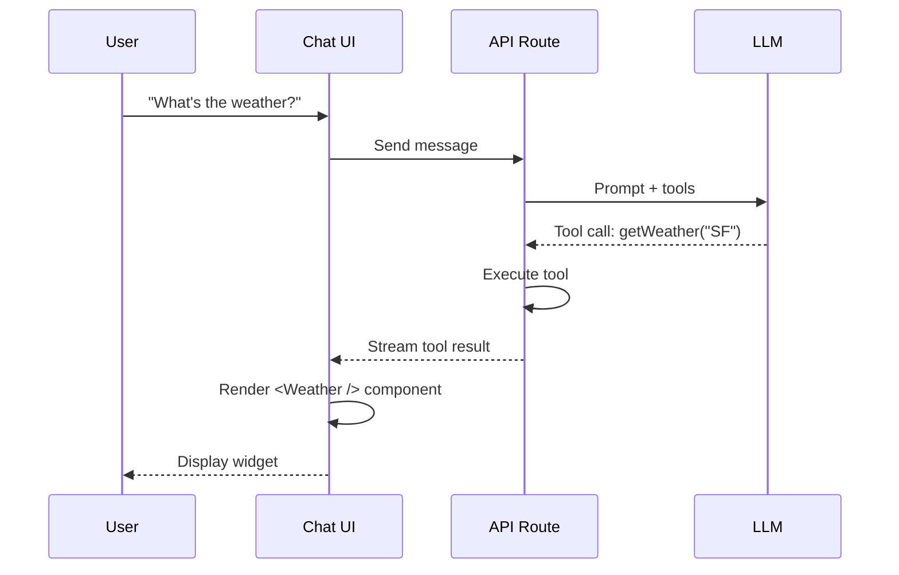

# Generative UI & Component Streaming

## Introduction

Generative UI takes AI-powered chat beyond text responses. Instead of just returning plain text, the model can trigger the rendering of rich React components—weather widgets, stock charts, booking forms, and more. This creates engaging, AI-native experiences where the interface adapts dynamically to user needs.

At its core, generative UI connects **tool calls** to **React components**. When the model decides to use a tool, the result is rendered as an interactive component rather than raw data.

### What We'll Cover in This Lesson

- What generative UI means and why it matters
- Two approaches: AI SDK UI vs AI SDK RSC
- Tool-based component rendering fundamentals
- Quick start with a weather widget example

### Prerequisites

- [AI SDK Integration (useChat)](./15-ai-sdk-integration-usechat/)
- Understanding of tool/function calling
- React component fundamentals

---

## What Is Generative UI?

Traditional chatbots return text. Generative UI allows the model to return **React components**.

```
User: "What's the weather in San Francisco?"

Traditional Response:
"The weather in San Francisco is 72°F and sunny."

Generative UI Response:
┌─────────────────────────────┐
│ 🌤️ San Francisco           │
│ 72°F — Sunny                │
│ ▁▂▃▅▆▇ 7am-1pm forecast     │
└─────────────────────────────┘
```

### How It Works



The model acts as a **dynamic router**, deciding when to show rich UI based on context.

---

## Two Approaches in AI SDK

AI SDK offers two ways to build generative UI:

| Approach | Package | Best For |
|----------|---------|----------|
| **AI SDK UI** | `@ai-sdk/react` | Production apps, typed tool parts |
| **AI SDK RSC** | `@ai-sdk/rsc` | Experimental, server-streamed components |

### AI SDK UI (Recommended)

Uses `useChat` with typed tool parts. Components render client-side based on tool results.

```tsx
// Tool part in message.parts
if (part.type === 'tool-displayWeather') {
  return <WeatherCard {...part.output} />;
}
```

**Pros:**
- Production-ready
- Full TypeScript support
- Works with any React framework

### AI SDK RSC (Experimental)

Uses `streamUI` to stream actual React Server Components from the server.

```tsx
const result = await streamUI({
  model: openai('gpt-4o'),
  tools: {
    getWeather: {
      generate: async function* ({ location }) {
        yield <LoadingSpinner />;
        const data = await fetchWeather(location);
        return <WeatherCard {...data} />;
      },
    },
  },
});
```

**Pros:**
- Stream components during async operations
- Generator functions for loading states

**Cons:**
- Experimental status
- Next.js App Router only

> **Note:** This lesson series covers both approaches. AI SDK UI is recommended for production.

---

## Tool-Based Component Rendering

The key pattern: **tools return data, you render components**.

### Defining a Tool

```typescript
// ai/tools.ts
import { tool } from 'ai';
import { z } from 'zod';

export const weatherTool = tool({
  description: 'Display weather for a location',
  inputSchema: z.object({
    location: z.string().describe('City name'),
  }),
  execute: async ({ location }) => {
    // Fetch real data or simulate
    const data = await fetchWeather(location);
    return {
      location,
      temperature: data.temp,
      condition: data.condition,
      forecast: data.forecast,
    };
  },
});

export const tools = {
  displayWeather: weatherTool,
};
```

### Server Route

```typescript
// app/api/chat/route.ts
import { streamText, convertToModelMessages, UIMessage } from 'ai';
import { tools } from '@/ai/tools';

export async function POST(request: Request) {
  const { messages }: { messages: UIMessage[] } = await request.json();

  const result = streamText({
    model: openai('gpt-4o'),
    messages: await convertToModelMessages(messages),
    tools,
  });

  return result.toUIMessageStreamResponse();
}
```

### Rendering Tool Results

```tsx
// app/page.tsx
'use client';

import { useChat } from '@ai-sdk/react';
import { WeatherCard } from '@/components/weather-card';

export default function Chat() {
  const { messages, sendMessage } = useChat();

  return (
    <div>
      {messages.map((message) => (
        <div key={message.id}>
          {message.parts.map((part, i) => {
            // Text content
            if (part.type === 'text') {
              return <p key={i}>{part.text}</p>;
            }

            // Tool result → Component
            if (part.type === 'tool-displayWeather') {
              if (part.state === 'output-available') {
                return <WeatherCard key={i} {...part.output} />;
              }
              if (part.state === 'input-available') {
                return <div key={i}>Loading weather...</div>;
              }
            }

            return null;
          })}
        </div>
      ))}
    </div>
  );
}
```

---

## Tool Part States

Tool parts progress through states as they execute:

| State | Description | UI Action |
|-------|-------------|-----------|
| `input-streaming` | Tool input being generated | Show skeleton |
| `input-available` | Input ready, executing | Show loading |
| `output-available` | Result ready | Render component |
| `output-error` | Execution failed | Show error |
| `approval-requested` | Needs user approval | Show confirm dialog |

```tsx
switch (part.state) {
  case 'input-streaming':
    return <Skeleton />;
  case 'input-available':
    return <Loading>Fetching {part.input.location}...</Loading>;
  case 'output-available':
    return <WeatherCard {...part.output} />;
  case 'output-error':
    return <ErrorMessage>{part.errorText}</ErrorMessage>;
}
```

---

## Quick Start Example

A complete minimal example:

### 1. Define Tool

```typescript
// ai/tools.ts
import { tool } from 'ai';
import { z } from 'zod';

export const tools = {
  showStock: tool({
    description: 'Show stock price for a ticker',
    inputSchema: z.object({
      symbol: z.string().describe('Stock ticker symbol'),
    }),
    execute: async ({ symbol }) => ({
      symbol: symbol.toUpperCase(),
      price: (Math.random() * 500 + 50).toFixed(2),
      change: (Math.random() * 10 - 5).toFixed(2),
    }),
  }),
};
```

### 2. API Route

```typescript
// app/api/chat/route.ts
import { streamText, convertToModelMessages, UIMessage } from 'ai';
import { openai } from '@ai-sdk/openai';
import { tools } from '@/ai/tools';

export async function POST(req: Request) {
  const { messages }: { messages: UIMessage[] } = await req.json();

  const result = streamText({
    model: openai('gpt-4o'),
    system: 'You help users check stock prices. Use the showStock tool when asked about stocks.',
    messages: await convertToModelMessages(messages),
    tools,
  });

  return result.toUIMessageStreamResponse();
}
```

### 3. Stock Component

```tsx
// components/stock-card.tsx
interface StockCardProps {
  symbol: string;
  price: string;
  change: string;
}

export function StockCard({ symbol, price, change }: StockCardProps) {
  const isPositive = parseFloat(change) >= 0;

  return (
    <div className="stock-card">
      <div className="stock-symbol">{symbol}</div>
      <div className="stock-price">${price}</div>
      <div className={`stock-change ${isPositive ? 'positive' : 'negative'}`}>
        {isPositive ? '↑' : '↓'} {Math.abs(parseFloat(change))}%
      </div>
    </div>
  );
}
```

### 4. Chat Page

```tsx
// app/page.tsx
'use client';

import { useChat } from '@ai-sdk/react';
import { useState } from 'react';
import { StockCard } from '@/components/stock-card';

export default function Page() {
  const [input, setInput] = useState('');
  const { messages, sendMessage } = useChat();

  return (
    <div className="chat-container">
      {messages.map((message) => (
        <div key={message.id} className={`message ${message.role}`}>
          {message.parts.map((part, i) => {
            if (part.type === 'text') {
              return <span key={i}>{part.text}</span>;
            }

            if (part.type === 'tool-showStock') {
              switch (part.state) {
                case 'input-available':
                  return <div key={i}>Looking up {part.input.symbol}...</div>;
                case 'output-available':
                  return <StockCard key={i} {...part.output} />;
                case 'output-error':
                  return <div key={i}>Error: {part.errorText}</div>;
              }
            }

            return null;
          })}
        </div>
      ))}

      <form
        onSubmit={(e) => {
          e.preventDefault();
          sendMessage({ text: input });
          setInput('');
        }}
      >
        <input
          value={input}
          onChange={(e) => setInput(e.target.value)}
          placeholder="Ask about a stock..."
        />
        <button type="submit">Send</button>
      </form>
    </div>
  );
}
```

---

## Lesson Structure

This lesson folder covers generative UI comprehensively:

| File | Topic |
|------|-------|
| [01-streaming-react-components](./01-streaming-react-components.md) | Tool parts, streaming, dynamic rendering |
| [02-artifact-display-patterns](./02-artifact-display-patterns.md) | Claude-style artifacts, versioning, export |
| [03-server-side-generation](./03-server-side-generation.md) | streamUI, createStreamableUI, RSC patterns |
| [04-interactive-generated-components](./04-interactive-generated-components.md) | User interactions, approval flows |
| [05-generative-ui-use-cases](./05-generative-ui-use-cases.md) | Forms, charts, booking widgets |
| [06-implementation-patterns](./06-implementation-patterns.md) | Component registry, fallbacks, hydration |

---

## Summary

✅ Generative UI renders React components from tool results, not just text

✅ AI SDK UI uses typed tool parts with `useChat` (production-ready)

✅ AI SDK RSC uses `streamUI` for server-streamed components (experimental)

✅ Tools define the data, components define the presentation

✅ Tool parts have states: streaming → available → output/error

**Next:** [Streaming React Components](./01-streaming-react-components.md)

---

## Further Reading

- [AI SDK Generative UI](https://ai-sdk.dev/docs/ai-sdk-ui/generative-user-interfaces) — Official guide
- [Chatbot Tool Usage](https://ai-sdk.dev/docs/ai-sdk-ui/chatbot-tool-usage) — Tool parts API
- [streamUI Reference](https://ai-sdk.dev/docs/reference/ai-sdk-rsc/stream-ui) — RSC streaming

---

<!-- 
Sources Consulted:
- AI SDK Generative UI: https://ai-sdk.dev/docs/ai-sdk-ui/generative-user-interfaces
- AI SDK Chatbot Tool Usage: https://ai-sdk.dev/docs/ai-sdk-ui/chatbot-tool-usage
- AI SDK RSC streamUI: https://ai-sdk.dev/docs/reference/ai-sdk-rsc/stream-ui
- AI SDK RSC Streaming Components: https://ai-sdk.dev/docs/ai-sdk-rsc/streaming-react-components
-->
