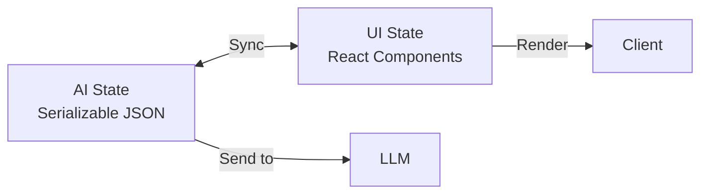

# Server-Side Component Generation

## Introduction

AI SDK RSC (React Server Components) provides an alternative approach to generative UI: streaming actual React components from the server rather than just data. Using `streamUI` and `createStreamableUI`, you can yield loading states, await async operations, and return rich components—all from Server Actions.

> **Warning:** AI SDK RSC is currently experimental. For production applications, AI SDK UI with typed tool parts is recommended.

### What We'll Cover

- The `streamUI` function for component streaming
- Generator functions for progressive rendering
- `createStreamableUI` for manual stream control
- AI State vs UI State management
- Managing state with `createAI` context

### Prerequisites

- [Generative UI Overview](./00-generative-ui-overview.md)
- Next.js App Router fundamentals
- React Server Components understanding

---

## Understanding AI SDK RSC

### How It Differs from AI SDK UI

| Aspect | AI SDK UI | AI SDK RSC |
|--------|-----------|------------|
| Component location | Client-side | Server-side (streamed) |
| Tool response | Data (JSON) | React components |
| Loading states | Client handles | `yield` from generators |
| Framework | Any React | Next.js App Router only |
| Status | Production-ready | Experimental |

### When to Use RSC

- Complex async operations with visual progress
- Components that need server-side data
- Reducing client bundle size
- Streaming long-running UI updates

---

## The streamUI Function

`streamUI` is similar to `streamText` but tools return React components instead of data:

### Basic Usage

```tsx
// app/actions.tsx
'use server';

import { streamUI } from '@ai-sdk/rsc';
import { openai } from '@ai-sdk/openai';
import { z } from 'zod';

export async function submitMessage(message: string) {
  const result = await streamUI({
    model: openai('gpt-4o'),
    prompt: message,
    
    // Handle plain text responses
    text: ({ content }) => <div className="ai-text">{content}</div>,
    
    // Define tools that return components
    tools: {
      getWeather: {
        description: 'Get weather for a location',
        inputSchema: z.object({
          location: z.string(),
        }),
        generate: async function* ({ location }) {
          // Yield loading state
          yield <WeatherSkeleton location={location} />;
          
          // Perform async operation
          const weather = await fetchWeather(location);
          
          // Return final component
          return <WeatherCard {...weather} />;
        },
      },
    },
  });

  return result.value;
}
```

### Key Concepts

1. **`text` callback**: Handles when the model returns plain text
2. **`tools` object**: Each tool has a `generate` function returning ReactNode
3. **Generator functions**: Use `function*` to yield intermediate states
4. **`result.value`**: The streamable React component

---

## Generator Functions for Streaming

Generator functions (`function*`) allow you to yield components during async operations:

### Progressive Loading States

```tsx
tools: {
  searchFlights: {
    description: 'Search for flights',
    inputSchema: z.object({
      from: z.string(),
      to: z.string(),
      date: z.string(),
    }),
    generate: async function* ({ from, to, date }) {
      // Stage 1: Initial loading
      yield (
        <FlightSearchStatus>
          <Spinner /> Searching flights from {from} to {to}...
        </FlightSearchStatus>
      );

      // Stage 2: Fetching data
      const flights = await searchFlights(from, to, date);
      
      yield (
        <FlightSearchStatus>
          <CheckIcon /> Found {flights.length} flights. Loading prices...
        </FlightSearchStatus>
      );

      // Stage 3: Enriching with prices
      const flightsWithPrices = await Promise.all(
        flights.map(async (flight) => ({
          ...flight,
          price: await getFlightPrice(flight.id),
        }))
      );

      // Final result
      return <FlightResults flights={flightsWithPrices} />;
    },
  },
}
```

### Streaming Updates Over Time

```tsx
generate: async function* ({ query }) {
  yield <SearchProgress status="Initializing search..." percent={0} />;

  const sources = await findSources(query);
  yield <SearchProgress status="Found sources" percent={25} />;

  const relevant = await filterRelevant(sources, query);
  yield <SearchProgress status="Analyzing content" percent={50} />;

  const summary = await summarize(relevant);
  yield <SearchProgress status="Generating response" percent={75} />;

  const finalAnswer = await generateAnswer(summary, query);
  
  return (
    <SearchResult 
      answer={finalAnswer} 
      sources={relevant} 
    />
  );
}
```

---

## Complete Server Action Example

```tsx
// app/actions.tsx
'use server';

import { streamUI } from '@ai-sdk/rsc';
import { openai } from '@ai-sdk/openai';
import { z } from 'zod';

// Components
function LoadingSpinner() {
  return (
    <div className="flex items-center gap-2 text-gray-500">
      <div className="animate-spin h-4 w-4 border-2 border-blue-500 border-t-transparent rounded-full" />
      <span>Loading...</span>
    </div>
  );
}

function WeatherCard({ location, temp, condition, icon }: {
  location: string;
  temp: number;
  condition: string;
  icon: string;
}) {
  return (
    <div className="bg-gradient-to-br from-blue-400 to-blue-600 text-white rounded-xl p-6 max-w-sm">
      <h3 className="text-lg font-semibold">{location}</h3>
      <div className="flex items-center gap-4 mt-4">
        <span className="text-5xl">{icon}</span>
        <div>
          <div className="text-4xl font-bold">{temp}°F</div>
          <div className="text-blue-100">{condition}</div>
        </div>
      </div>
    </div>
  );
}

// Simulated API
async function fetchWeather(location: string) {
  await new Promise(r => setTimeout(r, 1500));
  return {
    location,
    temp: Math.floor(Math.random() * 30) + 50,
    condition: ['Sunny', 'Cloudy', 'Rainy'][Math.floor(Math.random() * 3)],
    icon: ['☀️', '☁️', '🌧️'][Math.floor(Math.random() * 3)],
  };
}

// Server Action
export async function chat(message: string) {
  const result = await streamUI({
    model: openai('gpt-4o'),
    prompt: message,
    
    text: ({ content, done }) => (
      <div className="prose">
        {content}
        {!done && <span className="animate-pulse">▊</span>}
      </div>
    ),
    
    tools: {
      getWeather: {
        description: 'Get current weather for a city',
        inputSchema: z.object({
          location: z.string().describe('City name'),
        }),
        generate: async function* ({ location }) {
          yield (
            <div className="p-4 bg-gray-50 rounded-lg">
              <LoadingSpinner />
              <span className="ml-2">Getting weather for {location}...</span>
            </div>
          );

          const weather = await fetchWeather(location);

          return <WeatherCard {...weather} />;
        },
      },
    },
  });

  return result.value;
}
```

---

## Client Page Integration

```tsx
// app/page.tsx
'use client';

import { useState } from 'react';
import { chat } from './actions';

export default function ChatPage() {
  const [messages, setMessages] = useState<React.ReactNode[]>([]);
  const [input, setInput] = useState('');
  const [isLoading, setIsLoading] = useState(false);

  async function handleSubmit(e: React.FormEvent) {
    e.preventDefault();
    if (!input.trim() || isLoading) return;

    const userMessage = input;
    setInput('');
    setIsLoading(true);

    // Add user message
    setMessages(prev => [
      ...prev,
      <div key={Date.now()} className="user-message">{userMessage}</div>,
    ]);

    // Get AI response (streamed component)
    const response = await chat(userMessage);

    // Add AI response
    setMessages(prev => [
      ...prev,
      <div key={Date.now()} className="ai-message">{response}</div>,
    ]);

    setIsLoading(false);
  }

  return (
    <div className="chat-container">
      <div className="messages">
        {messages.map((msg, i) => (
          <div key={i}>{msg}</div>
        ))}
      </div>

      <form onSubmit={handleSubmit}>
        <input
          value={input}
          onChange={(e) => setInput(e.target.value)}
          placeholder="Ask about the weather..."
          disabled={isLoading}
        />
        <button type="submit" disabled={isLoading}>
          {isLoading ? 'Thinking...' : 'Send'}
        </button>
      </form>
    </div>
  );
}
```

---

## createStreamableUI

For more control over streaming, use `createStreamableUI`:

```tsx
import { createStreamableUI } from '@ai-sdk/rsc';

export async function processData(data: any) {
  // Create a streamable UI
  const ui = createStreamableUI(<LoadingSpinner />);

  // Start async processing
  (async () => {
    try {
      // Update the UI as processing progresses
      ui.update(<ProcessingStatus step="Validating..." />);
      await validateData(data);

      ui.update(<ProcessingStatus step="Processing..." />);
      const result = await processData(data);

      ui.update(<ProcessingStatus step="Finalizing..." />);
      await saveResult(result);

      // Mark as done with final UI
      ui.done(<SuccessMessage result={result} />);
    } catch (error) {
      // Handle errors
      ui.error(error);
    }
  })();

  // Return the streamable value immediately
  return ui.value;
}
```

### Methods

| Method | Description |
|--------|-------------|
| `update(node)` | Replace current UI with new node |
| `append(node)` | Add node after current content |
| `done(node?)` | Finalize stream with optional final node |
| `error(error)` | Signal error, caught by error boundary |

### Append Pattern

```tsx
export async function streamList(items: string[]) {
  const ui = createStreamableUI(<ul></ul>);

  (async () => {
    for (const item of items) {
      await new Promise(r => setTimeout(r, 500));
      ui.append(<li>{item}</li>);
    }
    ui.done();
  })();

  return ui.value;
}
```

---

## AI State vs UI State

RSC requires managing two types of state:

### AI State (Serializable)

- Sent to the model
- Persisted to database
- Contains message history as JSON

```typescript
type AIState = {
  messages: {
    role: 'user' | 'assistant';
    content: string;
    toolCalls?: { name: string; args: any; result: any }[];
  }[];
};
```

### UI State (React Nodes)

- Rendered on client
- Contains actual React components
- Not serializable

```typescript
type UIState = {
  id: string;
  display: React.ReactNode;
}[];
```

### The Relationship



AI State is the "source of truth" that can be converted to UI State for rendering.

---

## createAI Context

Manage AI and UI State across your app with `createAI`:

### Setup

```tsx
// app/ai.ts
import { createAI } from '@ai-sdk/rsc';
import { sendMessage } from './actions';

export type AIState = {
  messages: { role: 'user' | 'assistant'; content: string }[];
};

export type UIState = {
  id: string;
  display: React.ReactNode;
}[];

export const AI = createAI<AIState, UIState>({
  initialAIState: { messages: [] },
  initialUIState: [],
  actions: {
    sendMessage,
  },
});
```

### Wrap Your App

```tsx
// app/layout.tsx
import { AI } from './ai';

export default function RootLayout({ children }: { children: React.ReactNode }) {
  return (
    <AI>
      <html>
        <body>{children}</body>
      </html>
    </AI>
  );
}
```

### Access State

```tsx
// In client components
import { useAIState, useUIState, useActions } from '@ai-sdk/rsc';
import type { AI } from './ai';

export function ChatComponent() {
  const [aiState] = useAIState<typeof AI>();
  const [uiState, setUIState] = useUIState<typeof AI>();
  const { sendMessage } = useActions<typeof AI>();

  // ...
}
```

### Update State in Server Actions

```tsx
// app/actions.tsx
import { getMutableAIState } from '@ai-sdk/rsc';

export async function sendMessage(message: string) {
  'use server';

  const aiState = getMutableAIState();

  // Add user message
  aiState.update({
    messages: [
      ...aiState.get().messages,
      { role: 'user', content: message },
    ],
  });

  const result = await streamUI({
    // ... config
  });

  // Add assistant response
  aiState.done({
    messages: [
      ...aiState.get().messages,
      { role: 'assistant', content: result.text },
    ],
  });

  return result.value;
}
```

---

## Handling Text Streaming

The `text` callback streams text as it's generated:

```tsx
const result = await streamUI({
  model: openai('gpt-4o'),
  prompt: message,
  
  text: ({ content, done, delta }) => {
    // content: Full text so far
    // done: Whether streaming is complete
    // delta: Latest chunk
    
    return (
      <div className="ai-response">
        {content}
        {!done && <span className="cursor">|</span>}
      </div>
    );
  },
  
  tools: { /* ... */ },
});
```

### With Markdown Rendering

```tsx
text: ({ content, done }) => {
  return (
    <div className="prose">
      <ReactMarkdown>{content}</ReactMarkdown>
      {!done && <span className="animate-pulse ml-1">▊</span>}
    </div>
  );
},
```

---

## Error Handling

### In Generator Functions

```tsx
generate: async function* ({ query }) {
  try {
    yield <SearchLoading />;
    const results = await search(query);
    return <SearchResults data={results} />;
  } catch (error) {
    return (
      <ErrorCard 
        message="Search failed" 
        retry={() => {/* retry logic */}} 
      />
    );
  }
}
```

### With createStreamableUI

```tsx
const ui = createStreamableUI(<Loading />);

(async () => {
  try {
    const data = await fetchData();
    ui.done(<DataDisplay data={data} />);
  } catch (error) {
    ui.error(error); // Throws to nearest error boundary
  }
})();
```

### Error Boundaries

```tsx
// app/error.tsx
'use client';

export default function Error({
  error,
  reset,
}: {
  error: Error;
  reset: () => void;
}) {
  return (
    <div className="error-container">
      <h2>Something went wrong!</h2>
      <p>{error.message}</p>
      <button onClick={reset}>Try again</button>
    </div>
  );
}
```

---

## Summary

✅ `streamUI` enables server-streamed React components

✅ Generator functions (`function*`) yield progressive loading states

✅ `createStreamableUI` provides manual stream control with update/done/error

✅ AI State (serializable) syncs with UI State (React nodes)

✅ `createAI` provides context for state management across components

✅ Always call `.done()` to finalize streams

> **Remember:** AI SDK RSC is experimental. For production, consider AI SDK UI.

**Next:** [Interactive Generated Components](./04-interactive-generated-components.md)

---

## Further Reading

- [AI SDK RSC Overview](https://ai-sdk.dev/docs/ai-sdk-rsc/overview) — Full documentation
- [streamUI Reference](https://ai-sdk.dev/docs/reference/ai-sdk-rsc/stream-ui) — API details
- [createStreamableUI](https://ai-sdk.dev/docs/reference/ai-sdk-rsc/create-streamable-ui) — Manual streaming
- [Managing Generative UI State](https://ai-sdk.dev/docs/ai-sdk-rsc/generative-ui-state) — AI/UI state

---

<!-- 
Sources Consulted:
- AI SDK RSC streamUI: https://ai-sdk.dev/docs/reference/ai-sdk-rsc/stream-ui
- AI SDK RSC Streaming Components: https://ai-sdk.dev/docs/ai-sdk-rsc/streaming-react-components
- Managing Generative UI State: https://ai-sdk.dev/docs/ai-sdk-rsc/generative-ui-state
- createStreamableUI: https://ai-sdk.dev/docs/reference/ai-sdk-rsc/create-streamable-ui
-->
