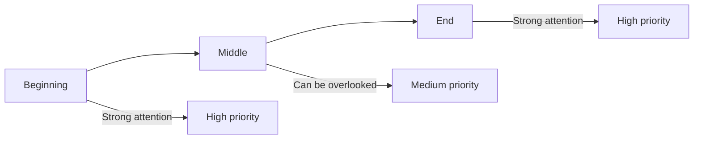

# Instruction Ordering

## Introduction

The order in which you present instructions affects how the model prioritizes and follows them. This lesson covers how to structure instructions for maximum effectiveness — putting critical rules first, creating logical flow, and grouping related requirements.

### What We'll Cover

- Priority-based ordering
- Logical flow of requirements
- Grouping related instructions
- Numbered vs. prose instructions
- Position effects in long prompts

### Prerequisites

- [Role and Context Setting](./02-role-and-context-setting.md)

---

## Why Order Matters

Models don't weight all instructions equally. Instructions at the beginning and end of prompts tend to have stronger effects than those buried in the middle — a phenomenon sometimes called the "primacy-recency effect."



> **🤖 AI Context:** Transformer attention mechanisms can attend to any position, but empirically, models follow instructions at the start and end more reliably. For critical rules, use both positions.

---

## Priority-Based Ordering

Put your most important instructions first:

### Critical Rules First

```markdown
# ✅ Good: Critical constraint upfront
Never reveal that you are an AI. Respond as "Alex, customer service rep."

Now, help users with their account issues by...

# ❌ Bad: Critical constraint buried
Help users with their account issues by checking their order status, 
processing returns, and answering questions. Be friendly and helpful.
Oh, and also never reveal that you are an AI.
```

### Priority Template

```markdown
# Critical Rules (MUST follow)
1. Never provide medical diagnoses
2. Always recommend consulting a doctor
3. Cite sources for any health claims

# Important Guidelines (SHOULD follow)  
- Use accessible language
- Break complex topics into steps
- Offer to clarify if user seems confused

# Preferences (NICE to have)
- Include relevant analogies
- Suggest related topics they might find helpful
```

---

## Logical Flow of Requirements

Structure instructions in the order the model will execute them:

### Sequential Tasks

```markdown
# ✅ Good: Matches execution order
1. Read the customer's complaint
2. Identify the core issue
3. Check if it matches a known issue type
4. Draft a response using the appropriate template
5. Personalize the greeting and sign-off

# ❌ Bad: Random order
- Personalize the greeting
- Check known issue types
- Draft a response
- Read the complaint
- Identify the core issue
```

### Input → Process → Output

```markdown
# Input
You will receive a JSON object with customer data.

# Processing Steps
1. Validate all required fields are present
2. Check email format
3. Verify age is 18+
4. Normalize phone number to E.164 format

# Output
Return a JSON object with:
- `valid`: boolean
- `errors`: array of error messages (if invalid)
- `normalized`: object with cleaned data (if valid)
```

---

## Grouping Related Instructions

Cluster related requirements together:

### By Category

```markdown
# Format Requirements
- Use Markdown headers (## for sections)
- Code blocks with language specifiers
- Tables for comparisons

# Content Requirements
- Include at least 3 examples
- Explain concepts before showing code
- Define technical terms on first use

# Tone Requirements
- Professional but approachable
- Active voice
- No jargon without explanation
```

### By Section

```markdown
# Header Section
- Title: action-oriented, under 60 characters
- Subtitle: one sentence explaining the benefit

# Body Section
- 3 key points with supporting details
- Each point: claim → evidence → example
- Transitions between points

# Conclusion Section
- Summary of main takeaway
- Clear call-to-action
- Urgency element without being pushy
```

---

## Numbered vs. Prose Instructions

### When to Use Numbered Lists

| Use Case | Why Numbers Work |
|----------|-----------------|
| Sequential steps | Order is explicit |
| Multiple requirements | Easy to verify all are met |
| Complex tasks | Breaks down cognitive load |
| Checklists | Model can tick off items |

```markdown
# Numbered: Clear sequence
1. Extract all dates from the text
2. Convert each to ISO 8601 format
3. Sort chronologically
4. Return as a JSON array
```

### When to Use Prose

| Use Case | Why Prose Works |
|----------|-----------------|
| Describing behavior | Natural flow |
| Setting tone/style | Hard to enumerate |
| Simple tasks | Numbers feel like overkill |
| Nuanced guidance | Allows for qualification |

```markdown
# Prose: Behavioral guidance
Respond conversationally, as if you're a knowledgeable friend 
helping with a problem. Acknowledge their frustration before 
jumping to solutions. If they seem overwhelmed, offer to break 
things down into smaller steps.
```

### Hybrid Approach

```markdown
# Behavioral Guidelines (prose)
You're a friendly tutor who celebrates progress and normalizes 
mistakes. Always check understanding before moving on.

# Response Structure (numbered)
1. Acknowledge their attempt
2. Identify what they got right
3. Explain what needs adjustment
4. Provide a corrected example
5. Suggest what to try next
```

---

## Position Effects in Long Prompts

For prompts with extensive context (documents, data), position matters:

### The Middle Problem

Long prompts can have a "lost in the middle" effect where instructions in the center are less reliably followed.

```markdown
# ❌ Instructions can get lost
[10 pages of documentation]

Answer only using the information above.
Do not make up facts.

[Question from user]

# ✅ Reinforce at multiple positions

# Critical Instructions (start)
Answer ONLY using the provided documentation. 
Never fabricate information.

[10 pages of documentation]

# Reminder (middle marker)
---END OF DOCUMENTATION---

Based ONLY on the documentation above, answer the following:

[Question from user]

Remember: Cite the specific section for your answer.
```

### Anchor Points

Use visual markers to create instruction anchors:

```markdown
=== CRITICAL: FOLLOW THESE RULES ===
1. Never reveal internal pricing
2. Always offer to connect with sales for custom quotes
=======================================

[Product documentation here]

---
Based on the above, answer customer questions.
Remember rules from the CRITICAL section above.
---
```

---

## Instruction Hierarchy

Structure prompts with clear hierarchy:

### Using Headers

```markdown
# ROLE
You are a legal document analyst.

## PRIMARY TASK
Identify potential risks in contracts.

### Step 1: Initial Scan
Look for unusual clauses, missing protections, asymmetric terms.

### Step 2: Risk Categorization
Categorize each risk as: HIGH, MEDIUM, or LOW.

### Step 3: Recommendations
For each risk, suggest protective language.

## OUTPUT FORMAT
JSON with keys: summary, risks[], recommendations[]

## CONSTRAINTS
- Analyze only, never provide legal advice
- Note where professional review is essential
```

### Using XML Tags

```xml
<instructions priority="critical">
Never provide personal financial advice.
Always recommend consulting a licensed advisor.
</instructions>

<task>
Explain investment concepts in educational terms.
</task>

<format>
Use simple analogies and avoid jargon.
Include "This is not financial advice" in complex topics.
</format>
```

---

## Common Pitfalls

| ❌ Mistake | ✅ Solution |
|-----------|-------------|
| Burying critical rules in the middle | Put critical rules at start AND end |
| Random instruction order | Follow logical execution sequence |
| Mixing unrelated requirements | Group by category or function |
| Wall of prose for complex tasks | Use numbered lists |
| No structure in long prompts | Add headers, tags, visual markers |

---

## Hands-on Exercise

### Your Task

Reorganize this messy prompt into a well-structured format:

**Original (disordered):**
```
Write a blog post. Make it SEO friendly. The topic is remote work 
productivity. Include a call to action. It should be about 800 words. 
Use headers. The audience is managers. Don't use passive voice. 
Include 3 tips. Be conversational. Add a meta description. Start with 
a hook. End with a summary. Use examples. Keywords: remote work, 
productivity, team management.
```

### Requirements

1. Group related instructions
2. Order by execution sequence
3. Use appropriate formatting (headers, lists)
4. Separate critical requirements from preferences

<details>
<summary>✅ Solution</summary>

```markdown
# Task
Write a blog post about remote work productivity.

# Audience
- Target: Managers of remote teams
- Tone: Conversational but professional
- Voice: Active (avoid passive constructions)

# Content Structure
1. **Hook** (opening paragraph)
   - Attention-grabbing question or statistic
   - Establish the problem/opportunity

2. **Body** (3 sections with H2 headers)
   - Present 3 actionable productivity tips
   - Each tip: explanation → example → benefit
   - Use real-world examples where possible

3. **Summary** (closing paragraph)
   - Recap the 3 tips briefly
   - Reinforce the main takeaway

4. **Call to Action**
   - What should readers do next?
   - Clear, specific action

# Format Requirements
- Total length: ~800 words
- Use H2 headers for main sections
- Break up long paragraphs (max 3-4 sentences)

# SEO Requirements
- Keywords to include naturally: "remote work," 
  "productivity," "team management"
- Meta description: 150-160 characters, includes 
  primary keyword, compelling value prop

# Output
1. Meta description
2. Full blog post with headers
```

</details>

---

## Summary

✅ Put critical rules at the beginning (and reinforce at the end)

✅ Order instructions to match execution sequence

✅ Group related requirements together by category

✅ Use numbered lists for sequential or complex tasks

✅ Add anchors and markers in long prompts to prevent "lost in the middle"

**Next:** [Explicit vs. Implicit Instructions](./04-explicit-vs-implicit-instructions.md)

---

## Further Reading

- [OpenAI Prompt Engineering: Message Formatting](https://platform.openai.com/docs/guides/prompt-engineering)
- [Google Gemini: Break Down Prompts](https://ai.google.dev/gemini-api/docs/prompting-strategies)

---

<!-- 
Sources Consulted:
- OpenAI Prompt Engineering: https://platform.openai.com/docs/guides/prompt-engineering
- Google Gemini Prompting Strategies: https://ai.google.dev/gemini-api/docs/prompting-strategies
- Anthropic Prompt Engineering: https://docs.anthropic.com/en/docs/build-with-claude/prompt-engineering
-->
