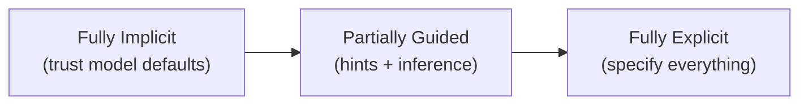
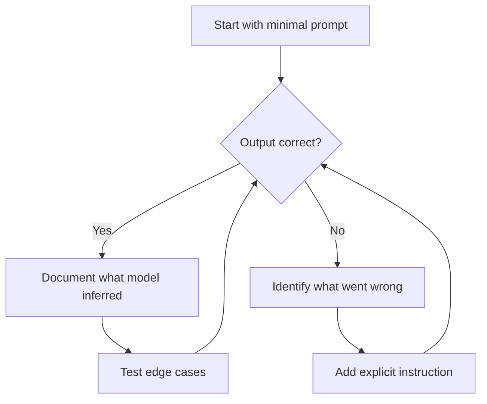

# Explicit vs. Implicit Instructions

## Introduction

When should you spell out every detail, and when can you rely on the model to infer your intent? This lesson explores the tradeoff between explicit and implicit instructions — when to be prescriptive and when to let the model use its trained understanding.

### What We'll Cover

- When explicit instructions are essential
- What models infer well (and what they don't)
- Cultural and domain assumptions
- Testing inference vs. specification

### Prerequisites

- [Instruction Ordering](./03-instruction-ordering.md)

---

## The Explicitness Spectrum

Every instruction falls somewhere on this spectrum:



| Level | Example | When to Use |
|-------|---------|-------------|
| **Implicit** | "Write a poem" | Creative exploration, flexible output |
| **Guided** | "Write a poem about autumn, with vivid imagery" | Direction + creative freedom |
| **Explicit** | "Write a 14-line Shakespearean sonnet about autumn. Use iambic pentameter, ABAB CDCD EFEF GG rhyme scheme..." | Specific requirements must be met |

---

## When Explicit Instructions Are Essential

### Safety and Compliance

Always be explicit about what the model must NOT do:

```markdown
# ✅ Explicit safety rules
IMPORTANT: Do not:
- Provide specific medical dosages
- Diagnose conditions
- Recommend stopping prescribed medications
- Claim any supplement treats/cures disease

Instead, always recommend: "Consult with your healthcare provider."

# ❌ Implicit (dangerous)
Help users with health questions. Be careful.
```

### Exact Format Requirements

When output format matters, specify precisely:

```markdown
# ✅ Explicit format
Return a JSON object with this exact structure:
{
  "name": string,
  "age": integer (not string),
  "email": string | null,
  "tags": string[] (empty array if none)
}

Do not wrap in markdown code blocks.
Do not include any text before or after the JSON.

# ❌ Implicit (risky)
Return the data as JSON.
```

### Business Logic

Never leave business rules to inference:

```markdown
# ✅ Explicit business rules
Discount calculation:
- Orders $0-49.99: No discount
- Orders $50-99.99: 10% discount
- Orders $100-199.99: 15% discount  
- Orders $200+: 20% discount
- VIP customers: Additional 5% on top of tier discount
- Discount applies to subtotal before tax

# ❌ Implicit (will vary)
Apply appropriate discounts to orders.
```

---

## What Models Infer Well

### Common Formats

Models understand standard formats without detailed explanation:

```markdown
# These work implicitly
- "Write a haiku" → 5-7-5 syllables inferred
- "Create a table comparing X and Y" → Markdown table
- "Format as a bulleted list" → Standard bullet points
- "Write a professional email" → Greeting, body, sign-off

# No need for
- "A haiku has 3 lines with 5, 7, and 5 syllables respectively"
- "Use | characters and dashes to create a markdown table"
```

### Conversational Norms

```markdown
# ✅ Works: Implicit social norms
Be a helpful customer service agent.
→ Model infers: Be polite, acknowledge concerns, offer solutions

# Unnecessary
Be a helpful customer service agent. Say hello first. 
Listen to their problem. Empathize. Then offer help.
Remain polite throughout.
```

### Domain Knowledge

Models have extensive training on common domains:

```markdown
# ✅ Works: Standard domain patterns
"Explain photosynthesis for a 5th grader"
→ Model infers: Simplify, use analogies, avoid jargon

"Review this Python code for best practices"  
→ Model infers: Check naming, structure, PEP 8, error handling

# Only specify if you need deviation from standard
"Review this Python code, but ignore PEP 8 style issues—
focus only on logic errors and security vulnerabilities"
```

---

## What Models DON'T Infer Well

### Your Specific Preferences

```markdown
# ❌ Will vary without guidance
"Write a blog post"
→ Could be 300 words or 3000 words
→ Could be formal or casual
→ Could include lists or be all prose

# ✅ Specify your preferences
"Write a blog post:
- Length: 600-800 words
- Tone: Conversational, like explaining to a smart friend
- Format: Use subheaders, include one bulleted list
- Avoid: Clichés like 'in today's fast-paced world'"
```

### Internal Terminology

```markdown
# ❌ Model can't infer your terms
"Calculate the customer's LTV and flag if below threshold."

# ✅ Define your terms
"Calculate the customer's Lifetime Value (LTV):
LTV = (Average Order Value) × (Purchase Frequency) × (Customer Lifespan in Years)

Flag customers with LTV below $500 as 'at-risk'."
```

### Recency-Dependent Information

```markdown
# ❌ Model may have outdated training
"Use the latest React syntax"
→ Model might not know React 19 features

# ✅ Specify what "latest" means
"Use React 19 syntax with:
- Server Components (default in App Router)
- use() hook for data fetching
- <Form> component for mutations"
```

---

## Cultural and Domain Assumptions

### Cultural Context

Different cultures have different defaults:

```markdown
# ❌ Implicit cultural assumptions
"Write a formal letter"
→ American formal? British formal? Japanese formal?

# ✅ Explicit cultural context
"Write a formal business letter following American conventions:
- Block format (left-aligned)
- Include date, recipient address, salutation
- Close with 'Sincerely,' or 'Best regards,'"
```

### Industry-Specific Meanings

```markdown
# ❌ Same term, different meanings
"Convert the lead"
→ Sales: Turn prospect into customer
→ Chemistry: Transform lead metal
→ Music: Arrange the main vocal part

# ✅ Explicit domain context
"In our CRM context, 'convert the lead' means:
Change lead status to 'Customer', create an account record,
and trigger the onboarding workflow."
```

### Regional Variations

```markdown
# ❌ Implicit regional defaults
"Format the address"
"Calculate the tax"
"Write the date"

# ✅ Explicit regional specs
"Format as a US address:
Name
Street Address
City, State ZIP"

"Calculate California sales tax at 7.25%"

"Write dates in MM/DD/YYYY format"
```

---

## Testing Inference vs. Specification

### The Iteration Process



### A/B Testing Explicitness

```markdown
# Version A: Implicit
Summarize this article.

# Version B: Explicit  
Summarize this article in 2-3 sentences.
Focus on the main argument, not supporting details.
Write for someone who hasn't read the article.

# Compare outputs across multiple articles
# If A consistently works: Keep it simple
# If A varies too much: Use B
```

### Document Your Findings

Keep notes on what works for your use case:

| Instruction | Implicit Works? | Notes |
|-------------|-----------------|-------|
| Response length | No | Must specify word count |
| Markdown formatting | Yes | Model uses headers, lists naturally |
| Tone | Partially | "Professional" works, but specify if formal vs friendly |
| Domain terminology | No | Always define internal terms |
| Edge case handling | No | Must specify how to handle unusual inputs |

---

## Practical Guidelines

### The Minimum Viable Specification

Include explicit instructions for:

1. **Output format** — If it must be exact (JSON, CSV, etc.)
2. **Length** — Unless any length is truly acceptable
3. **Constraints** — What NOT to do
4. **Domain terms** — Anything specific to your context
5. **Edge cases** — How to handle unusual inputs

Leave implicit:
1. **Basic language norms** — Grammar, coherence
2. **Common formats** — When flexibility is okay
3. **General knowledge** — Standard definitions, common facts

### The "Would a New Employee Know?" Test

> If a new employee in your company would need to ask for clarification, make it explicit.

```markdown
# A new employee would ask:
- "What's our standard response length?"
- "What counts as a 'priority' customer?"
- "Should I include prices in quotes?"

# A new employee would know:
- How to write a grammatically correct sentence
- That customer service should be polite
- What a bulleted list looks like
```

---

## Common Pitfalls

| ❌ Mistake | ✅ Solution |
|-----------|-------------|
| Assuming model knows your terms | Define all internal/domain terminology |
| Implicit safety rules | Always explicit about restrictions |
| "Use best practices" without specifics | Name the specific practices you want |
| Assuming cultural defaults | Specify region, industry, context |
| Over-specifying everything | Test what works implicitly first |

---

## Hands-on Exercise

### Your Task

You're building a product description generator. Analyze this prompt and identify what should be explicit vs. implicit:

**Current prompt:**
```
Write a product description for an e-commerce site.
Make it good and SEO-friendly.
```

### Requirements

1. List 5 things that MUST be made explicit
2. List 3 things that can remain implicit
3. Rewrite the prompt with appropriate explicitness

<details>
<summary>💡 Hints</summary>

- Think about what varies: length, tone, format
- What are "SEO-friendly" specifics?
- What does the model need to know about your brand?
- What standard practices can be inferred?

</details>

<details>
<summary>✅ Solution</summary>

**Must be explicit:**
1. **Product details** — What product? What are its features?
2. **Length** — 50 words? 200 words?
3. **Tone** — Luxury? Casual? Technical?
4. **SEO specifics** — What keywords? Where?
5. **Format** — Paragraphs? Bullet points? Headers?

**Can be implicit:**
1. **Grammar and coherence** — Model handles this
2. **Persuasive intent** — "Product description" implies selling
3. **Complete sentences** — Standard writing norm

**Improved prompt:**
```markdown
Write a product description for our e-commerce site.

# Product
Wireless noise-canceling headphones, $299
- 30-hour battery life
- Active noise cancellation
- Bluetooth 5.3
- Premium leather ear cushions

# Requirements
- Length: 100-150 words
- Tone: Premium but approachable (not stuffy)
- Format: One compelling paragraph, then 3-4 bullet points
  with key features
- Include keywords naturally: 
  "wireless headphones," "noise-canceling," "premium audio"

# Brand Voice
We're a premium audio brand targeting professionals who 
value quality and design. Avoid: superlatives like 
"best ever," technical jargon, price comparisons.
```

</details>

---

## Summary

✅ Be explicit about safety rules, format requirements, and business logic

✅ Models infer common formats, social norms, and domain knowledge well

✅ Always define internal terminology and cultural context

✅ Test minimal prompts first, then add specificity where needed

✅ Use the "new employee" test: If they'd ask, make it explicit

**Next:** [Positive vs. Negative Framing](./05-positive-vs-negative-framing.md)

---

## Further Reading

- [Anthropic: Be Clear and Direct](https://docs.anthropic.com/en/docs/build-with-claude/prompt-engineering/be-clear-and-direct)
- [Google Gemini: Clear and Specific Instructions](https://ai.google.dev/gemini-api/docs/prompting-strategies)

---

<!-- 
Sources Consulted:
- OpenAI Prompt Engineering: https://platform.openai.com/docs/guides/prompt-engineering
- Google Gemini Prompting Strategies: https://ai.google.dev/gemini-api/docs/prompting-strategies
- Anthropic Prompt Engineering: https://docs.anthropic.com/en/docs/build-with-claude/prompt-engineering
-->
