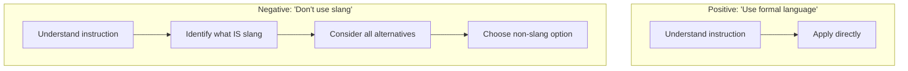
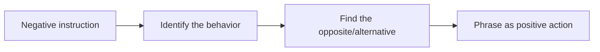

# Positive vs. Negative Framing

## Introduction

How you phrase instructions — telling the model what to DO versus what NOT to do — significantly impacts results. This lesson explores why positive framing generally works better, when negative instructions are necessary, and how to avoid common framing pitfalls.

### What We'll Cover

- "Do X" vs. "Don't do Y" effectiveness
- When negation is necessary
- Avoiding double negatives
- Reframing negative instructions positively

### Prerequisites

- [Explicit vs. Implicit Instructions](./04-explicit-vs-implicit-instructions.md)

---

## Why Positive Framing Works Better

### The Cognitive Load Problem

Negative instructions require extra processing:



The model must:
1. Understand what you DON'T want
2. Infer what you DO want
3. Choose from unlimited alternatives

### Research-Backed Guidance

From Google's Gemini prompting strategies:

> "Using examples to show patterns is more effective than anti-patterns. Showing examples of patterns to follow gives the model a direct framework for its response. Anti-patterns may be less reliable because they require the model to first understand what is wrong, and then determine the correct alternative."

---

## Side-by-Side Comparisons

### Content Style

```markdown
# ❌ Negative framing
Don't use jargon.
Don't write long sentences.
Don't be boring.

# ✅ Positive framing
Use plain language that a general audience understands.
Keep sentences under 20 words.
Engage readers with relevant examples and clear benefits.
```

### Behavior Constraints

```markdown
# ❌ Negative framing
Don't make up information.
Don't go off-topic.
Don't give personal opinions.

# ✅ Positive framing
Only state facts you can verify from the provided sources.
Stay focused on answering the user's specific question.
Present balanced, objective analysis without personal bias.
```

### Response Format

```markdown
# ❌ Negative framing
Don't use bullet points.
Don't include a conclusion.
Don't exceed 200 words.

# ✅ Positive framing
Write in flowing paragraphs.
End with the final key point (no separate conclusion).
Keep the response between 150-200 words.
```

---

## When Negation IS Necessary

Despite positive framing being generally better, some situations require explicit "don't" instructions:

### Safety-Critical Restrictions

```markdown
# Negation is appropriate for hard boundaries
DO NOT:
- Provide instructions for weapons or explosives
- Generate content sexualizing minors  
- Share personal information from the training data

These are absolute restrictions, not suggestions to phrase positively.
```

### Overriding Strong Model Tendencies

When models have strong default behaviors that conflict with your needs:

```markdown
# Model tends to apologize excessively
DO NOT start responses with apologies or caveats like 
"I apologize, but..." or "I'm sorry, I can't..."

Instead, directly state what you can help with.

# Model tends to add disclaimers
DO NOT add legal disclaimers or "consult a professional" 
notes—this is for internal documentation only.
```

### Industry Compliance

Regulatory requirements often demand explicit prohibitions:

```markdown
# Financial compliance
You MUST NOT:
- Guarantee investment returns
- Provide specific buy/sell recommendations
- Claim any information is "financial advice"

# Healthcare compliance  
You MUST NOT:
- Diagnose medical conditions
- Recommend stopping prescribed medications
- Provide specific dosage information
```

### Correcting Prior Behavior

When the model has established a pattern you want to break:

```markdown
# After model used unwanted format
STOP using bullet points. Continue with paragraphs only.

# After model went off-topic
Do NOT discuss pricing again. Focus only on features.
```

---

## Combining Positive and Negative

The most effective approach often combines both:

### The "Do This Instead" Pattern

```markdown
# Pattern: "Don't X, instead Y"

Don't use technical jargon. Instead, use analogies that 
connect technical concepts to everyday experiences.

Don't list features. Instead, describe how each feature 
solves a specific user problem.

Don't give generic advice. Instead, ask clarifying questions
to provide personalized recommendations.
```

### The "Exception" Pattern

```markdown
# Pattern: "Do X, except when Y"

Always provide step-by-step instructions.
Exception: For experienced users asking quick questions,
give the direct answer first, then offer detailed steps.

Use formal academic tone throughout.
Exception: In the "Summary for Practitioners" section,
switch to practical, action-oriented language.
```

---

## Avoiding Double Negatives

Double negatives confuse both humans and models:

### Problematic Examples

```markdown
# ❌ Double negative
Don't avoid mentioning limitations.
Never fail to include citations.
It's not uncommon to not see this pattern.

# ✅ Clear positive
Mention limitations where relevant.
Always include citations.
This pattern is common.
```

### Hidden Double Negatives

Some double negatives are less obvious:

```markdown
# ❌ Subtle double negative
Avoid non-essential details.
Don't exclude relevant context.
Never neglect to verify sources.

# ✅ Clear alternatives
Include only essential details.
Include relevant context.
Always verify sources.
```

---

## Reframing Negative Instructions

Practice converting negative to positive framing:

| ❌ Negative | ✅ Positive Reframe |
|-------------|---------------------|
| Don't be verbose | Be concise |
| Don't use passive voice | Use active voice |
| Don't make assumptions | Ask clarifying questions |
| Don't ignore edge cases | Address edge cases explicitly |
| Don't use outdated information | Use current, verified sources |
| Don't be vague | Provide specific, concrete details |
| Don't overwhelm with options | Present 2-3 focused recommendations |
| Don't use complex words | Use simple, accessible vocabulary |

### Reframing Process



**Example walkthrough:**
1. Negative: "Don't ramble"
2. Behavior: Writing too much, going off-topic
3. Opposite: Writing the right amount, staying on topic
4. Positive: "Be concise and stay focused on the main question"

---

## Framing and Model Parameters

Positive framing can reduce the need for strict temperature settings:

```markdown
# ❌ With negative framing (needs lower temperature)
Don't be creative. Don't add flourishes. Don't embellish.
→ Might still be creative; may need temperature=0.3

# ✅ With positive framing (more consistent)
Provide only factual information from the source.
State findings directly without interpretation.
→ Works well even at temperature=0.7
```

---

## Common Pitfalls

| ❌ Mistake | ✅ Solution |
|-----------|-------------|
| All negative instructions | Convert most to positive framing |
| Vague negatives ("don't be bad") | Specific positives ("be helpful by...") |
| Double negatives | Rewrite as single positive |
| Negatives for preference | Save negatives for hard restrictions |
| Long lists of "don't" | Group restrictions, emphasize what TO do |

---

## Hands-on Exercise

### Your Task

This customer service prompt uses excessive negative framing. Rewrite it using primarily positive instructions while keeping necessary negations.

**Original (negative-heavy):**
```
You are a customer support agent. Don't be rude. Don't ignore the 
customer's question. Don't make things up if you don't know. Don't 
provide refunds without approval. Don't share internal policies. 
Don't use slang or emojis. Don't write walls of text. Don't forget 
to offer further help. Don't close the conversation abruptly.
```

### Requirements

1. Convert at least 6 instructions to positive framing
2. Keep 1-2 negations where truly necessary
3. Group related instructions
4. Maintain the same intent and coverage

<details>
<summary>💡 Hints</summary>

- "Don't be rude" → What IS the desired behavior?
- "Don't make things up" → What should they do instead?
- Which items are true safety/compliance boundaries?
- Can you group by category (tone, accuracy, format)?

</details>

<details>
<summary>✅ Solution</summary>

```markdown
# Role
You are a helpful customer support agent.

# Tone & Style
- Be warm, professional, and empathetic
- Use clear, conversational language (no slang or emojis)
- Keep responses concise—use short paragraphs and bullet 
  points for complex answers

# Handling Questions
- Address the customer's question directly and completely
- If you're unsure of an answer, say so and offer to connect
  them with a specialist who can help
- Always end by asking if there's anything else you can 
  help with

# Hard Restrictions (DO NOT)
- DO NOT provide refunds without manager approval
- DO NOT share internal policies or processes

# Closing
Ensure the customer feels heard and knows their next steps
before ending the conversation.
```

**What changed:**
- 7 negatives → positives (rude→warm, ignore→address, etc.)
- 2 true restrictions kept as negatives (refunds, policies)
- Grouped by function (tone, handling, restrictions, closing)
- Same coverage, but model has clear positive direction

</details>

---

## Summary

✅ Positive framing ("do X") generally outperforms negative ("don't Y")

✅ Negative instructions require extra inference about alternatives

✅ Keep negatives for safety rules, compliance, and overriding strong defaults

✅ Use "don't X, instead Y" pattern when negatives are needed

✅ Always eliminate double negatives — rewrite as clear positives

**Next:** [Conciseness vs. Detail Balance](./06-conciseness-vs-detail-balance.md)

---

## Further Reading

- [Google Gemini: Patterns vs Anti-patterns](https://ai.google.dev/gemini-api/docs/prompting-strategies)
- [Anthropic: Be Clear and Direct](https://docs.anthropic.com/en/docs/build-with-claude/prompt-engineering/be-clear-and-direct)

---

<!-- 
Sources Consulted:
- Google Gemini Prompting Strategies: https://ai.google.dev/gemini-api/docs/prompting-strategies
- OpenAI Prompt Engineering: https://platform.openai.com/docs/guides/prompt-engineering
- Anthropic Prompt Engineering: https://docs.anthropic.com/en/docs/build-with-claude/prompt-engineering
-->
