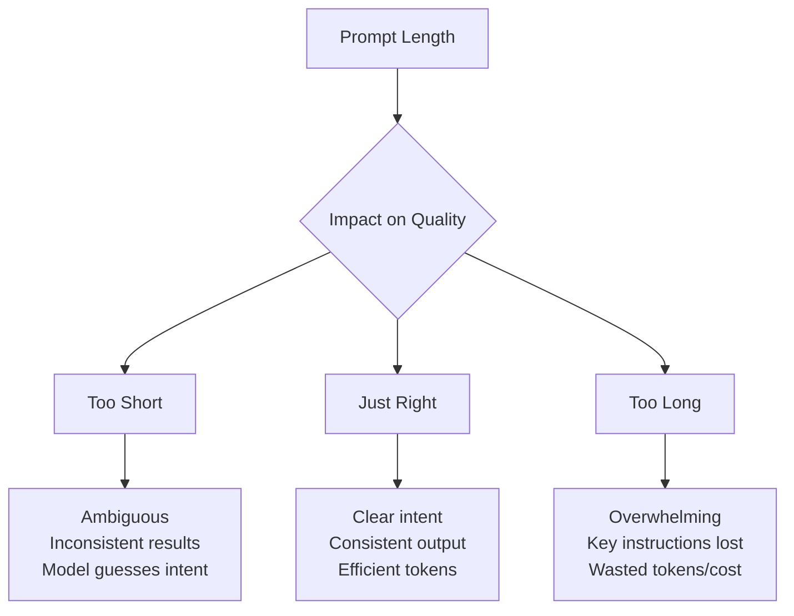
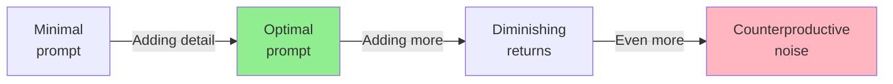

# Conciseness vs. Detail Balance

## Introduction

Prompt length matters — but not always in the way you might think. Longer isn't automatically better, and shorter isn't always clearer. This lesson explores how to find the right balance between conciseness and detail for different use cases.

### What We'll Cover

- When more detail helps vs. hurts
- The point of diminishing returns
- Identifying essential vs. optional information
- Iterative refinement techniques

### Prerequisites

- [Positive vs. Negative Framing](./05-positive-vs-negative-framing.md)

---

## The Prompt Length Tradeoff



---

## When More Detail Helps

### Complex or Unfamiliar Tasks

```markdown
# ❌ Too brief for complex task
Analyze this contract for risks.

# ✅ Appropriate detail for complex task
Analyze this contract for risks. Specifically:

1. **Liability clauses**: Identify any unlimited liability 
   or indemnification requirements
2. **Termination conditions**: Flag unusual notice periods 
   or auto-renewal traps
3. **IP ownership**: Note any clauses affecting our 
   intellectual property rights
4. **Payment terms**: Check for concerning payment 
   schedules or late penalties

For each risk found:
- Quote the relevant clause
- Explain the potential impact
- Rate severity (High/Medium/Low)
- Suggest protective language
```

### Precise Output Requirements

```markdown
# ❌ Vague format requirement
Return the data in JSON format.

# ✅ Precise format specification
Return a JSON object with this exact structure:
{
  "status": "success" | "error",
  "data": {
    "items": [
      {
        "id": string (UUID format),
        "name": string (1-100 chars),
        "price": number (2 decimal places),
        "inStock": boolean
      }
    ],
    "pagination": {
      "page": integer,
      "totalPages": integer,
      "itemsPerPage": integer
    }
  },
  "timestamp": string (ISO 8601 format)
}

Important:
- Use null for missing optional fields, not omission
- Numbers must be actual numbers, not strings
- Empty arrays for items when no results
```

### Domain-Specific Context

```markdown
# ❌ Assumes domain knowledge
Optimize this React component.

# ✅ Provides necessary domain context
Optimize this React component for performance:

Current issues:
- Re-renders on every parent update
- Fetches data in useEffect without cleanup
- Uses inline object creation in props

Apply these optimizations:
1. Wrap in React.memo() with custom comparison
2. Move data fetching to React Query or SWR
3. Memoize callback props with useCallback
4. Extract constant objects outside component

Show before/after for each change with brief explanation.
```

---

## When Brevity Works Better

### Familiar Tasks

```markdown
# ✅ Simple tasks need simple prompts
Fix the grammar in this text.

Translate this to Spanish.

Summarize in one sentence.
```

Adding detail to simple tasks can actually confuse:

```markdown
# ❌ Overthinking a simple task
Fix the grammar in this text. By grammar, I mean 
subject-verb agreement, tense consistency, punctuation, 
spelling, and syntax. Don't change the meaning or style, 
only fix actual grammatical errors. Preserve the original 
voice and don't make stylistic improvements...

# Just say:
Fix the grammar, keeping the original style.
```

### Creative Freedom

```markdown
# ✅ Room for creativity
Write a short story about an astronaut who discovers 
something unexpected on Mars.

# ❌ Over-constrained creativity
Write a short story about an astronaut (name: Sarah, age 34,
NASA mission commander) who discovers something unexpected 
(not aliens, not water, not fossils) on Mars. The story 
should be exactly 500 words, use third-person limited POV,
include exactly 3 scenes, have a melancholic but hopeful 
tone...
```

### Iterative Conversations

In multi-turn conversations, later prompts can be brief:

```markdown
# Turn 1: Detailed setup
You're a Python code reviewer. Review code for:
- PEP 8 compliance
- Security vulnerabilities  
- Performance issues
- Test coverage gaps
[long code block]

# Turn 2+: Can be brief
Now check the database queries for N+1 problems.

Add type hints to the function signatures.

How would you refactor the error handling?
```

---

## Diminishing Returns

More detail helps until a point — then it hurts:



### Signs of Diminishing Returns

| Symptom | What's Happening |
|---------|------------------|
| Model starts ignoring some instructions | Too many to track |
| Output quality decreases | Confusion from conflicting guidance |
| Model summarizes your prompt back | Processing your prompt, not the task |
| Responses become generic | Lost in the details |
| Increased token costs, same quality | Wasting resources |

### Finding Your Optimal Length

```markdown
# Start minimal
Explain quantum computing.

# Add detail only if output misses the mark
Explain quantum computing for software developers 
with no physics background.

# Add more only if still needed  
Explain quantum computing for software developers 
with no physics background. Focus on practical 
implications for cryptography. Use analogies to 
classical computing concepts.

# Stop when you get consistent quality
```

---

## Identifying Essential Information

### The "Would This Change the Output?" Test

For each piece of information in your prompt, ask: If I removed this, would the output meaningfully change?

```markdown
# Essential (output depends on it)
- Target audience → Changes vocabulary, depth
- Output format → Changes structure
- Key constraints → Changes what's included/excluded
- Specific examples → Changes pattern followed

# Optional (nice but not critical)
- General encouragement ("do your best")
- Obvious implications ("be helpful")
- Redundant specifications
- Historical context not affecting output
```

### Information Hierarchy

```markdown
# Must have (always include)
You are a medical information assistant.
IMPORTANT: Never provide diagnoses or treatment advice.

# Should have (include for consistency)
Response length: 2-3 paragraphs
Tone: Informative but empathetic

# Nice to have (include if space/budget allows)
When discussing conditions, mention that symptoms vary 
and encourage consulting healthcare providers.

# Don't need (remove)
"Your goal is to help users understand health topics."
(Already implied by the role)
```

---

## Iterative Refinement Techniques

### Start Minimal, Add as Needed

```markdown
# Iteration 1: Minimal
Write a product description for wireless headphones.

→ Output too long and generic

# Iteration 2: Add constraints  
Write a 100-word product description for wireless 
headphones. Focus on sound quality and comfort.

→ Better length, but tone too formal

# Iteration 3: Refine tone
Write a 100-word product description for wireless 
headphones targeting young professionals. 
Conversational tone, focus on sound quality and comfort.

→ Good! Stop here.
```

### Identify Gaps from Output

```markdown
# Your prompt
Summarize this research paper.

# Output issues identified
- Too long (wanted 3 sentences, got 3 paragraphs)
- Included methodology details (wanted conclusions only)
- Academic tone (wanted accessible)

# Refined prompt
Summarize this research paper in exactly 3 sentences.
Focus only on key findings and implications.
Write for a general audience, avoiding technical jargon.
```

### The Compression Test

Take a working prompt and try to shorten it:

```markdown
# Original (45 words)
You are a helpful assistant that provides cooking advice.
When users ask about recipes, provide clear step-by-step
instructions. Make sure to mention any important tips or
common mistakes. Keep your responses friendly and
encouraging.

# Compressed (23 words, same quality)
You're a cooking advisor. Give clear step-by-step recipes
with tips for common mistakes. Be friendly and encouraging.

# Too compressed (8 words, quality drops)
Help with cooking. Be friendly and clear.
```

---

## Context-Appropriate Length Guidelines

| Scenario | Recommended Approach |
|----------|---------------------|
| Simple Q&A | 1-3 sentences |
| Creative writing | High-level direction, 2-5 sentences |
| Data transformation | Detailed format spec, examples |
| Code generation | Requirements + constraints + examples |
| Analysis tasks | Detailed criteria, clear output format |
| Chat personas | Role + key behaviors, refine over turns |

### Word Count Rough Guides

| Prompt Complexity | Typical Length |
|-------------------|----------------|
| Simple task | 10-30 words |
| Standard task | 50-100 words |
| Complex task | 100-300 words |
| System prompts | 200-500 words |
| Very complex (with examples) | 500-1000 words |

> **Note:** These are guidelines, not rules. A 50-word prompt that's perfect beats a 200-word prompt that's cluttered.

---

## Token Efficiency

Concise prompts aren't just clearer — they cost less:

```markdown
# Verbose version (89 tokens)
I would like you to please take the following text that 
I am about to provide and summarize it in a way that is
concise and captures the main points. The summary should
be approximately 3 sentences long and should be written
in a professional tone. Here is the text:

# Efficient version (18 tokens)
Summarize in 3 sentences, professional tone:

# Savings: 80% fewer input tokens, same output quality
```

For high-volume applications, this efficiency adds up.

---

## Common Pitfalls

| ❌ Mistake | ✅ Solution |
|-----------|-------------|
| Including everything "just in case" | Only include what affects output |
| Repeating instructions in different words | State once, clearly |
| Long preambles before the task | Task first, context after |
| Over-explaining obvious things | Trust the model's baseline knowledge |
| Under-specifying critical requirements | Always explicit on format, constraints |

---

## Hands-on Exercise

### Your Task

This prompt is too long and contains unnecessary content. Compress it to essential information only while maintaining the same output quality.

**Original (verbose):**
```
I need your help with something. I would like you to act 
as a professional email writer who is an expert at writing
business emails. I need you to write an email for me. The
email should be a follow-up email to a potential client 
named John. We had a meeting last week where we discussed 
our software product. The meeting went well and John seemed 
interested. I want to follow up to see if he has any 
questions and to try to schedule a next call. The email 
should be professional but not too formal. It should be 
relatively short because busy executives don't have time 
to read long emails. Please also make sure the email has 
a clear call to action at the end asking to schedule a 
call. The email should be well-structured and easy to read.
```

### Requirements

1. Reduce by at least 50%
2. Keep all essential information
3. Remove redundancy and obvious implications
4. Maintain the same expected output

<details>
<summary>💡 Hints</summary>

- What's implied by "professional email"?
- Is "well-structured and easy to read" necessary to state?
- Can background info be condensed?
- What's the core ask?

</details>

<details>
<summary>✅ Solution</summary>

**Compressed version (51 words, 65% reduction):**
```
Write a follow-up email to John, a potential client.

Context: Had a productive meeting last week about our 
software; he seemed interested.

Goal: Check if he has questions, schedule a follow-up call.

Tone: Professional but warm. Keep it brief—busy executive.

End with a clear CTA to schedule the call.
```

**What was removed:**
- "I need your help with something" — Obvious
- "who is an expert at writing business emails" — Implied by the task
- "The meeting went well" — Replaced with "productive"
- "should be well-structured and easy to read" — Implied
- "Please also make sure" — Unnecessary filler
- Repeated "email" references — Consolidated

**What was kept:**
- Recipient (John), relationship (potential client)
- Context (meeting, software, interested)
- Goals (questions, schedule call)
- Tone (professional, brief)
- CTA requirement

</details>

---

## Summary

✅ Add detail for complex, unfamiliar, or precision-required tasks

✅ Keep it brief for simple, creative, or conversational contexts

✅ Watch for diminishing returns — more isn't always better

✅ Use the "Would this change the output?" test for each element

✅ Start minimal, add iteratively based on actual output gaps

---

## Lesson Complete!

You've completed all lessons in **Fundamentals of Effective Prompts**.

**Key Takeaways from This Unit:**
- Be clear, specific, and direct — the "colleague test"
- Set context with roles and background information
- Order instructions by priority and logical flow
- Be explicit about what matters, trust the model for conventions
- Frame instructions positively when possible
- Balance conciseness with necessary detail

**Next Unit:** [Structured Prompting Techniques](../02-structured-prompting-techniques/)

---

## Further Reading

- [OpenAI: Prompt Engineering Best Practices](https://platform.openai.com/docs/guides/prompt-engineering)
- [Anthropic: Long Context Tips](https://docs.anthropic.com/en/docs/build-with-claude/prompt-engineering/long-context-tips)
- [Google Gemini: Prompting Strategies](https://ai.google.dev/gemini-api/docs/prompting-strategies)

---

<!-- 
Sources Consulted:
- OpenAI Prompt Engineering: https://platform.openai.com/docs/guides/prompt-engineering
- Google Gemini Prompting Strategies: https://ai.google.dev/gemini-api/docs/prompting-strategies
- Anthropic Prompt Engineering: https://docs.anthropic.com/en/docs/build-with-claude/prompt-engineering
-->
