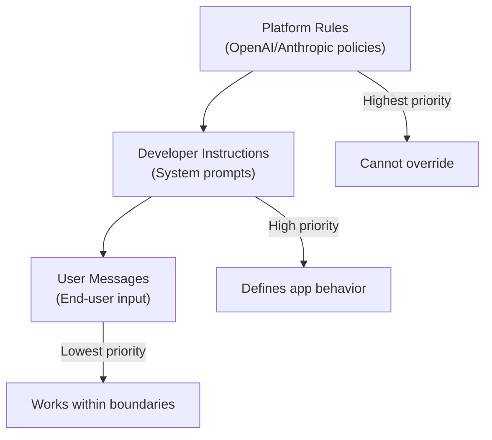

# System Prompts & Developer Messages

## Introduction

System prompts are the foundation of AI application behavior. They define who the AI is, how it should act, and what rules it must follow — separate from and prioritized above user input. This lesson covers how to design effective system prompts across different APIs and use cases.

> **🤖 AI Context:** System prompts persist across conversation turns, making them the right place for identity, constraints, and rules that should never change during a session.

### Why System Prompts Matter

- **Consistent behavior** — Users get the same AI personality every time
- **Security boundary** — Separate trusted developer instructions from untrusted user input
- **Higher priority** — Models follow system/developer instructions over conflicting user requests
- **Maintainability** — Change AI behavior without modifying application code

### The Priority Chain



---

## What We'll Cover

This lesson is divided into focused sub-lessons:

| Lesson | Topic | Key Concepts |
|--------|-------|--------------|
| [01](./01-purpose-of-system-prompts.md) | Purpose of System Prompts | Persistent behavior, separation, priority |
| [02](./02-developer-role-responses-api.md) | Developer Role (Responses API) | OpenAI `developer` role, `instructions` param |
| [03](./03-api-comparison.md) | API Comparison | System vs developer vs Claude vs Gemini |
| [04](./04-defining-persona-behavior.md) | Defining Persona & Behavior | Character, expertise, style, boundaries |
| [05](./05-response-constraints.md) | Response Constraints | Length, format, forbidden topics |
| [06](./06-tone-and-style.md) | Tone and Style | Formal/casual, technical level, consistency |
| [07](./07-safety-and-length.md) | Safety & Length Considerations | Security, token budget, caching |

---

## Prerequisites

- [Fundamentals of Effective Prompts](../01-fundamentals-of-effective-prompts/)

---

## Quick Reference: System Prompt Anatomy

```markdown
# Identity
You are [NAME], a [ROLE] specializing in [DOMAIN].

# Capabilities
You can:
- [Capability 1]
- [Capability 2]

You cannot:
- [Restriction 1]
- [Restriction 2]

# Communication Style
- [Tone guideline]
- [Format preference]
- [Language level]

# Response Rules
- Always: [Required behavior]
- Never: [Prohibited behavior]
- When uncertain: [Fallback behavior]

# Context (if needed)
[Background information the AI needs]
```

---

## API Quick Comparison

| Provider | Method | Parameter/Role |
|----------|--------|----------------|
| **OpenAI (Responses)** | Message role | `developer` |
| **OpenAI (Responses)** | Top-level param | `instructions` |
| **OpenAI (Chat)** | Message role | `system` |
| **Anthropic Claude** | Separate param | `system` |
| **Google Gemini** | Config param | `system_instruction` |

---

## Further Reading

- [OpenAI Text Generation Guide](https://platform.openai.com/docs/guides/text-generation)
- [Anthropic System Prompts](https://docs.anthropic.com/en/docs/build-with-claude/prompt-engineering/system-prompts)
- [Google Gemini System Instructions](https://ai.google.dev/gemini-api/docs/text-generation#system-instructions)

---

<!-- 
Sources Consulted:
- OpenAI Text Generation: https://platform.openai.com/docs/guides/text-generation
- Anthropic System Prompts: https://docs.anthropic.com/en/docs/build-with-claude/prompt-engineering/system-prompts
- Google Gemini: https://ai.google.dev/gemini-api/docs/text-generation
-->
