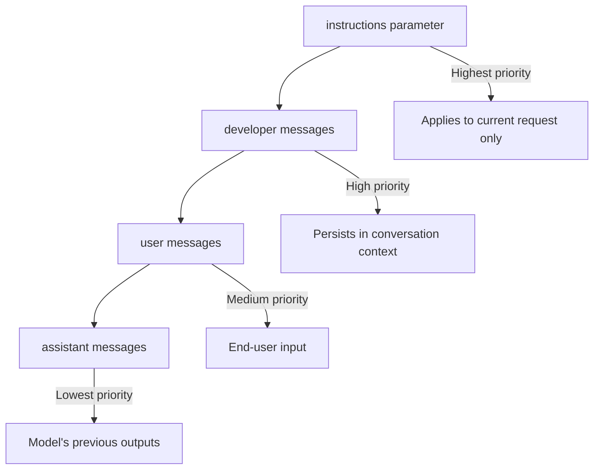

# Developer Role & Responses API

## Introduction

OpenAI's Responses API introduces the `developer` role as a clearer alternative to the traditional `system` role. Combined with the `instructions` parameter, it provides a more structured way to define AI behavior. This lesson covers how to use these features effectively.

### What We'll Cover

- The `developer` role vs. `system` role
- Using the `instructions` parameter
- Priority hierarchy in Responses API
- Practical implementation patterns

### Prerequisites

- [Purpose of System Prompts](./01-purpose-of-system-prompts.md)

---

## The Developer Role

In the Responses API, use `developer` instead of `system`:

### Basic Usage

```javascript
import OpenAI from "openai";
const client = new OpenAI();

const response = await client.responses.create({
  model: "gpt-5",
  input: [
    {
      role: "developer",
      content: "You are a helpful Python tutor. Explain concepts clearly with examples."
    },
    {
      role: "user", 
      content: "How do list comprehensions work?"
    }
  ]
});

console.log(response.output_text);
```

### Python Example

```python
from openai import OpenAI
client = OpenAI()

response = client.responses.create(
    model="gpt-5",
    input=[
        {
            "role": "developer",
            "content": "You are a helpful Python tutor. Explain concepts clearly with examples."
        },
        {
            "role": "user",
            "content": "How do list comprehensions work?"
        }
    ]
)

print(response.output_text)
```

### Why "Developer" Instead of "System"?

| Aspect | `system` (Chat Completions) | `developer` (Responses API) |
|--------|-----------------------------|-----------------------------|
| **Naming** | Generic, unclear source | Explicitly from developer |
| **Mental model** | System-level setting | Application developer's rules |
| **Trust implication** | Assumed trusted | Clearly developer-controlled |
| **Pairing** | Standalone | Works with `instructions` param |

> **🤖 AI Context:** The rename clarifies the trust model. "Developer" messages are your application's logic; "user" messages are end-user input. The model understands this distinction.

---

## The Instructions Parameter

The `instructions` parameter provides high-level guidance at the API call level:

### Basic Usage

```javascript
const response = await client.responses.create({
  model: "gpt-5",
  instructions: "Talk like a pirate. Keep responses under 100 words.",
  input: "What's the weather usually like in the Caribbean?"
});
```

### Instructions vs. Developer Messages

Both work, but they serve different purposes:

```javascript
// Using instructions parameter
const response = await client.responses.create({
  model: "gpt-5",
  instructions: "You are a helpful coding assistant.",
  input: "How do I reverse a string in Python?"
});

// Equivalent using developer message
const response = await client.responses.create({
  model: "gpt-5",
  input: [
    {
      role: "developer",
      content: "You are a helpful coding assistant."
    },
    {
      role: "user",
      content: "How do I reverse a string in Python?"
    }
  ]
});
```

### When to Use Which

| Use `instructions` When | Use `developer` Messages When |
|-------------------------|-------------------------------|
| Simple, single-purpose instructions | Complex multi-part instructions |
| Same instructions across all calls | Instructions vary per conversation |
| Quick prototyping | Production applications |
| No conversation history | Building multi-turn conversations |

---

## Priority Hierarchy

The Responses API has a clear priority order:



### Important Note on Instructions Scope

> The `instructions` parameter only applies to the current response generation request. If you are managing conversation state with the `previous_response_id` parameter, the `instructions` used on previous turns will not be present in the context.

```javascript
// Turn 1
const response1 = await client.responses.create({
  model: "gpt-5",
  instructions: "Speak in a formal tone.",  // ← Only applies to this turn
  input: "Tell me about machine learning."
});

// Turn 2 - instructions from turn 1 are NOT automatically included
const response2 = await client.responses.create({
  model: "gpt-5",
  previous_response_id: response1.id,
  instructions: "Speak in a formal tone.",  // ← Must repeat if needed
  input: "Can you give me an example?"
});
```

---

## Combining Instructions with Developer Messages

For complex applications, combine both:

```javascript
const response = await client.responses.create({
  model: "gpt-5",
  
  // High-level guidance (request-level)
  instructions: "Respond in JSON format.",
  
  // Detailed context (conversation-level)
  input: [
    {
      role: "developer",
      content: `You are a data extraction assistant.
        
Extract the following from user-provided text:
- Names (people mentioned)
- Dates (in ISO format)
- Locations (cities, countries)
- Organizations (companies, institutions)

Return as JSON with keys: names, dates, locations, organizations.
Each should be an array of strings.`
    },
    {
      role: "user",
      content: "Apple CEO Tim Cook announced the new iPhone on September 12, 2024 in Cupertino, California."
    }
  ]
});
```

**Output:**
```json
{
  "names": ["Tim Cook"],
  "dates": ["2024-09-12"],
  "locations": ["Cupertino", "California"],
  "organizations": ["Apple"]
}
```

---

## Reasoning Models and Developer Role

When using reasoning models (like o3 or GPT-5), the developer role becomes even more important:

```javascript
const response = await client.responses.create({
  model: "gpt-5",
  reasoning: { effort: "medium" },
  input: [
    {
      role: "developer",
      content: `You are a legal contract analyst.
        
Analyze contracts for:
1. Unusual liability clauses
2. Missing protections
3. Asymmetric terms

Provide risk ratings: HIGH, MEDIUM, LOW.
Cite specific clauses.`
    },
    {
      role: "user",
      content: contractText
    }
  ]
});
```

> **Note:** Reasoning models perform best when developer instructions provide high-level guidance rather than step-by-step procedures. Let the model figure out the reasoning path.

---

## Reusable Prompts

The Responses API supports reusable prompt templates:

```javascript
// Create a reusable prompt in the OpenAI dashboard
// with placeholders like {{customer_name}}

const response = await client.responses.create({
  model: "gpt-5",
  prompt: {
    id: "pmpt_abc123",         // Your prompt ID
    version: "2",              // Specific version
    variables: {
      customer_name: "Jane Doe",
      product: "Premium Subscription"
    }
  }
});
```

### Benefits of Reusable Prompts

| Benefit | Description |
|---------|-------------|
| **Version control** | Track prompt changes over time |
| **A/B testing** | Compare prompt versions with evals |
| **No code deploy** | Update prompts without changing code |
| **Collaboration** | Non-engineers can edit prompts |

---

## Migration from Chat Completions

If you're migrating from Chat Completions API:

```javascript
// OLD: Chat Completions API
const oldResponse = await client.chat.completions.create({
  model: "gpt-4",
  messages: [
    { role: "system", content: "You are a helpful assistant." },
    { role: "user", content: "Hello!" }
  ]
});

// NEW: Responses API
const newResponse = await client.responses.create({
  model: "gpt-5",
  input: [
    { role: "developer", content: "You are a helpful assistant." },
    { role: "user", content: "Hello!" }
  ]
});

// Or using instructions
const newResponse2 = await client.responses.create({
  model: "gpt-5",
  instructions: "You are a helpful assistant.",
  input: "Hello!"
});
```

---

## Common Pitfalls

| ❌ Mistake | ✅ Solution |
|-----------|-------------|
| Assuming `instructions` persists across turns | Repeat `instructions` or use `developer` messages |
| Using `system` role in Responses API | Use `developer` role instead |
| Overly detailed reasoning instructions | Provide high-level goals for reasoning models |
| Ignoring reusable prompts | Use them for production applications |

---

## Hands-on Exercise

### Your Task

Convert this Chat Completions API call to Responses API, using both:
1. The `developer` role approach
2. The `instructions` parameter approach

**Original (Chat Completions):**
```javascript
const response = await client.chat.completions.create({
  model: "gpt-4",
  messages: [
    {
      role: "system",
      content: "You are a creative writing assistant specializing in science fiction. Keep stories under 500 words. Include unexpected plot twists."
    },
    {
      role: "user",
      content: "Write a story about a robot who discovers emotions."
    }
  ]
});
```

<details>
<summary>✅ Solution</summary>

**Approach 1: Developer Role**
```javascript
const response = await client.responses.create({
  model: "gpt-5",
  input: [
    {
      role: "developer",
      content: `You are a creative writing assistant specializing 
in science fiction. Keep stories under 500 words. 
Include unexpected plot twists.`
    },
    {
      role: "user",
      content: "Write a story about a robot who discovers emotions."
    }
  ]
});
```

**Approach 2: Instructions Parameter**
```javascript
const response = await client.responses.create({
  model: "gpt-5",
  instructions: `You are a creative writing assistant specializing 
in science fiction. Keep stories under 500 words. 
Include unexpected plot twists.`,
  input: "Write a story about a robot who discovers emotions."
});
```

**Hybrid Approach (for complex needs)**
```javascript
const response = await client.responses.create({
  model: "gpt-5",
  instructions: "Keep stories under 500 words.",
  input: [
    {
      role: "developer",
      content: `You are a creative writing assistant specializing 
in science fiction. Include unexpected plot twists.`
    },
    {
      role: "user",
      content: "Write a story about a robot who discovers emotions."
    }
  ]
});
```

</details>

---

## Summary

✅ Use `developer` role instead of `system` in the Responses API

✅ The `instructions` parameter provides request-level high-level guidance

✅ `instructions` applies only to the current request — doesn't persist

✅ Combine `instructions` and `developer` messages for complex applications

✅ Reasoning models work better with high-level developer guidance

**Next:** [API Comparison](./03-api-comparison.md)

---

## Further Reading

- [OpenAI Responses API Guide](https://platform.openai.com/docs/guides/text-generation)
- [Migrate to Responses API](https://platform.openai.com/docs/guides/migrate-to-responses)
- [OpenAI Model Spec](https://model-spec.openai.com/)

---

<!-- 
Sources Consulted:
- OpenAI Text Generation: https://platform.openai.com/docs/guides/text-generation
- OpenAI Model Spec: https://model-spec.openai.com/
-->
