# API Comparison: System Prompts Across Providers

## Introduction

Different AI providers handle system prompts differently. Understanding these variations is essential for building multi-provider applications or migrating between services. This lesson compares OpenAI, Anthropic, and Google approaches.

### What We'll Cover

- OpenAI Chat Completions vs. Responses API
- Anthropic Claude's system parameter
- Google Gemini's system instructions
- Cross-provider compatibility patterns

### Prerequisites

- [Developer Role (Responses API)](./02-developer-role-responses-api.md)

---

## Overview Comparison

| Provider | API | Mechanism | Placement |
|----------|-----|-----------|-----------|
| **OpenAI** | Chat Completions | `role: "system"` | In messages array |
| **OpenAI** | Responses | `role: "developer"` | In input array |
| **OpenAI** | Responses | `instructions` | Top-level parameter |
| **Anthropic** | Messages | `system` | Separate parameter |
| **Google** | Gemini | `system_instruction` | Config parameter |

---

## OpenAI: Chat Completions API

The legacy approach using `system` role in the messages array:

```javascript
import OpenAI from "openai";
const client = new OpenAI();

const response = await client.chat.completions.create({
  model: "gpt-4o",
  messages: [
    {
      role: "system",
      content: "You are a helpful coding assistant specializing in Python."
    },
    {
      role: "user",
      content: "How do I read a CSV file?"
    }
  ]
});

console.log(response.choices[0].message.content);
```

### Python Version

```python
from openai import OpenAI
client = OpenAI()

response = client.chat.completions.create(
    model="gpt-4o",
    messages=[
        {"role": "system", "content": "You are a helpful coding assistant."},
        {"role": "user", "content": "How do I read a CSV file?"}
    ]
)

print(response.choices[0].message.content)
```

---

## OpenAI: Responses API

The newer approach with `developer` role and `instructions`:

### Using Developer Role

```javascript
const response = await client.responses.create({
  model: "gpt-5",
  input: [
    {
      role: "developer",
      content: "You are a helpful coding assistant specializing in Python."
    },
    {
      role: "user",
      content: "How do I read a CSV file?"
    }
  ]
});

console.log(response.output_text);
```

### Using Instructions Parameter

```javascript
const response = await client.responses.create({
  model: "gpt-5",
  instructions: "You are a helpful coding assistant specializing in Python.",
  input: "How do I read a CSV file?"
});

console.log(response.output_text);
```

---

## Anthropic Claude

Claude uses a **separate `system` parameter**, not a message role:

```javascript
import Anthropic from "@anthropic-ai/sdk";
const client = new Anthropic();

const response = await client.messages.create({
  model: "claude-sonnet-4-5-20250929",
  max_tokens: 2048,
  system: "You are a helpful coding assistant specializing in Python.",  // ← Separate param
  messages: [
    {
      role: "user",
      content: "How do I read a CSV file?"
    }
  ]
});

console.log(response.content[0].text);
```

### Python Version

```python
import anthropic
client = anthropic.Anthropic()

response = client.messages.create(
    model="claude-sonnet-4-5-20250929",
    max_tokens=2048,
    system="You are a helpful coding assistant specializing in Python.",
    messages=[
        {"role": "user", "content": "How do I read a CSV file?"}
    ]
)

print(response.content[0].text)
```

### Key Difference

> **Note:** In Anthropic's API, the `system` prompt is NOT part of the messages array. This is a common source of errors when migrating from OpenAI.

```javascript
// ❌ Wrong: system as a message role (OpenAI style)
messages: [
  { role: "system", content: "..." },  // This won't work with Claude!
  { role: "user", content: "..." }
]

// ✅ Correct: system as separate parameter
system: "...",
messages: [
  { role: "user", content: "..." }
]
```

---

## Google Gemini

Gemini uses `system_instruction` in the configuration:

```javascript
import { GoogleGenAI } from "@google/genai";
const client = new GoogleGenAI({ apiKey: process.env.GEMINI_API_KEY });

const response = await client.models.generateContent({
  model: "gemini-3-flash-preview",
  config: {
    systemInstruction: "You are a helpful coding assistant specializing in Python."
  },
  contents: "How do I read a CSV file?"
});

console.log(response.text);
```

### Python Version

```python
from google import genai
from google.genai import types

client = genai.Client()

response = client.models.generate_content(
    model="gemini-3-flash-preview",
    config=types.GenerateContentConfig(
        system_instruction="You are a helpful coding assistant specializing in Python."
    ),
    contents="How do I read a CSV file?"
)

print(response.text)
```

---

## Side-by-Side Comparison

Here's the same prompt implemented across all providers:

```mermaid
flowchart LR
    subgraph OpenAI_Chat["OpenAI Chat Completions"]
        A["messages: [\n  {role: 'system', ...},\n  {role: 'user', ...}\n]"]
    end
    
    subgraph OpenAI_Resp["OpenAI Responses"]
        B["instructions: '...'\n—or—\ninput: [\n  {role: 'developer', ...}\n]"]
    end
    
    subgraph Anthropic["Anthropic Claude"]
        C["system: '...'\nmessages: [\n  {role: 'user', ...}\n]"]
    end
    
    subgraph Google["Google Gemini"]
        D["config: {\n  systemInstruction: '...'\n}\ncontents: '...'"]
    end
```



---

## Cross-Provider Abstraction

When building applications that work with multiple providers, create an abstraction layer:

```javascript
// provider-agnostic.js

class AIProvider {
  async complete(systemPrompt, userMessage) {
    throw new Error("Must implement in subclass");
  }
}

class OpenAIProvider extends AIProvider {
  constructor(client) {
    super();
    this.client = client;
  }
  
  async complete(systemPrompt, userMessage) {
    const response = await this.client.responses.create({
      model: "gpt-5",
      input: [
        { role: "developer", content: systemPrompt },
        { role: "user", content: userMessage }
      ]
    });
    return response.output_text;
  }
}

class AnthropicProvider extends AIProvider {
  constructor(client) {
    super();
    this.client = client;
  }
  
  async complete(systemPrompt, userMessage) {
    const response = await this.client.messages.create({
      model: "claude-sonnet-4-5-20250929",
      max_tokens: 2048,
      system: systemPrompt,
      messages: [{ role: "user", content: userMessage }]
    });
    return response.content[0].text;
  }
}

class GeminiProvider extends AIProvider {
  constructor(client) {
    super();
    this.client = client;
  }
  
  async complete(systemPrompt, userMessage) {
    const response = await this.client.models.generateContent({
      model: "gemini-3-flash-preview",
      config: { systemInstruction: systemPrompt },
      contents: userMessage
    });
    return response.text;
  }
}

// Usage
const provider = new OpenAIProvider(openaiClient);
// const provider = new AnthropicProvider(anthropicClient);
// const provider = new GeminiProvider(geminiClient);

const result = await provider.complete(
  "You are a helpful coding assistant.",
  "How do I read a CSV file in Python?"
);
```

---

## Feature Comparison

| Feature | OpenAI Chat | OpenAI Responses | Anthropic | Gemini |
|---------|-------------|------------------|-----------|--------|
| System prompt location | Messages array | Separate + messages | Separate param | Config param |
| Role name | `system` | `developer` | N/A (param) | N/A (config) |
| Per-request override | Replace message | `instructions` param | Replace param | Replace config |
| Multi-turn persistence | In conversation | Depends on approach | Re-send each turn | Re-send each turn |
| Prompt caching | Via API | Via API | Built-in | Context caching |

---

## Common Migration Gotchas

### OpenAI → Anthropic

```javascript
// ❌ Common mistake: treating system as a message
const response = await anthropic.messages.create({
  messages: [
    { role: "system", content: "..." },  // ERROR!
    { role: "user", content: "..." }
  ]
});

// ✅ Correct
const response = await anthropic.messages.create({
  system: "...",  // System prompt goes here
  messages: [
    { role: "user", content: "..." }
  ]
});
```

### OpenAI Chat → OpenAI Responses

```javascript
// Chat Completions
response.choices[0].message.content

// Responses API
response.output_text
// or
response.output[0].content[0].text
```

### Anthropic → OpenAI

```javascript
// Anthropic: No system in messages
system: "...",
messages: [{ role: "user", content: "..." }]

// OpenAI: System IS a message
messages: [
  { role: "system", content: "..." },  // or "developer" in Responses
  { role: "user", content: "..." }
]
```

---

## When to Use Each Provider

| Use Case | Recommended | Why |
|----------|-------------|-----|
| General purpose | Any | All capable |
| Long context | Gemini, Claude | 200K-2M tokens |
| Reasoning tasks | GPT-5, Claude | Strong reasoning |
| Code generation | Any | All excellent |
| Vision tasks | All support | Varies by model |
| Cost-sensitive | Gemini Flash | Lower pricing |
| Latency-sensitive | Smaller models | Faster response |

---

## Hands-on Exercise

### Your Task

Create a cross-provider utility function that sends the same system prompt and user message to all three providers and returns their responses for comparison.

### Requirements

1. Accept system prompt, user message, and list of providers
2. Handle errors gracefully (one provider failing shouldn't stop others)
3. Return results with provider name and response (or error)

<details>
<summary>💡 Hints</summary>

- Use Promise.allSettled() for parallel execution
- Wrap each provider call in try/catch
- Return a consistent structure regardless of success/failure

</details>

<details>
<summary>✅ Solution</summary>

```javascript
async function compareProviders(systemPrompt, userMessage, providers) {
  const results = await Promise.allSettled(
    providers.map(async (provider) => {
      const response = await provider.complete(systemPrompt, userMessage);
      return {
        provider: provider.name,
        response,
        success: true
      };
    })
  );
  
  return results.map((result, index) => {
    if (result.status === "fulfilled") {
      return result.value;
    } else {
      return {
        provider: providers[index].name,
        error: result.reason.message,
        success: false
      };
    }
  });
}

// Usage
const systemPrompt = "You are a helpful assistant. Be concise.";
const userMessage = "What is the capital of France?";

const providers = [
  { name: "OpenAI", complete: (s, u) => openaiComplete(s, u) },
  { name: "Anthropic", complete: (s, u) => anthropicComplete(s, u) },
  { name: "Gemini", complete: (s, u) => geminiComplete(s, u) }
];

const results = await compareProviders(systemPrompt, userMessage, providers);
console.log(results);
// [
//   { provider: "OpenAI", response: "Paris.", success: true },
//   { provider: "Anthropic", response: "Paris is the capital of France.", success: true },
//   { provider: "Gemini", response: "Paris.", success: true }
// ]
```

</details>

---

## Summary

✅ **OpenAI Chat Completions** uses `role: "system"` in the messages array

✅ **OpenAI Responses** uses `role: "developer"` and/or `instructions` parameter

✅ **Anthropic Claude** uses a separate `system` parameter (NOT in messages)

✅ **Google Gemini** uses `system_instruction` in the config object

✅ Build abstraction layers for multi-provider applications

**Next:** [Defining Persona & Behavior](./04-defining-persona-behavior.md)

---

## Further Reading

- [OpenAI API Reference](https://platform.openai.com/docs/api-reference)
- [Anthropic Messages API](https://docs.anthropic.com/en/api/messages)
- [Google Gemini API](https://ai.google.dev/gemini-api/docs)

---

<!-- 
Sources Consulted:
- OpenAI Text Generation: https://platform.openai.com/docs/guides/text-generation
- Anthropic System Prompts: https://docs.anthropic.com/en/docs/build-with-claude/prompt-engineering/system-prompts
- Google Gemini: https://ai.google.dev/gemini-api/docs/text-generation
-->
