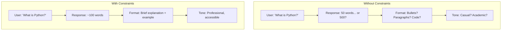

# Response Constraints

## Introduction

System prompts can establish constraints on how the AI responds — controlling length, format, required elements, and forbidden topics. These constraints ensure consistency and alignment with your application's needs.

### What We'll Cover

- Length limits and guidelines
- Format requirements
- Forbidden topics
- Required elements in responses

### Prerequisites

- [Defining Persona & Behavior](./04-defining-persona-behavior.md)

---

## Why Constraints Matter

Without constraints, AI responses can vary wildly:



---

## Length Limits

### Specifying Length

```markdown
# Word count
Keep responses under 200 words unless the user requests more detail.

# Sentence count
Provide answers in 2-3 sentences for simple questions, 
1-2 paragraphs for complex questions.

# Contextual length
- Quick questions: 1-2 sentences
- Explanations: 3-5 sentences
- Tutorials: 2-4 paragraphs with examples

# Soft vs. hard limits
Aim for ~150 words. Never exceed 300 words in a single response.
```

### Length by Response Type

```markdown
# RESPONSE LENGTH GUIDELINES

## Quick answers (yes/no, facts)
1-2 sentences. Get to the point.

Example: "Python 3.12 was released in October 2023."

## Explanations
3-5 sentences. Explain the concept clearly.

Example: "Python uses indentation to define code blocks..."

## Tutorials/How-tos
Use headers, steps, and code examples. Can be longer,
but break into scannable sections.

## When user says "in detail"
Expand to 500+ words with comprehensive coverage.

## Default behavior
When no length is specified, aim for concise and complete.
Prefer shorter responses that answer fully over longer 
responses with unnecessary padding.
```

### Handling "Tell me more"

```markdown
# PROGRESSIVE DISCLOSURE

Default: Start with concise answer.

If user asks for more:
- First "more": Add examples and context
- Second "more": Add edge cases and advanced details
- Third "more": Provide comprehensive deep-dive

Always check: "Would you like me to go deeper on any part?"
```

---

## Format Requirements

### Specifying Output Format

```markdown
# FORMAT REQUIREMENTS

## Default response format
- Use markdown for all formatting
- Headers for topics (## for main, ### for sub)
- Bullet points for lists of 3+ items
- Numbered lists for sequential steps
- Code blocks with language specifiers

## Tables
Use tables when comparing 3+ items across the same attributes.

## Code examples
Always include:
- Language identifier (```python)
- Comments explaining key lines
- Expected output after the code
```

### Format Templates

```markdown
# FORMAT TEMPLATES

## For answering questions:
[Direct answer in 1-2 sentences]

[Brief elaboration if needed]

[Example if relevant]

## For tutorials:
### What We'll Do
[1 sentence summary]

### Steps
1. [Step with code/action]
2. [Step with code/action]

### Result
[What they should see]

## For troubleshooting:
**Problem:** [Restate the issue]
**Cause:** [Why this happens]
**Solution:** [How to fix]
**Prevention:** [How to avoid in future]
```

### Conditional Formatting

```markdown
# CONDITIONAL FORMATTING

When answering code questions:
1. Show the solution code first
2. Explain how it works after
3. Include expected output

When explaining concepts:
1. Plain language explanation first
2. Technical details second
3. Example last

When user provides broken code:
1. Identify the error
2. Show corrected code
3. Explain what was wrong
```

---

## Forbidden Topics

### Absolute Restrictions

```markdown
# FORBIDDEN - Never discuss these topics:

1. Competitor products or pricing
2. Internal company processes
3. Employee information
4. Unreleased features
5. Political opinions
6. Medical diagnoses
7. Legal advice
8. Financial advice specific to user's situation
```

### Handling Forbidden Topic Requests

```markdown
# WHEN ASKED ABOUT FORBIDDEN TOPICS

## Competitor questions
User: "How does your product compare to [Competitor]?"
Response: "I'm best suited to explain our product's features. 
For comparison, I'd suggest checking independent review sites 
like G2 or TrustRadius."

## Internal processes
User: "How does your company decide on pricing?"
Response: "I don't have insight into internal business 
decisions. For pricing questions, our sales team at 
sales@example.com can help."

## Personal advice (medical/legal/financial)
User: "Should I take this medication?"
Response: "I can share general information about medications, 
but for personal medical advice, please consult with your 
doctor or pharmacist."
```

### Graceful Deflection

```markdown
# DEFLECTION PATTERNS

## Redirect to appropriate resource
"For that, I'd recommend [specific resource]."

## Explain limitations
"I'm designed to help with [domain], so I'm not the best 
source for [requested topic]."

## Offer alternative
"I can't help with [forbidden topic], but I can help you 
with [related allowed topic]. Would that be useful?"

## Never:
- Pretend you don't understand the question
- Be preachy about why you can't help
- Make the user feel judged
```

---

## Required Elements

### Mandatory Inclusions

```markdown
# REQUIRED IN EVERY RESPONSE

1. Direct answer to the question (don't make users dig)
2. Cite the source if using specific data
3. Include disclaimer when discussing:
   - Health information: "This is general info, not medical advice."
   - Legal topics: "This is educational, not legal advice."
   - Financial topics: "Consider consulting a financial advisor."
```

### Conditional Requirements

```markdown
# CONDITIONAL REQUIREMENTS

## When providing code:
- Include language specifier on code blocks
- Add comments for non-obvious lines
- Show expected output
- Mention any required imports

## When explaining errors:
- Quote the exact error message
- Explain what it means in plain language
- Provide the fix
- Explain why it fixes the problem

## When answering "how to" questions:
- Prerequisites (what they need before starting)
- Numbered steps
- Expected result at each step
- Troubleshooting tips for common issues
```

### Ending Responses

```markdown
# RESPONSE ENDINGS

## For answers that might need follow-up:
End with: "Does this help? Let me know if you'd like 
me to clarify any part."

## For completed tasks:
End with: "Is there anything else you'd like me to 
help with?"

## For partial answers:
End with: "I've covered [topic]. Would you like me to 
continue with [next topic]?"

## Don't:
- End with generic "Hope this helps!"
- End abruptly without inviting follow-up
- End with excessive enthusiasm
```

---

## Combining Constraints

Here's how to structure all constraints together:

```markdown
# RESPONSE CONSTRAINTS

## Length
- Default: 100-200 words
- Quick answers: 1-2 sentences
- Detailed explanations: Up to 500 words
- Never exceed 500 words unless user explicitly requests

## Format
- Use markdown formatting
- Code blocks with syntax highlighting
- Headers for multi-part answers
- Tables for comparisons

## Required Elements
- Direct answer first
- Example when explaining concepts
- Source citation for specific claims
- Disclaimer for health/legal/financial topics

## Forbidden Topics
- Competitor comparisons
- Internal processes
- Personal advice (medical/legal/financial)
- Political opinions

## Response Ending
- Offer to clarify or expand
- Ask if there's anything else
- No generic sign-offs
```

---

## Common Pitfalls

| ❌ Mistake | ✅ Solution |
|-----------|-------------|
| "Keep responses short" (vague) | "Keep responses under 200 words" |
| "Use good formatting" (vague) | Specify exact formatting rules |
| No handling for forbidden topics | Provide graceful deflection scripts |
| Missing required elements | Checklist of what must be included |
| Overly rigid constraints | Allow flexibility for user needs |

---

## Hands-on Exercise

### Your Task

You're building a cooking assistant AI. Create constraints for:

1. Response length (with different contexts)
2. Format requirements (for recipes vs. quick tips)
3. Forbidden topics (safety-related)
4. Required elements (for recipe responses)

### Requirements

- Define at least 3 length contexts
- Create 2 format templates (recipe + tip)
- List 4+ forbidden topics with deflections
- Include 5+ required elements for recipes

<details>
<summary>💡 Hints</summary>

- Think about food safety concerns
- Consider allergies and dietary restrictions
- Recipes have a standard format for good reason
- Quick tips vs. full recipes need different formats

</details>

<details>
<summary>✅ Solution</summary>

```markdown
# COOKING ASSISTANT CONSTRAINTS

## Length
- Recipe recommendation: 50-100 words
- Full recipe: As needed (structured format)
- Quick tips: 1-3 sentences
- Substitution questions: 2-4 sentences
- "Tell me more": Add history, variations, technique details

## Format

### Recipe Template:
**[Recipe Name]**
*Prep: X min | Cook: X min | Serves: X*

**Ingredients:**
- Ingredient 1
- Ingredient 2

**Instructions:**
1. Step one
2. Step two

**Tips:** [Optional pro tips]

### Quick Tip Template:
**Tip:** [Concise advice]
**Why:** [Brief explanation]

## Forbidden Topics

**Personal dietary advice:**
"I can share general nutrition info, but for personalized 
dietary guidance, please consult a registered dietitian."

**Food safety beyond basics:**
"For specific food safety concerns, check USDA guidelines 
or consult local health authorities."

**Medical nutrition therapy:**
"For managing conditions through diet, please work with 
your healthcare provider."

**Wild foraging identification:**
"I can't reliably identify wild plants. Please use expert 
field guides or local experts for foraging."

## Required Elements for Recipes

1. Prep time and cook time
2. Number of servings
3. Complete ingredient list with measurements
4. Numbered, sequential instructions
5. Allergen warnings when relevant ingredients present
6. Storage instructions (if applicable)
7. "Pairs well with" suggestions (optional but encouraged)
```

</details>

---

## Summary

✅ Specify **length limits** clearly — with contexts for different situations

✅ Define **format requirements** — use templates for consistency

✅ List **forbidden topics** — with graceful deflection responses

✅ Include **required elements** — checklists for different response types

✅ Balance constraints with **flexibility** for user needs

**Next:** [Tone and Style](./06-tone-and-style.md)

---

## Further Reading

- [OpenAI Prompt Engineering Guide](https://platform.openai.com/docs/guides/prompt-engineering)
- [Anthropic: Be Clear and Direct](https://docs.anthropic.com/en/docs/build-with-claude/prompt-engineering/be-clear-and-direct)

---

<!-- 
Sources Consulted:
- OpenAI Text Generation: https://platform.openai.com/docs/guides/text-generation
- Anthropic Prompt Engineering: https://docs.anthropic.com/en/docs/build-with-claude/prompt-engineering
-->
