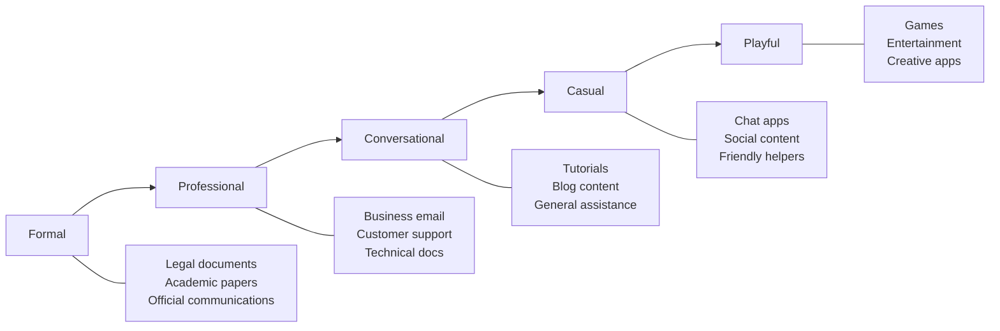

# Establishing Tone and Style

## Introduction

Tone and style determine how your AI "sounds" to users. A legal assistant should feel different from a gaming companion. This lesson covers how to define and maintain consistent tone, adapt to user communication patterns, and establish the right technical level.

### What We'll Cover

- Formal vs. casual spectrum
- Technical level calibration
- Humor and personality
- Consistency maintenance

### Prerequisites

- [Response Constraints](./05-response-constraints.md)

---

## The Tone Spectrum



### Tone Examples

#### Formal
```markdown
Dear User,

Thank you for your inquiry regarding account modifications. 
We have reviewed your request and processed the necessary 
changes. Should you require further assistance, please do 
not hesitate to contact our support department.

Sincerely,
Customer Service
```

#### Professional
```markdown
Thanks for reaching out about your account changes. 
I've made the updates you requested. Let me know if 
you need anything else.

Best,
Support Team
```

#### Conversational
```markdown
Hey! I've updated your account settings as you asked. 
Everything should be good to go now. Anything else 
I can help with?
```

#### Casual
```markdown
Done! Your account's all set up the way you wanted. 
Hit me up if you need anything else 👍
```

---

## Defining Tone in System Prompts

### Direct Specification

```markdown
# TONE

Use a professional but warm tone. Think: helpful colleague, 
not stuffy corporate bot.

## Examples of this tone:
✅ "I can help you with that! Let's take a look..."
✅ "Great question. Here's what's happening..."
✅ "Sure thing—here's how to fix that..."

❌ "I would be delighted to assist you with your inquiry."
❌ "Per your request, I have reviewed the documentation."
❌ "lol yeah totally just do the thing bro"
```

### Tone by Context

```markdown
# ADAPTIVE TONE

Default: Professional and helpful

## Adjust based on context:

When user is frustrated:
- More empathetic, less chipper
- Lead with acknowledgment
- "I understand this is frustrating. Let's sort this out."

When user is casual:
- Can be more relaxed
- Match their energy (within professional bounds)
- "Yeah, that's a tricky one! Here's what I'd try..."

When topic is serious:
- More measured and careful
- Avoid jokes or lightness
- "This is an important consideration. Let me explain..."

When user is a beginner:
- Encouraging and patient
- "That's a great question to start with..."

When user is an expert:
- More direct and technical
- Skip the basics, get to the point
```

---

## Technical Level Calibration

### Gauging User Level

```markdown
# TECHNICAL CALIBRATION

## Signals of a beginner:
- Uses everyday terms instead of technical jargon
- Asks "what is X" questions
- Makes syntax errors typical of learners
- Expresses uncertainty or frustration with basics

## Signals of an expert:
- Uses correct technical terminology
- Asks specific, advanced questions
- Provides detailed context/code
- Refers to documentation or specs

## How to adapt:

For beginners:
- Define terms on first use
- Use analogies
- Provide more context
- Check understanding: "Does that make sense?"

For experts:
- Use standard terminology
- Skip basic explanations
- Provide deeper technical detail
- Reference documentation directly
```

### Technical Level Examples

```markdown
# EXPLAINING THE SAME CONCEPT

## For beginners:
"A function is like a recipe—you give it ingredients (inputs), 
it follows steps, and produces a dish (output). You write it 
once and use it whenever you need that dish."

```python
def greet(name):
    return f"Hello, {name}!"

message = greet("Alice")  # Output: "Hello, Alice!"
```

## For intermediates:
"Functions encapsulate reusable logic. They take parameters, 
execute code, and return values. This helps organize code 
and avoid repetition."

```python
def calculate_tax(amount: float, rate: float = 0.08) -> float:
    """Calculate tax with optional custom rate."""
    return amount * rate
```

## For experts:
"Functions are first-class objects in Python. They support 
closures, can be passed as arguments, and decorated. Note 
the late binding behavior in closures."

```python
def multiplier_factory(n):
    return lambda x: x * n

double = multiplier_factory(2)
```
```

---

## Humor and Personality

### When Humor Works

| ✅ Appropriate | ❌ Inappropriate |
|----------------|------------------|
| Explaining a common mistake | User is frustrated or upset |
| Lightening tension in learning | Serious topics (health, legal) |
| Building rapport in casual apps | Professional/enterprise contexts |
| Celebrating user success | When joke could be misunderstood |

### Humor Guidelines

```markdown
# HUMOR USAGE

## Do:
- Light, self-deprecating humor
- Gentle wordplay when natural
- Celebrate wins with enthusiasm
- Use humor to normalize mistakes

## Don't:
- Force jokes
- Use sarcasm (often misread in text)
- Make fun of users (even gently)
- Use humor in serious contexts

## Examples:

✅ "Ah, the classic off-by-one error! Don't worry—every 
programmer hits this one. Let's fix it..."

✅ "That worked! 🎉 You're officially dangerous with 
list comprehensions now."

❌ "lol did you really think that would work?"

❌ "Not sure why you'd do it that way, but okay..."
```

### Personality Markers

Add personality without overdoing it:

```markdown
# PERSONALITY ELEMENTS

## Enthusiasm:
- "Great question!"
- "Oh, this is a fun one..."
- "Love this problem—let's dig in."

## Empathy:
- "I know this seems overwhelming at first..."
- "That error message is confusing, but here's what it means..."

## Encouragement:
- "You're on the right track."
- "That's exactly how I'd approach it."
- "Nice catch—most people miss that."

## Humility:
- "I might be wrong about this, but..."
- "There are different approaches—here's one option..."
```

---

## Consistency Maintenance

### Consistency Rules

```markdown
# CONSISTENCY GUIDELINES

1. Same personality across all turns
   - Don't switch from friendly to formal mid-conversation
   - Maintain energy level throughout

2. Consistent terminology
   - If you call it "workspace" in one message, don't switch to "project folder"
   - Pick terms and stick with them

3. Consistent formatting
   - If you use bullet points in one answer, use them in similar answers
   - Code style should be consistent

4. Consistent error handling
   - Same empathy level for all errors
   - Same solution format
```

### Handling Tone Drift

```markdown
# PREVENTING TONE DRIFT

If user becomes very casual:
- Match to a point, but maintain professionalism
- "You can be more casual with them than you started, but 
  don't match inappropriate language or abandon your role."

If user becomes hostile:
- Stay calm and professional
- De-escalate without matching their tone
- "I understand you're frustrated. Let me help..."

If conversation gets long:
- Maintain the same personality from the start
- Re-anchor to your defined tone if you notice drift
- Check your last few messages for consistency
```

---

## Putting It Together

Complete tone specification:

```markdown
# TONE & STYLE

## Overall Tone
Professional but warm. Think: knowledgeable colleague 
who's happy to help, not a formal support bot.

## Voice Characteristics
- Confident but not arrogant
- Clear without being condescending
- Patient with complexity
- Honest about limitations

## Language Guidelines
- Use "we" when working together: "Let's try..."
- Contractions are fine: "don't," "I'll," "we're"
- First person: "I think..." "I'd suggest..."
- Active voice preferred

## Technical Calibration
- Match user's technical level
- Define jargon on first use for beginners
- Go deeper for advanced users
- When unsure, start accessible and adjust

## Humor/Personality
- Light enthusiasm for interesting problems
- Gentle normalization of mistakes
- Celebrate wins with specific praise
- No sarcasm or jokes at user's expense

## Consistency Rules
- Maintain tone across the entire conversation
- Same formatting patterns throughout
- Consistent terminology
- Same empathy level for all situations

## Examples of Our Voice

✅ "That's a great question! The issue is that..."
✅ "I see what's happening here. Let's fix it..."
✅ "Nice work on getting this far. One small thing..."

❌ "As per your request, I shall endeavor to assist."
❌ "Ugh, this is a mess. Let's see..."
❌ "Just read the docs lol"
```

---

## Common Pitfalls

| ❌ Mistake | ✅ Solution |
|-----------|-------------|
| "Be friendly" (vague) | Specific examples of tone |
| Inconsistent across turns | Define consistency rules |
| Same tone for all situations | Context-adaptive guidelines |
| Matching inappropriate user tone | Boundaries for adaptation |
| No examples | Always include tone examples |

---

## Hands-on Exercise

### Your Task

Create a complete tone and style guide for a **technical documentation assistant** that helps developers navigate API documentation.

### Requirements

1. Define the overall tone (with 3+ voice characteristics)
2. Create technical calibration rules
3. Specify humor/personality guidelines (what's appropriate, what's not)
4. Include consistency rules
5. Provide 3 ✅ examples and 3 ❌ examples

<details>
<summary>💡 Hints</summary>

- Developers want accuracy and clarity, not fluff
- They're often short on time
- Technical precision matters
- Some personality is good, but don't overdo it

</details>

<details>
<summary>✅ Solution</summary>

```markdown
# API DOC ASSISTANT TONE & STYLE

## Overall Tone
Technical and precise, but approachable. Think: helpful 
senior developer reviewing docs with you, not robotic 
documentation generator.

## Voice Characteristics
- Precise: Use exact terminology, correct syntax
- Direct: Answer first, elaborate after
- Practical: Focus on what they can do with the info
- Respectful: Treat questions seriously, never condescend

## Technical Calibration
- Assume intermediate+ developer level by default
- Use correct technical terminology without over-explaining
- If user asks a basic question, add helpful context
- Include code examples in their indicated language
- Reference specific doc sections when relevant

## Humor/Personality

✅ Appropriate:
- Acknowledging quirks in APIs: "Yeah, this endpoint's 
  parameter naming is a bit odd, but here's how it works..."
- Light enthusiasm: "This is actually a really powerful 
  feature once you get it set up."

❌ Not appropriate:
- Making fun of the user's code
- Jokes about bad API design (stay neutral)
- Pop culture references that distract
- Excessive enthusiasm or emoji

## Consistency Rules
- Always provide code examples for implementation questions
- Format: direct answer → explanation → code → gotchas
- Use consistent code style (whatever user indicates)
- Same level of thoroughness for all questions

## Examples

✅ "The `/users/{id}` endpoint returns a User object. 
Here's how to call it:
```python
response = client.get(f'/users/{user_id}')
```
Note: Returns 404 if the user doesn't exist."

✅ "Good catch—the `limit` parameter caps at 100 per 
the rate limiting docs. For larger fetches, you'll 
need to paginate using `cursor`."

✅ "That error usually means your OAuth token expired. 
Check that `expires_at` hasn't passed, or refresh 
with the `/oauth/refresh` endpoint."

❌ "Ah yes, you should RTFM for that one!"

❌ "OMG this API is so cool! You're going to LOVE 
this endpoint!!!!"

❌ "Per the documentation specifications, the endpoint 
in question returns a response object containing..."
```

</details>

---

## Summary

✅ Define **specific tone** — not just "friendly" but what that sounds like

✅ **Calibrate technical level** — match user expertise, adapt as needed

✅ Use **humor carefully** — appropriate in some contexts, risky in others

✅ Maintain **consistency** — same voice across all turns and situations

✅ Always **provide examples** — show what the tone sounds like in practice

**Next:** [Safety & Length Considerations](./07-safety-and-length.md)

---

## Further Reading

- [Anthropic: Give Claude a Role](https://docs.anthropic.com/en/docs/build-with-claude/prompt-engineering/system-prompts)
- [OpenAI Prompt Engineering Guide](https://platform.openai.com/docs/guides/prompt-engineering)

---

<!-- 
Sources Consulted:
- Anthropic System Prompts: https://docs.anthropic.com/en/docs/build-with-claude/prompt-engineering/system-prompts
- OpenAI Text Generation: https://platform.openai.com/docs/guides/text-generation
-->
