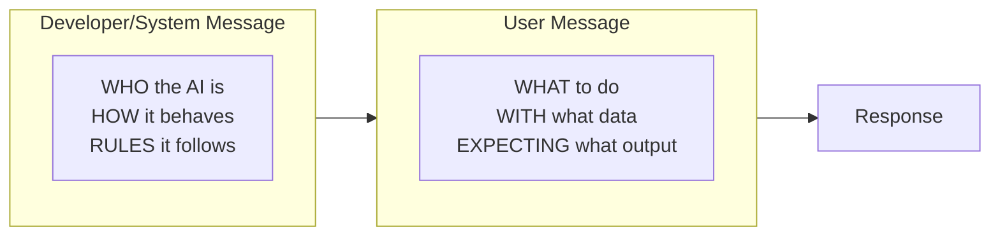

# User Message Construction

## Introduction

While system prompts define who the AI is, user messages define what the AI should do. Well-constructed user messages are the key to getting consistent, high-quality outputs. This lesson covers how to write clear task descriptions, provide context, format input data, and specify desired outputs.

> **🤖 AI Context:** Think of `developer` messages as function definitions and `user` messages as function arguments. The user message provides the specific inputs and configuration that the developer instructions operate on.

### User vs. Developer Messages



---

## What We'll Cover

This lesson is divided into focused sub-lessons:

| Lesson | Topic | Key Concepts |
|--------|-------|--------------|
| [01](./01-clear-task-description.md) | Clear Task Description | Action verbs, specific goals, success criteria, scope |
| [02](./02-providing-context.md) | Providing Context | Background info, prior conversation, domain context |
| [03](./03-input-data-formatting.md) | Input Data Formatting | Delimiters, labels, data format, special characters |
| [04](./04-specifying-desired-output.md) | Specifying Desired Output | Format description, examples, required fields |
| [05](./05-multi-step-tasks.md) | Handling Multi-Step Tasks | Step numbering, dependencies, intermediate outputs |
| [06](./06-grounding-rag-prompting.md) | Grounding & RAG Prompting | Retrieved context, source citations, grounding |

---

## Prerequisites

- [System Prompts & Developer Messages](../02-system-prompts-developer-messages/)

---

## Quick Reference: User Message Structure

```markdown
# Task
[Clear action verb + specific goal]

# Context (if needed)
[Background information relevant to this specific request]

# Input
[Clearly delimited data to process]

# Output Requirements
[Format, length, required elements]

# Constraints (if any)
[Specific limitations or rules for this request]
```

---

## Example: Complete User Message

```markdown
# Task
Extract all product mentions from this customer review and 
classify the sentiment for each.

# Context
This is from our electronics product line. Product names 
include: "ProMax Headphones", "SoundBar X1", "SmartWatch V3".

# Input
<review>
I love my ProMax Headphones - the sound quality is amazing! 
The SoundBar X1 was okay but too expensive for what you get. 
Haven't tried the SmartWatch V3 yet but excited to use it.
</review>

# Output Requirements
Return as JSON with this structure:
{
  "products": [
    {
      "name": "string",
      "sentiment": "positive" | "neutral" | "negative",
      "evidence": "quote from review"
    }
  ]
}
```

---

## Further Reading

- [OpenAI Prompt Engineering Guide](https://platform.openai.com/docs/guides/prompt-engineering)
- [Google Gemini Prompting Strategies](https://ai.google.dev/gemini-api/docs/prompting-strategies)

---

<!-- 
Sources Consulted:
- OpenAI Prompt Engineering: https://platform.openai.com/docs/guides/prompt-engineering
- Google Gemini Prompting Strategies: https://ai.google.dev/gemini-api/docs/prompting-strategies
-->
