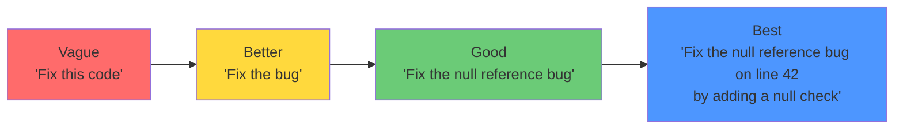

# Clear Task Description

## Introduction

The task description is the most critical part of your user message. A vague task gets vague results; a specific task gets specific results. This lesson shows you how to write task descriptions that leave no room for misinterpretation.

> **🔑 Key Concept:** Start every task with an **action verb**. "Summarize," "Extract," "Convert," "Classify" tell the model exactly what operation to perform.

### What We'll Cover

- Using strong action verbs
- Defining specific goals
- Setting success criteria
- Establishing scope boundaries

### Prerequisites

- [User Message Construction Overview](./00-user-message-overview.md)

---

## Using Strong Action Verbs

The first word of your task should tell the model what action to take. Weak verbs lead to ambiguous responses.

### Action Verb Categories

| Category | Strong Verbs | Example Task |
|----------|-------------|--------------|
| **Generate** | Write, Create, Compose, Draft | "Write a product description..." |
| **Transform** | Convert, Translate, Reformat, Rewrite | "Convert this JSON to YAML..." |
| **Extract** | Extract, Identify, List, Find | "Extract all email addresses..." |
| **Analyze** | Analyze, Compare, Evaluate, Assess | "Analyze the sentiment of..." |
| **Classify** | Classify, Categorize, Label, Tag | "Classify this support ticket..." |
| **Explain** | Explain, Describe, Summarize, Clarify | "Explain how OAuth works..." |
| **Fix** | Fix, Correct, Debug, Improve | "Fix the syntax errors in..." |
| **Decide** | Determine, Choose, Recommend, Select | "Determine the best shipping method..." |

### Weak vs. Strong Task Openings

| ❌ Weak | ✅ Strong |
|---------|----------|
| "I need help with this text" | "Summarize this text in 3 bullet points" |
| "What about these numbers?" | "Calculate the average of these numbers" |
| "Something's wrong with this code" | "Identify the bug causing the TypeError" |
| "This email needs work" | "Rewrite this email in a professional tone" |
| "Look at this data" | "Extract all dates from this data" |

### Example: Action Verbs in Practice

**Vague (what action?):**
```
Here's a customer review. Let me know what you think.
```

**Specific (clear action):**
```
Classify this customer review as positive, neutral, or negative.
Then extract the specific product features mentioned.

<review>
The battery life exceeded my expectations, but the screen 
brightness is disappointing in sunlight.
</review>
```

**Output:**
```
Classification: Mixed (positive and negative elements)

Product Features Mentioned:
1. Battery life - positive ("exceeded my expectations")
2. Screen brightness - negative ("disappointing in sunlight")
```

---

## Defining Specific Goals

After the action verb, specify exactly what outcome you want. Vague goals produce inconsistent results.

### The Goal Specificity Spectrum



### Components of a Specific Goal

1. **What** — The concrete deliverable
2. **How many** — Quantity or count (if applicable)
3. **Which format** — Structure of the output
4. **What criteria** — Quality standards

### Example: Goal Specificity Progression

**Level 1 — Vague:**
```
Summarize this article.
```

**Level 2 — Better:**
```
Summarize this article in a few bullet points.
```

**Level 3 — Good:**
```
Summarize this article in 3-5 bullet points, 
focusing on the main arguments.
```

**Level 4 — Specific:**
```
Summarize this article in exactly 5 bullet points:
- First bullet: The main thesis
- Bullets 2-4: Key supporting arguments
- Final bullet: Author's conclusion

Each bullet should be one sentence (max 20 words).
```

### Input Types Shape Goals

According to Google's prompting guidelines, user inputs typically fall into four categories. Your goal should match the input type:

| Input Type | Description | Goal Format |
|------------|-------------|-------------|
| **Question** | Seeking information | "Provide the answer" |
| **Task** | Requesting an action | "Complete the action" |
| **Entity** | Providing data to process | "Process and return result" |
| **Completion** | Starting a pattern | "Continue the pattern" |

**Question input:**
```
What's the time complexity of binary search?

Goal: Explain in one sentence with Big O notation.
```

**Task input:**
```
Sort this list alphabetically: ["cherry", "apple", "banana"]

Goal: Return the sorted list.
```

**Entity input:**
```
Customer: John Smith, Age: 34, Purchases: 12

Goal: Generate a customer segment label.
```

**Completion input:**
```
Monday: Team meeting
Tuesday: Code review
Wednesday:

Goal: Continue the pattern with a reasonable entry.
```

---

## Setting Success Criteria

Success criteria tell the model how to evaluate its own output. Without them, the model guesses what "good" means.

### Types of Success Criteria

| Criteria Type | Description | Example |
|---------------|-------------|---------|
| **Length** | Word count, character limit, page length | "Maximum 100 words" |
| **Format** | Structure, markup, data type | "Return as valid JSON" |
| **Content** | Required elements, topics to cover | "Must include price and availability" |
| **Tone** | Voice, formality, audience | "Professional but approachable" |
| **Accuracy** | Source constraints, factual basis | "Based only on the provided document" |
| **Exclusions** | What to avoid | "Do not include personal opinions" |

### Example: Explicit Success Criteria

**Without criteria:**
```
Write a product description for wireless headphones.
```

**With success criteria:**
```
Write a product description for wireless headphones.

Success criteria:
- Length: 50-75 words
- Include: battery life, noise cancellation, comfort
- Tone: Enthusiastic but not salesy
- Format: Single paragraph
- Avoid: Technical jargon, competitor comparisons
```

**Output:**
```
Experience pure audio freedom with our wireless headphones. 
Enjoy up to 40 hours of uninterrupted listening on a single 
charge, while active noise cancellation blocks out distractions. 
The memory foam ear cushions provide all-day comfort, making 
these the perfect companion for work, travel, or relaxation. 
Your music, your way—no wires attached.
```

### Using Checklists for Success Criteria

For complex tasks, provide a checklist the model can verify:

```
Review this code for security issues.

Before responding, verify your review includes:
☐ SQL injection vulnerabilities
☐ Cross-site scripting (XSS) risks  
☐ Authentication/authorization flaws
☐ Hardcoded secrets or credentials
☐ Input validation issues

For each issue found, provide:
1. Line number
2. Issue type
3. Risk level (Critical/High/Medium/Low)
4. Recommended fix
```

---

## Establishing Scope Boundaries

Scope boundaries prevent the model from going too broad or too deep. They define what's in and out of bounds.

### Defining What's In Scope

Tell the model exactly what to focus on:

```
Analyze the performance of this function.

In scope:
- Time complexity
- Space complexity
- Potential bottlenecks

Out of scope:
- Code style/formatting
- Variable naming
- Adding new features
```

### Limiting Scope with Constraints

| Constraint Type | Example |
|-----------------|---------|
| **Domain** | "Only consider Python 3.10+ features" |
| **Timeframe** | "Focus on changes from the last 30 days" |
| **Depth** | "High-level overview, not implementation details" |
| **Perspective** | "From a backend developer's viewpoint" |
| **Source** | "Using only the provided documentation" |

### Example: Scope in Code Review

**Without scope:**
```
Review this code.
```

**With clear scope:**
```
Review this code for performance issues only.

Scope boundaries:
- Focus: Performance bottlenecks, inefficient algorithms, 
  unnecessary memory allocations
- Ignore: Formatting, naming conventions, documentation
- Depth: Flag issues with brief explanations, don't rewrite
- Limit: Top 3 most impactful issues

<code>
def find_duplicates(items):
    duplicates = []
    for i in range(len(items)):
        for j in range(len(items)):
            if i != j and items[i] == items[j]:
                if items[i] not in duplicates:
                    duplicates.append(items[i])
    return duplicates
</code>
```

**Output:**
```
Top 3 Performance Issues:

1. O(n²) nested loops - The double loop creates quadratic time 
   complexity. Use a set for O(n) duplicate detection.

2. Repeated list membership check - `items[i] not in duplicates` 
   is O(n), making total complexity O(n³). Use a set instead.

3. Redundant comparisons - Each pair is checked twice 
   (i,j and j,i). Only check j > i if keeping the loop structure.
```

---

## Best Practices

| Practice | Why It Matters |
|----------|----------------|
| Start with an action verb | Eliminates ambiguity about what to do |
| Quantify when possible | "3 examples" beats "some examples" |
| State what not to do | Prevents unwanted content |
| Make success measurable | The model can verify its own output |
| Define scope explicitly | Keeps responses focused |

---

## Common Pitfalls

| ❌ Mistake | ✅ Solution |
|-----------|-------------|
| "Help me with this" | "Summarize/Extract/Fix this" |
| "Make it better" | "Reduce word count by 50%" |
| "Be thorough" | "Include A, B, and C" |
| "Keep it short" | "Maximum 50 words" |
| "Check everything" | "Check for X, Y, and Z only" |

---

## Hands-on Exercise

### Your Task

Transform these vague task descriptions into clear, specific prompts.

### Requirements

For each vague prompt below, rewrite with:
1. Strong action verb
2. Specific goal
3. Success criteria
4. Scope boundaries

**Vague prompts to fix:**

1. "Look at this data and tell me what you see"
2. "Make this email sound better"  
3. "Help with this Python code"

<details>
<summary>💡 Hints (click to expand)</summary>

- What action verb fits? (Analyze, Rewrite, Debug, etc.)
- What specific output do you want?
- How will you know if the output is good?
- What should be included/excluded?

</details>

<details>
<summary>✅ Solution (click to expand)</summary>

**1. Data Analysis:**
```
Analyze this sales data and identify the top 3 trends.

Success criteria:
- Each trend: one sentence summary + supporting metric
- Focus: Month-over-month changes, seasonal patterns
- Ignore: Individual transaction details

<data>
[Your data here]
</data>
```

**2. Email Improvement:**
```
Rewrite this email to be more concise and professional.

Success criteria:
- Reduce length by 40%
- Use active voice
- Keep all key information
- Professional but warm tone

<email>
[Original email here]
</email>
```

**3. Python Code Help:**
```
Debug this Python function that throws a TypeError.

Scope:
- Identify the cause of the TypeError
- Provide corrected code
- Explain what was wrong in one sentence

Out of scope:
- Performance improvements
- Code style suggestions

<code>
[Python code here]
</code>
```

</details>

### Bonus Challenge

- [ ] Create a task description template for your most common use case

---

## Summary

✅ **Start with action verbs** — "Summarize," "Extract," "Classify" tell the model what to do

✅ **Define specific goals** — State exactly what deliverable you want

✅ **Set success criteria** — Make it measurable (length, format, content, tone)

✅ **Establish scope boundaries** — Define what's in and out of bounds

✅ **Match input type to goal** — Questions, tasks, entities, and completions each need different goal formats

**Next:** [Providing Context](./02-providing-context.md)

---

## Further Reading

- [OpenAI Prompt Engineering Guide](https://platform.openai.com/docs/guides/prompt-engineering)
- [Google Gemini Prompting Strategies](https://ai.google.dev/gemini-api/docs/prompting-strategies)

---

<!-- 
Sources Consulted:
- OpenAI Prompt Engineering: https://platform.openai.com/docs/guides/prompt-engineering
- Google Gemini Prompting Strategies: https://ai.google.dev/gemini-api/docs/prompting-strategies
-->
