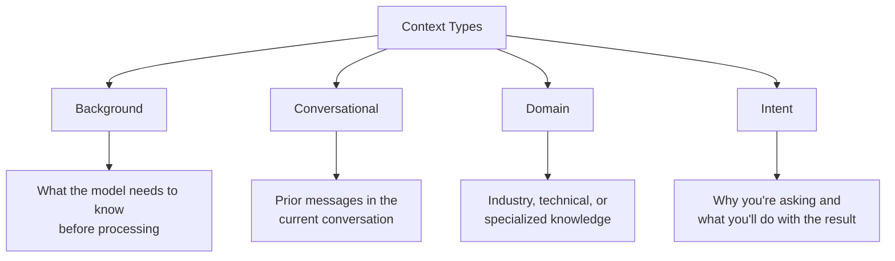
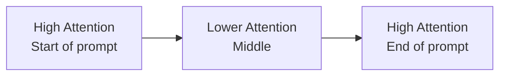

# Providing Context

## Introduction

Context transforms generic responses into relevant ones. When you give the model background information, prior conversation history, and domain-specific details, it can tailor its output to your exact situation. This lesson shows you how to provide context effectively without overwhelming the prompt.

> **🤖 AI Context:** Models don't remember previous conversations (unless you include them). Every API call starts with a blank slate. The context you provide is the model's entire world for that request.

### What We'll Cover

- Types of context and when to use each
- Background information best practices
- Including prior conversation
- Domain context for specialized tasks
- Intent clarification techniques

### Prerequisites

- [Clear Task Description](./01-clear-task-description.md)

---

## Types of Context

Different tasks require different types of context. Understanding what the model needs helps you provide the right information.



### When Each Type Matters

| Context Type | Use When | Example |
|--------------|----------|---------|
| **Background** | The task requires knowledge about your specific situation | "We're a B2B SaaS company targeting enterprise clients" |
| **Conversational** | Continuing a multi-turn interaction | "Earlier you suggested using a dictionary..." |
| **Domain** | Task requires specialized terminology or standards | "This follows HIPAA compliance requirements" |
| **Intent** | The "why" affects how to respond | "I need this for a technical presentation to CTOs" |

---

## Background Information

Background context provides facts the model needs but doesn't inherently know. This includes information about your company, project, users, or data.

### What to Include

| Category | Examples |
|----------|----------|
| **Who** | Company name, team, target audience |
| **What** | Product, service, project, codebase |
| **When** | Timeline, deadlines, time-sensitive info |
| **Where** | Region, platform, deployment environment |
| **Constraints** | Budget, tech stack, regulations |

### Example: Background in Code Review

**Without background:**
```
Review this function for improvements.

def get_user(id):
    return db.query(f"SELECT * FROM users WHERE id = {id}")
```

**With background:**
```
Review this function for improvements.

Background:
- This is a public-facing API endpoint
- We use PostgreSQL with SQLAlchemy
- We've had SQL injection attempts before
- Our codebase uses type hints throughout

def get_user(id):
    return db.query(f"SELECT * FROM users WHERE id = {id}")
```

**Output with background:**
```
Critical Security Issue: SQL Injection vulnerability.

Given your PostgreSQL/SQLAlchemy stack and public-facing API, 
this is a serious risk. Replace with parameterized query:

from sqlalchemy import text

def get_user(id: int) -> User:
    return db.query(text("SELECT * FROM users WHERE id = :id"), 
                    {"id": id})

Also adding type hint since your codebase uses them.
```

### The "Just Enough" Principle

More context isn't always better. Include what's relevant; exclude what isn't.

| ❌ Too Much | ✅ Just Right |
|------------|---------------|
| "Our company was founded in 2015 by three engineers who met at Stanford. We've raised $50M in funding and have 200 employees across 5 offices..." | "We're a B2B SaaS company. Our users are enterprise IT admins." |
| "Here's our entire database schema with 47 tables..." | "This function queries the `users` and `orders` tables, joined on `user_id`." |

### Where to Place Background

Position background context **before** the task, so the model reads it first:

```markdown
# Background
[Context information here]

# Task
[What you want done]

# Input
[Data to process]
```

---

## Prior Conversation Context

When building conversational applications, you need to include previous messages so the model understands the flow.

### Conversation History Format

```python
messages = [
    {
        "role": "developer",
        "content": "You are a helpful coding assistant."
    },
    {
        "role": "user",
        "content": "How do I read a file in Python?"
    },
    {
        "role": "assistant",
        "content": "Use the open() function with a context manager:\n\nwith open('file.txt', 'r') as f:\n    content = f.read()"
    },
    {
        "role": "user",
        "content": "What if the file doesn't exist?"  # <-- Current turn
    }
]
```

The model now understands "the file" refers to the file from the previous turn.

### Summarizing Long Conversations

For long conversations, summarize earlier context to stay within token limits:

```python
messages = [
    {
        "role": "developer",
        "content": "You are a helpful coding assistant."
    },
    {
        "role": "user",
        "content": """Previous conversation summary:
        - User asked about reading files in Python
        - I showed them using open() with context manager
        - User implemented it but got a FileNotFoundError
        
        Current question:
        What's the best way to handle this error?"""
    }
]
```

### Conversation Context Best Practices

| Practice | Reason |
|----------|--------|
| Include 3-5 most recent turns | Maintains immediate context |
| Summarize earlier turns | Saves tokens while preserving key info |
| Include assistant responses | Shows what advice was already given |
| Label the current turn | Makes the latest question clear |

---

## Domain Context

Domain context provides specialized knowledge or terminology the model needs for your industry or technical area.

### Types of Domain Context

| Domain Type | Examples |
|-------------|----------|
| **Industry** | Healthcare (HIPAA), Finance (SOC2), E-commerce |
| **Technical** | Programming language, framework, architecture |
| **Internal** | Company jargon, product names, abbreviations |
| **Regulatory** | GDPR, ADA, industry standards |

### Example: Domain Context in Healthcare

**Without domain context:**
```
Summarize this patient note.

Patient presents with SOB and CP. Hx of MI. 
ECHO showed EF of 35%. Started on BB and ACE-I.
```

**With domain context:**
```
Summarize this patient note for a clinical handoff.

Domain context:
- This is a cardiology progress note
- Audience: Incoming physician at shift change
- Expand abbreviations for clarity
- Highlight concerning findings

<note>
Patient presents with SOB and CP. Hx of MI. 
ECHO showed EF of 35%. Started on BB and ACE-I.
</note>
```

**Output:**
```
Clinical Handoff Summary:

Chief Complaint: Shortness of breath and chest pain

Key History: Previous myocardial infarction (heart attack)

Concerning Finding: Echocardiogram shows ejection fraction 
of 35% (reduced; normal is 55-70%), indicating impaired 
heart function.

Current Treatment: Beta-blocker and ACE inhibitor initiated.

Action Items: Monitor for response to new medications.
```

### Providing Technical Domain Context

For programming tasks, specify the relevant technical stack:

```
Debug this API endpoint.

Domain context:
- Framework: FastAPI with Pydantic v2
- Database: PostgreSQL with SQLAlchemy 2.0 (async)
- Auth: JWT tokens via python-jose
- Python version: 3.11

<code>
[Your code here]
</code>
```

This prevents suggestions for Flask, Django, or outdated library versions.

---

## Intent Clarification

Intent context explains **why** you're asking and **how you'll use** the response. This helps the model calibrate its answer appropriately.

### Intent Changes the Response

The same question with different intents produces different answers:

**Question:** "Explain Kubernetes."

| Intent | Appropriate Response |
|--------|---------------------|
| "I'm writing a blog post for beginners" | Simple analogy, no jargon |
| "I'm preparing for a DevOps interview" | Key concepts, common questions |
| "I'm deciding if we should adopt it" | Pros/cons, when to use |
| "I'm debugging a pod crash" | Irrelevant—ask a different question |

### Providing Intent Context

```
Explain how JWT authentication works.

Intent: I'm writing internal documentation for our 
backend team. They know HTTP but haven't used JWTs before. 
I need enough detail for them to implement it.
```

**Output:**
```
## JWT Authentication for Backend Developers

JWT (JSON Web Token) is a stateless authentication mechanism...

### How It Works
1. User logs in with credentials
2. Server validates and returns a signed JWT
3. Client includes JWT in `Authorization: Bearer <token>` header
4. Server validates signature on each request

### Implementation Checklist
- [ ] Choose a signing algorithm (RS256 recommended)
- [ ] Set appropriate expiration times
- [ ] Store tokens securely client-side
- [ ] Implement token refresh flow

### Code Example (Python/FastAPI)
[Implementation code here]
```

### Audience as Intent

Specifying your audience is a form of intent context:

| Audience | Effect on Response |
|----------|-------------------|
| "5-year-old" | Simple analogies, no jargon |
| "Junior developer" | More explanation, practical examples |
| "Senior architect" | Concise, assumes deep knowledge |
| "Non-technical executive" | Business impact, avoid implementation details |

---

## Context Placement Strategies

Where you place context in your prompt matters for model attention.

### The Attention Curve



Models pay most attention to the **beginning** and **end** of prompts. Place your most important context accordingly.

### Recommended Context Order

```markdown
1. Background context (read first, sets the scene)
2. Domain context (specialized knowledge)
3. Prior conversation (if applicable)
4. Task description (what to do)
5. Input data (what to process)
6. Output requirements (how to format)  ← Near end for emphasis
```

### Example: Well-Ordered Prompt

```
# Background
We're building a customer support chatbot for an e-commerce 
platform selling electronics.

# Domain Context
- Product categories: smartphones, laptops, accessories
- Return policy: 30 days, must have receipt
- Support hours: 9 AM - 6 PM EST

# Previous Conversation
Customer: I want to return my headphones
Bot: I'd be happy to help with that return. When did you purchase them?
Customer: Last week

# Current Task
Generate a helpful response asking for the order number 
to process the return.

# Output Requirements
- Friendly, professional tone
- Keep under 50 words
- Don't make promises about approval
```

---

## Best Practices

| Practice | Why It Matters |
|----------|----------------|
| Lead with background | Sets the scene before the task |
| Specify your audience | Calibrates complexity and tone |
| Include only relevant context | Too much context dilutes focus |
| Summarize long histories | Preserves key info within token limits |
| State your intent | "Why" affects "how" the model responds |

---

## Common Pitfalls

| ❌ Mistake | ✅ Solution |
|-----------|-------------|
| No context at all | Add background relevant to the task |
| Life story level detail | Include only what affects the response |
| Assuming the model remembers | Include prior conversation context |
| Unexplained jargon | Add domain context or expand terms |
| Forgetting the audience | State who will read the output |

---

## Hands-on Exercise

### Your Task

Add appropriate context to this bare prompt to improve the response quality.

**Original prompt:**
```
Write error handling for this function.

def divide(a, b):
    return a / b
```

### Requirements

Add four types of context:
1. Background (what project/codebase)
2. Domain (technical stack/standards)
3. Intent (why you need this)
4. Audience (who will see it)

<details>
<summary>💡 Hints (click to expand)</summary>

- What kind of project uses this function?
- What Python version? What error handling style?
- Will this be in production? Library? Script?
- Junior devs? Senior engineers? Mixed team?

</details>

<details>
<summary>✅ Solution (click to expand)</summary>

```
Write error handling for this function.

# Background
This is part of a financial calculation API. 
Division by zero would indicate bad user input.

# Domain Context
- Python 3.11
- We use custom exception classes
- All functions should have docstrings
- Logging is done via structlog

# Intent
I need production-ready error handling that logs 
issues and returns helpful error messages to API clients.

# Audience
Other backend developers will maintain this code.

def divide(a, b):
    return a / b
```

**Example output with context:**
```python
import structlog
from app.exceptions import CalculationError

logger = structlog.get_logger()

def divide(a: float, b: float) -> float:
    """
    Divide two numbers with proper error handling.
    
    Args:
        a: Dividend
        b: Divisor
        
    Returns:
        Result of a / b
        
    Raises:
        CalculationError: If division by zero is attempted
    """
    if b == 0:
        logger.warning("division_by_zero_attempted", dividend=a)
        raise CalculationError(
            "Division by zero is not allowed",
            error_code="CALC_001"
        )
    return a / b
```

</details>

### Bonus Challenge

- [ ] Create a context template for prompts you use frequently

---

## Summary

✅ **Context types** — Background, conversational, domain, and intent each serve different purposes

✅ **Just enough** — Include relevant context, not exhaustive detail

✅ **Prior conversation** — Include recent turns; summarize older ones

✅ **Domain context** — Specify industry, tech stack, and terminology

✅ **Intent clarification** — State why you're asking and how you'll use it

**Next:** [Input Data Formatting](./03-input-data-formatting.md)

---

## Further Reading

- [OpenAI Prompt Engineering Guide](https://platform.openai.com/docs/guides/prompt-engineering)
- [Google Gemini Prompting Strategies](https://ai.google.dev/gemini-api/docs/prompting-strategies)

---

<!-- 
Sources Consulted:
- OpenAI Prompt Engineering: https://platform.openai.com/docs/guides/prompt-engineering
- Google Gemini Prompting Strategies: https://ai.google.dev/gemini-api/docs/prompting-strategies
-->
