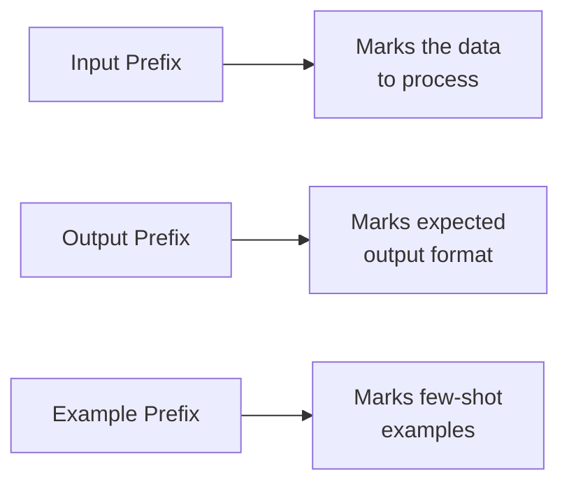

# Input Data Formatting

## Introduction

When your prompt includes data for the model to process—customer reviews, code snippets, documents, JSON objects—how you format that data significantly impacts the quality of results. Clear delimiters, consistent labels, and proper formatting help the model understand where your instructions end and your data begins.

> **🔑 Key Concept:** The model sees your entire prompt as a continuous stream of text. Without clear delimiters, it can confuse your instructions with your input data.

### What We'll Cover

- Delimiter strategies (XML tags, Markdown, triple quotes)
- Labeling data with prefixes and markers
- Format specifications for structured data
- Handling special characters and edge cases

### Prerequisites

- [Providing Context](./02-providing-context.md)

---

## Why Formatting Matters

Consider this prompt without formatting:

```
Summarize this The quarterly results exceeded expectations 
with revenue up 15% and tell me the key points
```

Is "tell me the key points" part of the text to summarize, or an instruction? The model has to guess.

**With clear formatting:**

```
Summarize this text:

<text>
The quarterly results exceeded expectations with revenue up 15%.
</text>

Return the key points as bullet points.
```

Now there's no ambiguity.

---

## Delimiter Strategies

Delimiters are markers that separate different parts of your prompt. Choose based on your use case and the data you're processing.

### XML-Style Tags

XML tags are the most explicit and reliable delimiters. They're especially recommended for complex prompts.

```
Analyze the sentiment of this review:

<review>
The product arrived damaged but customer service 
was helpful in resolving the issue quickly.
</review>

Classify as: positive, negative, or mixed.
```

**Common XML tag names:**

| Use Case | Suggested Tags |
|----------|----------------|
| Text content | `<text>`, `<document>`, `<article>` |
| User input | `<input>`, `<query>`, `<message>` |
| Code | `<code>`, `<script>`, `<function>` |
| Data | `<data>`, `<json>`, `<csv>` |
| Context | `<context>`, `<background>`, `<reference>` |
| Examples | `<example>`, `<sample>` |

### Markdown Code Blocks

Markdown fencing (triple backticks) works well for code and structured data:

```
Fix the syntax error in this Python function:

```python
def greet(name)
    return f"Hello, {name}!"
```

Return only the corrected code.
```

### Triple Quotes

Python-style triple quotes work for text content:

```
Translate this paragraph to Spanish:

"""
The early bird catches the worm, but the second 
mouse gets the cheese.
"""
```

### Choosing the Right Delimiter

| Delimiter | Best For | Watch Out For |
|-----------|----------|---------------|
| **XML tags** | Complex prompts, multiple data sections | Verbose for simple cases |
| **Markdown blocks** | Code, JSON, structured data | May confuse with actual Markdown formatting |
| **Triple quotes** | Simple text content | Not as explicit as XML |
| **Dashes/equals** | Visual separation in simple prompts | Can appear in natural text |

### Nested Delimiters

When your data contains the same delimiter, use different styles:

```
Process this code file:

<file>
def example():
    """This function has triple quotes inside"""
    return "result"
</file>
```

Here, XML tags wrap content that contains triple quotes, avoiding confusion.

---

## Labeling with Prefixes

Prefixes add semantic meaning to different parts of your prompt. Google's documentation specifically recommends three prefix types.

### The Three Prefix Types



### Input Prefix

Labels the data to be processed:

```
Input: The weather today is sunny and warm.
Sentiment:
```

### Output Prefix

Shows the model how to start its response:

```
Text: Machine learning is a subset of AI.
Summary: [Model completes from here]
```

### Example Prefix

Labels few-shot examples:

```
Example 1:
Input: I love this product!
Output: positive

Example 2:
Input: Terrible experience, never again.
Output: negative

Now classify:
Input: The delivery was on time.
Output:
```

### Consistent Prefix Usage

Keep prefixes consistent throughout your prompt:

| ✅ Consistent | ❌ Inconsistent |
|--------------|-----------------|
| `Input:` / `Output:` | `Input:` / `Result:` |
| `Text:` / `Summary:` | `Text:` / `The summary:` |
| `Q:` / `A:` | `Question:` / `A:` |

**Example with consistent prefixes:**

```
Classify customer feedback:

Feedback: The app crashes frequently.
Category: Bug Report
Urgency: High

Feedback: Could you add dark mode?
Category: Feature Request
Urgency: Low

Feedback: Where can I find my order history?
Category:
Urgency:
```

---

## Format Specifications

When passing structured data, specify its format explicitly.

### JSON Data

```
Extract the email addresses from this API response.

Format: JSON array of user objects

<data>
{
  "users": [
    {"name": "Alice", "email": "alice@example.com"},
    {"name": "Bob", "email": "bob@test.org"}
  ]
}
</data>

Return only the email addresses as a JSON array.
```

### CSV Data

```
Calculate the average price from this CSV data.

Format: CSV with headers (product, price, quantity)

<csv>
product,price,quantity
Widget A,29.99,100
Widget B,49.99,50
Widget C,19.99,200
</csv>

Return the average price rounded to 2 decimal places.
```

### Tabular Data with Alignment

For tables, be explicit about structure:

```
Summarize the sales trends from this data.

Format: Markdown table with Month and Revenue columns

| Month | Revenue |
|-------|---------|
| Jan   | $50,000 |
| Feb   | $62,000 |
| Mar   | $58,000 |

Identify any notable patterns.
```

### Mixed Format Data

When combining formats, label each section:

```
Analyze this support ticket.

# Metadata (JSON)
<metadata>
{
  "ticket_id": "TKT-1234",
  "priority": "high",
  "created": "2025-01-15"
}
</metadata>

# Customer Message (Plain Text)
<message>
I've been trying to reset my password for three days 
now. The reset email never arrives. Very frustrated!
</message>

# Previous Agent Notes (Markdown)
<notes>
- Verified email is correct
- Checked spam folder
- No blocks on our email server
</notes>

Provide a recommended resolution.
```

---

## Handling Special Characters

Input data often contains characters that could confuse the model or break your formatting.

### Common Problem Characters

| Character | Problem | Solution |
|-----------|---------|----------|
| `<` and `>` | Looks like XML tags | Use different delimiters |
| Triple backticks | Breaks code blocks | Use XML tags instead |
| Triple quotes | Breaks string delimiters | Use XML tags or escape |
| `#` at line start | Looks like Markdown heading | Add context that it's data |
| `---` | Looks like separator | Use XML tags around data |

### Example: Code with Special Characters

The input code contains triple backticks (a docstring example):

**Problematic approach:**
```
Review this code:

```python
def example():
    ```
    This docstring uses backticks
    ```
    pass
```
```

**Safer approach:**
```
Review this code:

<code lang="python">
def example():
    ```
    This docstring uses backticks
    ```
    pass
</code>
```

### Escaping vs. Different Delimiters

| Strategy | When to Use |
|----------|-------------|
| **Different delimiter** | Cleaner, preferred when possible |
| **Escaping** | When you must use a specific delimiter |
| **Base64 encoding** | For binary or highly problematic content |

---

## Multiple Input Sections

Complex prompts often have multiple data inputs. Label each clearly.

### Comparing Two Documents

```
Compare these two versions of the policy:

<version_1>
Returns accepted within 14 days of purchase.
Items must be in original packaging.
Refund processed within 5 business days.
</version_1>

<version_2>
Returns accepted within 30 days of purchase.
Items must be in original packaging with receipt.
Refund processed within 3 business days.
</version_2>

List the changes as bullet points.
```

### Processing Multiple Items

```
Classify each of these support tickets:

<ticket id="1">
My order hasn't arrived yet and it's been 2 weeks.
</ticket>

<ticket id="2">
Can you add Apple Pay as a payment option?
</ticket>

<ticket id="3">
The website is very slow on mobile devices.
</ticket>

For each ticket, provide:
- Ticket ID
- Category (Delivery, Feature Request, Bug, Other)
- Suggested Priority (Low, Medium, High)
```

### Input with Reference Materials

```
Answer the question using only the provided documents.

<document source="FAQ" id="1">
Our return policy allows returns within 30 days 
with a valid receipt.
</document>

<document source="Terms" id="2">
Electronics have a 14-day return window due to 
rapid depreciation.
</document>

<question>
Can I return a laptop I bought 20 days ago?
</question>

Cite which document supports your answer.
```

---

## Best Practices

| Practice | Why It Matters |
|----------|----------------|
| Use explicit delimiters | Prevents confusion between instructions and data |
| Label multiple inputs | Makes each section's purpose clear |
| Specify data format | Helps model parse structured data correctly |
| Be consistent | Same prefixes throughout the prompt |
| Test with edge cases | Special characters can break formatting |

---

## Common Pitfalls

| ❌ Mistake | ✅ Solution |
|-----------|-------------|
| No delimiters at all | Wrap data in XML tags or code blocks |
| Using delimiters that appear in data | Choose different delimiter type |
| Inconsistent labeling | Use same prefix style throughout |
| Assuming format is obvious | Explicitly state "Format: JSON" etc. |
| Forgetting to close tags | Always verify matching open/close |

---

## Hands-on Exercise

### Your Task

Format this messy prompt with proper delimiters and labels.

**Original messy prompt:**
```
I need you to analyze this customer feedback and also 
look at this competitor analysis The feedback is Great 
product but shipping took forever and the competitor 
analysis says they offer 2-day shipping and compare 
them and give me recommendations
```

### Requirements

1. Separate instructions from data
2. Use appropriate delimiters for each data section
3. Add clear labels
4. Structure the output request clearly

<details>
<summary>💡 Hints (click to expand)</summary>

- There are two pieces of input data (feedback and competitor analysis)
- Use XML tags or other clear delimiters
- Add labels like "Customer Feedback:" and "Competitor Analysis:"
- Break the final request into clear steps

</details>

<details>
<summary>✅ Solution (click to expand)</summary>

```
Compare our customer feedback against competitor analysis 
and provide recommendations.

# Inputs

<customer_feedback>
Great product but shipping took forever.
</customer_feedback>

<competitor_analysis>
Competitors offer 2-day shipping as standard.
</competitor_analysis>

# Task

1. Identify the key complaint in the customer feedback
2. Compare against competitor capabilities
3. Provide 2-3 actionable recommendations

# Output Format

Use this structure:
- Key Issue: [one sentence]
- Competitor Advantage: [one sentence]
- Recommendations:
  1. [action item]
  2. [action item]
  3. [action item]
```

</details>

### Bonus Challenges

- [ ] Create a template for multi-document comparison prompts
- [ ] Practice formatting prompts that include code with special characters

---

## Summary

✅ **Use explicit delimiters** — XML tags, code blocks, or quotes to separate data

✅ **Label consistently** — Input prefix, output prefix, example prefix

✅ **Specify formats** — Tell the model when data is JSON, CSV, Markdown, etc.

✅ **Handle special characters** — Use different delimiters when data contains your chosen delimiter

✅ **Label multiple inputs** — Clear identification for each data section

**Next:** [Specifying Desired Output](./04-specifying-desired-output.md)

---

## Further Reading

- [OpenAI Prompt Engineering Guide](https://platform.openai.com/docs/guides/prompt-engineering)
- [Google Gemini Prompting Strategies](https://ai.google.dev/gemini-api/docs/prompting-strategies)

---

<!-- 
Sources Consulted:
- OpenAI Prompt Engineering: https://platform.openai.com/docs/guides/prompt-engineering
- Google Gemini Prompting Strategies: https://ai.google.dev/gemini-api/docs/prompting-strategies
-->
