# Specifying Desired Output

## Introduction

Telling the model what to do is only half the battle—you also need to tell it how to format the response. Clear output specifications eliminate ambiguity and make responses immediately usable in your application. This lesson covers format descriptions, example outputs, and defining required vs. optional fields.

> **🤖 AI Context:** When you need structured outputs (JSON, CSV, tables), explicit format specifications are crucial. Many AI APIs now support "structured outputs" mode that guarantees valid format, but your prompt still needs to clearly describe what structure you want.

### What We'll Cover

- Format description techniques
- Using example outputs (few-shot patterns)
- Defining required vs. optional fields
- Controlling length and verbosity
- Schema specifications for structured data

### Prerequisites

- [Input Data Formatting](./03-input-data-formatting.md)

---

## Why Output Specification Matters

Without output specifications, you get whatever format the model chooses:

**Unspecified output:**
```
List the capitals of France, Germany, and Spain.
```

**Possible responses:**
```
The capital of France is Paris, Germany's capital is Berlin, 
and the capital of Spain is Madrid.
```
```
France - Paris
Germany - Berlin  
Spain - Madrid
```
```
1. Paris (France)
2. Berlin (Germany)
3. Madrid (Spain)
```

All correct, but inconsistent and hard to parse programmatically.

**With output specification:**
```
List the capitals of France, Germany, and Spain.

Return as JSON: {"country": "capital"}
```

**Consistent output:**
```json
{
  "France": "Paris",
  "Germany": "Berlin",
  "Spain": "Madrid"
}
```

---

## Format Description Techniques

### Direct Format Statement

Tell the model exactly what format to use:

```
Extract the person's name and age from this text.

<text>
John Smith just celebrated his 42nd birthday last week.
</text>

Return as: Name: [name], Age: [age]
```

**Output:**
```
Name: John Smith, Age: 42
```

### Template-Based Format

Provide a template with placeholders:

```
Generate a product description.

Use this template:
---
**[Product Name]**

*[One-line tagline]*

[2-3 sentence description]

✅ Key features:
- [Feature 1]
- [Feature 2]  
- [Feature 3]

💰 Price: $[price]
---
```

### Format Options Table

| Format Type | When to Use | Specification Example |
|-------------|-------------|----------------------|
| **Plain text** | Human-readable responses | "Respond in 2-3 sentences" |
| **Bullet points** | Lists, multiple items | "Return as bullet points" |
| **Numbered list** | Sequential steps, rankings | "Return as numbered steps" |
| **JSON** | Programmatic parsing | "Return as valid JSON" |
| **Markdown** | Formatted documents | "Return as Markdown with headers" |
| **Table** | Comparison data | "Return as a Markdown table" |
| **Code** | Programming tasks | "Return only the code, no explanation" |

---

## Few-Shot Output Examples

Showing examples of desired output is often more effective than describing it. This is called "few-shot learning."

### Zero-Shot vs. Few-Shot

```mermaid
flowchart LR
    A[Zero-shot] --> B["Just instructions<br/>No examples"]
    C[One-shot] --> D["One example<br/>of input → output"]
    E[Few-shot] --> F["2-5 examples<br/>of input → output"]
```



### One-Shot Example

```
Classify the sentiment of this review.

Example:
Review: "The battery dies way too fast."
Sentiment: negative

Now classify:
Review: "Best purchase I've made this year!"
Sentiment:
```

### Few-Shot Examples

Multiple examples improve consistency:

```
Extract action items from meeting notes.

Example 1:
Notes: "We need to update the pricing page by Friday."
Action: {"task": "Update pricing page", "deadline": "Friday", "owner": null}

Example 2:
Notes: "Sarah will handle the customer follow-up tomorrow."
Action: {"task": "Customer follow-up", "deadline": "tomorrow", "owner": "Sarah"}

Example 3:
Notes: "Let's revisit the budget discussion next week."
Action: {"task": "Budget discussion", "deadline": "next week", "owner": null}

Now extract:
Notes: "Mike should send the proposal to the client by end of day."
Action:
```

### Consistent Example Formatting

Keep formatting identical across all examples:

| ✅ Consistent | ❌ Inconsistent |
|--------------|-----------------|
| Same JSON structure in all examples | Different key names between examples |
| Same delimiter style | Mixing XML tags and Markdown |
| Same level of detail | Verbose in some, terse in others |

**Example of inconsistent (bad):**
```
Example 1:
Input: text
Output: {"sentiment": "positive"}

Example 2:
The text is: another text
Result: negative sentiment
```

---

## Required vs. Optional Fields

When requesting structured output, specify which fields are mandatory and which are optional.

### Field Specification Table

```
Extract contact information from this text.

Fields:
| Field | Required | Format | Default if missing |
|-------|----------|--------|-------------------|
| name | Yes | string | — |
| email | Yes | string | — |
| phone | No | string | null |
| company | No | string | null |
| title | No | string | null |

<text>
Reach out to Sarah Chen at sarah@techcorp.io for details.
</text>
```

**Output:**
```json
{
  "name": "Sarah Chen",
  "email": "sarah@techcorp.io",
  "phone": null,
  "company": null,
  "title": null
}
```

### JSON Schema Specification

For complex structures, provide a JSON schema:

```
Parse this event information into JSON.

Schema:
{
  "event_name": "string (required)",
  "date": "ISO 8601 date string (required)",
  "time": "HH:MM format (optional, null if not specified)",
  "location": {
    "venue": "string (optional)",
    "city": "string (required)",
    "address": "string (optional)"
  },
  "organizer": "string (optional)"
}

<text>
Join us for TechConnect 2025 on March 15th in San Francisco! 
The event will be held at the Moscone Center starting at 9 AM.
</text>
```

**Output:**
```json
{
  "event_name": "TechConnect 2025",
  "date": "2025-03-15",
  "time": "09:00",
  "location": {
    "venue": "Moscone Center",
    "city": "San Francisco",
    "address": null
  },
  "organizer": null
}
```

### Handling Missing Data

Specify how to handle missing or uncertain information:

```
Extract the information below. Use these conventions:
- Required field missing: Return "MISSING" 
- Optional field missing: Return null
- Uncertain data: Return best guess with "(uncertain)" suffix
```

---

## Controlling Length and Verbosity

Be explicit about how long or detailed the response should be.

### Length Specifications

| Specification | Example |
|---------------|---------|
| **Word count** | "Maximum 50 words" |
| **Sentence count** | "In 2-3 sentences" |
| **Bullet count** | "Exactly 5 bullet points" |
| **Paragraph count** | "Write 2 paragraphs" |
| **Character limit** | "Under 280 characters (for Twitter)" |

### Verbosity Levels

```
Explain how HTTPS works.

Verbosity: [Choose one]
- Brief: One sentence
- Summary: One paragraph
- Standard: 2-3 paragraphs
- Detailed: Comprehensive with examples
```

### Example: Length Control

**Without length control:**
```
Summarize this article.
```

Response could be 1 sentence or 10 paragraphs.

**With length control:**
```
Summarize this article.

Format:
- Title: [Catchy summary title, 5-8 words]
- TL;DR: [One sentence, max 20 words]
- Key Points: [Exactly 3 bullet points, each 10-15 words]
```

**Output:**
```
Title: AI Startup Raises Record Funding Round

TL;DR: TechAI secured $500M in Series C, the largest 
AI funding round this year.

Key Points:
• Valuation jumped to $5B, triple the previous round
• Funds will expand engineering team from 200 to 500
• New products launching in healthcare and finance sectors
```

---

## Output Completion Strategy

A powerful technique is to start the output yourself, guiding the model to continue in your format.

### Partial Output Completion

```
Classify this support ticket.

Ticket: "The app crashes when I try to upload photos."

Category:
```

The model completes with just: `Bug Report` or `Technical Issue`

### Structured Completion

```
Analyze this data point.

Data: Revenue increased 15% QoQ

Analysis:
- Metric: 
- Change: 
- Direction:
- Significance:
```

**Output:**
```
Analysis:
- Metric: Revenue
- Change: 15%
- Direction: Increase
- Significance: Quarter-over-quarter growth indicates healthy business momentum
```

### JSON Completion

```
Extract the order details.

Text: "Order #12345 for 3 units of Widget Pro at $29.99 each"

{
  "order_id":
```

**Output:**
```json
{
  "order_id": "12345",
  "product": "Widget Pro",
  "quantity": 3,
  "unit_price": 29.99,
  "total": 89.97
}
```

---

## Output-Only Responses

Sometimes you want just the answer, without explanation or preamble.

### Techniques for Clean Output

```
What's the capital of France?

Output only the city name, nothing else.
```

**Output:**
```
Paris
```

### Suppressing Preamble

| ❌ With preamble | ✅ Clean output instruction |
|-----------------|---------------------------|
| "The capital of France is Paris." | "Return only the answer: Paris" |
| "Here's the JSON you requested: {...}" | "Return valid JSON only, no markdown or explanation" |
| "Based on the analysis, I recommend..." | "State your recommendation in one word" |

### Code-Only Responses

```
Fix the bug in this function.

<code>
def add(a, b):
    return a - b
</code>

Return only the corrected code. No explanations, 
no markdown code blocks, just the raw code.
```

---

## Best Practices

| Practice | Why It Matters |
|----------|----------------|
| Provide example output | Shows exact format better than descriptions |
| Specify structure explicitly | JSON schema, table format, etc. |
| Define required vs optional | Prevents missing critical fields |
| Control length explicitly | "50 words" not "brief" |
| Use output completion | Start the response format yourself |

---

## Common Pitfalls

| ❌ Mistake | ✅ Solution |
|-----------|-------------|
| "Keep it short" | "Maximum 50 words" |
| Assuming JSON without asking | "Return as valid JSON" |
| No examples for complex format | Provide 2-3 few-shot examples |
| Inconsistent examples | Same format across all examples |
| Not handling missing data | Specify null, "N/A", or "MISSING" |

---

## Hands-on Exercise

### Your Task

Create a prompt that extracts structured data from unstructured text with a specific output format.

### The Challenge

Given this customer message:
```
Hi, I'm Alex from Acme Corp. We'd like to order 50 units 
of the Enterprise Plan. My email is alex@acme.com and 
you can reach me at 555-0123. We need delivery by 
March 15th to our NYC office.
```

Create a prompt that extracts order information into a specific JSON format.

### Requirements

1. Define the JSON schema with required/optional fields
2. Include one example of input → output
3. Handle the case where some information might be missing
4. Specify date format

<details>
<summary>💡 Hints (click to expand)</summary>

- What fields would an order system need?
- Which fields are definitely present vs. might be missing?
- What's a good date format for APIs? (ISO 8601)
- Show one complete example before the actual task

</details>

<details>
<summary>✅ Solution (click to expand)</summary>

```
Extract order information from customer messages.

# Output Schema
{
  "customer": {
    "name": "string (required)",
    "company": "string (optional, null if not mentioned)",
    "email": "string (required)",
    "phone": "string (optional, null if not mentioned)"
  },
  "order": {
    "product": "string (required)",
    "quantity": "integer (required)",
    "delivery_date": "ISO 8601 date (optional)",
    "delivery_location": "string (optional)"
  }
}

# Example
Message: "This is John from TechStart. Email me at 
john@techstart.io. We want 20 Basic Plans."

Output:
{
  "customer": {
    "name": "John",
    "company": "TechStart",
    "email": "john@techstart.io",
    "phone": null
  },
  "order": {
    "product": "Basic Plan",
    "quantity": 20,
    "delivery_date": null,
    "delivery_location": null
  }
}

# Now extract from this message:
<message>
Hi, I'm Alex from Acme Corp. We'd like to order 50 units 
of the Enterprise Plan. My email is alex@acme.com and 
you can reach me at 555-0123. We need delivery by 
March 15th to our NYC office.
</message>
```

**Expected output:**
```json
{
  "customer": {
    "name": "Alex",
    "company": "Acme Corp",
    "email": "alex@acme.com",
    "phone": "555-0123"
  },
  "order": {
    "product": "Enterprise Plan",
    "quantity": 50,
    "delivery_date": "2025-03-15",
    "delivery_location": "NYC office"
  }
}
```

</details>

### Bonus Challenges

- [ ] Add validation rules to your schema (e.g., quantity must be > 0)
- [ ] Handle multiple orders in a single message

---

## Summary

✅ **Specify format explicitly** — JSON, bullets, table, etc.

✅ **Use few-shot examples** — Show 2-3 examples of desired output

✅ **Define fields clearly** — Required vs. optional, data types, defaults

✅ **Control length precisely** — Word count, sentence count, bullet count

✅ **Use output completion** — Start the format to guide the model

**Next:** [Handling Multi-Step Tasks](./05-multi-step-tasks.md)

---

## Further Reading

- [OpenAI Structured Outputs](https://platform.openai.com/docs/guides/structured-outputs)
- [Google Gemini Prompting Strategies](https://ai.google.dev/gemini-api/docs/prompting-strategies)

---

<!-- 
Sources Consulted:
- OpenAI Prompt Engineering: https://platform.openai.com/docs/guides/prompt-engineering
- Google Gemini Prompting Strategies: https://ai.google.dev/gemini-api/docs/prompting-strategies
- OpenAI Structured Outputs: https://platform.openai.com/docs/guides/structured-outputs
-->
