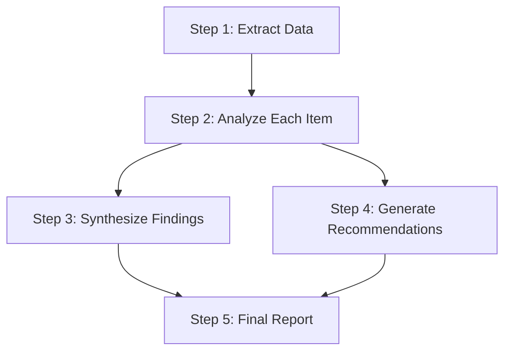
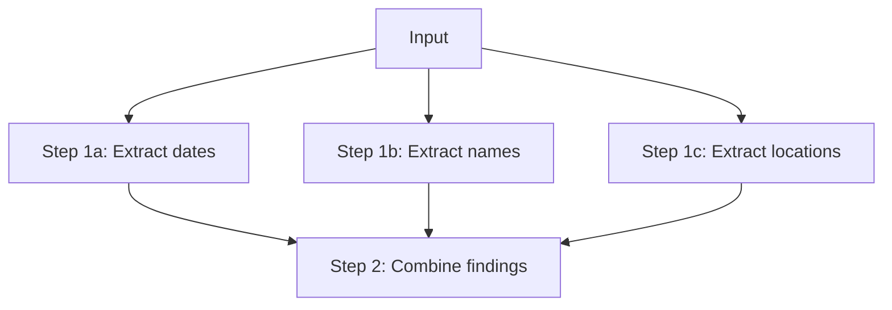

# Handling Multi-Step Tasks

## Introduction

Complex tasks often require multiple steps: analyze first, then summarize, then recommend. When you break tasks into explicit steps, you get more reliable and thorough results. This lesson covers how to structure multi-step prompts, manage dependencies between steps, and handle intermediate outputs.

> **🤖 AI Context:** Multi-step prompting is related to "chain of thought" reasoning. By explicitly numbering steps, you guide the model through a logical process rather than asking it to jump straight to a conclusion.

### What We'll Cover

- Structuring numbered steps
- Managing step dependencies
- Handling intermediate outputs
- Chaining prompts for complex workflows
- When to use single vs. multiple prompts

### Prerequisites

- [Specifying Desired Output](./04-specifying-desired-output.md)

---

## Why Multi-Step Structure Matters

Single-shot prompts for complex tasks often miss steps or produce incomplete results:

**Single-shot (what could go wrong):**
```
Analyze this sales data, identify trends, and give recommendations.
```

The model might skip the analysis and jump to generic recommendations.

**Multi-step (explicit process):**
```
Analyze this sales data in three steps:

Step 1: Identify the top 3 trends in the data
Step 2: Explain the likely causes of each trend
Step 3: Recommend actions to address each trend

Complete each step before moving to the next.
```

Now the model must work through each step systematically.

---

## Structuring Numbered Steps

### Basic Step Format

```
Complete the following analysis in order:

Step 1: [First action]
Step 2: [Second action]
Step 3: [Third action]

Show your work for each step before proceeding to the next.
```

### Example: Document Analysis

```
Analyze this contract in four steps:

Step 1: IDENTIFY key parties and their roles
Step 2: LIST all obligations for each party
Step 3: FLAG any unusual or concerning clauses
Step 4: SUMMARIZE the overall risk level (Low/Medium/High)

<contract>
[Contract text here]
</contract>

Format each step with a clear header.
```

**Output:**
```
## Step 1: Key Parties

| Party | Role |
|-------|------|
| Acme Corp | Service Provider |
| TechStart Inc | Client |

## Step 2: Obligations

**Acme Corp must:**
- Deliver software by March 1
- Provide 90 days of support
- Maintain 99.9% uptime

**TechStart must:**
- Pay $50,000 upon delivery
- Provide requirements by Feb 1

## Step 3: Concerning Clauses

⚠️ **Clause 7.2**: Unlimited liability for Acme with no cap
⚠️ **Clause 9.1**: 60-day payment terms (above standard 30)

## Step 4: Risk Assessment

**Risk Level: Medium**

The unlimited liability clause is concerning. Recommend 
negotiating a liability cap before signing.
```

### Step Action Verbs

Start each step with a clear action verb:

| Step Type | Action Verbs |
|-----------|-------------|
| **Analysis** | Identify, Analyze, Examine, Assess |
| **Extraction** | Extract, List, Find, Gather |
| **Transformation** | Convert, Reformat, Translate, Summarize |
| **Evaluation** | Compare, Evaluate, Rank, Rate |
| **Creation** | Generate, Write, Create, Compose |
| **Decision** | Recommend, Choose, Determine, Decide |

---

## Managing Step Dependencies

Some steps depend on output from previous steps. Make these dependencies explicit.

### Explicit Dependencies

```
Process this customer feedback:

Step 1: Extract all mentioned products
Step 2: For EACH product from Step 1, determine the sentiment
Step 3: Using results from Step 2, identify which products 
        need immediate attention (negative sentiment)

<feedback>
The new headphones are fantastic! But the charging cable 
keeps breaking. The carrying case is okay I guess.
</feedback>
```

**Output:**
```
## Step 1: Products Mentioned
1. Headphones
2. Charging cable
3. Carrying case

## Step 2: Sentiment by Product
| Product | Sentiment | Evidence |
|---------|-----------|----------|
| Headphones | Positive | "fantastic" |
| Charging cable | Negative | "keeps breaking" |
| Carrying case | Neutral | "okay I guess" |

## Step 3: Products Needing Attention
**Immediate attention required:**
- Charging cable (Negative sentiment - quality issue)
```

### Dependency Diagram



### Conditional Steps

Sometimes later steps depend on earlier results:

```
Evaluate this code change:

Step 1: Identify what the code change does
Step 2: Check for obvious bugs or issues
Step 3: 
  - IF bugs found in Step 2: Explain how to fix each bug
  - IF no bugs: Proceed to Step 4
Step 4: Evaluate performance impact
Step 5: Give final approval/rejection with reasoning
```

---

## Handling Intermediate Outputs

For complex tasks, you may want specific outputs at each step rather than just a final answer.

### Labeled Step Outputs

```
Research this topic and prepare a summary.

Step 1: List 5 key facts
Output: Numbered list of facts

Step 2: Identify the most important fact
Output: Single sentence explaining why it's most important

Step 3: Write a tweet-length summary (< 280 characters)
Output: The tweet text only
```

### Structured Intermediate Outputs

```
Process this support ticket through our workflow:

Step 1: Classify the ticket
Output as:
{
  "category": "...",
  "priority": "...",
  "complexity": "..."
}

Step 2: Generate initial response
Output as:
{
  "greeting": "...",
  "acknowledgment": "...",
  "next_steps": ["...", "..."]
}

Step 3: Create follow-up tasks
Output as:
{
  "tasks": [
    {"description": "...", "assignee": "...", "due": "..."}
  ]
}
```

### Skip Intermediate Output When Not Needed

Sometimes you only care about the final answer:

```
Analyze this data through these steps but only show 
the final recommendation:

Step 1: (internal) Calculate growth rates
Step 2: (internal) Identify anomalies
Step 3: (internal) Compare to benchmarks
Step 4: (output) Provide your top 3 recommendations

Only show Step 4 output.
```

---

## Parallel vs. Sequential Steps

Not all steps need to be sequential. Identify which can run in parallel.

### Sequential Steps (dependencies)


```
Step 1: Summarize the document
Step 2: Based on the summary, identify key themes
Step 3: Based on the themes, generate discussion questions
```

### Parallel Steps (no dependencies)



```
From this document, perform these extractions:

Parallel Tasks (complete all):
- 1a: Extract all dates mentioned
- 1b: Extract all person names
- 1c: Extract all location names

Then:
Step 2: Create a timeline combining dates, people, and events
```

---

## Chaining Multiple Prompts

For very complex workflows, break into separate API calls that feed into each other.

### When to Chain vs. Single Prompt

| Use Single Prompt | Use Chained Prompts |
|-------------------|---------------------|
| 2-5 simple steps | 6+ steps or complex logic |
| Steps are tightly coupled | Steps could use different models |
| < 1000 token output | Large intermediate outputs |
| All context fits in one prompt | Need to inject external data between steps |

### Chaining Pattern

```python
# Pseudocode for prompt chaining

# Step 1: Extract information
step1_prompt = """
Extract all product mentions from this review.
Return as JSON array: ["product1", "product2", ...]
"""
products = call_llm(step1_prompt, review_text)

# Step 2: Analyze each product (uses Step 1 output)
step2_prompt = f"""
For each product, analyze the sentiment.

Products to analyze: {products}

Original review:
{review_text}

Return as JSON: {{"product": "sentiment"}}
"""
sentiments = call_llm(step2_prompt)

# Step 3: Generate summary (uses Step 2 output)
step3_prompt = f"""
Based on this sentiment analysis: {sentiments}

Generate a one-paragraph summary of customer satisfaction.
"""
summary = call_llm(step3_prompt)
```

### Aggregating Parallel Results

```python
# Run parallel analyses
analysis_1 = call_llm("Analyze for security issues...", code)
analysis_2 = call_llm("Analyze for performance issues...", code)
analysis_3 = call_llm("Analyze for code style issues...", code)

# Aggregate in final step
final_prompt = f"""
Combine these code review analyses into a single report:

Security Analysis: {analysis_1}
Performance Analysis: {analysis_2}
Style Analysis: {analysis_3}

Prioritize issues and provide top 5 recommendations.
"""
final_report = call_llm(final_prompt)
```

---

## Best Practices

| Practice | Why It Matters |
|----------|----------------|
| Number steps explicitly | Creates clear sequence |
| Start each step with action verb | No ambiguity about what to do |
| Make dependencies explicit | "Using results from Step 2..." |
| Specify output format per step | Controls intermediate results |
| Limit to 5-7 steps | More than that, consider chaining |

---

## Common Pitfalls

| ❌ Mistake | ✅ Solution |
|-----------|-------------|
| Vague step descriptions | "Analyze the data" → "Calculate month-over-month growth rates" |
| Hidden dependencies | Make references explicit: "Using the products from Step 1..." |
| All-or-nothing output | Specify intermediate outputs for debugging |
| Too many steps | Break into chained prompts |
| Steps that could be parallel | Mark as parallel to potentially save time |

---

## Hands-on Exercise

### Your Task

Create a multi-step prompt for conducting a job candidate evaluation.

### The Scenario

You have a candidate's resume and need to:
1. Extract relevant experience
2. Match experience to job requirements
3. Identify gaps
4. Generate interview questions
5. Provide hiring recommendation

### Requirements

- Number all steps clearly
- Show dependencies between steps
- Specify output format for at least 2 steps
- Include at least one conditional step

<details>
<summary>💡 Hints (click to expand)</summary>

- Step 2 needs output from Step 1
- Step 3 needs outputs from Steps 1 and 2
- The recommendation could be conditional on gaps found
- Interview questions should target identified gaps

</details>

<details>
<summary>✅ Solution (click to expand)</summary>

```
Evaluate this candidate for the Senior Backend Engineer role.

## Job Requirements
- 5+ years Python experience
- API design experience
- Database optimization
- Team leadership

## Candidate Resume
<resume>
[Resume text here]
</resume>

---

## Evaluation Steps

### Step 1: Extract Relevant Experience
List candidate's relevant technical experience.
Output format:
| Skill | Years | Evidence from Resume |
|-------|-------|---------------------|

### Step 2: Match to Requirements
For EACH requirement listed above, rate the candidate's fit.
Use results from Step 1.
Output format:
| Requirement | Match Level | Justification |
|-------------|-------------|---------------|
(Match Level: Strong / Partial / Weak / None)

### Step 3: Identify Gaps
Based on Step 2 results, list any requirements rated 
"Weak" or "None".
Output: Bullet list of gaps with brief explanation

### Step 4: Generate Interview Questions
- IF gaps exist (from Step 3): Create 2 questions per gap 
  to probe deeper
- IF no gaps: Create 3 questions about growth potential 
  and leadership style

Output format:
1. [Question] - Purpose: [What you're assessing]

### Step 5: Hiring Recommendation
Based on all previous steps:
- IF more than 2 gaps rated "None": Recommend NO
- IF 1-2 gaps: Recommend MAYBE with conditions
- IF no significant gaps: Recommend YES

Output format:
**Recommendation:** [YES/MAYBE/NO]
**Confidence:** [High/Medium/Low]
**Key Factors:** [2-3 bullet points]
**Conditions (if MAYBE):** [What would change the decision]
```

</details>

### Bonus Challenges

- [ ] Add a step that compares this candidate to a "typical" senior engineer profile
- [ ] Make the process handle multiple candidates

---

## Summary

✅ **Number steps explicitly** — Creates a clear, auditable process

✅ **Use action verbs** — Start each step with Extract, Analyze, Compare, etc.

✅ **Make dependencies explicit** — "Using results from Step 2..."

✅ **Specify output per step** — Control format of intermediate results

✅ **Chain prompts for complexity** — 6+ steps often work better as multiple calls

**Next:** [Grounding & RAG Prompting](./06-grounding-rag-prompting.md)

---

## Further Reading

- [OpenAI Prompt Engineering Guide](https://platform.openai.com/docs/guides/prompt-engineering)
- [Chain of Thought Prompting](https://arxiv.org/abs/2201.11903)

---

<!-- 
Sources Consulted:
- OpenAI Prompt Engineering: https://platform.openai.com/docs/guides/prompt-engineering
- Google Gemini Prompting Strategies: https://ai.google.dev/gemini-api/docs/prompting-strategies
-->
