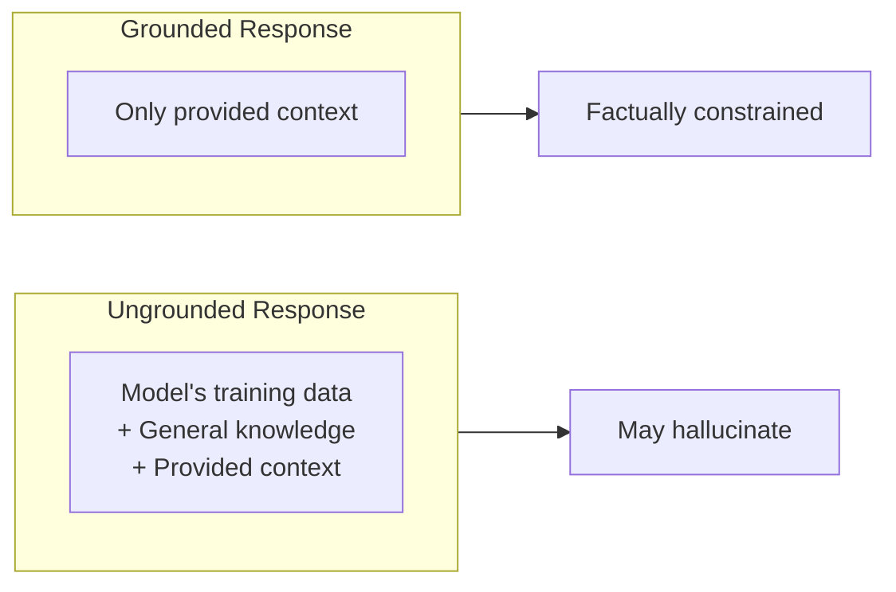

# Grounding & RAG Prompting

## Introduction

Language models have knowledge cutoffs and can sometimes "hallucinate" information. Grounding prompts tell the model to rely only on provided context rather than its training data. This technique is essential for RAG (Retrieval-Augmented Generation) systems where you inject retrieved documents into prompts.

> **🤖 AI Context:** Grounding is critical for production AI systems. When your chatbot says "According to our policy..." you need to be confident it's quoting your actual policy, not inventing one.

### What We'll Cover

- Grounding instructions and templates
- Formatting retrieved context
- Separation between context and query
- Source citation requirements
- Handling unanswerable questions

### Prerequisites

- [Handling Multi-Step Tasks](./05-multi-step-tasks.md)

---

## What is Grounding?

Grounding restricts the model to answering based solely on provided information, preventing it from using its general knowledge or making things up.



### Ungrounded vs. Grounded

| Aspect | Ungrounded | Grounded |
|--------|------------|----------|
| Knowledge source | Training data + context | Only provided context |
| Hallucination risk | Higher | Lower |
| "I don't know" responses | Rare | When context lacks answer |
| Creativity | Higher | Limited to context |
| Use case | General chat, creative writing | Document QA, support bots |

---

## Grounding Instructions

The key to effective grounding is an explicit instruction that overrides the model's default behavior.

### Basic Grounding Template

```
Answer the question using ONLY the information provided below.
If the answer is not in the provided context, say 
"I cannot answer this based on the available information."

<context>
[Your retrieved documents here]
</context>

Question: [User's question]
```

### Google's Grounding Template

This template from Google's Gemini documentation is particularly effective:

```
You are a strictly grounded assistant limited to the information 
provided in the User Context. In your answers, rely **only** on 
the facts that are directly mentioned in that context. You must 
**not** access or utilize your own knowledge or common sense 
to answer.

If the context does not contain enough information to fully 
answer the question, explicitly state what information is missing 
rather than guessing or inferring.

<user_context>
[Retrieved documents]
</user_context>

<question>
[User's question]
</question>
```

### Grounding Instruction Patterns

| Pattern | Example |
|---------|---------|
| **Restrictive** | "Use ONLY the provided text" |
| **Explicit prohibition** | "Do NOT use your general knowledge" |
| **Admission instruction** | "If not found, say 'Not in the provided documents'" |
| **Citation requirement** | "Quote the source for each fact" |

---

## Formatting Retrieved Context

How you format the retrieved documents affects how well the model can use them.

### Single Document

```
<document>
Company return policy: Items may be returned within 30 days 
of purchase with a valid receipt. Electronics have a 14-day 
return window. Clearance items are final sale.
</document>
```

### Multiple Documents with Metadata

```
<documents>

<document id="1" source="FAQ" last_updated="2025-01-15">
Our support hours are 9 AM to 6 PM EST, Monday through Friday.
Weekend support is available via email only.
</document>

<document id="2" source="Terms of Service" last_updated="2024-12-01">
Users are limited to 3 support tickets per day. Priority 
support is available for Enterprise customers.
</document>

</documents>
```

### Chunked Document Context

For long documents split into chunks:

```
<context>

<chunk source="Annual Report 2024" section="Executive Summary" page="3">
Revenue increased 15% year-over-year, reaching $500M.
</chunk>

<chunk source="Annual Report 2024" section="Financial Results" page="12">
Operating expenses grew 8% due to expansion efforts.
</chunk>

<chunk source="Annual Report 2024" section="Outlook" page="24">
We project 10-12% growth for fiscal year 2025.
</chunk>

</context>
```

### Context Metadata to Include

| Metadata | Why It Helps |
|----------|--------------|
| **Source/document name** | Enables citation |
| **Section/chapter** | Provides localization |
| **Date/version** | Indicates recency |
| **Page number** | Helps user verify |
| **Chunk ID** | Useful for multi-chunk retrieval |

---

## Separating Context from Query

Keep the user's question clearly separated from the grounding context. This prevents confusion about what to use vs. what to answer.

### Clear Separation Structure

```
# INSTRUCTIONS
Answer questions using only the provided company documents.
Cite the source document for each answer.

# CONTEXT (use this to answer)
<documents>
[Retrieved content here]
</documents>

# QUESTION (answer this)
<question>
What is the return policy for electronics?
</question>
```

### Why Separation Matters

Without clear separation:
```
Here's some text: Our return policy is 30 days. 
What's the return policy? 
Also we do free shipping.
```

The model might not know which parts are context vs. question.

**With separation:**
```
<context>
Our return policy is 30 days.
We offer free shipping on orders over $50.
</context>

<question>
What's the return policy?
</question>
```

Now it's unambiguous.

---

## Citation Requirements

For accountability and user verification, require the model to cite its sources.

### Basic Citation Instruction

```
Answer the question and cite the source document.

Format: [Answer] (Source: [document name])
```

**Output:**
```
Items can be returned within 30 days with a receipt. 
(Source: Return Policy FAQ)
```

### Inline Citations

```
Use inline citations in square brackets [Doc ID].

Example: "Returns are accepted within 30 days [1] with 
a valid receipt [1]. Electronics have a 14-day window [2]."
```

### Citations with Quotes

```
For each fact in your answer:
1. State the fact
2. Quote the exact text from the source
3. Cite the document

Format:
Fact: [your statement]
Evidence: "[exact quote from document]"
Source: [document name, section]
```

**Output:**
```
Fact: Electronics have a shorter return window than other items.
Evidence: "Electronics have a 14-day return window"
Source: Return Policy, Section 2.1
```

### Citation Styles Summary

| Style | Example | Best For |
|-------|---------|----------|
| **Parenthetical** | "...30 days. (FAQ)" | Simple, inline |
| **Bracketed numbers** | "...30 days [1]" | Multiple sources |
| **Quote + source** | "per the FAQ: '30 days'" | Verification-critical |
| **Footnote style** | "...30 days.¹" | Formal documents |

---

## Handling Unanswerable Questions

A grounded system must gracefully handle questions that the context can't answer.

### Explicit Fallback Instructions

```
Answer using only the provided context.

If the context does not contain enough information:
1. State clearly: "I cannot find this information in the 
   provided documents."
2. Explain what information IS available that's related
3. Suggest what additional documents might help

Do NOT guess or use general knowledge.
```

### Partial Answer Handling

```
If the context only partially answers the question:

1. Answer what you CAN answer from the context
2. Clearly mark what remains unanswered
3. Use this format:

Based on the provided documents:
- [What we know]: ...
- [Not in documents]: ...
```

**Example output:**
```
Based on the provided documents:
- Return window: 30 days for most items, 14 days for electronics
- Not in documents: Return policy for items purchased with a gift card
```

### Confidence Indicators

```
For each part of your answer, indicate confidence:

✅ CONFIRMED: Directly stated in documents
⚠️ INFERRED: Reasonable conclusion from context
❓ UNCONFIRMED: Not in provided documents

Example:
✅ Returns accepted within 30 days
⚠️ This likely applies to online orders (not explicitly stated)
❓ Gift card purchases not mentioned
```

---

## RAG Prompt Patterns

Putting it all together for Retrieval-Augmented Generation systems.

### Complete RAG Prompt Template

```
You are a helpful assistant that answers questions about our 
company policies. Use ONLY the retrieved documents below to 
answer. Do not use general knowledge.

## Instructions
1. Read the retrieved documents carefully
2. Answer the question using only information from the documents
3. Cite the source document for each fact
4. If the answer isn't in the documents, say "I don't have 
   information about that in the available documents"

## Retrieved Documents
<documents>
{retrieved_docs}
</documents>

## User Question
<question>
{user_question}
</question>

## Answer Format
[Your answer here]

Sources cited: [List document IDs used]
```

### RAG with Conversation History

```
You answer questions about our product based on provided context.

## Previous Conversation
<history>
User: What's your return policy?
Assistant: Items can be returned within 30 days. [FAQ-001]
</history>

## Retrieved Context for Current Question
<context>
[Newly retrieved documents relevant to current question]
</context>

## Current Question
<question>
{current_question}
</question>

Answer based on the context. Reference previous conversation 
if relevant.
```

### RAG with Confidence Scoring

```
Answer the question using the provided documents.

After your answer, provide:
- Confidence: High (directly stated) / Medium (inferred) / 
  Low (partially relevant) / None (not in documents)
- Sources: List of document IDs used
- Gaps: What related information was NOT in the documents

<documents>
{retrieved_docs}
</documents>

Question: {question}
```

---

## Best Practices

| Practice | Why It Matters |
|----------|----------------|
| Use explicit grounding instructions | Overrides model's default to use general knowledge |
| Add document metadata | Enables accurate citations |
| Separate context from query | Prevents confusion |
| Require citations | Makes answers verifiable |
| Handle "I don't know" explicitly | Prevents hallucination |

---

## Common Pitfalls

| ❌ Mistake | ✅ Solution |
|-----------|-------------|
| No grounding instruction | Add "Use ONLY the provided context" |
| Context mixed with question | Use clear delimiters and labels |
| No fallback for missing info | Instruct model to say "not in documents" |
| No citation requirement | Request sources for each fact |
| Too much context | Retrieve focused, relevant chunks |

---

## Hands-on Exercise

### Your Task

Create a grounded RAG prompt for a customer support chatbot.

### The Scenario

Build a prompt for a support bot that:
- Answers questions about a software product
- Uses only provided documentation
- Cites sources
- Gracefully handles questions it can't answer

### Requirements

1. Include a strong grounding instruction
2. Format for multiple document sources
3. Require citations
4. Handle partial/missing information
5. Include an example exchange

<details>
<summary>💡 Hints (click to expand)</summary>

- Start with a clear grounding instruction
- Use XML tags to separate documents
- Add metadata to each document
- Specify citation format
- Provide explicit fallback behavior

</details>

<details>
<summary>✅ Solution (click to expand)</summary>

```
You are a support assistant for CloudSync Pro software.
Answer questions using ONLY the documentation provided below.

## CRITICAL GROUNDING RULES
1. Use ONLY information from the provided documents
2. Do NOT use general knowledge about software or cloud services
3. If information is not in the documents, say: "I don't have 
   documentation about that. Please contact support@cloudsync.io"
4. Cite the source for every fact using [Doc-ID]

## DOCUMENTATION

<document id="FAQ-001" title="Getting Started" updated="2025-01">
CloudSync Pro supports Windows 10+, macOS 12+, and Linux (Ubuntu 20+).
Installation requires 500MB disk space and 4GB RAM minimum.
The installer can be downloaded from cloudsync.io/download.
</document>

<document id="FAQ-002" title="Pricing" updated="2025-01">
Free tier: 5GB storage, 2 devices
Pro tier ($9.99/month): 100GB storage, unlimited devices
Enterprise: Custom pricing, contact sales@cloudsync.io
</document>

<document id="FAQ-003" title="Troubleshooting" updated="2024-12">
Sync errors: Check internet connection, then restart the app.
Login issues: Clear cache at Settings > Advanced > Clear Cache.
If problems persist, generate a diagnostic report from Help > Diagnostics.
</document>

## USER QUESTION
<question>
{question}
</question>

## RESPONSE FORMAT

**Answer:**
[Your answer using only the documents above]

**Sources:** [Doc-IDs cited]

**Not covered:** [If any part of the question wasn't in docs, note it here]

---

## EXAMPLE

Question: "How much RAM do I need and what's the price?"

**Answer:**
CloudSync Pro requires a minimum of 4GB RAM [FAQ-001]. 
Pricing starts with a free tier offering 5GB storage, or 
Pro tier at $9.99/month for 100GB storage [FAQ-002].

**Sources:** FAQ-001, FAQ-002

**Not covered:** N/A - question fully answered
```

</details>

### Bonus Challenges

- [ ] Add handling for multi-turn conversations
- [ ] Include a confidence score in the output
- [ ] Add instructions for when documents conflict

---

## Summary

✅ **Ground explicitly** — "Use ONLY the provided context"

✅ **Format context clearly** — Add metadata, use clear delimiters

✅ **Separate context from query** — No ambiguity about what to use vs. answer

✅ **Require citations** — Make answers verifiable

✅ **Handle gaps gracefully** — "I don't have information about that"

**Next:** [Few-Shot & Example-Based Prompting](../04-few-shot-prompting/)

---

## Further Reading

- [OpenAI Prompt Engineering Guide](https://platform.openai.com/docs/guides/prompt-engineering)
- [Google Gemini Grounding](https://ai.google.dev/gemini-api/docs/prompting-strategies)
- [RAG Best Practices](https://docs.anthropic.com/en/docs/build-with-claude/prompt-engineering/techniques#rag-retrieval-augmented-generation)

---

<!-- 
Sources Consulted:
- OpenAI Prompt Engineering: https://platform.openai.com/docs/guides/prompt-engineering
- Google Gemini Prompting Strategies: https://ai.google.dev/gemini-api/docs/prompting-strategies
- Google Gemini 3 Best Practices: Grounding template
-->
