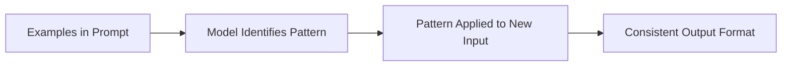

# Few-Shot Prompting

## Introduction

Few-shot prompting is one of the most powerful techniques in prompt engineering. By including examples of desired input-output pairs in your prompt, you can teach the model new tasks without any training or fine-tuning. This is called "in-context learning"—the model learns the pattern from examples you provide at runtime.

> **🤖 AI Context:** Few-shot learning is what makes LLMs so versatile. Instead of training a new model for each task (expensive, slow), you show a few examples in your prompt (cheap, instant). The model generalizes from those examples to handle new inputs.

### Why Few-Shot Works



---

## What We'll Cover

This lesson is divided into focused sub-lessons:

| Lesson | Topic | Key Concepts |
|--------|-------|--------------|
| [01](./01-what-is-few-shot-learning.md) | What is Few-Shot Learning? | In-context learning, pattern recognition, no training |
| [02](./02-example-selection.md) | Example Selection Strategies | Diverse examples, representative cases, edge coverage |
| [03](./03-example-formatting.md) | Example Formatting | Input/output pairs, delimiters, consistent structure |
| [04](./04-number-of-examples.md) | Number of Examples | Diminishing returns, token cost, quality vs quantity |
| [05](./05-zero-vs-few-shot.md) | Zero-Shot vs Few-Shot | When each is sufficient, trade-offs, cost |
| [06](./06-dynamic-example-selection.md) | Dynamic Example Selection | Runtime selection, similarity-based retrieval |
| [07](./07-rag-enhanced-few-shot.md) | RAG-Enhanced Few-Shot | Vector retrieval, semantic similarity, quality scoring |

---

## Prerequisites

- [User Message Construction](../03-user-message-construction/)

---

## Quick Reference: Few-Shot Template

```markdown
# Task
[Describe the task]

# Examples

## Example 1
Input: [example input 1]
Output: [desired output 1]

## Example 2
Input: [example input 2]
Output: [desired output 2]

## Example 3
Input: [example input 3]
Output: [desired output 3]

# Now process this:
Input: [actual input]
Output:
```

---

## Example: Few-Shot in Action

**Zero-shot (no examples):**
```
Classify this product review as Positive, Negative, or Neutral:
"The battery life is okay, but the screen is amazing!"
```
Model might respond with a full explanation, not just the label.

**Few-shot (with examples):**
```
Classify product reviews as Positive, Negative, or Neutral.

Review: "I love this product, best purchase ever!"
Classification: Positive

Review: "Terrible quality, broke after one week."
Classification: Negative

Review: "It works as expected, nothing special."
Classification: Neutral

Review: "The battery life is okay, but the screen is amazing!"
Classification:
```

Model outputs just: `Positive`

The examples teach format and decision boundary without explicit rules.

---

## Further Reading

- [OpenAI Prompt Engineering Guide](https://platform.openai.com/docs/guides/prompt-engineering)
- [Google Gemini Few-Shot Prompting](https://ai.google.dev/gemini-api/docs/prompting-strategies)

---

<!-- 
Sources Consulted:
- OpenAI Prompt Engineering: https://platform.openai.com/docs/guides/prompt-engineering
- Google Gemini Prompting Strategies: https://ai.google.dev/gemini-api/docs/prompting-strategies
-->
