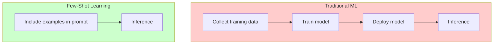

# What is Few-Shot Learning?

## Introduction

Few-shot learning allows you to teach a language model a new task by including examples directly in your prompt. Unlike traditional machine learning, which requires thousands of training examples, few-shot learning works with just 2-5 examples provided at inference time. This makes it incredibly flexible—you can change the task instantly by changing the examples.

> **🔑 Key Concept:** "Few-shot" means "a few examples." Zero-shot = no examples, one-shot = one example, few-shot = 2-5+ examples. More examples generally means better pattern recognition.

### What We'll Cover

- How in-context learning works
- The pattern recognition mechanism
- Why no training is required
- Comparison with traditional ML approaches

### Prerequisites

- [Few-Shot Prompting Overview](./00-few-shot-overview.md)

---

## In-Context Learning Explained

In-context learning is the ability of large language models to learn tasks from examples provided within the prompt itself. The model doesn't update its weights or undergo any training—it simply recognizes patterns in the examples and applies them.



### How It Works

1. **You provide examples** in your prompt showing input → output mappings
2. **The model identifies the pattern** from those examples
3. **You provide a new input** without an output
4. **The model completes the pattern** by generating the expected output

### Example: Teaching a Classification Task

```
Classify these animals:

Animal: Dog
Category: Mammal

Animal: Eagle
Category: Bird

Animal: Salmon
Category: Fish

Animal: Frog
Category:
```

The model learns from three examples that it should output a single-word category. It will complete with: `Amphibian`

---

## Pattern Recognition Mechanism

The model doesn't "understand" your task in a human sense. Instead, it recognizes statistical patterns in how your examples are structured and applies those patterns to new inputs.

### What the Model Learns from Examples

| Learned From Examples | Description |
|-----------------------|-------------|
| **Output format** | JSON, single word, bullet list, etc. |
| **Output length** | Terse or detailed responses |
| **Decision boundaries** | How to classify edge cases |
| **Terminology** | Domain-specific labels or vocabulary |
| **Tone/style** | Formal, casual, technical, etc. |

### The Pattern Completion View

Think of the model as an extremely sophisticated autocomplete system:

```
Given this pattern:
Q: What is 2+2?
A: 4

Q: What is 5+3?
A: 8

Q: What is 10-4?
A:
```

The model sees a pattern (Q: [question], A: [answer]) and completes it: `6`

### Implicit vs. Explicit Learning

| Approach | Example |
|----------|---------|
| **Explicit (instructions)** | "Output exactly one word: the sentiment label" |
| **Implicit (examples)** | Show 3 examples where output is always one word |
| **Combined (recommended)** | Instructions + examples for best results |

---

## No Training Required

This is what makes few-shot learning revolutionary. Traditional ML requires:
- Large datasets (thousands to millions of examples)
- Training compute (GPUs, hours to days)
- Deployment pipeline (model versioning, serving)
- Maintenance (retraining as data changes)

Few-shot learning requires:
- A handful of examples (2-5 typically)
- One API call
- Instant updates (just change the examples)

### Comparison Table

| Aspect | Traditional Fine-Tuning | Few-Shot Learning |
|--------|------------------------|-------------------|
| Examples needed | 1,000+ | 2-5 |
| Time to deploy | Hours to days | Seconds |
| Cost to set up | High (compute) | Low (tokens only) |
| Update task | Retrain model | Change prompt |
| Flexibility | Fixed to trained task | Any task, anytime |
| Accuracy ceiling | Higher (for narrow task) | Slightly lower |

### When Few-Shot Is Enough

Few-shot works surprisingly well for:
- Classification tasks
- Format conversion (JSON ↔ XML ↔ etc.)
- Extraction tasks
- Style/tone transformation
- Simple reasoning patterns

### When You Might Need Fine-Tuning

Consider fine-tuning when:
- You have thousands of examples
- Accuracy must be maximized
- Latency is critical (fewer prompt tokens)
- You need to reduce hallucination for specific domain
- Cost per request must be minimized

---

## The In-Context Learning Process

Let's trace through how few-shot learning works step by step.

### Step 1: Present the Examples

```
Convert temperatures from Celsius to Fahrenheit.

Celsius: 0
Fahrenheit: 32

Celsius: 100
Fahrenheit: 212

Celsius: 37
Fahrenheit: 98.6
```

### Step 2: Model Identifies the Pattern

The model recognizes:
- Input format: `Celsius: [number]`
- Output format: `Fahrenheit: [number]`
- Transformation: C × 9/5 + 32 = F (inferred from examples)

### Step 3: Present New Input

```
Celsius: 25
Fahrenheit:
```

### Step 4: Model Completes the Pattern

```
77
```

The model applies the learned pattern to the new input.

---

## Emergent Abilities

Few-shot learning is an "emergent ability"—it appears in models only above a certain size. Smaller models don't exhibit strong in-context learning, while larger models do.

### Why This Matters

| Model Size | In-Context Learning Ability |
|------------|----------------------------|
| Small (< 1B params) | Limited; often ignores examples |
| Medium (1-10B params) | Moderate; benefits from examples |
| Large (10B+ params) | Strong; reliably learns from examples |

> **Note:** Always test few-shot prompts with your specific model. Performance varies across model families and versions.

---

## Best Practices

| Practice | Why It Matters |
|----------|----------------|
| Start with 3 examples | Good balance of pattern clarity and token cost |
| Use diverse examples | Covers different cases the model might encounter |
| Keep format consistent | Inconsistent formats confuse the model |
| Match examples to task | Use examples similar to actual inputs |
| Combine with instructions | Explicit rules + implicit examples work best |

---

## Common Pitfalls

| ❌ Mistake | ✅ Solution |
|-----------|-------------|
| Too few examples (1) | Use at least 2-3 for reliable patterns |
| Inconsistent formatting | Exact same structure for all examples |
| Examples unlike real inputs | Use examples similar to actual use case |
| Overly complex examples | Simple, clear examples work better |
| Forgetting the completion cue | End with partial input for model to complete |

---

## Hands-on Exercise

### Your Task

Create a few-shot prompt that teaches the model to extract action items from meeting notes.

### Requirements

1. Include 3 examples of meeting notes → action items
2. Keep formatting consistent
3. Test with a new meeting note

<details>
<summary>💡 Hints (click to expand)</summary>

- What format should action items be in? (bullet list, JSON, numbered?)
- Should action items include assignees and deadlines?
- What if a meeting note has no action items?

</details>

<details>
<summary>✅ Solution (click to expand)</summary>

```
Extract action items from meeting notes.

Meeting Notes: "We discussed the Q1 roadmap. Sarah will 
prepare the budget by Friday. Mark needs to review the 
competitor analysis."
Action Items:
- Sarah: Prepare the budget (Due: Friday)
- Mark: Review competitor analysis

Meeting Notes: "Catch-up call about the launch. Everything 
is on track. No new tasks assigned."
Action Items:
- None

Meeting Notes: "Sprint planning for auth feature. John 
will implement OAuth. Lisa handles testing. Demo scheduled 
for next Tuesday."
Action Items:
- John: Implement OAuth
- Lisa: Handle testing
- Team: Demo (Due: Next Tuesday)

Meeting Notes: "Product sync with design team. Need to 
finalize the color palette by Monday. Alex volunteered 
to create mockups this week."
Action Items:
```

**Expected output:**
```
- Team: Finalize color palette (Due: Monday)
- Alex: Create mockups (Due: This week)
```

</details>

### Bonus Challenge

- [ ] Modify the prompt to output action items as JSON

---

## Summary

✅ **In-context learning** — Models learn tasks from examples in the prompt

✅ **Pattern recognition** — The model identifies format, structure, and rules from examples

✅ **No training required** — Works instantly without fine-tuning

✅ **Emergent ability** — Works best in larger models

✅ **Combine approaches** — Instructions + examples for best results

**Next:** [Example Selection Strategies](./02-example-selection.md)

---

## Further Reading

- [OpenAI Few-Shot Learning](https://platform.openai.com/docs/guides/prompt-engineering)
- [Language Models are Few-Shot Learners (GPT-3 Paper)](https://arxiv.org/abs/2005.14165)

---

<!-- 
Sources Consulted:
- OpenAI Prompt Engineering: https://platform.openai.com/docs/guides/prompt-engineering
- Google Gemini Prompting Strategies: https://ai.google.dev/gemini-api/docs/prompting-strategies
-->
