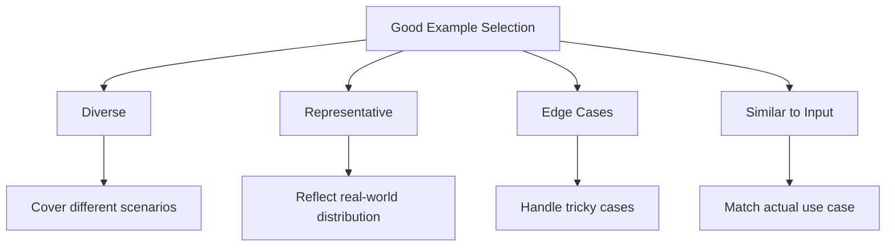
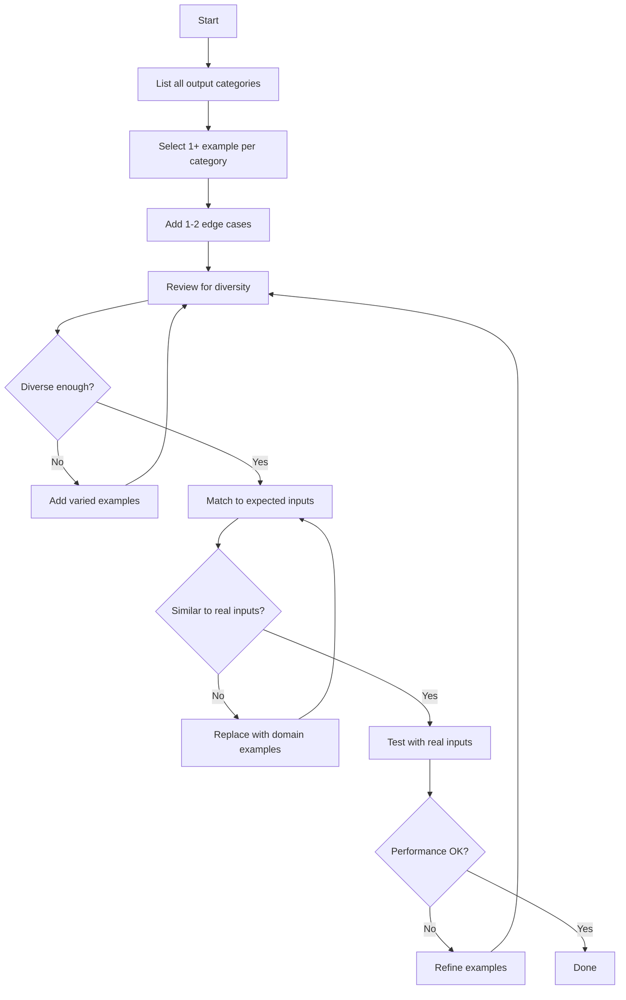

# Example Selection Strategies

## Introduction

The examples you choose for few-shot prompting directly impact output quality. Poor examples lead to poor pattern recognition; great examples lead to consistent, accurate results. This lesson covers how to select examples that maximize model performance.

> **🔑 Key Concept:** Examples should be **diverse enough** to show the range of possible inputs, but **consistent enough** that the model learns the right pattern.

### What We'll Cover

- Diversity in example selection
- Representative cases and coverage
- Edge case handling
- Matching examples to expected inputs

### Prerequisites

- [What is Few-Shot Learning?](./01-what-is-few-shot-learning.md)

---

## The Four Criteria for Good Examples



---

## Criterion 1: Diversity

Diverse examples show the model the range of inputs and outputs it should handle. If all examples are similar, the model may not generalize well.

### Why Diversity Matters

**Homogeneous examples (bad):**
```
Review: "Great product, love it!"
Sentiment: Positive

Review: "Amazing quality, highly recommend!"
Sentiment: Positive

Review: "Best purchase ever, fantastic!"
Sentiment: Positive

Review: "The product arrived late."
Sentiment:
```

The model only saw positive examples. It might default to "Positive" even for negative or neutral inputs.

**Diverse examples (good):**
```
Review: "Great product, love it!"
Sentiment: Positive

Review: "Terrible quality, fell apart immediately."
Sentiment: Negative

Review: "It's okay, nothing special."
Sentiment: Neutral

Review: "The product arrived late."
Sentiment:
```

Now the model has seen all three categories and can make informed decisions.

### Diversity Dimensions

| Dimension | Example |
|-----------|---------|
| **Output classes** | Include examples of each possible output category |
| **Input length** | Short, medium, and long inputs |
| **Complexity** | Simple and complex cases |
| **Vocabulary** | Formal and informal language |
| **Domain** | Different subtopics within your domain |

---

## Criterion 2: Representative Cases

Examples should reflect the real-world distribution of inputs your system will encounter. Don't over-represent rare cases at the expense of common ones.

### Matching Real-World Distribution

If 80% of your inputs are straightforward and 20% are edge cases, your examples should roughly reflect that:

```
# 3 straightforward examples (common cases)
Input: "Schedule a meeting for tomorrow at 2pm"
Intent: schedule_meeting

Input: "What's the weather like today?"
Intent: weather_query

Input: "Set a reminder to call mom"
Intent: set_reminder

# 1 edge case example
Input: "Cancel my 3pm if it rains"
Intent: conditional_cancel

# Now process:
Input: "Book a conference room for Monday"
Intent:
```

### Avoid Over-Representing Edge Cases

| ❌ Over-represented edges | ✅ Balanced representation |
|--------------------------|---------------------------|
| 3 edge cases, 1 common case | 3 common cases, 1 edge case |
| Model learns edges are "normal" | Model learns true distribution |

---

## Criterion 3: Edge Case Coverage

While you shouldn't over-represent edge cases, you should include at least one or two to show the model how to handle tricky situations.

### Types of Edge Cases

| Edge Case Type | Example |
|----------------|---------|
| **Ambiguous input** | Text that could be classified multiple ways |
| **Missing information** | Input that lacks expected data |
| **Mixed signals** | Positive and negative elements in same input |
| **Unusual format** | Non-standard input structure |
| **Empty/minimal input** | Very short or empty content |

### Example: Handling Mixed Signals

```
Review: "I love this product!"
Sentiment: Positive

Review: "Awful, complete waste of money."
Sentiment: Negative

Review: "The quality is great but the price is too high."
Sentiment: Mixed

Review: "Fast shipping, product was broken on arrival."
Sentiment:
```

By including the "Mixed" example, you teach the model that outputs aren't always binary.

### Example: Handling Missing Information

```
Extract the shipping address.

Order: "Ship to 123 Main St, Boston, MA 02101"
Address: {"street": "123 Main St", "city": "Boston", 
          "state": "MA", "zip": "02101"}

Order: "Deliver to John Smith in California"
Address: {"street": null, "city": null, 
          "state": "California", "zip": null, 
          "note": "Incomplete address"}

Order: "Send to 456 Oak Ave, Portland"
Address:
```

The second example shows how to handle incomplete data.

---

## Criterion 4: Similarity to Expected Inputs

Your examples should look like the actual inputs your system will process. Don't use examples from a different domain or format.

### Domain Matching

**Mismatched domain (bad):**

Task: Classify customer support tickets for a software company

```
Complaint: "My soup was cold."
Category: Food Quality

Complaint: "The waiter was rude."
Category: Service

Complaint: "My software keeps crashing."
Category:
```

Restaurant examples don't help with software tickets.

**Matched domain (good):**
```
Ticket: "The app won't launch on my phone."
Category: Bug - Mobile

Ticket: "How do I reset my password?"
Category: Account - Password

Ticket: "Can you add dark mode?"
Category: Feature Request

Ticket: "My software keeps crashing."
Category:
```

Software-specific examples produce better results.

### Format Matching

If your inputs will be JSON, use JSON examples:

```
Parse this API response and extract the user count.

Response: {"status": "ok", "data": {"users": 150}}
User Count: 150

Response: {"status": "ok", "data": {"active_users": 89}}
User Count: 89

Response: {"status": "error", "message": "Not found"}
User Count: 0

Response: {"status": "ok", "data": {"users": 432, "premium": 50}}
User Count:
```

---

## Example Selection Workflow

### Step-by-Step Process



### Checklist for Example Selection

Before finalizing your examples, verify:

- [ ] Each output category is represented
- [ ] Examples vary in length and complexity
- [ ] At least one edge case is included
- [ ] Examples match the domain of actual inputs
- [ ] Format of examples matches expected input format
- [ ] Examples are high-quality (correct outputs)

---

## Anti-Patterns to Avoid

### Repetitive Examples

```
❌ Bad: Same pattern three times
Email: "Meeting at 3pm"
Subject: Meeting

Email: "Meeting at 4pm"
Subject: Meeting

Email: "Meeting at 5pm"
Subject: Meeting
```

### Only Happy Path

```
❌ Bad: No error handling shown
Input: "John Smith, john@email.com"
Output: {"name": "John Smith", "email": "john@email.com"}

Input: "Jane Doe, jane@email.com"
Output: {"name": "Jane Doe", "email": "jane@email.com"}

What if input is "No email provided"?
```

### Examples with Errors

```
❌ Bad: Typos or mistakes in examples
Review: "Great product"
Sentment: Postive    ← Typos!

The model may replicate your errors.
```

---

## Best Practices

| Practice | Why It Matters |
|----------|----------------|
| One example per output class | Ensures all classes are learnable |
| Include edge cases | Teaches handling of tricky inputs |
| Match your domain | Generic examples produce generic results |
| Use high-quality examples | Model learns from your mistakes too |
| Test with real inputs | Verify examples work in practice |

---

## Common Pitfalls

| ❌ Mistake | ✅ Solution |
|-----------|-------------|
| All examples same category | Balance across all output types |
| Only easy cases | Include at least one edge case |
| Wrong domain examples | Use examples from your actual domain |
| Errors in example outputs | Double-check all outputs are correct |
| Too similar examples | Vary length, complexity, vocabulary |

---

## Hands-on Exercise

### Your Task

You're building a customer intent classifier for an e-commerce chatbot. Select appropriate examples for these intent categories:
- Order Status
- Returns/Refunds
- Product Questions
- Account Issues
- General Inquiry

### Requirements

1. Create one example per category
2. Include at least one edge case (ambiguous intent)
3. Vary the input style (questions, statements, complaints)

<details>
<summary>💡 Hints (click to expand)</summary>

- What kinds of messages will customers actually send?
- Can a message belong to multiple categories?
- What about very short or unclear messages?

</details>

<details>
<summary>✅ Solution (click to expand)</summary>

```
Classify customer messages into intents.

Message: "Where is my order? I ordered 3 days ago."
Intent: Order Status

Message: "This product is broken, I want my money back."
Intent: Returns/Refunds

Message: "Does this laptop come with a warranty?"
Intent: Product Questions

Message: "I can't log into my account."
Intent: Account Issues

Message: "Hi, I have a question."
Intent: General Inquiry

Message: "I can't track my return, the page won't load."
Intent: Order Status + Account Issues (multiple)

Message: "Help"
Intent: General Inquiry (clarification needed)

Message: "The order I returned never got refunded and 
I need to check status on my new order too."
Intent:
```

**Note:** The solution includes:
- One standard example per category (diverse outputs)
- An edge case with multiple intents
- An edge case with minimal input
- Varied input styles (questions, statements, short messages)

</details>

### Bonus Challenge

- [ ] Reduce to just 4 examples while maintaining quality

---

## Summary

✅ **Diversity** — Cover different scenarios, outputs, and input types

✅ **Representative** — Match the real-world distribution of inputs

✅ **Edge cases** — Include 1-2 tricky examples to show handling

✅ **Similarity** — Use examples that match your actual domain and format

✅ **Quality** — Ensure examples are correct and error-free

**Next:** [Example Formatting](./03-example-formatting.md)

---

## Further Reading

- [OpenAI Prompt Engineering Guide](https://platform.openai.com/docs/guides/prompt-engineering)
- [Google Gemini Prompting Strategies](https://ai.google.dev/gemini-api/docs/prompting-strategies)

---

<!-- 
Sources Consulted:
- OpenAI Prompt Engineering: https://platform.openai.com/docs/guides/prompt-engineering
- Google Gemini Prompting Strategies: https://ai.google.dev/gemini-api/docs/prompting-strategies
-->
