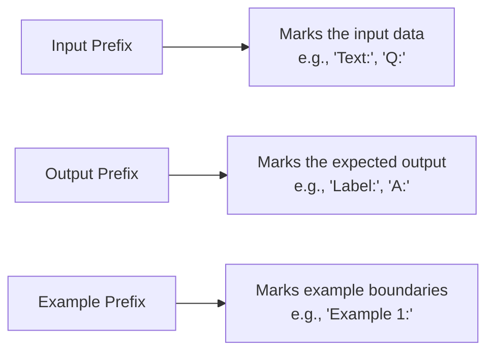

# Example Formatting

## Introduction

Even with great examples, poor formatting can confuse the model. Consistent structure, clear delimiters, and proper labeling help the model recognize the pattern you're teaching. This lesson covers the mechanics of formatting few-shot examples for maximum effectiveness.

> **🔑 Key Concept:** The model learns format from your examples. If your examples use inconsistent formatting, the model's outputs will be inconsistent too.

### What We'll Cover

- Input/output pair structure
- Delimiter strategies
- Consistent formatting rules
- Labeling and prefixes

### Prerequisites

- [Example Selection Strategies](./02-example-selection.md)

---

## Input/Output Pair Structure

Every few-shot example consists of an input and its corresponding output. The structure of these pairs should be identical across all examples.

### Basic Structure

```
[Input Label]: [input content]
[Output Label]: [output content]
```

### Example Formats

| Style | Example |
|-------|---------|
| **Question/Answer** | `Q: What is 2+2?` → `A: 4` |
| **Input/Output** | `Input: hello` → `Output: HELLO` |
| **Text/Label** | `Text: Great product!` → `Label: Positive` |
| **Before/After** | `Before: messy code` → `After: clean code` |

### Choosing Your Format

Pick labels that make semantic sense for your task:

```
# For translation
English: Hello
French: Bonjour

# For classification
Review: "Amazing product"
Sentiment: Positive

# For extraction
Document: "Contact: john@example.com"
Email: john@example.com

# For transformation
Original: The quick brown fox.
Reversed: .xof nworb kciuq ehT
```

---

## Delimiter Strategies

Delimiters help the model understand where one example ends and another begins.

### Common Delimiter Patterns

| Delimiter | Example |
|-----------|---------|
| **Blank lines** | Separate examples with empty lines |
| **Numbered sections** | `Example 1:`, `Example 2:` |
| **Horizontal rules** | `---` between examples |
| **XML tags** | `<example>...</example>` |

### Blank Line Separation

```
Product: Wireless headphones with noise cancellation
Category: Electronics

Product: Organic cotton t-shirt
Category: Clothing

Product: Stainless steel water bottle
Category:
```

### Numbered Examples

```
Example 1:
Input: "The movie was fantastic!"
Output: Positive

Example 2:
Input: "Worst film I've ever seen."
Output: Negative

Example 3:
Input: "It was okay, nothing special."
Output: Neutral

Now classify:
Input: "Absolutely loved every minute!"
Output:
```

### XML Tag Delimiters

For complex examples or when blank lines might appear in content:

```
<examples>

<example id="1">
<input>Calculate 15% tip on $50</input>
<output>$7.50</output>
</example>

<example id="2">
<input>Calculate 20% tip on $80</input>
<output>$16.00</output>
</example>

</examples>

<query>
Calculate 18% tip on $65
</query>
```

---

## Consistent Formatting Rules

Inconsistent formatting is the most common few-shot mistake. The model learns whatever patterns you show—including your inconsistencies.

### The Consistency Checklist

| Element | Keep Consistent |
|---------|-----------------|
| **Labels** | Same text: `Input:` not sometimes `INPUT:` |
| **Punctuation** | Same ending: colon, no colon, etc. |
| **Spacing** | Same whitespace around labels |
| **Case** | Same capitalization pattern |
| **Structure** | Same number of lines per example |

### ❌ Inconsistent Example (Common Mistake)

```
Input: Hello world
Output: HELLO WORLD

input: "goodbye world"
Result: GOODBYE WORLD

Text = another example
OUTPUT: ANOTHER EXAMPLE
```

Problems:
- Labels change: Input/input/Text
- Punctuation changes: no quotes / quotes
- Output labels change: Output/Result/OUTPUT
- Format changes: colon / equals

### ✅ Consistent Example (Correct)

```
Input: Hello world
Output: HELLO WORLD

Input: goodbye world
Output: GOODBYE WORLD

Input: another example
Output: ANOTHER EXAMPLE
```

---

## Labeling and Prefixes

Labels (also called prefixes) mark different parts of your examples. Google's documentation specifically recommends three prefix types.

### The Three Prefix Types



### Input Prefix Examples

| Task | Appropriate Input Prefix |
|------|-------------------------|
| Translation | `English:`, `French:` |
| Sentiment | `Review:`, `Text:` |
| Q&A | `Question:`, `Q:` |
| Code | `Code:`, `Function:` |
| Summarization | `Document:`, `Article:` |

### Output Prefix Examples

| Task | Appropriate Output Prefix |
|------|--------------------------|
| Translation | `French:`, `Spanish:` |
| Sentiment | `Sentiment:`, `Label:` |
| Q&A | `Answer:`, `A:` |
| Code | `Fixed:`, `Optimized:` |
| Summarization | `Summary:`, `TL;DR:` |

### Prefix Best Practices

| Practice | Example |
|----------|---------|
| **Semantic meaning** | `Sentiment:` not `Output:` for sentiment tasks |
| **Short and clear** | `Q:` is fine if meaning is obvious |
| **Include colon** | `Input:` not `Input` for clarity |
| **Match your completion** | End with same prefix for model to complete |

---

## Advanced Formatting Patterns

### Multi-Field Output

When output has multiple fields:

```
Profile: John Smith, 28, Software Engineer at TechCorp
Extracted:
- Name: John Smith
- Age: 28
- Title: Software Engineer
- Company: TechCorp

Profile: Sarah Lee, 34, Data Scientist at DataInc
Extracted:
- Name: Sarah Lee
- Age: 34
- Title: Data Scientist
- Company: DataInc

Profile: Mike Chen, 45, CEO at StartupXYZ
Extracted:
```

### JSON Output Format

```
Convert to JSON.

Text: "Meeting with Alice on Tuesday at 3pm"
JSON: {"event": "Meeting", "attendee": "Alice", 
       "day": "Tuesday", "time": "3pm"}

Text: "Call Bob tomorrow morning"
JSON: {"event": "Call", "attendee": "Bob", 
       "day": "tomorrow", "time": "morning"}

Text: "Lunch with team on Friday at noon"
JSON:
```

### Showing Reasoning (Chain of Thought)

```
Question: If a shirt costs $25 and is 20% off, what's the final price?
Reasoning: 20% of $25 = $5 discount. $25 - $5 = $20.
Answer: $20

Question: If a book costs $15 and you buy 3, what's the total?
Reasoning: $15 × 3 = $45.
Answer: $45

Question: If a pizza costs $18 and you tip 15%, what's the total?
Reasoning:
```

---

## Formatting for Different Output Types

### Single Value Output

```
City: Paris
Country: France

City: Tokyo
Country: Japan

City: Sydney
Country:
```

### List Output

```
Sentence: The quick brown fox jumps.
Words:
- The
- quick
- brown
- fox
- jumps

Sentence: I love programming.
Words:
- I
- love
- programming

Sentence: Hello world today.
Words:
```

### Structured Output

```
Order: "2 large coffees and 1 muffin"
Items:
  - quantity: 2
    item: coffee
    size: large
  - quantity: 1
    item: muffin
    size: null

Order: "3 small teas"
Items:
  - quantity: 3
    item: tea
    size: small

Order: "1 medium latte and 2 cookies"
Items:
```

---

## Best Practices

| Practice | Why It Matters |
|----------|----------------|
| Use semantic labels | `Sentiment:` is clearer than `Output:` |
| Keep exact consistency | Same labels, punctuation, spacing everywhere |
| Use clear delimiters | Blank lines or markers between examples |
| Match output format | Examples should show exact desired output format |
| End with partial | Final example should trail off for completion |

---

## Common Pitfalls

| ❌ Mistake | ✅ Solution |
|-----------|-------------|
| Inconsistent labels | `Input:` everywhere, not `Input:`/`input:`/`INPUT:` |
| No delimiters | Add blank lines between examples |
| Forgetting completion cue | End with input prefix only |
| Extra formatting in output | If you want plain text, examples should be plain |
| Different structures | Same number of fields in each example |

---

## Hands-on Exercise

### Your Task

Fix the formatting issues in this few-shot prompt:

```
Input: "hello"
output HELLO

TEXT "goodbye"
output: Goodbye

input: "EXAMPLE"
Result: example
```

### Requirements

1. Make all labels consistent
2. Use proper delimiters
3. Ensure consistent punctuation and spacing
4. Add a final example for completion

<details>
<summary>💡 Hints (click to expand)</summary>

- Pick one capitalization style for labels
- Pick one punctuation pattern (colon or no colon)
- Pick one quote style (or none)
- Add blank lines between examples
- End with `Input:` and `Output:` for completion

</details>

<details>
<summary>✅ Solution (click to expand)</summary>

```
Convert text to uppercase.

Input: hello
Output: HELLO

Input: goodbye
Output: GOODBYE

Input: example
Output: EXAMPLE

Input: this is a test
Output:
```

**Changes made:**
- Consistent labels: `Input:` and `Output:`
- Consistent capitalization: First letter uppercase
- Removed quotes (not needed for simple text)
- Added blank line delimiters
- Fixed third example (was lowercase output)
- Added completion cue at the end

</details>

### Bonus Challenge

- [ ] Reformat using XML tags instead of plain labels

---

## Summary

✅ **Input/output pairs** — Consistent structure for every example

✅ **Clear delimiters** — Blank lines, numbers, or XML tags

✅ **Consistent formatting** — Same labels, punctuation, spacing

✅ **Semantic prefixes** — Labels that match your task meaning

✅ **Completion cue** — End with partial input for model to complete

**Next:** [Number of Examples Optimization](./04-number-of-examples.md)

---

## Further Reading

- [OpenAI Prompt Engineering Guide](https://platform.openai.com/docs/guides/prompt-engineering)
- [Google Gemini Add Prefixes](https://ai.google.dev/gemini-api/docs/prompting-strategies)

---

<!-- 
Sources Consulted:
- OpenAI Prompt Engineering: https://platform.openai.com/docs/guides/prompt-engineering
- Google Gemini Prompting Strategies: https://ai.google.dev/gemini-api/docs/prompting-strategies
-->
