# Number of Examples Optimization

## Introduction

How many examples should you include in a few-shot prompt? Too few and the model may not learn the pattern; too many and you waste tokens and money. This lesson explores the trade-offs and helps you find the optimal number for your use case.

> **🔑 Key Concept:** There are diminishing returns with examples. Going from 0→3 examples usually provides a big improvement; going from 5→10 examples often provides minimal gain at double the cost.

### What We'll Cover

- Diminishing returns analysis
- Token cost considerations
- Quality vs. quantity trade-offs
- Practical recommendations by task type

### Prerequisites

- [Example Formatting](./03-example-formatting.md)

---

## The Diminishing Returns Curve

Adding more examples helps—up to a point. After that, you're spending tokens without improving results.

```mermaid
flowchart LR
    subgraph Performance["Performance Improvement"]
        A["0→1: Big jump"] --> B["1→3: Significant"] --> C["3→5: Moderate"] --> D["5→10: Minimal"]
    end
```



### Typical Performance Pattern

| Examples | Performance Impact | Notes |
|----------|-------------------|-------|
| 0 (zero-shot) | Baseline | Often works for simple tasks |
| 1 (one-shot) | +30-50% | Establishes basic pattern |
| 2-3 | +20-30% additional | Covers diversity, reinforces pattern |
| 4-5 | +5-15% additional | Good for complex tasks |
| 6-10 | +1-5% additional | Diminishing returns |
| 10+ | Minimal to none | May cause overfitting |

> **Note:** These percentages are illustrative. Actual improvement varies significantly by model, task, and example quality.

---

## Token Cost Considerations

Every token in your prompt costs money and increases latency. Examples are often the largest part of your prompt.

### Token Cost Calculation

```
Total prompt tokens = System instructions + Examples + Current input
                    = ~100 tokens + (N × tokens_per_example) + ~50 tokens
```

### Example Cost Analysis

| Examples | Tokens per Example | Total Example Tokens | Est. Cost (GPT-4) |
|----------|-------------------|---------------------|-------------------|
| 2 | 50 | 100 | $0.003 |
| 5 | 50 | 250 | $0.0075 |
| 10 | 50 | 500 | $0.015 |
| 20 | 50 | 1000 | $0.03 |

*Costs are approximate and vary by model and pricing tier.*

### The Cost-Benefit Question


---

## Quality vs. Quantity

Five excellent examples beat ten mediocre ones. Focus on example quality before adding more.

### Quality Indicators

| Quality Factor | High Quality | Low Quality |
|----------------|--------------|-------------|
| **Relevance** | Matches actual use case | Generic examples |
| **Correctness** | Output is accurate | Contains errors |
| **Clarity** | Unambiguous input/output | Confusing cases |
| **Diversity** | Covers different scenarios | All similar |
| **Formatting** | Consistent structure | Inconsistent |

### Example Quality Improvement

**Low quality (more won't help):**
```
Review: good
Sentiment: positive

Review: bad
Sentiment: negative

Review: ok
Sentiment: neutral
```

**High quality (fewer work better):**
```
Review: "The battery life exceeded all my expectations. 
Easily lasts 2 days with heavy use."
Sentiment: Positive

Review: "Arrived broken and customer service was unhelpful. 
Complete waste of money."
Sentiment: Negative

Review: "It works as described. Nothing exceptional but 
does the job."
Sentiment: Neutral
```

---

## Recommendations by Task Type

Different tasks have different optimal example counts.

### Simple Classification

**Recommended: 2-3 examples**

```
Classify emails as Spam or Not Spam.

Email: "Congratulations! You won $1,000,000!"
Class: Spam

Email: "Your meeting has been rescheduled to 3pm."
Class: Not Spam

Email: "Hot singles in your area want to meet!"
Class: Spam

Email: "Please review the attached proposal."
Class:
```

### Format Transformation

**Recommended: 2-4 examples**

```
Convert to title case.

Input: hello world
Output: Hello World

Input: THE QUICK BROWN FOX
Output: The Quick Brown Fox

Input: javaScript is FUN
Output:
```

### Complex Extraction

**Recommended: 4-6 examples**

More examples help with edge cases and field variations.

### Creative Generation

**Recommended: 2-3 examples**

Too many examples can constrain creativity.

### Mathematical/Logical Reasoning

**Recommended: 3-5 examples with reasoning**

Show step-by-step thinking in each example.

### Summary Table

| Task Type | Optimal Count | Reasoning |
|-----------|---------------|-----------|
| Binary classification | 2-3 | Simple decision boundary |
| Multi-class classification | 3-5 | One per class + edge case |
| Format conversion | 2-3 | Pattern is straightforward |
| Entity extraction | 4-6 | Many edge cases |
| Translation | 2-3 | Strong pre-trained ability |
| Summarization | 2-3 | Show length/style preference |
| Complex reasoning | 3-5 | Chain of thought needed |
| Creative writing | 2-3 | Avoid constraining creativity |

---

## Testing Example Count

Don't guess—test different counts and measure results.

### A/B Testing Approach

```python
# Pseudocode for testing example counts

example_counts = [1, 2, 3, 5, 7]
test_cases = load_test_cases()  # Known input/output pairs

results = {}
for count in example_counts:
    examples = select_examples(count)
    accuracy = 0
    
    for test in test_cases:
        prompt = build_prompt(examples, test.input)
        output = call_llm(prompt)
        if output == test.expected:
            accuracy += 1
    
    results[count] = accuracy / len(test_cases)
    print(f"{count} examples: {results[count]:.1%} accuracy")
```

### What to Measure

| Metric | How to Measure |
|--------|----------------|
| **Accuracy** | % of correct outputs |
| **Format compliance** | % matching expected structure |
| **Latency** | Time per request |
| **Cost** | Tokens consumed |
| **Edge case handling** | Success on tricky inputs |

---

## Context Window Constraints

Large language models have finite context windows. Too many examples can leave insufficient room for input or output.

### Context Budget Planning

```
Model Context Window: 128K tokens

Budget allocation:
- System prompt: 500 tokens
- Few-shot examples: 2,000 tokens (cap)
- User input: 1,000 tokens (expected max)
- Output room: 500 tokens (expected max)
- Safety margin: 500 tokens
-----------------------------------
Available for context/RAG: 123,500 tokens
```

### When Examples Compete with Context

In RAG applications, you must balance:
- Few-shot examples (teach the format)
- Retrieved context (provide information)

```
Option A: 10 examples, 5 context chunks
Option B: 3 examples, 15 context chunks

Often, Option B produces better results because 
the model has more relevant information to work with.
```

---

## Overfitting to Examples

Yes, you can "overfit" with too many examples. The model starts mimicking your examples too literally instead of generalizing.

### Signs of Overfitting

| Symptom | Cause |
|---------|-------|
| Outputs copy example phrasing | Too many similar examples |
| Can't handle variations | Examples too narrow |
| Inconsistent on new inputs | Pattern not generalizable |

### Example: Overfitting

```
20 examples all with short, one-word inputs

Input: dog
Category: Animal

Input: cat
Category: Animal

... (18 more similar examples)

Input: The large brown dog ran across the park
Category: ???
```

The model may struggle because all examples were single words.

---

## Best Practices

| Practice | Why It Matters |
|----------|----------------|
| Start with 3 | Good baseline for most tasks |
| Prioritize quality | Better examples beat more examples |
| Test different counts | Find optimal for your task |
| Consider token cost | Balance quality with budget |
| Leave room for context | Don't fill the context window |

---

## Common Pitfalls

| ❌ Mistake | ✅ Solution |
|-----------|-------------|
| Using 10+ examples by default | Start with 3, add only if needed |
| Same quality as quantity | Focus on example quality first |
| No testing | A/B test different counts |
| Filling context window | Reserve space for input and output |
| Ignoring cost | Consider tokens × requests × price |

---

## Hands-on Exercise

### Your Task

You have this 5-example sentiment classifier. Test if you can reduce to 3 examples without losing accuracy.

```
Classify the sentiment.

Review: "Absolutely amazing product, exceeded expectations!"
Sentiment: Positive

Review: "Complete waste of money, doesn't work at all."
Sentiment: Negative

Review: "It's okay, nothing special but gets the job done."
Sentiment: Neutral

Review: "Best purchase I've ever made, highly recommend!"
Sentiment: Positive

Review: "Terrible quality, fell apart after one use."
Sentiment: Negative

Review: "Love the design but hate the price."
Sentiment:
```

### Requirements

1. Identify which examples to keep
2. Explain your selection reasoning
3. Predict if accuracy will suffer

<details>
<summary>💡 Hints (click to expand)</summary>

- Do you need two positive examples? Two negative?
- Which examples are most different from each other?
- The last test case has mixed sentiment—is that covered?

</details>

<details>
<summary>✅ Solution (click to expand)</summary>

**Reduced to 3 examples:**
```
Classify the sentiment.

Review: "Absolutely amazing product, exceeded expectations!"
Sentiment: Positive

Review: "Complete waste of money, doesn't work at all."
Sentiment: Negative

Review: "It's okay, nothing special but gets the job done."
Sentiment: Neutral

Review: "Love the design but hate the price."
Sentiment:
```

**Reasoning:**
- Kept one example per category (positive, negative, neutral)
- Removed redundant positive and negative examples
- The neutral example is important for the test case (mixed sentiment)

**Accuracy prediction:** Should remain high. The three examples clearly establish the pattern with one of each category. The test case has mixed sentiment, which is similar to "neutral" tone.

**Optional improvement:** Add "Mixed" as fourth category with its own example if mixed sentiment outputs are desired.

</details>

### Bonus Challenge

- [ ] Calculate the token savings from 5 → 3 examples

---

## Summary

✅ **Diminishing returns** — 3 examples often nearly as good as 10

✅ **Token cost** — More examples = more cost per request

✅ **Quality over quantity** — Better examples beat more examples

✅ **Task-dependent** — Simple tasks need fewer examples

✅ **Test and measure** — Don't guess, experiment with counts

**Next:** [Zero-Shot vs Few-Shot Trade-offs](./05-zero-vs-few-shot.md)

---

## Further Reading

- [OpenAI Prompt Engineering Guide](https://platform.openai.com/docs/guides/prompt-engineering)
- [Google Gemini Optimal Number of Examples](https://ai.google.dev/gemini-api/docs/prompting-strategies)

---

<!-- 
Sources Consulted:
- OpenAI Prompt Engineering: https://platform.openai.com/docs/guides/prompt-engineering
- Google Gemini Prompting Strategies: https://ai.google.dev/gemini-api/docs/prompting-strategies
-->
