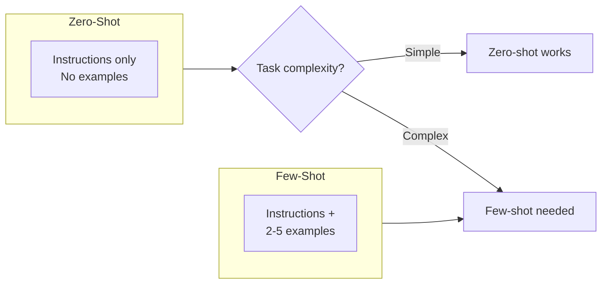
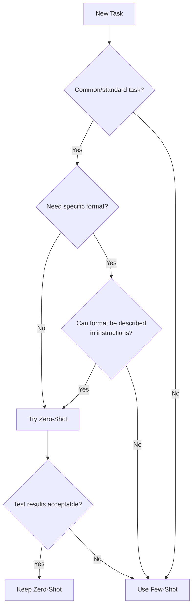

# Zero-Shot vs Few-Shot Trade-offs

## Introduction

Not every task needs few-shot examples. For many tasks, a well-crafted zero-shot prompt (with no examples) works just as well—and costs less. This lesson helps you decide when to use each approach and understand the trade-offs involved.

> **🤖 AI Context:** Google's documentation states: "We recommend to always include few-shot examples in your prompts." However, this is guidance for the general case. For simple tasks with clear instructions, zero-shot often suffices.

### What We'll Cover

- When zero-shot is sufficient
- When few-shot is necessary
- Cost and latency considerations
- Decision framework

### Prerequisites

- [Number of Examples Optimization](./04-number-of-examples.md)

---

## Zero-Shot vs Few-Shot Defined



### Comparison at a Glance

| Aspect | Zero-Shot | Few-Shot |
|--------|-----------|----------|
| Examples in prompt | 0 | 2-5+ |
| Token usage | Lower | Higher |
| Latency | Faster | Slower |
| Cost per request | Lower | Higher |
| Format consistency | Variable | High |
| Task coverage | Common tasks | Any task |
| Setup effort | Minimal | Requires examples |

---

## When Zero-Shot is Sufficient

Zero-shot works well when the model already "knows" how to do the task from its training data.

### Good Zero-Shot Candidates

| Task Type | Example |
|-----------|---------|
| **Common transformations** | Translate, summarize, expand |
| **General knowledge** | Answer factual questions |
| **Simple instructions** | "Write a poem about X" |
| **Standard formats** | "Return as JSON" |
| **Well-defined tasks** | Spell check, grammar fix |

### Example: Zero-Shot Success

```
Translate the following text to Spanish:

"The weather is beautiful today."
```

**Output:**
```
El clima está hermoso hoy.
```

No examples needed—translation is a well-known task.

### Zero-Shot with Clear Format Instructions

```
Extract all email addresses from this text.
Return them as a JSON array.

Text: "Contact us at support@example.com or sales@example.com 
for more information."
```

**Output:**
```json
["support@example.com", "sales@example.com"]
```

The model knows email patterns and JSON format.

---

## When Few-Shot is Necessary

Few-shot shines when you need specific behavior that can't be easily described in instructions.

### Few-Shot Required Scenarios

| Scenario | Why Few-Shot Helps |
|----------|-------------------|
| **Custom formats** | Model can't guess your specific format |
| **Precise decision boundaries** | Examples define what's in/out |
| **Unusual tasks** | Not in model's training distribution |
| **Subjective judgments** | Your criteria differ from default |
| **Edge case handling** | Show how to handle tricky cases |

### Example: Custom Classification

**Zero-shot (likely to fail):**
```
Classify this support ticket using our internal categories:
Level 1, Level 2, or Escalate.

Ticket: "My account was hacked and money is missing."
```

The model doesn't know your specific category definitions.

**Few-shot (works better):**
```
Classify support tickets using our categories.

Ticket: "I can't reset my password."
Category: Level 1

Ticket: "The app crashes when I upload photos."
Category: Level 2

Ticket: "I found a security vulnerability in your system."
Category: Escalate

Ticket: "My account was hacked and money is missing."
Category:
```

Examples teach your specific category boundaries.

### Example: Custom Output Format

**Zero-shot (unpredictable format):**
```
Analyze the sentiment of this review and provide details.
```

Could return paragraph, bullets, JSON, or anything.

**Few-shot (consistent format):**
```
Analyze sentiment with our format.

Review: "Great product, fast shipping!"
Analysis:
- Sentiment: Positive
- Confidence: High
- Key phrases: "great product", "fast shipping"

Review: "It's okay, nothing special."
Analysis:
- Sentiment: Neutral
- Confidence: Medium
- Key phrases: "okay", "nothing special"

Review: "Absolutely terrible, waste of money."
Analysis:
```

Now every response will follow your exact format.

---

## Cost and Latency Considerations

The practical impact of choosing between zero and few-shot.

### Token Cost Comparison

| Prompt Type | Tokens | Cost at $0.03/1K |
|-------------|--------|------------------|
| Zero-shot | ~100 | $0.003 |
| 3-shot | ~300 | $0.009 |
| 5-shot | ~450 | $0.0135 |

*3x more tokens = 3x more cost*

### Latency Impact

More tokens = longer processing time:

| Prompt Type | Relative Latency |
|-------------|-----------------|
| Zero-shot | 1x (baseline) |
| 3-shot | 1.2-1.5x |
| 5-shot | 1.3-1.8x |

### Cost Over Scale

| Daily Requests | Zero-shot Cost | 3-shot Cost | Difference |
|----------------|---------------|-------------|------------|
| 1,000 | $3 | $9 | +$6 |
| 10,000 | $30 | $90 | +$60 |
| 100,000 | $300 | $900 | +$600 |

At scale, the difference is significant.

---

## Decision Framework

Use this flowchart to decide between zero-shot and few-shot:



### Decision Questions

| Question | If Yes | If No |
|----------|--------|-------|
| Is this a common task (translation, summarization)? | Try zero-shot | Consider few-shot |
| Can the output format be fully described? | Zero-shot may work | Few-shot needed |
| Does the model "know" this task? | Try zero-shot | Few-shot needed |
| Are results consistent with zero-shot? | Keep zero-shot | Add examples |
| Is token cost a major concern? | Favor zero-shot | Few-shot acceptable |

---

## Hybrid Approach: Instructions + Examples

Often the best results come from combining clear instructions with a few examples.

### The Combined Strategy

```
# Instructions (zero-shot component)
Classify customer support tickets into categories.
Output only the category name, nothing else.
Categories: Billing, Technical, Account, Other

# Examples (few-shot component)
Ticket: "I was charged twice for my order."
Category: Billing

Ticket: "The app won't install on my phone."
Category: Technical

Ticket: "I need to change my email address."
Category: Account

# Current task
Ticket: "How do I cancel my subscription?"
Category:
```

### Why Combined Works Best

| Component | What It Provides |
|-----------|------------------|
| Instructions | Clear rules, category definitions |
| Examples | Format demonstration, edge case handling |
| Both together | Clarity + consistency |

---

## Task-Specific Recommendations

| Task | Recommendation | Reasoning |
|------|----------------|-----------|
| Translation | Zero-shot | Well-trained task |
| Summarization | Zero-shot + length instruction | Common task |
| Custom classification | Few-shot | Need to teach categories |
| Entity extraction | Few-shot | Format varies widely |
| Creative writing | Zero-shot | Don't constrain creativity |
| Code generation | Zero-shot or 1-shot | Well-trained, show style if needed |
| Format conversion | 1-2 shot | Show input/output structure |
| Sentiment analysis | Zero or few-shot | Zero works for basic, few for custom |

---

## Testing Your Choice

Don't assume—validate your approach.

### A/B Test Protocol

1. **Create test set**: 20-50 representative inputs with expected outputs
2. **Run zero-shot**: Record accuracy and format compliance
3. **Run few-shot**: Same test set, same metrics
4. **Compare**: Is the improvement worth the cost?

### Example Comparison Results

| Metric | Zero-Shot | 3-Shot | Difference |
|--------|-----------|--------|------------|
| Accuracy | 82% | 91% | +9% |
| Format compliance | 65% | 98% | +33% |
| Avg latency | 0.8s | 1.1s | +0.3s |
| Cost per 1000 | $3.00 | $9.00 | +$6.00 |

**Decision:** If format compliance is critical → use few-shot. If format is flexible and 82% accuracy is acceptable → use zero-shot.

---

## Best Practices

| Practice | Why It Matters |
|----------|----------------|
| Try zero-shot first | Start simple, add complexity if needed |
| Test both approaches | Don't assume, measure |
| Consider scale | Cost difference compounds at volume |
| Format needs examples | Consistent format usually needs few-shot |
| Combine when possible | Instructions + examples often work best |

---

## Common Pitfalls

| ❌ Mistake | ✅ Solution |
|-----------|-------------|
| Always using few-shot | Test if zero-shot works first |
| Always using zero-shot | Add examples when format inconsistent |
| Not testing | A/B test before deciding |
| Ignoring cost at scale | Calculate total cost at expected volume |
| Using few-shot for creative tasks | Let model be creative; fewer constraints |

---

## Hands-on Exercise

### Your Task

For each of these tasks, predict whether zero-shot or few-shot would work better, then explain your reasoning.

**Tasks:**
1. Translate English text to French
2. Classify emails as "Marketing", "Personal", "Work", or "Spam"
3. Extract dates from unstructured text
4. Generate a haiku about nature
5. Convert CSV data to JSON format

<details>
<summary>💡 Hints (click to expand)</summary>

- Is this a common task models are trained on?
- Does the output need a specific format?
- Are the categories standard or custom?

</details>

<details>
<summary>✅ Solution (click to expand)</summary>

1. **Translate English to French**
   - **Answer:** Zero-shot
   - **Reasoning:** Translation is a well-trained task. Models excel at this without examples.

2. **Classify emails as "Marketing", "Personal", "Work", or "Spam"**
   - **Answer:** Few-shot (2-4 examples)
   - **Reasoning:** Custom category definitions. "Work" vs "Personal" boundaries are subjective.

3. **Extract dates from unstructured text**
   - **Answer:** Few-shot (2-3 examples)
   - **Reasoning:** Output format matters (which date format?). Examples show expected format.

4. **Generate a haiku about nature**
   - **Answer:** Zero-shot
   - **Reasoning:** Creative task. Models know haiku format. Examples might constrain creativity.

5. **Convert CSV to JSON format**
   - **Answer:** One-shot or few-shot (1-2 examples)
   - **Reasoning:** Show the expected JSON structure. Different JSON formats are possible.

</details>

### Bonus Challenge

- [ ] Test one of these tasks both ways and compare results

---

## Summary

✅ **Zero-shot works for** — Common tasks, well-defined formats, creative work

✅ **Few-shot works for** — Custom classification, specific formats, edge cases

✅ **Cost consideration** — Few-shot costs 2-5x more per request

✅ **Test both** — Don't assume, measure actual results

✅ **Combine approaches** — Instructions + examples often works best

**Next:** [Dynamic Example Selection](./06-dynamic-example-selection.md)

---

## Further Reading

- [OpenAI Prompt Engineering Guide](https://platform.openai.com/docs/guides/prompt-engineering)
- [Google Gemini Zero-Shot vs Few-Shot](https://ai.google.dev/gemini-api/docs/prompting-strategies)

---

<!-- 
Sources Consulted:
- OpenAI Prompt Engineering: https://platform.openai.com/docs/guides/prompt-engineering
- Google Gemini Prompting Strategies: https://ai.google.dev/gemini-api/docs/prompting-strategies
-->
