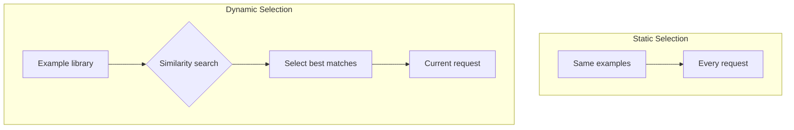
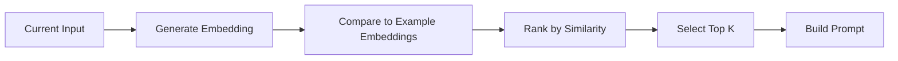

# Dynamic Example Selection

## Introduction

Static few-shot prompts use the same examples for every request. Dynamic example selection chooses examples at runtime based on the current input. This produces better results because the examples are always relevant to the specific query being processed.

> **🤖 AI Context:** Dynamic selection is a form of RAG (Retrieval-Augmented Generation) for examples. Instead of retrieving documents, you retrieve the most relevant examples from your example library.

### What We'll Cover

- Runtime example selection
- Similarity-based retrieval
- Task-specific example matching
- A/B testing examples

### Prerequisites

- [Zero-Shot vs Few-Shot Trade-offs](./05-zero-vs-few-shot.md)

---

## Static vs. Dynamic Examples



### Comparison

| Aspect | Static Examples | Dynamic Examples |
|--------|----------------|------------------|
| Examples used | Always the same | Vary per request |
| Relevance | Generic | Highly relevant |
| Setup complexity | Low | Medium-High |
| Maintenance | Edit prompt | Manage example library |
| Performance | Good | Often better |
| Best for | Uniform input types | Diverse input types |

---

## Why Dynamic Selection Works Better

When examples are similar to the current input, the model has an easier time applying the learned pattern.

### Example: Customer Support Classification

**Static examples (always used):**
```
Ticket: "I can't log into my account"
Category: Account

Ticket: "The app crashes on startup"
Category: Technical
```

**Current input:** "The checkout button doesn't work"

These examples help, but neither is about checkout issues.

**Dynamically selected examples:**
```
Ticket: "Payment fails at checkout"
Category: Technical

Ticket: "Cart total is wrong"
Category: Technical
```

These examples are directly relevant to the checkout issue.

---

## Similarity-Based Retrieval

The most common approach uses embedding similarity to find relevant examples.

### How It Works



### Implementation Pattern

```python
# Pseudocode for similarity-based example selection

from openai import OpenAI
import numpy as np

client = OpenAI()

# Pre-computed example library
example_library = [
    {
        "input": "I can't log in",
        "output": "Account",
        "embedding": [0.1, 0.2, ...]  # Pre-computed
    },
    {
        "input": "The app crashes",
        "output": "Technical", 
        "embedding": [0.3, 0.1, ...]
    },
    # ... more examples
]

def get_embedding(text):
    response = client.embeddings.create(
        model="text-embedding-3-small",
        input=text
    )
    return response.data[0].embedding

def cosine_similarity(a, b):
    return np.dot(a, b) / (np.linalg.norm(a) * np.linalg.norm(b))

def select_examples(current_input, k=3):
    # Get embedding for current input
    input_embedding = get_embedding(current_input)
    
    # Calculate similarity to each example
    scored = []
    for example in example_library:
        similarity = cosine_similarity(
            input_embedding, 
            example["embedding"]
        )
        scored.append((similarity, example))
    
    # Sort by similarity and return top k
    scored.sort(reverse=True, key=lambda x: x[0])
    return [ex for (score, ex) in scored[:k]]

def build_prompt(current_input):
    examples = select_examples(current_input, k=3)
    
    prompt = "Classify support tickets.\n\n"
    for ex in examples:
        prompt += f"Ticket: \"{ex['input']}\"\n"
        prompt += f"Category: {ex['output']}\n\n"
    
    prompt += f"Ticket: \"{current_input}\"\n"
    prompt += "Category:"
    
    return prompt
```

### Embedding Models for Similarity

| Model | Speed | Quality | Cost |
|-------|-------|---------|------|
| text-embedding-3-small | Fast | Good | Low |
| text-embedding-3-large | Medium | High | Medium |
| sentence-transformers | Fast | Good | Free (self-hosted) |

---

## Task-Specific Example Matching

Beyond semantic similarity, you can match examples by task-specific criteria.

### Category-Aware Selection

Ensure examples cover all relevant categories:

```python
def select_diverse_examples(current_input, k=3):
    # Get similar examples
    similar = select_by_similarity(current_input, k=10)
    
    # Ensure category diversity
    selected = []
    categories_seen = set()
    
    for example in similar:
        category = example["output"]
        if category not in categories_seen or len(selected) < k:
            selected.append(example)
            categories_seen.add(category)
        
        if len(selected) >= k:
            break
    
    return selected
```

### Input-Type Matching

Match by input characteristics:

```python
def select_by_input_type(current_input, k=3):
    # Analyze input characteristics
    is_question = "?" in current_input
    is_long = len(current_input) > 100
    has_urgency = any(w in current_input.lower() 
                     for w in ["urgent", "asap", "emergency"])
    
    # Filter examples by matching characteristics
    matching = [
        ex for ex in example_library
        if matches_characteristics(ex, is_question, is_long, has_urgency)
    ]
    
    # Then sort by similarity within matching set
    return select_by_similarity(current_input, k=k, pool=matching)
```

### Difficulty-Based Selection

Match example complexity to input complexity:

| Input Complexity | Example Selection |
|------------------|-------------------|
| Simple, short | Simple examples |
| Complex, multi-part | Complex examples with reasoning |
| Technical jargon | Technical examples |
| Casual language | Casual examples |

---

## Managing an Example Library

Dynamic selection requires maintaining a quality example library.

### Library Structure

```python
example_library = [
    {
        "id": "ex-001",
        "input": "How do I reset my password?",
        "output": "Account",
        "embedding": [...],
        "metadata": {
            "category": "Account",
            "difficulty": "easy",
            "created": "2025-01-15",
            "verified": True
        }
    },
    # ...
]
```

### Library Maintenance Tasks

| Task | Frequency | Purpose |
|------|-----------|---------|
| Add new examples | As needed | Cover new scenarios |
| Remove outdated examples | Quarterly | Keep library current |
| Verify example quality | Monthly | Ensure correctness |
| Recompute embeddings | When model changes | Maintain compatibility |
| Analyze usage patterns | Weekly | Identify gaps |

### Building Your Initial Library

1. **Start with representative examples** (20-50)
2. **Add edge cases** (10-20)
3. **Monitor production failures** → add corrective examples
4. **Rotate out low-performing examples**

---

## A/B Testing Examples

Not sure which examples work best? Test them.

### Testing Different Example Sets

```python
import random

def get_examples_ab_test(current_input, variant=None):
    if variant is None:
        variant = random.choice(["A", "B"])
    
    if variant == "A":
        # Original example set
        examples = select_examples_v1(current_input)
    else:
        # New example set being tested
        examples = select_examples_v2(current_input)
    
    return examples, variant

def log_result(input, output, variant, is_correct):
    # Log for later analysis
    log.append({
        "input": input,
        "output": output,
        "variant": variant,
        "correct": is_correct
    })
```

### Metrics to Track

| Metric | What It Tells You |
|--------|-------------------|
| Accuracy | Which examples produce correct outputs |
| Format compliance | Which examples produce consistent format |
| Edge case handling | Which examples handle tricky inputs |
| Token usage | Which examples are more efficient |

### Analyzing A/B Results

```python
def analyze_ab_test(logs):
    variant_a = [l for l in logs if l["variant"] == "A"]
    variant_b = [l for l in logs if l["variant"] == "B"]
    
    accuracy_a = sum(l["correct"] for l in variant_a) / len(variant_a)
    accuracy_b = sum(l["correct"] for l in variant_b) / len(variant_b)
    
    print(f"Variant A accuracy: {accuracy_a:.1%}")
    print(f"Variant B accuracy: {accuracy_b:.1%}")
    
    # Statistical significance test
    # (implement chi-square or similar)
```

---

## Caching and Performance

Dynamic selection adds latency. Optimize for production use.

### Caching Strategies

| Cache Level | What to Cache | Benefit |
|-------------|---------------|---------|
| **Embedding cache** | Input → embedding | Skip embedding API call |
| **Selection cache** | Input hash → examples | Skip similarity search |
| **Prompt cache** | Full prompt for common inputs | Skip all processing |

### Example Caching Implementation

```python
from functools import lru_cache
import hashlib

# Cache embeddings
@lru_cache(maxsize=10000)
def get_embedding_cached(text):
    return get_embedding(text)

# Cache selection results for exact matches
selection_cache = {}

def select_examples_cached(current_input, k=3):
    cache_key = hashlib.md5(current_input.encode()).hexdigest()
    
    if cache_key in selection_cache:
        return selection_cache[cache_key]
    
    examples = select_examples(current_input, k)
    selection_cache[cache_key] = examples
    
    return examples
```

---

## Best Practices

| Practice | Why It Matters |
|----------|----------------|
| Pre-compute embeddings | Avoid API calls at runtime |
| Cache common queries | Reduce latency for repeated inputs |
| Balance similarity with diversity | Cover different scenarios |
| Maintain example quality | Bad examples produce bad results |
| Monitor and iterate | Continuously improve library |

---

## Common Pitfalls

| ❌ Mistake | ✅ Solution |
|-----------|-------------|
| Computing embeddings at runtime | Pre-compute and store |
| Too small example library | 50+ examples for dynamic selection |
| No diversity guarantee | Force category coverage |
| Stale examples | Regular maintenance schedule |
| No monitoring | Track which examples are selected |

---

## Hands-on Exercise

### Your Task

Design a dynamic example selection system for a product recommendation chatbot.

### Scenario

Users ask about products in various categories:
- Electronics
- Clothing
- Home & Garden
- Sports

Your example library has 100 examples across all categories.

### Requirements

1. Design the example selection logic
2. Ensure category relevance
3. Handle cross-category queries
4. Describe your caching strategy

<details>
<summary>💡 Hints (click to expand)</summary>

- How will you detect which category the user is asking about?
- What if they ask about multiple categories?
- Should you always include at least one example per category?
- What's the trade-off between similarity and diversity?

</details>

<details>
<summary>✅ Solution (click to expand)</summary>

```python
# Dynamic Example Selection for Product Chatbot

import numpy as np
from collections import defaultdict

class ProductExampleSelector:
    def __init__(self, example_library):
        self.examples = example_library
        self.category_index = self._build_category_index()
    
    def _build_category_index(self):
        """Group examples by category for diversity sampling"""
        index = defaultdict(list)
        for ex in self.examples:
            index[ex["category"]].append(ex)
        return index
    
    def _detect_categories(self, query):
        """Detect which categories the query mentions"""
        query_lower = query.lower()
        detected = []
        
        keywords = {
            "Electronics": ["laptop", "phone", "tv", "computer", "tablet"],
            "Clothing": ["shirt", "dress", "shoes", "jacket", "pants"],
            "Home & Garden": ["furniture", "plant", "kitchen", "decor"],
            "Sports": ["bike", "gym", "running", "workout", "tennis"]
        }
        
        for category, words in keywords.items():
            if any(word in query_lower for word in words):
                detected.append(category)
        
        return detected if detected else list(keywords.keys())
    
    def select_examples(self, query, k=4):
        """Select k examples with similarity and diversity"""
        
        # Get query embedding
        query_embedding = get_embedding_cached(query)
        
        # Detect relevant categories
        relevant_categories = self._detect_categories(query)
        
        # Get candidate examples from relevant categories
        candidates = []
        for cat in relevant_categories:
            candidates.extend(self.category_index[cat])
        
        # Score by similarity
        scored = []
        for ex in candidates:
            sim = cosine_similarity(query_embedding, ex["embedding"])
            scored.append((sim, ex))
        
        scored.sort(reverse=True, key=lambda x: x[0])
        
        # Select with diversity guarantee
        selected = []
        categories_used = set()
        
        for sim, ex in scored:
            cat = ex["category"]
            
            # First pass: one per detected category
            if cat in relevant_categories and cat not in categories_used:
                selected.append(ex)
                categories_used.add(cat)
            
            if len(selected) >= min(k, len(relevant_categories)):
                break
        
        # Fill remaining slots with most similar
        for sim, ex in scored:
            if ex not in selected and len(selected) < k:
                selected.append(ex)
        
        return selected

# Caching strategy
embedding_cache = {}
selection_cache = {}

def get_embedding_cached(text):
    if text not in embedding_cache:
        embedding_cache[text] = get_embedding(text)
    return embedding_cache[text]

def select_with_cache(selector, query, k=4):
    cache_key = f"{hash(query)}_{k}"
    
    if cache_key not in selection_cache:
        selection_cache[cache_key] = selector.select_examples(query, k)
    
    return selection_cache[cache_key]

# Cache invalidation: Clear selection_cache when example library changes
# Cache size limits: Use LRU eviction when embedding_cache grows too large
```

**Design decisions:**
1. **Category detection** — Keyword-based to quickly narrow candidates
2. **Diversity guarantee** — At least one example per detected category
3. **Similarity ranking** — Most similar examples selected within constraints
4. **Two-level caching** — Embeddings (expensive) and selections (full results)
5. **Cross-category handling** — Defaults to all categories if none detected

</details>

### Bonus Challenge

- [ ] Add time-decay to prefer recently added examples

---

## Summary

✅ **Dynamic selection** — Choose examples at runtime based on input

✅ **Similarity-based** — Use embeddings to find relevant examples

✅ **Diversity balance** — Ensure coverage of different categories

✅ **Library management** — Maintain quality example collection

✅ **Caching** — Pre-compute embeddings, cache selections

**Next:** [RAG-Enhanced Few-Shot](./07-rag-enhanced-few-shot.md)

---

## Further Reading

- [OpenAI Embeddings Guide](https://platform.openai.com/docs/guides/embeddings)
- [Semantic Similarity Search](https://www.pinecone.io/learn/semantic-search/)

---

<!-- 
Sources Consulted:
- OpenAI Prompt Engineering: https://platform.openai.com/docs/guides/prompt-engineering
- OpenAI Embeddings: https://platform.openai.com/docs/guides/embeddings
-->
