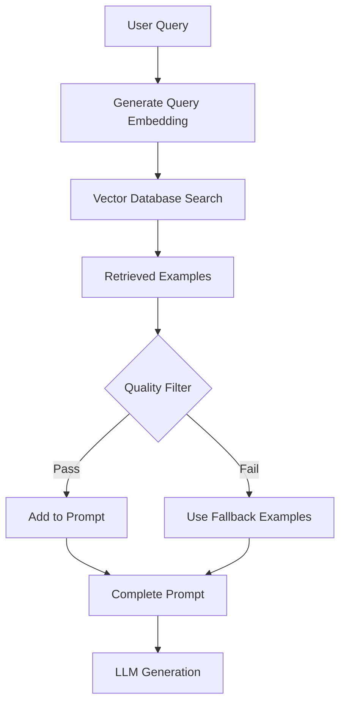
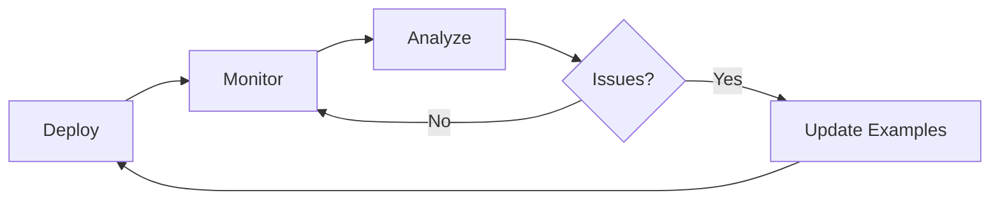

# RAG-Enhanced Few-Shot

## Introduction

RAG-Enhanced Few-Shot combines the power of retrieval-augmented generation with few-shot learning. Instead of using static examples, you retrieve relevant examples from a vector database based on the current query. This produces the most relevant examples possible for each request, significantly improving output quality.

> **🤖 AI Context:** This is essentially "RAG for examples." Just as you retrieve relevant documents for context, you retrieve relevant examples for pattern learning. The two techniques can work together in a single prompt.

### What We'll Cover

- Retrieving examples from vector databases
- Semantic similarity for example selection
- Dynamic example count based on context
- Combining retrieved examples with curated ones
- Example quality scoring

### Prerequisites

- [Dynamic Example Selection](./06-dynamic-example-selection.md)

---

## RAG-Enhanced Few-Shot Architecture



---

## Setting Up the Vector Database

Store your examples with embeddings in a vector database for fast similarity search.

### Example Schema

```python
# Example structure in vector DB
{
    "id": "ex-001",
    "input": "How do I cancel my subscription?",
    "output": "Category: Account\nPriority: Medium",
    "embedding": [0.012, -0.034, 0.089, ...],  # 1536 dimensions
    "metadata": {
        "category": "Account",
        "priority": "Medium",
        "quality_score": 0.95,
        "created_at": "2025-01-15",
        "times_used": 142,
        "success_rate": 0.89
    }
}
```

### Vector Database Options

| Database | Type | Best For |
|----------|------|----------|
| **Pinecone** | Managed | Production, scale |
| **Chroma** | Local/Cloud | Development, small scale |
| **Weaviate** | Self-hosted/Cloud | Hybrid search |
| **pgvector** | PostgreSQL extension | Existing Postgres infra |
| **Qdrant** | Self-hosted/Cloud | High performance |

### Indexing Examples

```python
# Pseudocode for indexing examples

from openai import OpenAI
import chromadb

client = OpenAI()
chroma_client = chromadb.Client()

# Create collection for examples
collection = chroma_client.create_collection(
    name="few_shot_examples",
    metadata={"hnsw:space": "cosine"}
)

def index_example(example):
    # Generate embedding
    response = client.embeddings.create(
        model="text-embedding-3-small",
        input=example["input"]
    )
    embedding = response.data[0].embedding
    
    # Store in vector DB
    collection.add(
        ids=[example["id"]],
        embeddings=[embedding],
        documents=[example["input"]],
        metadatas=[{
            "output": example["output"],
            "category": example["category"],
            "quality_score": example.get("quality_score", 1.0)
        }]
    )

# Index all examples
for example in example_library:
    index_example(example)
```

---

## Retrieving Examples

At runtime, query the vector database to find the most relevant examples.

### Basic Retrieval

```python
def retrieve_examples(query, k=3):
    # Generate query embedding
    response = client.embeddings.create(
        model="text-embedding-3-small",
        input=query
    )
    query_embedding = response.data[0].embedding
    
    # Search vector database
    results = collection.query(
        query_embeddings=[query_embedding],
        n_results=k,
        include=["documents", "metadatas", "distances"]
    )
    
    # Format as examples
    examples = []
    for i, doc in enumerate(results["documents"][0]):
        examples.append({
            "input": doc,
            "output": results["metadatas"][0][i]["output"],
            "similarity": 1 - results["distances"][0][i]  # Convert distance to similarity
        })
    
    return examples
```

### Filtered Retrieval

Add metadata filters to narrow results:

```python
def retrieve_examples_filtered(query, category=None, min_quality=0.8, k=3):
    # Build filter
    where_filter = {}
    if category:
        where_filter["category"] = category
    if min_quality:
        where_filter["quality_score"] = {"$gte": min_quality}
    
    # Generate query embedding
    query_embedding = get_embedding(query)
    
    # Search with filter
    results = collection.query(
        query_embeddings=[query_embedding],
        n_results=k,
        where=where_filter if where_filter else None
    )
    
    return format_examples(results)
```

---

## Dynamic Example Count

Not every query needs the same number of examples. Adjust based on query complexity and available context.

### Strategies for Dynamic Count

| Strategy | Description |
|----------|-------------|
| **Similarity threshold** | Include all examples above a similarity score |
| **Complexity-based** | More examples for complex queries |
| **Context budget** | Adjust based on remaining token budget |
| **Quality-based** | More examples if quality is lower |

### Similarity Threshold Approach

```python
def retrieve_examples_by_threshold(query, threshold=0.7, max_k=5):
    """Retrieve all examples above similarity threshold"""
    
    # Get more candidates than we need
    results = collection.query(
        query_embeddings=[get_embedding(query)],
        n_results=max_k
    )
    
    # Filter by similarity threshold
    examples = []
    for i, distance in enumerate(results["distances"][0]):
        similarity = 1 - distance
        if similarity >= threshold:
            examples.append({
                "input": results["documents"][0][i],
                "output": results["metadatas"][0][i]["output"],
                "similarity": similarity
            })
    
    return examples
```

### Context Budget Approach

```python
def retrieve_within_budget(query, token_budget=500):
    """Retrieve as many examples as fit in token budget"""
    
    examples = retrieve_examples(query, k=10)  # Get candidates
    
    selected = []
    tokens_used = 0
    
    for ex in examples:
        ex_tokens = count_tokens(format_example(ex))
        if tokens_used + ex_tokens <= token_budget:
            selected.append(ex)
            tokens_used += ex_tokens
        else:
            break
    
    return selected
```

---

## Combining Retrieved and Curated Examples

Some examples should always be included regardless of query. Combine retrieved examples with curated "anchor" examples.

### The Hybrid Approach

```python
# Curated anchor examples (always included)
ANCHOR_EXAMPLES = [
    {
        "input": "What are your business hours?",
        "output": "Category: General\nPriority: Low",
        "purpose": "Shows general query handling"
    },
    {
        "input": "This is urgent, my account was hacked!",
        "output": "Category: Security\nPriority: Critical",
        "purpose": "Shows high-priority handling"
    }
]

def get_combined_examples(query, retrieved_k=3):
    # Get retrieved examples
    retrieved = retrieve_examples(query, k=retrieved_k)
    
    # Remove duplicates (if any anchor matches retrieved)
    anchor_inputs = {ex["input"] for ex in ANCHOR_EXAMPLES}
    retrieved_unique = [
        ex for ex in retrieved 
        if ex["input"] not in anchor_inputs
    ]
    
    # Combine: anchors first, then retrieved
    combined = ANCHOR_EXAMPLES + retrieved_unique[:retrieved_k]
    
    return combined
```

### When to Use Hybrid

| Situation | Approach |
|-----------|----------|
| Critical edge cases must be shown | Include as anchors |
| Format must be exact | Anchor with format example |
| Safety boundaries needed | Anchor with boundary examples |
| General relevance | Use retrieved examples |

---

## Example Quality Scoring

Not all examples are equally good. Score and filter by quality.

### Quality Metrics

| Metric | What It Measures |
|--------|------------------|
| **Correctness** | Is the output accurate? |
| **Clarity** | Is the example unambiguous? |
| **Relevance** | Does it match common inputs? |
| **Success rate** | Historical accuracy when used |
| **Recency** | How recently was it verified? |

### Computing Quality Scores

```python
def compute_quality_score(example, usage_stats):
    """Compute composite quality score for an example"""
    
    scores = {}
    
    # Correctness (manual verification)
    scores["correctness"] = example.get("verified", False) * 1.0
    
    # Success rate (from usage tracking)
    if example["id"] in usage_stats:
        stats = usage_stats[example["id"]]
        scores["success_rate"] = stats["correct"] / stats["total"]
    else:
        scores["success_rate"] = 0.5  # Unknown default
    
    # Recency (prefer recently verified examples)
    days_old = (datetime.now() - example["verified_date"]).days
    scores["recency"] = max(0, 1 - (days_old / 365))
    
    # Weighted average
    weights = {
        "correctness": 0.4,
        "success_rate": 0.4,
        "recency": 0.2
    }
    
    quality = sum(
        scores[k] * weights[k] 
        for k in weights
    )
    
    return quality
```

### Filtering by Quality

```python
def retrieve_quality_examples(query, min_quality=0.7, k=3):
    # Get more candidates than needed
    candidates = retrieve_examples(query, k=k*3)
    
    # Filter by quality
    quality_filtered = [
        ex for ex in candidates
        if ex.get("quality_score", 0) >= min_quality
    ]
    
    # Return top k by similarity (already sorted)
    return quality_filtered[:k]
```

---

## Full RAG-Enhanced Few-Shot Pipeline

Putting it all together:

```python
class RAGFewShotPromptBuilder:
    def __init__(self, collection, anchor_examples=None):
        self.collection = collection
        self.anchors = anchor_examples or []
    
    def build_prompt(
        self, 
        query, 
        system_prompt,
        k=3,
        min_quality=0.7,
        similarity_threshold=0.5
    ):
        # Step 1: Retrieve relevant examples
        retrieved = self.retrieve_filtered(
            query, 
            k=k, 
            min_quality=min_quality,
            threshold=similarity_threshold
        )
        
        # Step 2: Combine with anchors
        examples = self.combine_examples(retrieved)
        
        # Step 3: Build the prompt
        prompt = f"{system_prompt}\n\n"
        prompt += "# Examples\n\n"
        
        for ex in examples:
            prompt += f"Input: {ex['input']}\n"
            prompt += f"Output: {ex['output']}\n\n"
        
        prompt += f"# Current Query\n\n"
        prompt += f"Input: {query}\n"
        prompt += "Output:"
        
        return prompt
    
    def retrieve_filtered(self, query, k, min_quality, threshold):
        # Get candidates
        results = self.collection.query(
            query_embeddings=[get_embedding(query)],
            n_results=k * 3,
            where={"quality_score": {"$gte": min_quality}}
        )
        
        # Filter by similarity threshold
        examples = []
        for i, distance in enumerate(results["distances"][0]):
            similarity = 1 - distance
            if similarity >= threshold:
                examples.append({
                    "input": results["documents"][0][i],
                    "output": results["metadatas"][0][i]["output"],
                    "similarity": similarity,
                    "quality_score": results["metadatas"][0][i]["quality_score"]
                })
        
        return examples[:k]
    
    def combine_examples(self, retrieved):
        # Deduplicate
        retrieved_inputs = {ex["input"] for ex in retrieved}
        unique_anchors = [
            a for a in self.anchors 
            if a["input"] not in retrieved_inputs
        ]
        
        return unique_anchors + retrieved

# Usage
builder = RAGFewShotPromptBuilder(
    collection=example_collection,
    anchor_examples=CRITICAL_EXAMPLES
)

prompt = builder.build_prompt(
    query="How do I get a refund?",
    system_prompt="Classify support tickets.",
    k=3,
    min_quality=0.8
)
```

---

## Monitoring and Improvement

Track example performance to continuously improve your library.

### What to Track

| Metric | Purpose |
|--------|---------|
| Which examples are selected | Identify over/under-used examples |
| Success rate per example | Find high/low quality examples |
| Similarity scores | Identify coverage gaps |
| Category distribution | Ensure balanced coverage |

### Continuous Improvement Loop



---

## Best Practices

| Practice | Why It Matters |
|----------|----------------|
| Pre-compute embeddings | Fast retrieval at runtime |
| Use quality scores | Filter out low-quality examples |
| Include anchor examples | Ensure critical cases are covered |
| Monitor selection patterns | Identify gaps in coverage |
| Regularly update library | Keep examples current |

---

## Common Pitfalls

| ❌ Mistake | ✅ Solution |
|-----------|-------------|
| Computing embeddings at runtime | Pre-index all examples |
| No quality filtering | Score and filter examples |
| Ignoring edge cases | Add anchor examples for critical cases |
| Static example library | Regularly review and update |
| No monitoring | Track which examples are used |

---

## Hands-on Exercise

### Your Task

Design a RAG-enhanced few-shot system for a code review assistant.

### Scenario

You have 500 examples of code snippets with review comments:
- Different programming languages (Python, JavaScript, Java)
- Different issue types (bugs, style, performance, security)
- Varying complexity levels

### Requirements

1. Design the example schema for the vector database
2. Define quality scoring criteria
3. Create a retrieval strategy that considers language and issue type
4. Include anchor examples for security issues (critical)

<details>
<summary>💡 Hints (click to expand)</summary>

- How will you filter by programming language?
- Should security examples always be included?
- What metadata will help with quality scoring?
- How will you handle multi-language queries?

</details>

<details>
<summary>✅ Solution (click to expand)</summary>

```python
# RAG-Enhanced Few-Shot for Code Review

# 1. Example Schema
EXAMPLE_SCHEMA = {
    "id": "string",
    "code_snippet": "string",
    "review_comment": "string",
    "embedding": "vector[1536]",  # From code_snippet
    "metadata": {
        "language": "python|javascript|java|other",
        "issue_type": "bug|style|performance|security",
        "severity": "low|medium|high|critical",
        "quality_score": "float",  # 0-1
        "verified": "boolean",
        "verified_date": "date",
        "times_used": "int",
        "success_rate": "float"
    }
}

# 2. Quality Scoring
def compute_code_review_quality(example, usage_stats):
    scores = {
        "verified": 1.0 if example["metadata"]["verified"] else 0.5,
        "success_rate": usage_stats.get(example["id"], {}).get("success_rate", 0.5),
        "recency": compute_recency_score(example["metadata"]["verified_date"]),
        "completeness": 1.0 if len(example["review_comment"]) > 50 else 0.7
    }
    
    weights = {"verified": 0.3, "success_rate": 0.4, "recency": 0.15, "completeness": 0.15}
    return sum(scores[k] * weights[k] for k in weights)

# 3. Retrieval Strategy
class CodeReviewExampleRetriever:
    def __init__(self, collection):
        self.collection = collection
        self.security_anchors = self._load_security_anchors()
    
    def retrieve(self, code_snippet, detected_language=None, k=3):
        # Build filter
        where_filter = {"quality_score": {"$gte": 0.7}}
        if detected_language:
            where_filter["language"] = detected_language
        
        # Retrieve candidates
        candidates = self.collection.query(
            query_embeddings=[get_embedding(code_snippet)],
            n_results=k * 2,
            where=where_filter
        )
        
        # Format results
        retrieved = self._format_results(candidates)[:k]
        
        # Always include security anchor if security-related
        if self._is_security_related(code_snippet):
            retrieved = self._add_security_anchor(retrieved)
        
        return retrieved
    
    def _is_security_related(self, code):
        security_patterns = ["password", "sql", "eval(", "exec(", 
                          "input(", "secret", "token", "auth"]
        return any(p in code.lower() for p in security_patterns)
    
    def _add_security_anchor(self, examples):
        # Add critical security example if not already present
        anchor = self.security_anchors[0]  # Always include this
        if anchor["code_snippet"] not in [e["input"] for e in examples]:
            return [anchor] + examples[:-1]  # Replace last example
        return examples

# 4. Security Anchor Examples
SECURITY_ANCHORS = [
    {
        "code_snippet": '''
def login(user, password):
    query = f"SELECT * FROM users WHERE username='{user}' AND password='{password}'"
    return db.execute(query)
''',
        "review_comment": '''CRITICAL SECURITY ISSUE: SQL Injection vulnerability.
Never use f-strings to build SQL queries. Use parameterized queries:
```python
query = "SELECT * FROM users WHERE username=? AND password=?"
return db.execute(query, (user, password))
```
This prevents attackers from injecting malicious SQL.''',
        "metadata": {
            "language": "python",
            "issue_type": "security",
            "severity": "critical",
            "quality_score": 1.0
        }
    },
    # Add more security anchors for XSS, auth bypass, etc.
]
```

**Design decisions:**
1. **Embed code snippets** — More relevant than embedding comments
2. **Language filtering** — Return same-language examples when possible
3. **Security anchors** — Always include for security-sensitive code
4. **Quality threshold** — Minimum 0.7 score for retrieval
5. **Severity metadata** — Enables filtering critical issues

</details>

### Bonus Challenge

- [ ] Add a feedback loop that updates quality scores based on developer acceptance

---

## Summary

✅ **Vector database storage** — Index examples with embeddings

✅ **Semantic retrieval** — Find examples similar to current query

✅ **Dynamic count** — Adjust examples based on similarity or budget

✅ **Hybrid approach** — Combine retrieved examples with curated anchors

✅ **Quality scoring** — Filter for high-quality examples

**Next:** [Chain-of-Thought Prompting](../05-chain-of-thought/)

---

## Further Reading

- [OpenAI Embeddings Guide](https://platform.openai.com/docs/guides/embeddings)
- [Pinecone Vector Database](https://docs.pinecone.io/)
- [Chroma Documentation](https://docs.trychroma.com/)

---

<!-- 
Sources Consulted:
- OpenAI Prompt Engineering: https://platform.openai.com/docs/guides/prompt-engineering
- OpenAI Embeddings: https://platform.openai.com/docs/guides/embeddings
- Pinecone: https://docs.pinecone.io/
-->
