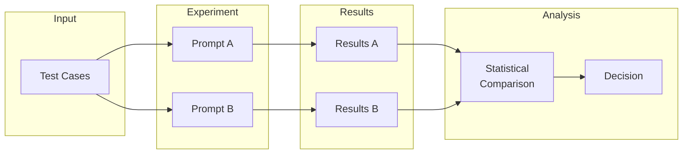
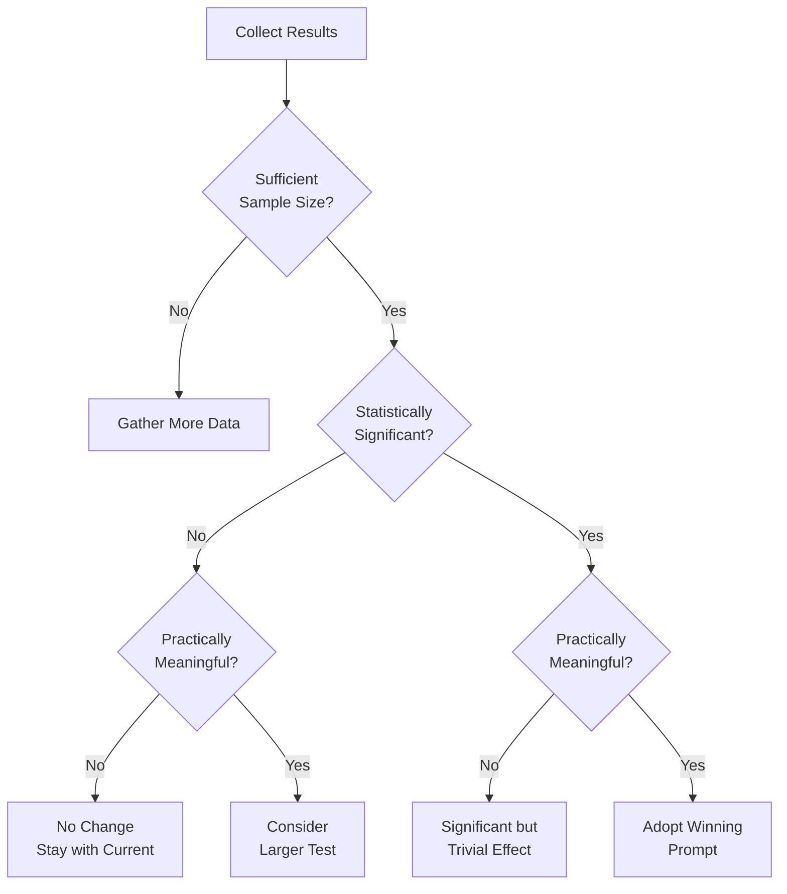

# A/B Testing Prompts

## Introduction

A/B testing provides empirical evidence for prompt selection. Instead of guessing which prompt is better, you systematically compare variants on real or representative data. This lesson covers experimental design, statistical analysis, and decision-making for prompt experiments.

> **🔑 Key Insight:** The best prompt on a small sample might not be the best at scale. Statistical rigor separates informed decisions from lucky guesses.

### What We'll Cover

- Experiment design fundamentals
- Sample size determination
- Statistical significance testing
- Interpreting results correctly
- Running and documenting experiments

### Prerequisites

- [Evaluation Metrics](./01-evaluation-metrics.md)
- Basic statistics (mean, standard deviation, confidence intervals)

---

## A/B Testing Fundamentals

### What is Prompt A/B Testing?

Compare two (or more) prompt variants on the same inputs, measure outcomes, and determine if observed differences are real or due to chance.



### Prompt Variables to Test

| Category | Examples | Impact Potential |
|----------|----------|------------------|
| **Instruction wording** | "Analyze" vs "Evaluate" vs "Review" | Medium |
| **Format specifications** | JSON vs Markdown vs plain text | High |
| **Example count** | 1-shot vs 3-shot vs 5-shot | High |
| **Role definitions** | Expert, assistant, specific persona | Medium |
| **Constraint ordering** | Safety first vs task first | Medium-High |
| **Output length guidance** | "Brief" vs "Detailed" vs word counts | High |

### Controlled Experiment Setup

```python
from dataclasses import dataclass
from typing import Callable
import random

@dataclass
class PromptExperiment:
    name: str
    prompt_a: str
    prompt_b: str
    test_cases: list[dict]
    evaluator: Callable[[str, dict], float]
    
def run_experiment(experiment: PromptExperiment, model: str) -> dict:
    """Run A/B test with controlled conditions."""
    
    results_a = []
    results_b = []
    
    # Shuffle to avoid ordering effects
    shuffled_cases = experiment.test_cases.copy()
    random.shuffle(shuffled_cases)
    
    for case in shuffled_cases:
        # Run both prompts on each case
        output_a = call_model(experiment.prompt_a, case["input"], model)
        output_b = call_model(experiment.prompt_b, case["input"], model)
        
        # Evaluate both outputs
        score_a = experiment.evaluator(output_a, case)
        score_b = experiment.evaluator(output_b, case)
        
        results_a.append({"case_id": case["id"], "output": output_a, "score": score_a})
        results_b.append({"case_id": case["id"], "output": output_b, "score": score_b})
    
    return {
        "experiment": experiment.name,
        "prompt_a": results_a,
        "prompt_b": results_b
    }
```

---

## Sample Size Determination

### Why Sample Size Matters

| Sample Size | Risk | Consequence |
|-------------|------|-------------|
| Too small | High variance | False positives/negatives |
| Too large | Wasted resources | Unnecessary cost |
| Just right | Reliable results | Efficient decisions |

### Factors Affecting Sample Size

1. **Effect size** - How big a difference matters to you?
2. **Baseline rate** - Current success/quality rate
3. **Statistical power** - Probability of detecting real effects (typically 0.80)
4. **Significance level** - False positive tolerance (typically 0.05)

### Sample Size Calculator

```python
from scipy import stats
import math

def calculate_sample_size(
    baseline_rate: float,
    minimum_detectable_effect: float,
    power: float = 0.80,
    alpha: float = 0.05
) -> int:
    """
    Calculate required sample size per variant.
    
    Args:
        baseline_rate: Current success rate (e.g., 0.70 for 70%)
        minimum_detectable_effect: Smallest improvement that matters (e.g., 0.05 for 5%)
        power: Statistical power (default 0.80)
        alpha: Significance level (default 0.05)
    
    Returns:
        Required samples per variant
    """
    p1 = baseline_rate
    p2 = baseline_rate + minimum_detectable_effect
    
    # Pooled probability
    p_pooled = (p1 + p2) / 2
    
    # Z-scores for power and significance
    z_alpha = stats.norm.ppf(1 - alpha / 2)  # Two-tailed
    z_beta = stats.norm.ppf(power)
    
    # Sample size formula for proportion comparison
    numerator = (z_alpha * math.sqrt(2 * p_pooled * (1 - p_pooled)) + 
                 z_beta * math.sqrt(p1 * (1 - p1) + p2 * (1 - p2))) ** 2
    denominator = (p2 - p1) ** 2
    
    n = numerator / denominator
    
    return math.ceil(n)

# Example usage
n = calculate_sample_size(
    baseline_rate=0.70,
    minimum_detectable_effect=0.05,
    power=0.80,
    alpha=0.05
)
print(f"Required samples per variant: {n}")
```

**Output:**
```
Required samples per variant: 783
```

### Quick Reference Table

| Baseline | Detectable Effect | Samples Needed (per variant) |
|----------|-------------------|------------------------------|
| 50% | 5% | ~770 |
| 70% | 5% | ~780 |
| 80% | 5% | ~680 |
| 70% | 10% | ~200 |
| 90% | 3% | ~380 |

> **Note:** These assume 80% power and α=0.05. Adjust based on your risk tolerance.

---

## Statistical Significance Testing

### Choosing the Right Test

| Data Type | Comparison | Test |
|-----------|------------|------|
| Binary (pass/fail) | Two proportions | Chi-squared, Fisher's exact |
| Continuous scores | Two means | t-test |
| Continuous (non-normal) | Two distributions | Mann-Whitney U |
| Paired observations | Same items, both prompts | Paired t-test, Wilcoxon |

### Testing Binary Outcomes

```python
from scipy.stats import chi2_contingency, fisher_exact
import numpy as np

def compare_success_rates(
    successes_a: int,
    total_a: int,
    successes_b: int,
    total_b: int
) -> dict:
    """Compare two prompt success rates."""
    
    # Contingency table
    #                 Success  Failure
    # Prompt A        s_a      f_a
    # Prompt B        s_b      f_b
    
    table = np.array([
        [successes_a, total_a - successes_a],
        [successes_b, total_b - successes_b]
    ])
    
    # Use Fisher's exact for small samples, chi-squared otherwise
    if min(table.flatten()) < 5:
        _, p_value = fisher_exact(table)
        test_used = "Fisher's exact"
    else:
        _, p_value, _, _ = chi2_contingency(table)
        test_used = "Chi-squared"
    
    rate_a = successes_a / total_a
    rate_b = successes_b / total_b
    
    return {
        "rate_a": rate_a,
        "rate_b": rate_b,
        "difference": rate_b - rate_a,
        "relative_improvement": (rate_b - rate_a) / rate_a if rate_a > 0 else float('inf'),
        "p_value": p_value,
        "test": test_used,
        "significant": p_value < 0.05
    }

# Example
result = compare_success_rates(
    successes_a=70, total_a=100,
    successes_b=82, total_b=100
)
print(f"Rate A: {result['rate_a']:.1%}")
print(f"Rate B: {result['rate_b']:.1%}")
print(f"p-value: {result['p_value']:.4f}")
print(f"Significant: {result['significant']}")
```

**Output:**
```
Rate A: 70.0%
Rate B: 82.0%
p-value: 0.0437
Significant: True
```

### Testing Continuous Scores

```python
from scipy import stats
import numpy as np

def compare_scores(
    scores_a: list[float],
    scores_b: list[float],
    paired: bool = False
) -> dict:
    """Compare score distributions between prompts."""
    
    a = np.array(scores_a)
    b = np.array(scores_b)
    
    if paired:
        # Paired t-test (same test cases, both prompts)
        t_stat, p_value = stats.ttest_rel(a, b)
        test_used = "Paired t-test"
    else:
        # Check normality
        _, p_normal_a = stats.shapiro(a) if len(a) <= 5000 else (None, 0.05)
        _, p_normal_b = stats.shapiro(b) if len(b) <= 5000 else (None, 0.05)
        
        if p_normal_a > 0.05 and p_normal_b > 0.05:
            t_stat, p_value = stats.ttest_ind(a, b)
            test_used = "Independent t-test"
        else:
            t_stat, p_value = stats.mannwhitneyu(a, b, alternative='two-sided')
            test_used = "Mann-Whitney U"
    
    # Effect size (Cohen's d)
    pooled_std = np.sqrt((np.var(a) + np.var(b)) / 2)
    cohens_d = (np.mean(b) - np.mean(a)) / pooled_std if pooled_std > 0 else 0
    
    return {
        "mean_a": np.mean(a),
        "mean_b": np.mean(b),
        "std_a": np.std(a),
        "std_b": np.std(b),
        "difference": np.mean(b) - np.mean(a),
        "cohens_d": cohens_d,
        "p_value": p_value,
        "test": test_used,
        "significant": p_value < 0.05,
        "effect_interpretation": interpret_cohens_d(cohens_d)
    }

def interpret_cohens_d(d: float) -> str:
    d_abs = abs(d)
    if d_abs < 0.2:
        return "negligible"
    elif d_abs < 0.5:
        return "small"
    elif d_abs < 0.8:
        return "medium"
    else:
        return "large"
```

### Confidence Intervals

```python
def calculate_confidence_interval(
    scores: list[float],
    confidence: float = 0.95
) -> tuple[float, float, float]:
    """Calculate mean and confidence interval."""
    
    n = len(scores)
    mean = np.mean(scores)
    sem = stats.sem(scores)  # Standard error of mean
    
    h = sem * stats.t.ppf((1 + confidence) / 2, n - 1)
    
    return mean - h, mean, mean + h

# Compare with confidence intervals
ci_a = calculate_confidence_interval(scores_a)
ci_b = calculate_confidence_interval(scores_b)

print(f"Prompt A: {ci_a[1]:.3f} [{ci_a[0]:.3f}, {ci_a[2]:.3f}]")
print(f"Prompt B: {ci_b[1]:.3f} [{ci_b[0]:.3f}, {ci_b[2]:.3f}]")
```

> **Tip:** Non-overlapping confidence intervals suggest statistical significance, but overlapping intervals don't necessarily mean no difference.

---

## Interpreting Results Correctly

### Common Interpretation Mistakes

| ❌ Mistake | ✅ Correct Interpretation |
|-----------|---------------------------|
| "p=0.06 means no effect" | "Insufficient evidence at α=0.05; consider practical significance" |
| "p=0.001 means huge effect" | "Highly significant doesn't mean large effect; check effect size" |
| "A won, so always use A" | "A won on this sample; may not generalize to all cases" |
| "Small sample shows B wins" | "Need more data for reliable conclusions" |

### Decision Framework



### Statistical vs Practical Significance

| Scenario | p-value | Effect Size | Recommendation |
|----------|---------|-------------|----------------|
| Clear winner | < 0.05 | Large (d > 0.8) | ✅ Switch to winner |
| Statistical but trivial | < 0.05 | Small (d < 0.2) | ⚠️ Consider switching costs |
| Trend but underpowered | 0.05-0.10 | Medium | 🔄 Collect more data |
| No difference | > 0.10 | Negligible | ✅ Use simpler/cheaper option |

### Report Template

```python
def generate_ab_report(experiment_results: dict) -> str:
    """Generate human-readable A/B test report."""
    
    report = f"""
# A/B Test Report: {experiment_results['name']}

## Summary
- **Test Date:** {experiment_results['date']}
- **Sample Size:** {experiment_results['n_per_variant']} per variant
- **Metric:** {experiment_results['metric_name']}

## Results

| Variant | Mean Score | 95% CI | N |
|---------|------------|--------|---|
| A (Control) | {experiment_results['mean_a']:.3f} | [{experiment_results['ci_a'][0]:.3f}, {experiment_results['ci_a'][1]:.3f}] | {experiment_results['n_a']} |
| B (Treatment) | {experiment_results['mean_b']:.3f} | [{experiment_results['ci_b'][0]:.3f}, {experiment_results['ci_b'][1]:.3f}] | {experiment_results['n_b']} |

## Statistical Analysis
- **Difference:** {experiment_results['difference']:.3f} ({experiment_results['relative_change']:.1%} relative)
- **p-value:** {experiment_results['p_value']:.4f}
- **Effect Size (Cohen's d):** {experiment_results['cohens_d']:.2f} ({experiment_results['effect_interpretation']})
- **Statistical Significance:** {'Yes' if experiment_results['significant'] else 'No'} (α=0.05)

## Recommendation
{experiment_results['recommendation']}

## Limitations
- {experiment_results['limitations']}
"""
    return report
```

---

## Running Multi-Variant Tests

### Beyond A/B: A/B/C/N Testing

When testing more than two variants:

```python
from scipy.stats import f_oneway, kruskal

def compare_multiple_variants(variants: dict[str, list[float]]) -> dict:
    """Compare multiple prompt variants."""
    
    groups = list(variants.values())
    names = list(variants.keys())
    
    # Check sample sizes
    sizes = [len(g) for g in groups]
    
    # ANOVA for normal distributions, Kruskal-Wallis otherwise
    try:
        _, p_anova = f_oneway(*groups)
        test_used = "One-way ANOVA"
    except:
        _, p_anova = kruskal(*groups)
        test_used = "Kruskal-Wallis"
    
    # Pairwise comparisons if overall significant
    pairwise = {}
    if p_anova < 0.05:
        from itertools import combinations
        from scipy.stats import ttest_ind
        
        for (name_a, group_a), (name_b, group_b) in combinations(zip(names, groups), 2):
            _, p_pair = ttest_ind(group_a, group_b)
            pairwise[f"{name_a} vs {name_b}"] = p_pair
    
    # Find best variant
    means = {name: np.mean(group) for name, group in variants.items()}
    best = max(means, key=means.get)
    
    return {
        "overall_p": p_anova,
        "test": test_used,
        "means": means,
        "best_variant": best,
        "pairwise_comparisons": pairwise
    }
```

### Multiple Comparisons Correction

When comparing multiple variants, adjust for multiple testing:

```python
from scipy.stats import false_discovery_control

def adjust_p_values(p_values: list[float], method: str = "bh") -> list[float]:
    """Adjust p-values for multiple comparisons."""
    
    if method == "bonferroni":
        n = len(p_values)
        return [min(p * n, 1.0) for p in p_values]
    elif method == "bh":  # Benjamini-Hochberg
        return list(false_discovery_control(p_values))
    else:
        raise ValueError(f"Unknown method: {method}")
```

| Correction Method | Use When |
|-------------------|----------|
| **Bonferroni** | Few comparisons, need strong control |
| **Benjamini-Hochberg** | Many comparisons, can tolerate some false positives |
| **None** | Exploratory analysis, not final decision |

---

## Hands-on Exercise

### Your Task

Design and analyze an A/B test comparing two prompts for a sentiment analysis task.

### Requirements

1. Calculate required sample size for detecting 10% improvement from 70% baseline
2. Generate simulated results and run statistical tests
3. Calculate effect size and confidence intervals
4. Write a recommendation based on results

<details>
<summary>💡 Hints (click to expand)</summary>

- Use the sample size formula with power=0.80, alpha=0.05
- For simulation: `np.random.binomial(1, p, n)` generates binary outcomes
- Check both statistical AND practical significance
- Consider what happens if prompts tie

</details>

<details>
<summary>✅ Solution (click to expand)</summary>

```python
import numpy as np
from scipy import stats

# 1. Calculate sample size
def sample_size_for_proportions(p1, p2, power=0.8, alpha=0.05):
    """Calculate required n per group."""
    z_alpha = stats.norm.ppf(1 - alpha/2)
    z_beta = stats.norm.ppf(power)
    
    p = (p1 + p2) / 2
    
    n = (2 * p * (1-p) * (z_alpha + z_beta)**2) / (p2 - p1)**2
    return int(np.ceil(n))

n_required = sample_size_for_proportions(0.70, 0.80)
print(f"Required sample size per variant: {n_required}")

# 2. Simulate experiment
np.random.seed(42)
n = 200  # Per variant

results_a = np.random.binomial(1, 0.70, n)  # Control: 70% success
results_b = np.random.binomial(1, 0.78, n)  # Treatment: 78% success

success_a = results_a.sum()
success_b = results_b.sum()

print(f"\nResults:")
print(f"Prompt A: {success_a}/{n} = {success_a/n:.1%}")
print(f"Prompt B: {success_b}/{n} = {success_b/n:.1%}")

# 3. Statistical test
contingency = [[success_a, n - success_a],
               [success_b, n - success_b]]

_, p_value = stats.chi2_contingency(contingency)[:2]
print(f"\nChi-squared p-value: {p_value:.4f}")

# Effect size (risk ratio)
rr = (success_b/n) / (success_a/n)
print(f"Risk ratio: {rr:.2f}")

# Confidence interval for difference
p_a, p_b = success_a/n, success_b/n
se = np.sqrt(p_a*(1-p_a)/n + p_b*(1-p_b)/n)
diff = p_b - p_a
ci = (diff - 1.96*se, diff + 1.96*se)
print(f"Difference: {diff:.1%} (95% CI: [{ci[0]:.1%}, {ci[1]:.1%}])")

# 4. Recommendation
print("\n--- RECOMMENDATION ---")
if p_value < 0.05 and diff > 0.05:
    print("ADOPT PROMPT B: Statistically significant improvement "
          f"of {diff:.1%} with p={p_value:.4f}")
elif p_value < 0.05:
    print("CONSIDER B: Significant but small effect. "
          "Weigh improvement against switching costs.")
else:
    print("NO CHANGE: Insufficient evidence for difference. "
          "Continue with current prompt or gather more data.")
```

**Output:**
```
Required sample size per variant: 196

Results:
Prompt A: 143/200 = 71.5%
Prompt B: 155/200 = 77.5%

Chi-squared p-value: 0.1671
Risk ratio: 1.08
Difference: 6.0% (95% CI: [-2.7%, 14.7%])

--- RECOMMENDATION ---
NO CHANGE: Insufficient evidence for difference. 
Continue with current prompt or gather more data.
```

</details>

---

## Summary

✅ A/B testing provides empirical evidence for prompt selection
✅ Calculate sample size BEFORE running to ensure detectable effects
✅ Use appropriate statistical tests: chi-squared for binary, t-test for continuous
✅ Check BOTH statistical AND practical significance before deciding
✅ Adjust for multiple comparisons when testing many variants
✅ Document experiments thoroughly for reproducibility

**Next:** [Edge Case Testing](./03-edge-case-testing.md)

---

## Further Reading

- [A/B Testing for AI Products](https://www.nngroup.com/articles/ab-testing-ai/) - UX perspective
- [Statistical Power Analysis](https://www.statmethods.net/stats/power.html) - Power calculation
- [Evan Miller's Sample Size Calculator](https://www.evanmiller.org/ab-testing/sample-size.html) - Interactive tool

---

<!-- 
Sources Consulted:
- Statistical testing best practices for A/B testing
- Cohen's d effect size interpretation guidelines
- Multiple comparison correction methods
-->
