# Regression Testing

## Introduction

Prompt changes can have unintended consequences. A small wording tweak that improves one capability might break another. Regression testing ensures that modifications don't degrade existing functionality—every change is validated against a golden dataset before deployment.

> **🔑 Key Insight:** Without regression tests, you're flying blind. Today's improvement might be tomorrow's production incident.

### What We'll Cover

- Golden dataset creation and maintenance
- Automated regression test workflows
- Change impact analysis
- CI/CD integration for prompts
- Continuous evaluation strategies

### Prerequisites

- [Edge Case Testing](./03-edge-case-testing.md)
- Basic understanding of CI/CD concepts

---

## Golden Datasets

### What is a Golden Dataset?

A curated collection of input-output pairs that represent expected behavior. Every prompt change must pass against this dataset.

```mermaid
flowchart LR
    subgraph Golden Dataset
        I[Inputs] --> E[Expected Outputs]
    end
    
    subgraph Regression Test
        P[Prompt Change] --> T[Run Against Dataset]
        T --> C{Compare}
    end
    
    E --> C
    C -->|Pass| D[✅ Deploy]
    C -->|Fail| R[❌ Review]
```



### Dataset Structure

```python
from typing import Optional
from pydantic import BaseModel
from datetime import datetime

class GoldenCase(BaseModel):
    id: str
    category: str
    input: dict
    expected_output: str
    expected_properties: Optional[dict] = None  # For partial matching
    graders: list[str]  # Which graders to use
    added_date: datetime
    last_verified: datetime
    source: str  # Where this case came from
    notes: Optional[str] = None

class GoldenDataset(BaseModel):
    version: str
    prompt_id: str
    cases: list[GoldenCase]
    metadata: dict
    
    def to_jsonl(self, path: str):
        """Export for evaluation platforms."""
        import json
        with open(path, 'w') as f:
            for case in self.cases:
                f.write(json.dumps(case.dict()) + '\n')
```

### Example Golden Dataset

```json
{"id": "GD-001", "category": "greeting", "input": {"user_message": "Hello"}, "expected_output": "Hello! How can I help you today?", "graders": ["text_similarity"], "source": "production_validated"}
{"id": "GD-002", "category": "product_query", "input": {"user_message": "What's the return policy?"}, "expected_output": "Our return policy allows...", "graders": ["score_model"], "source": "manual_curation"}
{"id": "GD-003", "category": "edge_case", "input": {"user_message": ""}, "expected_output": "I didn't receive a message. Could you please try again?", "graders": ["string_check"], "source": "edge_case_library"}
```

### Selecting Golden Cases

| Source | Description | Coverage |
|--------|-------------|----------|
| **Production samples** | Real user interactions | Typical cases |
| **Edge case library** | Boundary and unusual inputs | Robustness |
| **A/B test winners** | Validated good outputs | Quality baseline |
| **Bug reports** | Cases that previously failed | Regression prevention |
| **Synthetic generation** | Programmatically created | Systematic coverage |

```python
def select_golden_cases(
    production_logs: list[dict],
    edge_cases: list[dict],
    n_per_category: int = 20
) -> list[GoldenCase]:
    """Select diverse golden cases for regression testing."""
    
    golden_cases = []
    
    # Group by category
    categories = {}
    for log in production_logs:
        cat = classify_input(log["input"])
        if cat not in categories:
            categories[cat] = []
        categories[cat].append(log)
    
    # Select representative samples per category
    for category, logs in categories.items():
        # Prioritize: high confidence + diverse inputs
        selected = select_diverse(logs, n=n_per_category)
        
        for log in selected:
            golden_cases.append(GoldenCase(
                id=generate_id(),
                category=category,
                input=log["input"],
                expected_output=log["output"],
                graders=select_graders_for_category(category),
                added_date=datetime.now(),
                last_verified=datetime.now(),
                source="production_validated"
            ))
    
    # Add edge cases
    for edge in edge_cases:
        if edge.get("passed"):
            golden_cases.append(GoldenCase(
                id=edge["id"],
                category="edge_case",
                input=edge["input"],
                expected_output=edge["expected_behavior"],
                graders=["score_model"],  # LLM judge for edge cases
                added_date=datetime.now(),
                last_verified=datetime.now(),
                source="edge_case_library"
            ))
    
    return golden_cases
```

### Maintaining Golden Datasets

| Activity | Frequency | Purpose |
|----------|-----------|---------|
| **Add new cases** | Weekly | Expand coverage |
| **Verify existing** | Monthly | Ensure still valid |
| **Remove outdated** | Quarterly | Clean obsolete cases |
| **Rebalance categories** | Quarterly | Maintain diversity |

```python
def maintain_golden_dataset(
    dataset: GoldenDataset,
    production_logs: list[dict],
    age_threshold_days: int = 90
) -> GoldenDataset:
    """Maintain golden dataset freshness and coverage."""
    
    updated_cases = []
    
    for case in dataset.cases:
        # Check if case is still relevant
        days_old = (datetime.now() - case.last_verified).days
        
        if days_old > age_threshold_days:
            # Re-verify with current model
            is_valid = verify_case(case)
            if is_valid:
                case.last_verified = datetime.now()
                updated_cases.append(case)
            else:
                print(f"Removing outdated case: {case.id}")
        else:
            updated_cases.append(case)
    
    # Check category coverage
    category_counts = {}
    for case in updated_cases:
        category_counts[case.category] = category_counts.get(case.category, 0) + 1
    
    # Add cases for underrepresented categories
    for category, count in category_counts.items():
        if count < 10:  # Minimum threshold
            new_cases = find_cases_for_category(production_logs, category, n=10-count)
            updated_cases.extend(new_cases)
    
    dataset.cases = updated_cases
    return dataset
```

---

## Automated Regression Workflows

### Regression Test Runner

```python
import asyncio
from dataclasses import dataclass
from typing import Callable

@dataclass
class RegressionResult:
    case_id: str
    passed: bool
    expected: str
    actual: str
    score: float
    grader: str
    error: Optional[str] = None

async def run_regression_suite(
    prompt: str,
    golden_dataset: GoldenDataset,
    model: str,
    graders: dict[str, Callable]
) -> dict:
    """Run full regression test suite."""
    
    results = []
    
    # Run tests in parallel batches
    batch_size = 10
    cases = golden_dataset.cases
    
    for i in range(0, len(cases), batch_size):
        batch = cases[i:i+batch_size]
        batch_results = await asyncio.gather(*[
            run_single_test(prompt, case, model, graders)
            for case in batch
        ])
        results.extend(batch_results)
    
    # Aggregate results
    passed = sum(1 for r in results if r.passed)
    failed = sum(1 for r in results if not r.passed)
    
    return {
        "total": len(results),
        "passed": passed,
        "failed": failed,
        "pass_rate": passed / len(results) if results else 0,
        "results": results,
        "failed_cases": [r for r in results if not r.passed]
    }

async def run_single_test(
    prompt: str,
    case: GoldenCase,
    model: str,
    graders: dict[str, Callable]
) -> RegressionResult:
    """Run single test case."""
    
    try:
        # Generate output
        actual_output = await call_model_async(prompt, case.input, model)
        
        # Evaluate with specified graders
        scores = []
        for grader_name in case.graders:
            grader = graders[grader_name]
            score = grader(actual_output, case.expected_output, case.input)
            scores.append(score)
        
        avg_score = sum(scores) / len(scores)
        passed = avg_score >= 0.7  # Configurable threshold
        
        return RegressionResult(
            case_id=case.id,
            passed=passed,
            expected=case.expected_output,
            actual=actual_output,
            score=avg_score,
            grader=",".join(case.graders)
        )
    except Exception as e:
        return RegressionResult(
            case_id=case.id,
            passed=False,
            expected=case.expected_output,
            actual="",
            score=0.0,
            grader=",".join(case.graders),
            error=str(e)
        )
```

### Pass/Fail Thresholds

| Threshold Type | Description | Use When |
|----------------|-------------|----------|
| **Strict (100%)** | All tests must pass | Safety-critical |
| **Standard (95%)** | Allow minor regressions | Most applications |
| **Lenient (90%)** | Accept some failures | Rapid iteration |
| **Category-specific** | Different thresholds per category | Mixed criticality |

```python
def evaluate_regression_results(
    results: dict,
    thresholds: dict
) -> dict:
    """Evaluate results against thresholds."""
    
    # Overall pass rate
    overall_pass = results["pass_rate"] >= thresholds.get("overall", 0.95)
    
    # Category-specific
    category_results = {}
    for result in results["results"]:
        cat = result.category if hasattr(result, 'category') else "unknown"
        if cat not in category_results:
            category_results[cat] = {"passed": 0, "total": 0}
        category_results[cat]["total"] += 1
        if result.passed:
            category_results[cat]["passed"] += 1
    
    category_pass = {}
    for cat, counts in category_results.items():
        rate = counts["passed"] / counts["total"]
        threshold = thresholds.get(f"category_{cat}", thresholds.get("overall", 0.95))
        category_pass[cat] = rate >= threshold
    
    # Final decision
    all_categories_pass = all(category_pass.values())
    
    return {
        "overall_pass": overall_pass,
        "overall_rate": results["pass_rate"],
        "category_pass": category_pass,
        "final_verdict": overall_pass and all_categories_pass,
        "blocking_categories": [c for c, p in category_pass.items() if not p]
    }
```

---

## Change Impact Analysis

### Before vs After Comparison

```python
def analyze_change_impact(
    old_prompt: str,
    new_prompt: str,
    golden_dataset: GoldenDataset,
    model: str
) -> dict:
    """Compare prompt versions on golden dataset."""
    
    # Run both versions
    old_results = run_regression_suite(old_prompt, golden_dataset, model)
    new_results = run_regression_suite(new_prompt, golden_dataset, model)
    
    # Compare case by case
    improvements = []
    regressions = []
    unchanged = []
    
    for old_r, new_r in zip(old_results["results"], new_results["results"]):
        if new_r.score > old_r.score + 0.1:  # Significant improvement
            improvements.append({
                "case_id": old_r.case_id,
                "old_score": old_r.score,
                "new_score": new_r.score,
                "delta": new_r.score - old_r.score
            })
        elif new_r.score < old_r.score - 0.1:  # Significant regression
            regressions.append({
                "case_id": old_r.case_id,
                "old_score": old_r.score,
                "new_score": new_r.score,
                "delta": new_r.score - old_r.score
            })
        else:
            unchanged.append(old_r.case_id)
    
    return {
        "summary": {
            "improvements": len(improvements),
            "regressions": len(regressions),
            "unchanged": len(unchanged),
            "net_impact": len(improvements) - len(regressions)
        },
        "old_pass_rate": old_results["pass_rate"],
        "new_pass_rate": new_results["pass_rate"],
        "improvements": improvements,
        "regressions": regressions,
        "recommendation": generate_recommendation(improvements, regressions)
    }

def generate_recommendation(improvements: list, regressions: list) -> str:
    if len(regressions) == 0 and len(improvements) > 0:
        return "APPROVE: Pure improvement, no regressions"
    elif len(regressions) == 0:
        return "APPROVE: No regressions, change is safe"
    elif len(improvements) > len(regressions) * 2:
        return "REVIEW: Improvements outweigh regressions, but review failures"
    else:
        return "REJECT: Regressions not justified by improvements"
```

### Impact Visualization

```python
def generate_impact_report(impact: dict) -> str:
    """Generate human-readable impact report."""
    
    report = f"""
# Prompt Change Impact Analysis

## Summary
| Metric | Value |
|--------|-------|
| Cases Improved | {impact['summary']['improvements']} |
| Cases Regressed | {impact['summary']['regressions']} |
| Cases Unchanged | {impact['summary']['unchanged']} |
| Net Impact | {impact['summary']['net_impact']:+d} |

## Pass Rate Comparison
- Old Prompt: {impact['old_pass_rate']:.1%}
- New Prompt: {impact['new_pass_rate']:.1%}
- Change: {impact['new_pass_rate'] - impact['old_pass_rate']:+.1%}

## Recommendation
**{impact['recommendation']}**

## Regressions (Requires Review)
"""
    
    for reg in impact["regressions"][:10]:  # Show top 10
        report += f"- Case {reg['case_id']}: {reg['old_score']:.2f} → {reg['new_score']:.2f} ({reg['delta']:+.2f})\n"
    
    return report
```

---

## CI/CD Integration

### GitHub Actions Workflow

```yaml
# .github/workflows/prompt-regression.yml
name: Prompt Regression Tests

on:
  pull_request:
    paths:
      - 'prompts/**'
  push:
    branches:
      - main
    paths:
      - 'prompts/**'

jobs:
  regression-test:
    runs-on: ubuntu-latest
    
    steps:
      - uses: actions/checkout@v4
      
      - name: Set up Python
        uses: actions/setup-python@v5
        with:
          python-version: '3.11'
      
      - name: Install dependencies
        run: pip install -r requirements.txt
      
      - name: Run regression tests
        env:
          OPENAI_API_KEY: ${{ secrets.OPENAI_API_KEY }}
        run: |
          python scripts/run_regression.py \
            --prompt prompts/${{ github.event.pull_request.head.ref }}.txt \
            --golden-dataset data/golden_dataset.jsonl \
            --threshold 0.95 \
            --output results.json
      
      - name: Check results
        run: |
          python scripts/check_results.py results.json
      
      - name: Upload results
        uses: actions/upload-artifact@v4
        with:
          name: regression-results
          path: results.json
      
      - name: Comment on PR
        if: github.event_name == 'pull_request'
        uses: actions/github-script@v7
        with:
          script: |
            const fs = require('fs');
            const results = JSON.parse(fs.readFileSync('results.json', 'utf8'));
            
            const body = `## Regression Test Results
            
            | Metric | Value |
            |--------|-------|
            | Pass Rate | ${(results.pass_rate * 100).toFixed(1)}% |
            | Passed | ${results.passed} |
            | Failed | ${results.failed} |
            
            ${results.pass_rate >= 0.95 ? '✅ Tests passed!' : '❌ Tests failed - review required'}
            `;
            
            github.rest.issues.createComment({
              issue_number: context.issue.number,
              owner: context.repo.owner,
              repo: context.repo.repo,
              body: body
            });
```

### Regression Test Script

```python
#!/usr/bin/env python3
# scripts/run_regression.py

import argparse
import asyncio
import json
import sys

async def main():
    parser = argparse.ArgumentParser()
    parser.add_argument('--prompt', required=True)
    parser.add_argument('--golden-dataset', required=True)
    parser.add_argument('--threshold', type=float, default=0.95)
    parser.add_argument('--output', default='results.json')
    parser.add_argument('--model', default='gpt-4o')
    args = parser.parse_args()
    
    # Load prompt
    with open(args.prompt) as f:
        prompt = f.read()
    
    # Load golden dataset
    golden_cases = []
    with open(args.golden_dataset) as f:
        for line in f:
            golden_cases.append(json.loads(line))
    
    # Run tests
    results = await run_regression_suite(
        prompt=prompt,
        cases=golden_cases,
        model=args.model
    )
    
    # Save results
    with open(args.output, 'w') as f:
        json.dump(results, f, indent=2)
    
    # Exit with appropriate code
    if results['pass_rate'] >= args.threshold:
        print(f"✅ Passed: {results['pass_rate']:.1%} >= {args.threshold:.1%}")
        sys.exit(0)
    else:
        print(f"❌ Failed: {results['pass_rate']:.1%} < {args.threshold:.1%}")
        sys.exit(1)

if __name__ == '__main__':
    asyncio.run(main())
```

### Integration with OpenAI Evals

```python
# Using OpenAI's evaluation platform
import openai

def create_eval_run(
    prompt_id: str,
    golden_dataset_path: str,
    model: str = "gpt-4o"
) -> str:
    """Create an eval run on OpenAI platform."""
    
    client = openai.OpenAI()
    
    # Upload dataset
    with open(golden_dataset_path, 'rb') as f:
        file = client.files.create(file=f, purpose="evals")
    
    # Create eval configuration
    eval_config = {
        "name": f"regression-{prompt_id}",
        "data_source_config": {
            "type": "custom",
            "item_schema": {
                "type": "object",
                "properties": {
                    "input": {"type": "object"},
                    "expected_output": {"type": "string"}
                }
            },
            "include_sample_schema": True
        },
        "testing_criteria": [
            {
                "type": "text_similarity",
                "input": "{{ sample.output_text }}",
                "reference": "{{ item.expected_output }}",
                "evaluation_metric": "fuzzy_match",
                "pass_threshold": 0.8
            }
        ]
    }
    
    # Create and run eval
    eval_obj = client.evals.create(**eval_config)
    run = client.evals.runs.create(
        eval_id=eval_obj.id,
        data_source={"type": "file", "file_id": file.id},
        model=model
    )
    
    return run.id
```

---

## Continuous Evaluation Strategies

### Evaluation Cadence

| Trigger | What to Run | Purpose |
|---------|-------------|---------|
| **Every commit** | Smoke tests (10-20 cases) | Catch obvious breaks |
| **Every PR** | Full regression suite | Validate changes |
| **Daily** | Extended suite + edge cases | Detect drift |
| **Weekly** | Full suite + new production samples | Update coverage |

### Monitoring for Drift

```python
async def monitor_model_drift(
    prompt: str,
    golden_dataset: GoldenDataset,
    model: str,
    history: list[dict]
) -> dict:
    """Detect if model behavior has drifted."""
    
    # Run current evaluation
    current_results = await run_regression_suite(prompt, golden_dataset, model)
    
    # Compare to historical baseline
    if history:
        baseline = history[-1]
        drift = current_results["pass_rate"] - baseline["pass_rate"]
        
        # Statistical significance
        significant = abs(drift) > 0.05  # 5% threshold
        
        return {
            "current_pass_rate": current_results["pass_rate"],
            "baseline_pass_rate": baseline["pass_rate"],
            "drift": drift,
            "significant": significant,
            "alert": significant and drift < 0,
            "timestamp": datetime.now().isoformat()
        }
    
    return {
        "current_pass_rate": current_results["pass_rate"],
        "baseline_pass_rate": None,
        "drift": 0,
        "significant": False,
        "alert": False,
        "timestamp": datetime.now().isoformat()
    }
```

### Alerting Configuration

```yaml
# monitoring/drift-alerts.yml
drift_monitoring:
  schedule: "0 0 * * *"  # Daily at midnight
  
  thresholds:
    warning: -0.03      # 3% decrease
    critical: -0.05     # 5% decrease
  
  alerts:
    - type: slack
      channel: "#prompt-engineering"
      on: [warning, critical]
    
    - type: pagerduty
      on: [critical]
    
    - type: email
      to: ["prompt-team@company.com"]
      on: [warning, critical]
  
  auto_actions:
    on_critical:
      - rollback_to_last_known_good
      - create_incident_ticket
```

---

## Hands-on Exercise

### Your Task

Set up a regression testing pipeline for a customer support prompt.

### Requirements

1. Create a golden dataset with 15 cases across 3 categories
2. Write a regression test runner
3. Define pass/fail thresholds
4. Create a change impact comparison
5. Design a CI/CD workflow (pseudocode or YAML)

<details>
<summary>💡 Hints (click to expand)</summary>

- Categories: greetings, product questions, complaints
- Include at least one edge case per category
- Set category-specific thresholds (complaints should be stricter)
- Use both text_similarity and score_model graders

</details>

<details>
<summary>✅ Solution (click to expand)</summary>

```python
# 1. Golden Dataset
golden_dataset = {
    "version": "1.0.0",
    "prompt_id": "customer_support_v1",
    "cases": [
        # Greetings (5 cases)
        {"id": "G-001", "category": "greeting", "input": {"message": "Hi"}, 
         "expected": "Hello! How can I help you today?", "graders": ["text_similarity"]},
        {"id": "G-002", "category": "greeting", "input": {"message": "Good morning"},
         "expected": "Good morning! How can I assist you?", "graders": ["text_similarity"]},
        {"id": "G-003", "category": "greeting", "input": {"message": ""},
         "expected": "Hello! I'm here to help. What can I do for you?", "graders": ["text_similarity"]},
        {"id": "G-004", "category": "greeting", "input": {"message": "Hey there!"},
         "expected": "Hi! How can I help you today?", "graders": ["text_similarity"]},
        {"id": "G-005", "category": "greeting", "input": {"message": "👋"},
         "expected": "Hello! How can I assist you?", "graders": ["text_similarity"]},
        
        # Product Questions (5 cases)
        {"id": "P-001", "category": "product", "input": {"message": "What's the return policy?"},
         "expected": "Our return policy allows returns within 30 days...", "graders": ["score_model"]},
        {"id": "P-002", "category": "product", "input": {"message": "Do you ship internationally?"},
         "expected": "Yes, we ship to over 50 countries...", "graders": ["score_model"]},
        {"id": "P-003", "category": "product", "input": {"message": "Is item #12345 in stock?"},
         "expected": "Let me check the availability of item #12345...", "graders": ["score_model"]},
        {"id": "P-004", "category": "product", "input": {"message": "price of widget?"},
         "expected": "I'd be happy to help with pricing...", "graders": ["score_model"]},
        {"id": "P-005", "category": "product", "input": {"message": "怎么退货"},
         "expected": "I'll help with your return question...", "graders": ["score_model"]},
        
        # Complaints (5 cases)
        {"id": "C-001", "category": "complaint", "input": {"message": "This is broken!"},
         "expected": "I'm sorry to hear that. Let me help resolve this...", "graders": ["score_model"]},
        {"id": "C-002", "category": "complaint", "input": {"message": "I've been waiting for 2 weeks"},
         "expected": "I apologize for the delay. Let me look into this...", "graders": ["score_model"]},
        {"id": "C-003", "category": "complaint", "input": {"message": "THIS IS UNACCEPTABLE"},
         "expected": "I understand your frustration...", "graders": ["score_model"]},
        {"id": "C-004", "category": "complaint", "input": {"message": "worst service ever"},
         "expected": "I'm truly sorry for your experience...", "graders": ["score_model"]},
        {"id": "C-005", "category": "complaint", "input": {"message": "I want a refund NOW"},
         "expected": "I understand. Let me help with your refund...", "graders": ["score_model"]},
    ]
}

# 2. Regression Test Runner
async def run_support_regression(prompt: str, dataset: dict) -> dict:
    results = []
    
    for case in dataset["cases"]:
        output = await call_model(prompt, case["input"]["message"])
        
        # Grade based on category
        if "text_similarity" in case["graders"]:
            score = calculate_similarity(output, case["expected"])
        else:
            score = await llm_judge(output, case["expected"], case["category"])
        
        results.append({
            "id": case["id"],
            "category": case["category"],
            "passed": score >= get_threshold(case["category"]),
            "score": score
        })
    
    return aggregate_results(results)

# 3. Category-Specific Thresholds
THRESHOLDS = {
    "overall": 0.95,
    "greeting": 0.90,      # More lenient
    "product": 0.95,       # Standard
    "complaint": 0.98      # Stricter - empathy is critical
}

def get_threshold(category: str) -> float:
    return THRESHOLDS.get(category, THRESHOLDS["overall"])

# 4. Change Impact
async def compare_prompts(old: str, new: str, dataset: dict):
    old_results = await run_support_regression(old, dataset)
    new_results = await run_support_regression(new, dataset)
    
    return {
        "old_rate": old_results["pass_rate"],
        "new_rate": new_results["pass_rate"],
        "category_comparison": {
            cat: {
                "old": old_results["by_category"][cat],
                "new": new_results["by_category"][cat]
            }
            for cat in ["greeting", "product", "complaint"]
        },
        "recommendation": "APPROVE" if new_results["pass_rate"] >= old_results["pass_rate"] else "REVIEW"
    }

# 5. CI/CD Workflow
"""
name: Support Prompt Regression

on:
  pull_request:
    paths: ['prompts/customer_support/**']

jobs:
  test:
    runs-on: ubuntu-latest
    steps:
      - uses: actions/checkout@v4
      
      - name: Run Regression
        run: python scripts/run_regression.py
        env:
          OPENAI_API_KEY: ${{ secrets.OPENAI_API_KEY }}
      
      - name: Check Thresholds
        run: |
          python -c "
          import json
          results = json.load(open('results.json'))
          assert results['category_complaint'] >= 0.98, 'Complaint threshold failed'
          assert results['overall'] >= 0.95, 'Overall threshold failed'
          "
      
      - name: Compare to Main
        if: github.event_name == 'pull_request'
        run: python scripts/compare_prompts.py --base main --head ${{ github.head_ref }}
"""
```

</details>

---

## Summary

✅ Golden datasets capture expected behavior for regression prevention
✅ Select diverse cases from production, edge cases, and bug fixes
✅ Maintain datasets: add new cases, verify old ones, rebalance coverage
✅ Automated testing: run on every change, fail fast on regressions
✅ Change impact analysis: compare before/after, quantify improvements and regressions
✅ CI/CD integration: block merges on regression, automate deployment gates

**Next:** [Documentation & Versioning](./05-documentation-versioning.md)

---

## Further Reading

- [OpenAI Evals Platform](https://platform.openai.com/docs/guides/evals) - Built-in evaluation tools
- [GitHub Actions for ML](https://github.blog/2020-06-17-using-github-actions-for-mlops/) - CI/CD patterns
- [Continuous Evaluation](https://arxiv.org/abs/2303.15559) - Academic perspective

---

<!-- 
Sources Consulted:
- OpenAI Evals Guide: eval creation, dataset formats
- CI/CD best practices for ML systems
- Golden dataset maintenance strategies
-->
