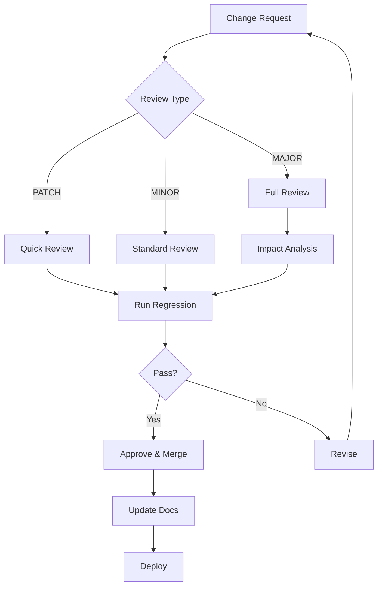

# Documentation & Versioning

## Introduction

Prompts evolve. What started as a simple instruction becomes a complex system prompt with examples, constraints, and edge case handling. Without proper documentation and versioning, you lose track of what changed, why it changed, and whether you can safely roll back.

> **🔑 Key Insight:** Prompts are code. Apply the same rigor to prompt management that you apply to software development—version control, documentation, and change management.

### What We'll Cover

- Prompt documentation standards
- Semantic versioning for prompts
- Change management processes
- Migration and deprecation strategies
- Prompt registries and discovery

### Prerequisites

- [Regression Testing](./04-regression-testing.md)
- Familiarity with version control concepts

---

## Prompt Documentation Standards

### The Prompt Documentation Template

Every production prompt should have accompanying documentation:

```markdown
# Prompt: [Name]

## Metadata
- **ID:** prompt-customer-support-v2.3.1
- **Owner:** @prompt-engineering-team
- **Created:** 2024-01-15
- **Last Modified:** 2024-06-20
- **Status:** Production

## Purpose
[One paragraph describing what this prompt does and why it exists]

## Use Cases
- Primary: Customer support chat
- Secondary: Email response drafting
- Not suitable for: Sales, legal advice

## Input/Output Specification

### Expected Input
| Field | Type | Required | Description |
|-------|------|----------|-------------|
| user_message | string | Yes | The customer's message |
| conversation_history | array | No | Previous turns |
| customer_tier | string | No | gold, silver, bronze |

### Expected Output
| Field | Type | Description |
|-------|------|-------------|
| response | string | The agent's reply |
| sentiment | string | detected customer sentiment |
| escalate | boolean | Whether to escalate |

## Dependencies
- Model: gpt-4o (minimum capability level)
- Context window: 8000 tokens
- External APIs: None

## Known Limitations
1. Does not handle multiple languages in same message
2. May struggle with highly technical product queries
3. Cannot access order status without tool integration

## Performance Metrics
- Avg. latency: 1.2s
- Avg. tokens: 450 output
- Success rate: 94.2% (based on golden dataset)

## Change History
| Version | Date | Author | Changes |
|---------|------|--------|---------|
| 2.3.1 | 2024-06-20 | @jane | Fixed edge case with empty messages |
| 2.3.0 | 2024-06-01 | @john | Added sentiment detection |
| 2.2.0 | 2024-05-15 | @jane | Improved complaint handling |

## Related Prompts
- `prompt-escalation-handler-v1.2.0` - Handles escalated cases
- `prompt-email-composer-v1.0.0` - Drafts follow-up emails
```

### Documenting the Prompt Itself

Embed documentation within the prompt using comments:

```
# PROMPT: customer-support-v2.3.1
# PURPOSE: Handle customer inquiries with empathy and accuracy
# OWNER: prompt-engineering-team
# LAST_UPDATED: 2024-06-20

You are a helpful customer support agent for TechCorp.

## Your Role
- Answer product questions accurately
- Handle complaints with empathy
- Escalate when appropriate

## Guidelines
# NOTE: Order matters - safety first, then quality
1. Always maintain a professional, friendly tone
2. Never promise specific resolution timelines
3. For billing issues, offer to connect with billing team

## Output Format
# REQUIRED: JSON with these exact fields
Respond in JSON format:
{
  "response": "your message to customer",
  "sentiment": "positive|neutral|negative|frustrated",
  "escalate": true/false
}

# EDGE CASES:
# - Empty message: Ask clarifying question
# - Profanity: Acknowledge frustration, redirect
# - Multiple questions: Address each in order
```

### API-Style Documentation

For programmatic prompt use:

```python
class CustomerSupportPrompt:
    """
    Customer Support Prompt v2.3.1
    
    Handles customer inquiries with empathy and accuracy.
    Returns structured JSON with response, sentiment, and escalation flag.
    
    Attributes:
        model (str): Target model (default: gpt-4o)
        max_tokens (int): Maximum output tokens (default: 500)
        temperature (float): Sampling temperature (default: 0.3)
    
    Example:
        >>> prompt = CustomerSupportPrompt()
        >>> result = prompt.run(
        ...     user_message="My order hasn't arrived",
        ...     customer_tier="gold"
        ... )
        >>> print(result)
        {"response": "I'm sorry to hear...", "sentiment": "frustrated", "escalate": False}
    
    Raises:
        ValueError: If user_message is empty
        PromptError: If model response is malformed
    
    Notes:
        - Requires gpt-4o or equivalent capability
        - Not suitable for legal or medical advice
        - See related: EscalationPrompt, EmailComposerPrompt
    
    Version History:
        2.3.1 (2024-06-20): Fixed empty message edge case
        2.3.0 (2024-06-01): Added sentiment detection
        2.2.0 (2024-05-15): Improved complaint handling
    """
    
    VERSION = "2.3.1"
    PROMPT_ID = "prompt-customer-support"
```

---

## Semantic Versioning for Prompts

### Version Number Structure

```
MAJOR.MINOR.PATCH

Example: 2.3.1
         │ │ │
         │ │ └── PATCH: Bug fixes, typo corrections
         │ └──── MINOR: New capabilities, backward compatible
         └────── MAJOR: Breaking changes, new output format
```

### What Triggers Version Increments?

| Change Type | Increment | Examples |
|-------------|-----------|----------|
| **MAJOR** | Breaking change | New output schema, removed capability, different behavior |
| **MINOR** | New feature | Added output field, new handling for edge case, expanded scope |
| **PATCH** | Bug fix | Typo fix, wording improvement, edge case fix (same behavior) |

### Version Increment Examples

```python
# PATCH: 2.3.0 → 2.3.1
# Typo fix, no behavior change
- "Respond in a freindly manner"
+ "Respond in a friendly manner"

# MINOR: 2.3.1 → 2.4.0
# New capability added (sentiment field)
  {
    "response": "...",
+   "sentiment": "positive|neutral|negative",
    "escalate": false
  }

# MAJOR: 2.4.0 → 3.0.0
# Output format completely changed
  {
-   "response": "...",
-   "sentiment": "...",
-   "escalate": false
+   "message": {
+     "text": "...",
+     "metadata": { "sentiment": "...", "escalate": false }
+   }
  }
```

### Pre-release Versions

```
2.3.1-alpha.1    # Early development
2.3.1-beta.1     # Testing phase
2.3.1-rc.1       # Release candidate
2.3.1            # Production release
```

Use pre-release versions for:
- A/B testing candidates
- Prompts under evaluation
- Experimental features

---

## Change Management

### Change Request Process



### Change Request Template

```markdown
# Prompt Change Request

## Summary
Brief description of what's changing and why.

## Change Type
- [ ] PATCH (bug fix, no behavior change)
- [ ] MINOR (new feature, backward compatible)
- [ ] MAJOR (breaking change)

## Motivation
Why is this change needed? Link to issues/tickets.

## Changes Made
Specific changes to the prompt:
```diff
- old text
+ new text
```

## Testing
- [ ] Regression tests pass
- [ ] Edge cases tested
- [ ] A/B test results (if applicable)

## Rollback Plan
How to revert if issues arise.

## Affected Consumers
List applications/services using this prompt.

## Checklist
- [ ] Documentation updated
- [ ] Version incremented correctly
- [ ] Migration guide (if MAJOR)
- [ ] Stakeholders notified
```

### Breaking Change Identification

| Question | If Yes → Breaking |
|----------|-------------------|
| Does output schema change? | ✅ |
| Are required input fields added? | ✅ |
| Does existing behavior change? | ✅ |
| Are capabilities removed? | ✅ |
| Do consumers need code changes? | ✅ |

```python
def is_breaking_change(old_prompt: str, new_prompt: str) -> dict:
    """Analyze if prompt change is breaking."""
    
    # Parse expected outputs
    old_schema = extract_output_schema(old_prompt)
    new_schema = extract_output_schema(new_prompt)
    
    breaking_reasons = []
    
    # Check for removed fields
    old_fields = set(old_schema.get("properties", {}).keys())
    new_fields = set(new_schema.get("properties", {}).keys())
    removed = old_fields - new_fields
    if removed:
        breaking_reasons.append(f"Removed output fields: {removed}")
    
    # Check for type changes
    for field in old_fields & new_fields:
        old_type = old_schema["properties"][field].get("type")
        new_type = new_schema["properties"][field].get("type")
        if old_type != new_type:
            breaking_reasons.append(f"Field '{field}' type changed: {old_type} → {new_type}")
    
    # Check for new required inputs
    old_required = extract_required_inputs(old_prompt)
    new_required = extract_required_inputs(new_prompt)
    new_requirements = new_required - old_required
    if new_requirements:
        breaking_reasons.append(f"New required inputs: {new_requirements}")
    
    return {
        "is_breaking": len(breaking_reasons) > 0,
        "reasons": breaking_reasons,
        "suggested_version": "MAJOR" if breaking_reasons else None
    }
```

---

## Migration Strategies

### Migration Guide Template

```markdown
# Migration Guide: v2.x → v3.0

## Overview
Version 3.0 introduces a new output format for improved structured data handling.

## Breaking Changes

### Output Format Change
**Before (v2.x):**
```json
{
  "response": "Hello, how can I help?",
  "escalate": false
}
```

**After (v3.0):**
```json
{
  "message": {
    "text": "Hello, how can I help?",
    "metadata": {
      "escalate": false,
      "confidence": 0.95
    }
  }
}
```

## Migration Steps

### Step 1: Update Response Parsing
```python
# Before
response_text = result["response"]
should_escalate = result["escalate"]

# After
response_text = result["message"]["text"]
should_escalate = result["message"]["metadata"]["escalate"]
```

### Step 2: Handle New Fields
The `confidence` field is now included. Update your logic:
```python
confidence = result["message"]["metadata"]["confidence"]
if confidence < 0.7:
    # Consider additional validation
    pass
```

### Step 3: Update Tests
Update your test fixtures to use the new format.

## Rollback Instructions
If you need to rollback, set `PROMPT_VERSION=2.3.1` in your configuration.

## Support
Contact prompt-engineering-team for migration assistance.
```

### Gradual Rollout Strategy

```python
class PromptVersionManager:
    """Manage gradual rollout of new prompt versions."""
    
    def __init__(self, prompts: dict[str, str]):
        self.prompts = prompts  # version -> prompt content
        self.rollout_config = {}
    
    def set_rollout(self, new_version: str, percentage: float):
        """Set rollout percentage for new version."""
        self.rollout_config[new_version] = percentage
    
    def get_prompt(self, user_id: str, default_version: str) -> tuple[str, str]:
        """Get prompt for user based on rollout config."""
        
        # Check if user should get new version
        for version, percentage in self.rollout_config.items():
            if self._should_include(user_id, percentage):
                return version, self.prompts[version]
        
        return default_version, self.prompts[default_version]
    
    def _should_include(self, user_id: str, percentage: float) -> bool:
        """Deterministic assignment based on user_id."""
        import hashlib
        hash_val = int(hashlib.md5(user_id.encode()).hexdigest(), 16)
        return (hash_val % 100) < (percentage * 100)

# Usage
manager = PromptVersionManager({
    "2.3.1": old_prompt,
    "3.0.0": new_prompt
})

# Start with 10% rollout
manager.set_rollout("3.0.0", 0.10)

# Gradually increase
manager.set_rollout("3.0.0", 0.25)  # 25%
manager.set_rollout("3.0.0", 0.50)  # 50%
manager.set_rollout("3.0.0", 1.00)  # Full rollout
```

---

## Deprecation Policies

### Deprecation Timeline

| Phase | Duration | Actions |
|-------|----------|---------|
| **Announcement** | Immediate | Notify consumers, document replacement |
| **Warning** | 2-4 weeks | Log deprecation warnings |
| **Soft Deprecation** | 4-8 weeks | Redirect to new version when possible |
| **Hard Deprecation** | End of life | Return errors, remove from registry |

### Deprecation Notice

```python
class DeprecatedPrompt:
    """Wrapper for deprecated prompts with warnings."""
    
    def __init__(
        self,
        prompt: str,
        version: str,
        replacement: str,
        end_of_life: str
    ):
        self.prompt = prompt
        self.version = version
        self.replacement = replacement
        self.end_of_life = end_of_life
    
    def run(self, **kwargs) -> dict:
        """Run prompt with deprecation warning."""
        import warnings
        import logging
        
        warning_msg = (
            f"Prompt {self.version} is deprecated and will be removed on {self.end_of_life}. "
            f"Please migrate to {self.replacement}. "
            f"See migration guide: /docs/prompts/migration/{self.version}-to-{self.replacement}.md"
        )
        
        # Log warning
        logging.warning(warning_msg)
        
        # Also emit Python warning
        warnings.warn(warning_msg, DeprecationWarning)
        
        # Track usage for sunset planning
        track_deprecated_usage(self.version, kwargs.get("user_id"))
        
        # Still execute the prompt
        return execute_prompt(self.prompt, **kwargs)
```

### Sunset Criteria

Before removing a deprecated prompt, verify:

```python
def can_sunset_prompt(version: str, min_days: int = 30) -> dict:
    """Check if prompt can be safely removed."""
    
    usage_stats = get_usage_stats(version, days=min_days)
    
    return {
        "can_sunset": usage_stats["daily_calls"] < 10,
        "current_usage": usage_stats["daily_calls"],
        "trend": usage_stats["trend"],  # "decreasing", "stable", "increasing"
        "active_consumers": usage_stats["unique_consumers"],
        "recommendation": (
            "Safe to remove" if usage_stats["daily_calls"] < 10
            else f"Wait for usage to decrease. {usage_stats['unique_consumers']} active consumers."
        )
    }
```

---

## Prompt Registries

### Registry Structure

```
prompt-registry/
├── prompts/
│   ├── customer-support/
│   │   ├── v2.3.1/
│   │   │   ├── prompt.txt
│   │   │   ├── metadata.json
│   │   │   ├── README.md
│   │   │   └── tests/
│   │   └── v3.0.0/
│   │       ├── prompt.txt
│   │       ├── metadata.json
│   │       ├── README.md
│   │       ├── MIGRATION.md
│   │       └── tests/
│   └── email-composer/
│       └── v1.0.0/
├── schemas/
│   └── prompt-metadata.json
└── registry.json
```

### Registry API

```python
from typing import Optional
from pydantic import BaseModel

class PromptMetadata(BaseModel):
    id: str
    name: str
    version: str
    status: str  # development, staging, production, deprecated
    owner: str
    created_at: str
    updated_at: str
    model_requirements: dict
    dependencies: list[str]
    tags: list[str]

class PromptRegistry:
    """Central registry for prompt discovery and management."""
    
    def __init__(self, storage_path: str):
        self.storage_path = storage_path
        self.prompts = self._load_registry()
    
    def register(self, prompt: str, metadata: PromptMetadata) -> str:
        """Register a new prompt version."""
        prompt_id = f"{metadata.id}-v{metadata.version}"
        
        # Validate
        self._validate_prompt(prompt, metadata)
        
        # Store
        self._store_prompt(prompt_id, prompt, metadata)
        
        # Update registry index
        self.prompts[prompt_id] = metadata
        self._save_registry()
        
        return prompt_id
    
    def get(self, prompt_id: str, version: Optional[str] = None) -> tuple[str, PromptMetadata]:
        """Retrieve prompt by ID and optional version."""
        if version:
            full_id = f"{prompt_id}-v{version}"
        else:
            # Get latest version
            versions = self.list_versions(prompt_id)
            full_id = f"{prompt_id}-v{versions[-1]}"
        
        return self._load_prompt(full_id)
    
    def list_versions(self, prompt_id: str) -> list[str]:
        """List all versions of a prompt."""
        return sorted([
            m.version for pid, m in self.prompts.items()
            if pid.startswith(prompt_id)
        ])
    
    def search(self, query: str = None, tags: list[str] = None, status: str = None) -> list[PromptMetadata]:
        """Search prompts by query, tags, or status."""
        results = []
        
        for prompt_id, metadata in self.prompts.items():
            if status and metadata.status != status:
                continue
            if tags and not all(t in metadata.tags for t in tags):
                continue
            if query and query.lower() not in metadata.name.lower():
                continue
            results.append(metadata)
        
        return results
```

### Discovery Interface

```python
# CLI interface for prompt discovery
"""
Usage:
  prompt-registry list [--status=STATUS] [--tag=TAG]
  prompt-registry get <prompt-id> [--version=VERSION]
  prompt-registry search <query>
  prompt-registry history <prompt-id>
  prompt-registry diff <prompt-id> <version1> <version2>
  prompt-registry publish <path> --version=VERSION

Examples:
  prompt-registry list --status=production
  prompt-registry get customer-support --version=2.3.1
  prompt-registry search "support"
  prompt-registry history customer-support
  prompt-registry diff customer-support 2.3.0 2.3.1
"""

def cli_list(status: str = None, tag: str = None):
    registry = PromptRegistry("./registry")
    prompts = registry.search(status=status, tags=[tag] if tag else None)
    
    print(f"Found {len(prompts)} prompts:\n")
    for p in prompts:
        status_icon = {"production": "🟢", "staging": "🟡", "deprecated": "🔴"}.get(p.status, "⚪")
        print(f"  {status_icon} {p.id} v{p.version} - {p.name}")
```

---

## Hands-on Exercise

### Your Task

Create a complete prompt documentation and versioning system.

### Requirements

1. Write full documentation for a prompt using the template
2. Define version history with at least 3 versions
3. Create a migration guide for a breaking change
4. Design a deprecation notice
5. Sketch a prompt registry entry

<details>
<summary>💡 Hints (click to expand)</summary>

- Start with a simple prompt (e.g., text summarization)
- Include at least one PATCH, MINOR, and MAJOR change
- Migration guide should include before/after code examples
- Registry entry should include all metadata fields

</details>

<details>
<summary>✅ Solution (click to expand)</summary>

```markdown
# Prompt: Text Summarizer

## Metadata
- **ID:** prompt-text-summarizer
- **Owner:** @content-team
- **Created:** 2024-03-01
- **Last Modified:** 2024-07-15
- **Status:** Production

## Purpose
Summarizes long-form text content into concise summaries while preserving key information and maintaining the original tone.

## Use Cases
- Primary: Article summarization for news feeds
- Secondary: Document summarization for search snippets
- Not suitable for: Technical documentation, legal documents

## Input/Output Specification

### Expected Input (v2.x)
| Field | Type | Required | Description |
|-------|------|----------|-------------|
| text | string | Yes | Text to summarize (max 10000 chars) |
| max_length | int | No | Target summary length (default: 100 words) |
| style | string | No | "formal", "casual" (default: "formal") |

### Expected Output (v2.x)
| Field | Type | Description |
|-------|------|-------------|
| summary | string | The summarized text |
| word_count | int | Actual word count |

### Expected Output (v3.0 - NEW)
| Field | Type | Description |
|-------|------|-------------|
| result | object | Container for summary data |
| result.text | string | The summarized text |
| result.stats | object | Summary statistics |
| result.stats.word_count | int | Actual word count |
| result.stats.compression_ratio | float | Original/summary ratio |

## Change History
| Version | Date | Author | Type | Changes |
|---------|------|--------|------|---------|
| 3.0.0 | 2024-07-15 | @jane | MAJOR | New nested output format |
| 2.1.0 | 2024-06-01 | @john | MINOR | Added style parameter |
| 2.0.1 | 2024-05-20 | @jane | PATCH | Fixed handling of bullet points |
| 2.0.0 | 2024-05-01 | @john | MAJOR | Added word_count to output |
| 1.0.0 | 2024-03-01 | @jane | INITIAL | Initial release |

---

# Migration Guide: v2.x → v3.0

## Overview
Version 3.0 restructures the output format for better extensibility.

## Breaking Changes

### Output Structure
**Before (v2.x):**
```json
{
  "summary": "This is the summary...",
  "word_count": 45
}
```

**After (v3.0):**
```json
{
  "result": {
    "text": "This is the summary...",
    "stats": {
      "word_count": 45,
      "compression_ratio": 0.15
    }
  }
}
```

## Migration Steps

### Python
```python
# Before (v2.x)
summary_text = response["summary"]
word_count = response["word_count"]

# After (v3.0)
summary_text = response["result"]["text"]
word_count = response["result"]["stats"]["word_count"]
compression = response["result"]["stats"]["compression_ratio"]  # NEW
```

### JavaScript
```javascript
// Before (v2.x)
const { summary, word_count } = response;

// After (v3.0)
const { result: { text: summary, stats: { word_count, compression_ratio } } } = response;
```

## Rollback
Set environment variable: `SUMMARIZER_VERSION=2.1.0`

---

# Deprecation Notice

**⚠️ DEPRECATION WARNING**

`prompt-text-summarizer v2.x` is deprecated as of 2024-07-15.

- **End of Life:** 2024-09-15
- **Replacement:** `prompt-text-summarizer v3.0.0`
- **Migration Guide:** /docs/prompts/migration/summarizer-v2-to-v3.md

Please update your integration before the end-of-life date.

---

# Registry Entry

```json
{
  "id": "prompt-text-summarizer",
  "name": "Text Summarizer",
  "version": "3.0.0",
  "status": "production",
  "owner": "@content-team",
  "created_at": "2024-03-01T00:00:00Z",
  "updated_at": "2024-07-15T00:00:00Z",
  "model_requirements": {
    "minimum": "gpt-3.5-turbo",
    "recommended": "gpt-4o",
    "context_window": 8000
  },
  "dependencies": [],
  "tags": ["summarization", "content", "nlp"],
  "metrics": {
    "avg_latency_ms": 850,
    "success_rate": 0.98,
    "golden_dataset_pass_rate": 0.96
  },
  "related_prompts": [
    "prompt-headline-generator-v1.0.0",
    "prompt-keyword-extractor-v2.0.0"
  ]
}
```
```

</details>

---

## Summary

✅ Document prompts like code: purpose, I/O specs, limitations, history
✅ Use semantic versioning: MAJOR.MINOR.PATCH based on change impact
✅ Breaking changes require migration guides and consumer notification
✅ Gradual rollouts reduce risk of major version changes
✅ Deprecation should follow a clear timeline with warnings
✅ Prompt registries enable discovery, versioning, and governance

**Next:** [Back to Testing & Iteration Overview](./00-testing-iteration-overview.md)

---

## Further Reading

- [Semantic Versioning](https://semver.org/) - The versioning standard
- [API Versioning Best Practices](https://cloud.google.com/apis/design/versioning) - Google's guidelines
- [Documentation-Driven Development](https://gist.github.com/zsup/9434452) - Write docs first

---

<!-- 
Sources Consulted:
- Semantic Versioning specification
- API versioning patterns from major cloud providers
- Software documentation best practices
-->
