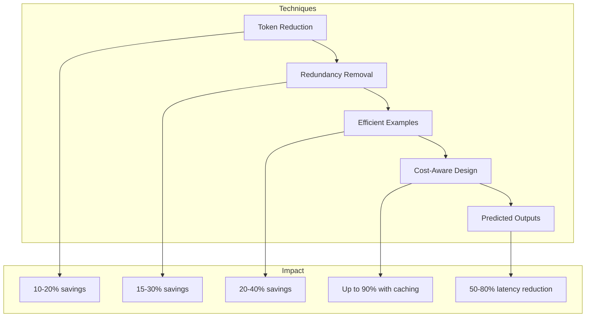
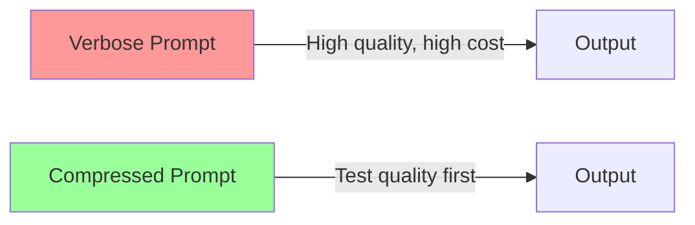

# Prompt Compression Techniques

## Overview

Every token costs money and time. In production systems processing millions of requests, even small reductions in prompt size compound into significant savings. This lesson teaches systematic approaches to compress prompts without sacrificing output quality.

> **🔑 Key Insight:** The best prompt isn't the longest or the shortest—it's the one that achieves maximum quality per token spent.

## Why Prompt Compression Matters

| Impact Area | Benefit |
|-------------|---------|
| **Cost** | 90% reduction with caching, 50%+ with compression |
| **Latency** | Fewer input tokens = faster time-to-first-token |
| **Context Window** | More room for user content and conversation history |
| **Throughput** | Lower token counts = higher requests per minute |

## The Compression Pyramid



## What You'll Learn

| Lesson | Focus | Key Techniques |
|--------|-------|----------------|
| [Token Reduction](./01-token-reduction.md) | Write less, mean more | Terse style, abbreviations, synonym selection |
| [Redundancy Removal](./02-redundancy-removal.md) | Eliminate repetition | Consolidation, implicit/explicit trade-offs |
| [Efficient Examples](./03-efficient-examples.md) | Optimize few-shot | Minimal structure, representative selection |
| [Cost-Aware Design](./04-cost-aware-design.md) | Budget optimization | Token allocation, caching strategies |
| [Predicted Outputs](./05-predicted-outputs.md) | Speed up generation | Speculative decoding, code editing |

## Provider-Specific Caching

| Provider | Caching Type | Minimum Tokens | Cost Savings |
|----------|--------------|----------------|--------------|
| **OpenAI** | Automatic | 1,024 | Up to 90% on cached tokens |
| **Anthropic** | Explicit (`cache_control`) | 1,024-4,096 | 90% read, 25% write premium |
| **Google** | Implicit + Explicit | 1,024-4,096 | Automatic discounts |

## Quick Wins

Before diving deep, try these immediate optimizations:

### 1. Structure for Caching
```
✅ Static content FIRST → Dynamic content LAST
   [System prompt] → [Tools] → [Examples] → [Context] → [User message]

❌ Mixed ordering
   [User message] → [System] → [Context] → [Examples]
```

### 2. Remove Obvious Filler
```diff
- Please carefully analyze the following text and provide a comprehensive 
- summary that captures all the key points and main ideas.
+ Summarize the key points:
```

### 3. Use Abbreviated JSON Keys
```diff
- {"message_is_conversation_continuation": true, "user_sentiment": "frustrated"}
+ {"cont": true, "sentiment": "frustrated"}
```

## Compression vs. Quality Trade-off



> **⚠️ Warning:** Always test compressed prompts. A 30% token reduction is worthless if quality drops 10%.

## Prerequisites

- [Output Formatting](../05-output-formatting-structured-prompting/00-output-formatting-overview.md)
- [Few-Shot Prompting](../04-few-shot-prompting/00-few-shot-prompting-overview.md)
- Understanding of token economics

---

## Lessons in This Section

1. [Token Reduction](./01-token-reduction.md) - Write concise instructions
2. [Redundancy Removal](./02-redundancy-removal.md) - Eliminate repetition
3. [Efficient Examples](./03-efficient-examples.md) - Optimize few-shot prompts
4. [Cost-Aware Design](./04-cost-aware-design.md) - Budget and caching strategies
5. [Predicted Outputs](./05-predicted-outputs.md) - Speed up known outputs

---

**Next:** [Token Reduction Strategies](./01-token-reduction.md)
